# BettaFish 设计模式与架构分析

## 概述

BettaFish项目采用了多种经典的设计模式和现代软件架构原则，实现了高内聚、低耦合的模块化设计。本文档深入分析项目中使用的各种设计模式及其实现方式。

## 核心设计模式分析

### 1. 策略模式（Strategy Pattern）

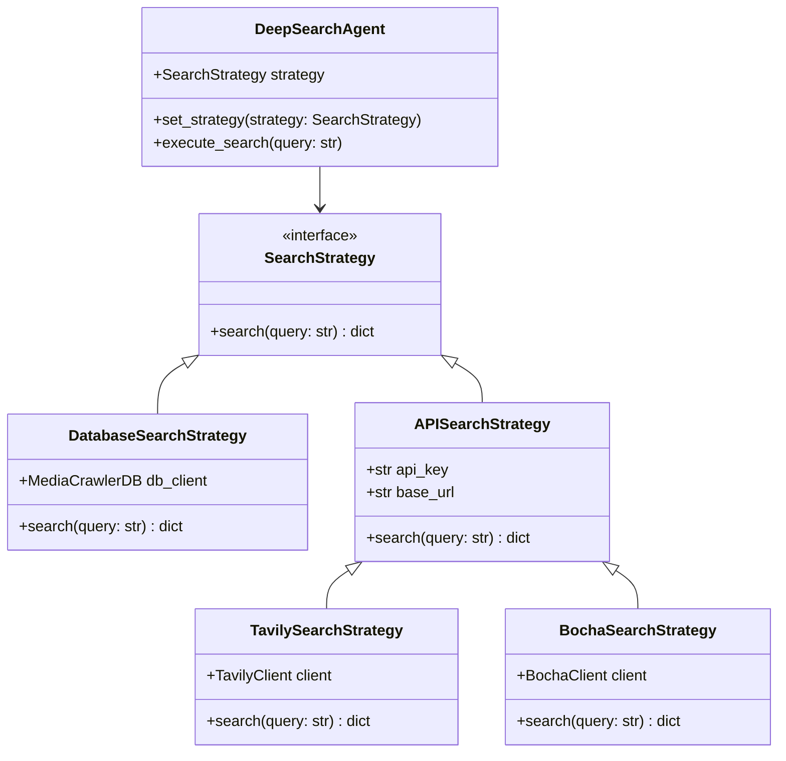

**策略模式应用说明：**
不同Engine采用不同的搜索策略：InsightEngine使用数据库搜索策略，MediaEngine使用博查API策略，QueryEngine使用Tavily搜索策略。通过策略接口统一了搜索行为，使得各Engine可以灵活切换搜索实现，提高了系统的可扩展性和可维护性。

### 2. 工厂模式（Factory Pattern）

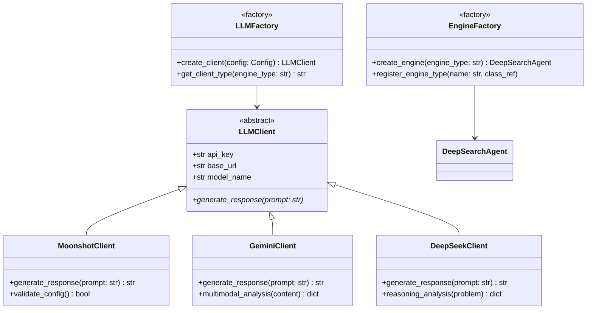

**工厂模式应用说明：**
系统使用工厂模式创建LLM客户端和Engine实例。LLMFactory根据配置信息选择合适的LLM服务（Moonshot、Gemini、DeepSeek），EngineFactory负责创建不同类型的分析引擎。这种设计隐藏了对象创建的复杂性，提供了统一的创建接口。

### 3. 模板方法模式（Template Method Pattern）

```mermaid
classDiagram
    class BaseNode {
        <<abstract>>
        +LLMClient llm_client
        +str node_name
        +run(input_data, **kwargs) dict
        +validate_input(input_data) bool
        +process_data(input_data)* dict
        +post_process(result) dict
    }
    
    class ReportStructureNode {
        +process_data(input_data) dict
        +generate_structure(query) dict
    }
    
    class FirstSearchNode {
        +SearchTool search_tool
        +process_data(input_data) dict
        +execute_search(queries) list
    }
    
    class ReflectionNode {
        +process_data(input_data) dict
        +analyze_quality(results) dict
        +suggest_improvements() list
    }
    
    class SummaryNode {
        +process_data(input_data) dict
        +extract_insights(data) dict
    }
    
    BaseNode <|-- ReportStructureNode
    BaseNode <|-- FirstSearchNode
    BaseNode <|-- ReflectionNode
    BaseNode <|-- SummaryNode
    
    note for BaseNode : "定义处理流程模板:\n1. 验证输入\n2. 处理数据\n3. 后处理结果"
```

**模板方法模式应用说明：**
BaseNode定义了节点处理的基本流程模板：输入验证、数据处理、结果后处理。各个具体节点继承基类并实现process_data方法，定制自己的处理逻辑。这确保了所有节点遵循统一的处理流程，同时允许各节点实现特定的业务逻辑。

### 4. 观察者模式（Observer Pattern）

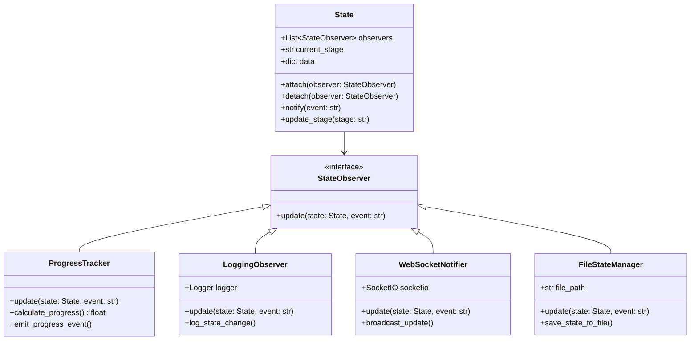

**观察者模式应用说明：**
系统使用观察者模式实现状态变更的实时通知。State对象作为被观察者，维护观察者列表并在状态变更时通知所有观察者。ProgressTracker负责进度计算，LoggingObserver记录日志，WebSocketNotifier实现实时推送，FileStateManager持久化状态。这种设计实现了状态管理的松耦合。

### 5. 责任链模式（Chain of Responsibility Pattern）

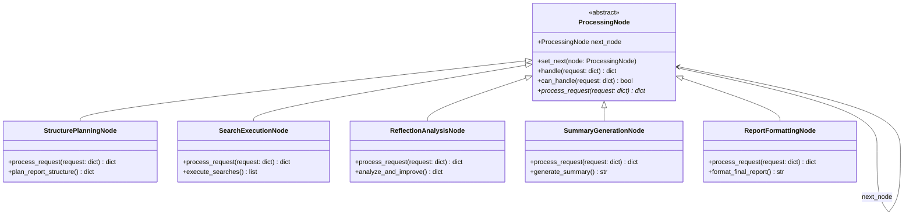

**责任链模式应用说明：**
各Engine内部的处理流程采用责任链模式，将复杂的分析过程分解为多个独立的处理节点。每个节点专注于特定的处理任务，并决定是否将请求传递给下一个节点。这种设计提高了系统的灵活性，便于添加、删除或重新排列处理步骤。

## 架构模式分析

### 1. 微服务架构（Microservices Architecture）

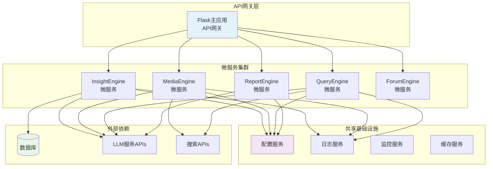

**微服务架构说明：**
BettaFish采用微服务架构，将不同的业务功能拆分为独立的服务模块。每个Engine作为独立的微服务运行，通过Flask主应用提供的API网关进行统一管理。各服务共享配置、日志、监控等基础设施，同时保持业务逻辑的独立性。

### 2. 事件驱动架构（Event-Driven Architecture）

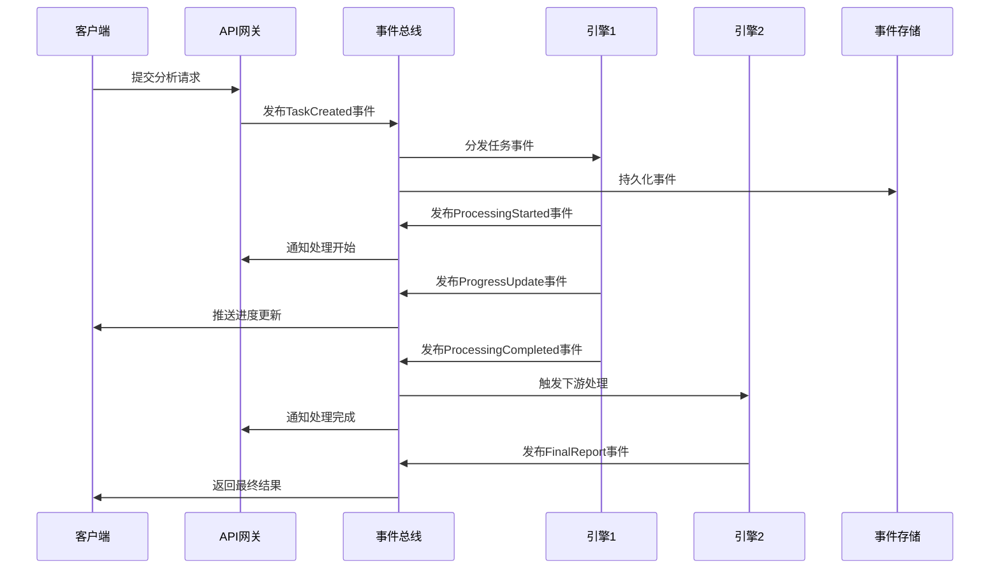

**事件驱动架构说明：**
系统通过事件总线实现各组件间的松耦合通信。当用户提交请求或系统状态发生变化时，相关组件发布事件到总线，其他组件订阅感兴趣的事件并做出响应。这种架构提高了系统的响应性和可伸缩性。

### 3. 分层架构（Layered Architecture）

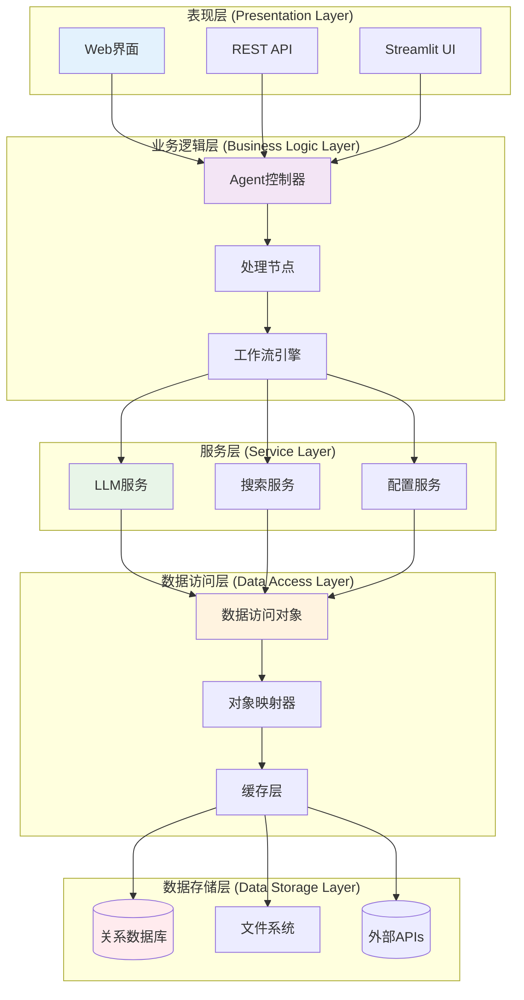

**分层架构说明：**
系统采用经典的分层架构模式，从上到下分为表现层、业务逻辑层、服务层、数据访问层和数据存储层。每层只与相邻层交互，层间职责明确，降低了系统复杂度，提高了可维护性和可测试性。

## 设计原则应用

### 1. SOLID原则

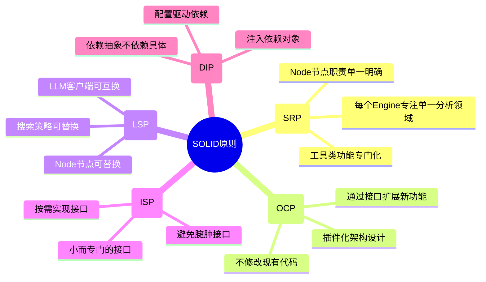

### 2. DRY原则（Don't Repeat Yourself）

- **基类抽象**: BaseNode、BaseAgent等基类封装通用逻辑
- **配置复用**: 统一的配置管理机制
- **工具复用**: 通用工具函数和辅助类
- **模板复用**: 报告模板和消息模板

### 3. 关注点分离（Separation of Concerns）

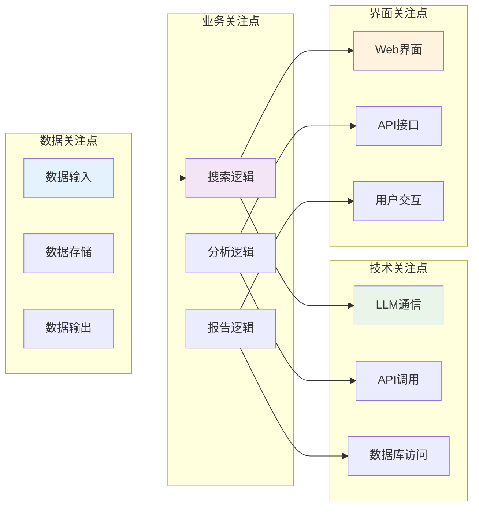

## 并发与异步模式

### 1. 异步处理模式

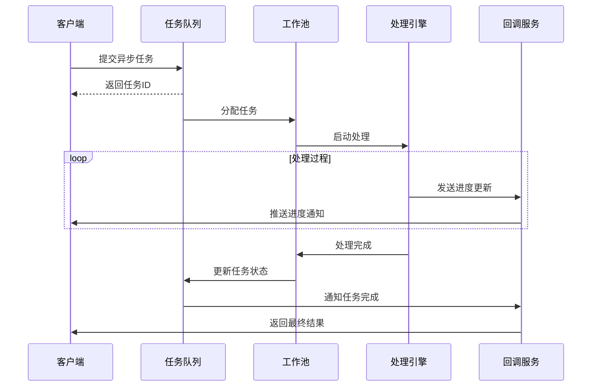

**异步处理说明：**
系统采用任务队列和工作池实现异步处理模式。长时间运行的分析任务在后台执行，不阻塞用户界面。通过回调机制实时推送处理进度，提升用户体验。

### 2. 生产者-消费者模式

```python
import asyncio
from asyncio import Queue
from typing import List

class AnalysisProducer:
    """分析任务生产者"""
    def __init__(self, task_queue: Queue):
        self.task_queue = task_queue
    
    async def produce_tasks(self, queries: List[str]):
        for query in queries:
            analysis_task = {
                'query': query,
                'timestamp': datetime.now(),
                'priority': self.calculate_priority(query)
            }
            await self.task_queue.put(analysis_task)

class AnalysisConsumer:
    """分析任务消费者"""
    def __init__(self, task_queue: Queue, engine: DeepSearchAgent):
        self.task_queue = task_queue
        self.engine = engine
    
    async def consume_tasks(self):
        while True:
            try:
                task = await self.task_queue.get()
                result = await self.process_task(task)
                self.task_queue.task_done()
            except Exception as e:
                logger.error(f"任务处理失败: {e}")
    
    async def process_task(self, task: dict):
        return await self.engine.deep_search(task['query'])
```

## 缓存策略模式

### 1. 多级缓存架构

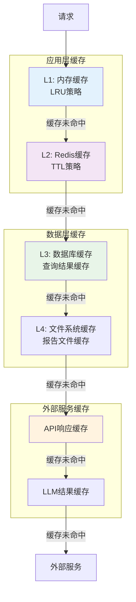

**多级缓存说明：**
系统实现了多级缓存架构，从内存缓存到外部服务缓存，每级缓存采用不同的策略和TTL设置。这种设计最大化了缓存命中率，显著提升了系统性能，减少了外部API调用成本。

### 2. 缓存更新策略

```python
from enum import Enum
from abc import ABC, abstractmethod

class CacheStrategy(Enum):
    """缓存策略枚举"""
    WRITE_THROUGH = "write_through"    # 写透缓存
    WRITE_BACK = "write_back"         # 写回缓存  
    WRITE_AROUND = "write_around"     # 绕写缓存

class CacheManager(ABC):
    """缓存管理器抽象基类"""
    
    @abstractmethod
    def get(self, key: str):
        pass
    
    @abstractmethod  
    def set(self, key: str, value, ttl: int = None):
        pass
    
    @abstractmethod
    def invalidate(self, key: str):
        pass
    
    @abstractmethod
    def clear_pattern(self, pattern: str):
        pass

class SmartCacheManager(CacheManager):
    """智能缓存管理器"""
    
    def __init__(self, strategy: CacheStrategy = CacheStrategy.WRITE_THROUGH):
        self.strategy = strategy
        self.l1_cache = {}  # 内存缓存
        self.l2_cache = RedisClient()  # Redis缓存
    
    def get(self, key: str):
        # L1缓存查找
        if key in self.l1_cache:
            return self.l1_cache[key]
        
        # L2缓存查找
        value = self.l2_cache.get(key)
        if value:
            self.l1_cache[key] = value  # 回填L1缓存
            return value
        
        return None
    
    def set(self, key: str, value, ttl: int = 3600):
        if self.strategy == CacheStrategy.WRITE_THROUGH:
            self.l1_cache[key] = value
            self.l2_cache.set(key, value, ttl)
        elif self.strategy == CacheStrategy.WRITE_BACK:
            self.l1_cache[key] = value
            # 延迟写入L2缓存
        elif self.strategy == CacheStrategy.WRITE_AROUND:
            # 直接写入L2缓存，跳过L1
            self.l2_cache.set(key, value, ttl)
```

## 错误处理与恢复模式

### 1. 断路器模式（Circuit Breaker Pattern）

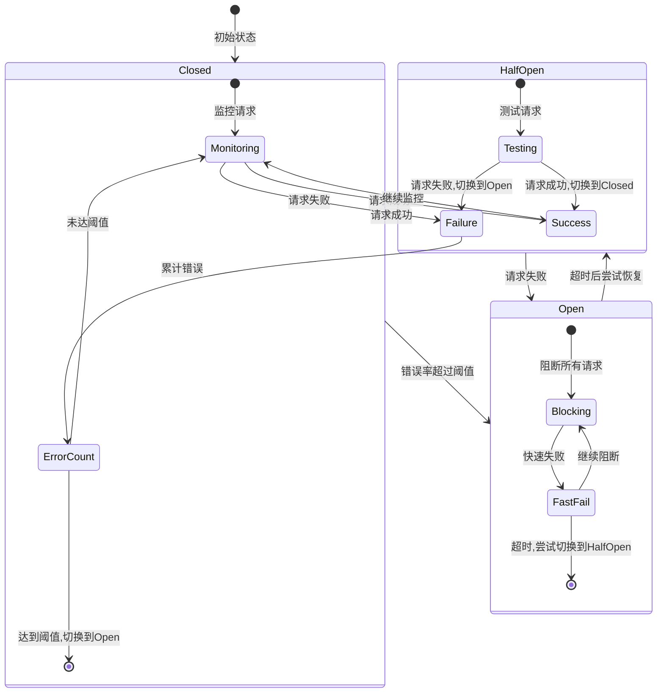

**断路器模式说明：**
系统在调用外部LLM服务时采用断路器模式。正常情况下断路器处于Closed状态，当错误率超过阈值时切换到Open状态，阻断请求并快速失败。经过一段时间后尝试恢复，进入HalfOpen状态测试服务可用性。

### 2. 重试机制

```python
import asyncio
from functools import wraps
from typing import Callable, List, Type
import random

def retry_with_backoff(
    max_retries: int = 3,
    base_delay: float = 1.0,
    max_delay: float = 60.0,
    exceptions: List[Type[Exception]] = None
):
    """带指数退避的重试装饰器"""
    exceptions = exceptions or [Exception]
    
    def decorator(func: Callable):
        @wraps(func)
        async def wrapper(*args, **kwargs):
            last_exception = None
            
            for attempt in range(max_retries + 1):
                try:
                    return await func(*args, **kwargs)
                except tuple(exceptions) as e:
                    last_exception = e
                    if attempt == max_retries:
                        break
                    
                    # 计算退避延迟 (指数退避 + 抖动)
                    delay = min(base_delay * (2 ** attempt), max_delay)
                    jitter = random.uniform(0, delay * 0.1)
                    total_delay = delay + jitter
                    
                    logger.warning(f"第{attempt + 1}次重试失败: {e}, {total_delay:.2f}秒后重试")
                    await asyncio.sleep(total_delay)
            
            raise last_exception
        
        return wrapper
    return decorator

# 使用示例
class LLMClient:
    @retry_with_backoff(
        max_retries=3,
        base_delay=1.0,
        exceptions=[ConnectionError, TimeoutError]
    )
    async def generate_response(self, prompt: str) -> str:
        # LLM API调用逻辑
        pass
```

## 插件化架构模式

### 1. 插件接口设计

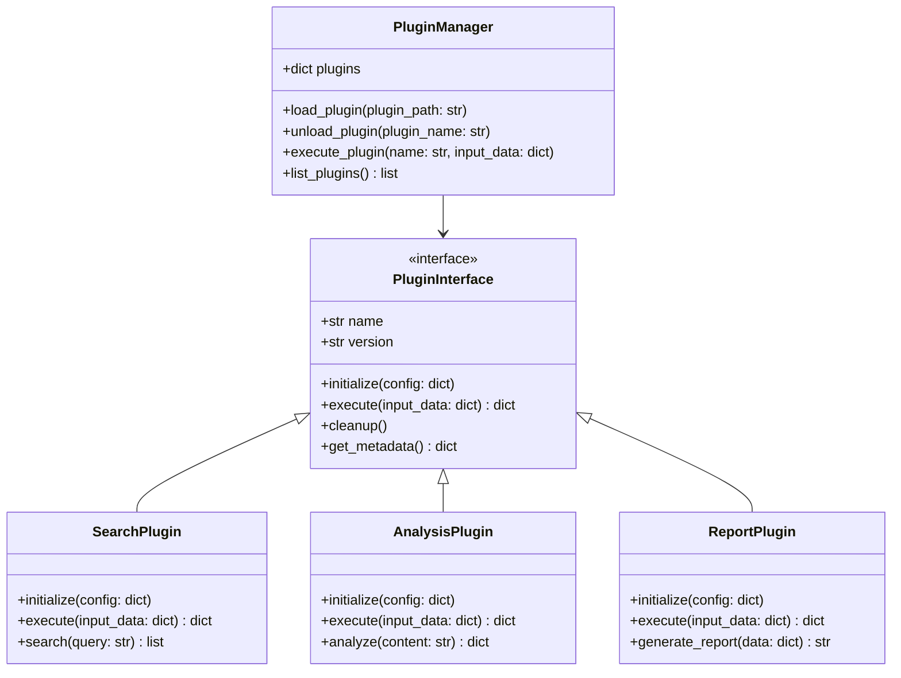

**插件化架构说明：**
系统采用插件化架构支持功能扩展。通过统一的插件接口，可以动态加载新的搜索、分析和报告生成插件。PluginManager负责插件的生命周期管理，支持热插拔和版本管理。

### 2. 配置驱动设计

```yaml
# plugins.yaml - 插件配置示例
plugins:
  search_plugins:
    - name: "enhanced_database_search"
      version: "1.2.0"
      enabled: true
      config:
        connection_pool_size: 10
        timeout: 30
        cache_enabled: true
        
    - name: "ai_powered_search"
      version: "2.0.0"
      enabled: false
      config:
        model_name: "search-gpt-4"
        api_endpoint: "https://api.example.com/search"
        
  analysis_plugins:
    - name: "sentiment_analyzer_v3"
      version: "3.1.0" 
      enabled: true
      config:
        model_path: "./models/sentiment_v3"
        batch_size: 32
        
    - name: "topic_extractor"
      version: "1.5.0"
      enabled: true
      config:
        min_topic_confidence: 0.8
        max_topics: 10
        
  report_plugins:
    - name: "html_report_generator"
      version: "2.2.0"
      enabled: true
      config:
        template_path: "./templates/advanced_report.html"
        include_charts: true
        
    - name: "pdf_export"
      version: "1.0.0"
      enabled: false
      config:
        font_family: "Arial"
        page_size: "A4"
```

## 总结

BettaFish项目在设计上体现了以下优势：

### 🎯 **模式应用恰当**
- 策略模式支持多种搜索实现
- 工厂模式简化对象创建
- 观察者模式实现松耦合通信
- 模板方法确保处理流程一致性

### 🏗️ **架构设计合理**
- 微服务架构提升可扩展性
- 分层架构降低复杂度
- 事件驱动提高响应性
- 插件化支持功能扩展

### 🔧 **工程实践优秀**
- SOLID原则指导设计
- DRY原则避免重复
- 关注点分离提高维护性
- 配置驱动增强灵活性

### 🚀 **性能优化到位**
- 多级缓存提升响应速度
- 异步处理避免阻塞
- 断路器模式保障稳定性
- 重试机制提高可靠性

这些设计模式和架构选择使得BettaFish项目具备了良好的可维护性、可扩展性和健壮性，为构建企业级舆情分析系统提供了坚实的技术基础。