# BettaFish 项目文档索引

## 📚 文档概览

欢迎使用BettaFish多智能体舆情分析平台！本文档集合提供了项目的全方位技术分析和使用指南。

## 📋 文档目录

### 1. [项目架构概览](01_project_architecture_overview.md) 🏗️
**内容概要**: 项目整体架构、技术栈和系统特性介绍
- 系统架构图和技术栈分析
- 核心模块概述和文件结构
- 部署架构和系统特性说明

**适合人群**: 项目负责人、架构师、新团队成员
**阅读时长**: 15-20分钟

---

### 2. [核心引擎模块详解](02_core_engines_detailed.md) ⚙️
**内容概要**: 五大核心Engine的详细技术分析
- Engine通用架构和设计模式
- InsightEngine、MediaEngine、QueryEngine、ReportEngine详解
- 状态管理和通信协作机制

**适合人群**: 开发工程师、系统设计师
**阅读时长**: 25-30分钟

---

### 3. [数据流与业务时序分析](03_dataflow_and_sequence.md) 🔄
**内容概要**: 系统数据流向和业务处理时序
- 系统数据流概览和存储架构
- 完整业务时序和单Engine处理流程
- 实时处理和数据一致性保障

**适合人群**: 系统分析师、运维工程师、开发工程师
**阅读时长**: 20-25分钟

---

### 4. [快速入门指南](04_quick_start_guide.md) 🚀
**内容概要**: 项目部署、配置和使用的完整指南
- Docker和本地环境部署步骤
- 核心功能使用指南和API接口
- 配置说明和故障排除

**适合人群**: 运维工程师、产品经理、最终用户
**阅读时长**: 30-40分钟

---

### 5. [设计模式与架构分析](05_design_patterns_analysis.md) 🎯
**内容概要**: 项目中应用的设计模式和架构原则
- 策略模式、工厂模式、观察者模式等分析
- 微服务架构、事件驱动架构详解
- SOLID原则应用和插件化设计

**适合人群**: 高级开发工程师、架构师、技术专家
**阅读时长**: 35-45分钟

## 🎯 阅读建议

### 📊 不同角色的阅读路径

```mermaid
graph TB
    subgraph "项目经理/产品经理"
        PM1[1. 项目架构概览]
        PM2[4. 快速入门指南]
        PM1 --> PM2
    end
    
    subgraph "新入职开发者"
        DEV1[1. 项目架构概览]
        DEV2[2. 核心引擎模块详解]  
        DEV3[4. 快速入门指南]
        DEV4[3. 数据流与业务时序]
        DEV1 --> DEV2 --> DEV3 --> DEV4
    end
    
    subgraph "系统架构师"
        ARCH1[1. 项目架构概览]
        ARCH2[5. 设计模式与架构分析]
        ARCH3[2. 核心引擎模块详解]
        ARCH4[3. 数据流与业务时序]
        ARCH1 --> ARCH2 --> ARCH3 --> ARCH4
    end
    
    subgraph "运维工程师"
        OPS1[4. 快速入门指南]
        OPS2[1. 项目架构概览] 
        OPS3[3. 数据流与业务时序]
        OPS1 --> OPS2 --> OPS3
    end
    
    style PM1 fill:#e3f2fd
    style DEV1 fill:#f3e5f5
    style ARCH1 fill:#e8f5e8
    style OPS1 fill:#fff3e0
```

### ⏱️ 时间安排建议

- **快速了解** (30分钟): 阅读文档1 + 文档4的核心功能部分
- **深度学习** (2小时): 完整阅读所有文档
- **专项研究** (1小时): 根据角色选择重点文档深入阅读

## 📖 文档特色

### 🎨 可视化图表
- **20+** 精心设计的Mermaid图表
- 涵盖架构图、时序图、状态图、类图等
- 每个图表都配有详细的文字说明

### 🔧 实用代码示例
- 完整的配置示例和API调用代码
- 可直接运行的部署脚本
- 故障排除和性能优化建议

### 📚 渐进式学习
- 从概览到细节的层次化结构
- 理论与实践相结合的内容组织
- 适合不同技术背景的读者

## 🔍 关键概念索引

### 核心技术概念
- **多智能体系统** (Multi-Agent System): 文档2
- **微服务架构** (Microservices): 文档1, 文档5
- **事件驱动架构** (Event-Driven): 文档3, 文档5
- **策略模式** (Strategy Pattern): 文档2, 文档5

### 业务功能概念  
- **洞察分析** (Insight Analysis): 文档2, 文档4
- **多模态搜索** (Multimodal Search): 文档1, 文档2
- **实时查询** (Real-time Query): 文档2, 文档3
- **智能报告** (Intelligent Reporting): 文档1, 文档2

### 技术实现概念
- **LLM集成** (LLM Integration): 文档1, 文档4
- **数据流管理** (Data Flow Management): 文档3
- **状态管理** (State Management): 文档2, 文档3
- **缓存策略** (Caching Strategy): 文档5

## 🛠️ 扩展资源

### 项目资源
- **GitHub仓库**: https://github.com/666ghj/BettaFish
- **在线Demo**: [如果有的话，请添加链接]
- **API文档**: [如果有Swagger等API文档，请添加链接]

### 相关技术文档
- **Flask官方文档**: https://flask.palletsprojects.com/
- **Streamlit文档**: https://docs.streamlit.io/
- **Docker官方文档**: https://docs.docker.com/

### 社区支持
- **技术讨论群**: [请添加群号或邀请链接]
- **问题反馈**: GitHub Issues
- **功能建议**: GitHub Discussions

## 📝 文档贡献

### 如何贡献
1. **发现问题**: 通过GitHub Issues报告文档问题
2. **改进建议**: 提出文档结构或内容改进建议  
3. **内容补充**: 贡献新的章节或示例代码
4. **翻译工作**: 协助翻译文档为其他语言

### 文档规范
- 使用Markdown格式编写
- Mermaid图表需要配文字说明
- 代码示例要确保可执行性
- 保持统一的文档风格

## 🎉 开始使用

建议从 **[项目架构概览](01_project_architecture_overview.md)** 开始，获得对BettaFish项目的整体认识，然后根据你的角色和需求选择合适的阅读路径。

祝你在使用BettaFish项目的过程中取得成功！如有任何问题，请随时通过GitHub Issues与我们联系。

---

**文档版本**: v1.0  
**最后更新**: 2025年11月6日  
**维护团队**: BettaFish开发团队
