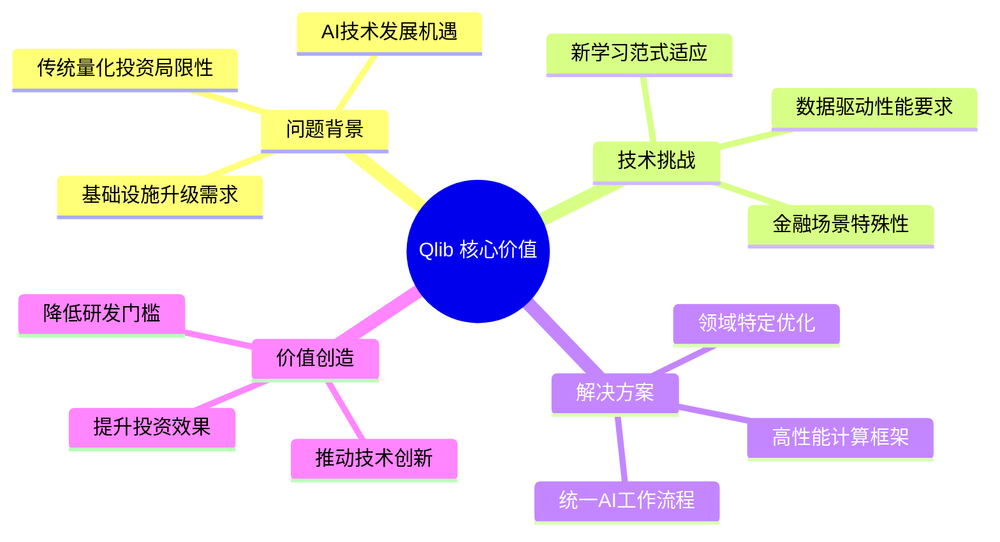
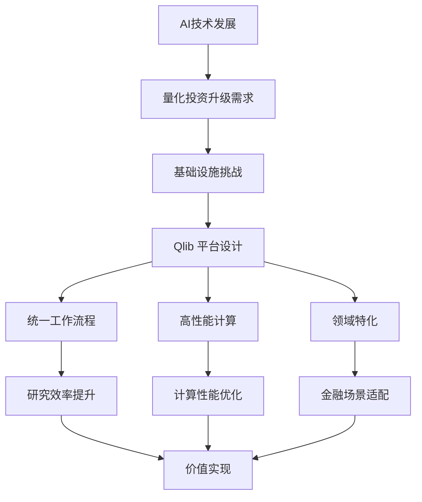
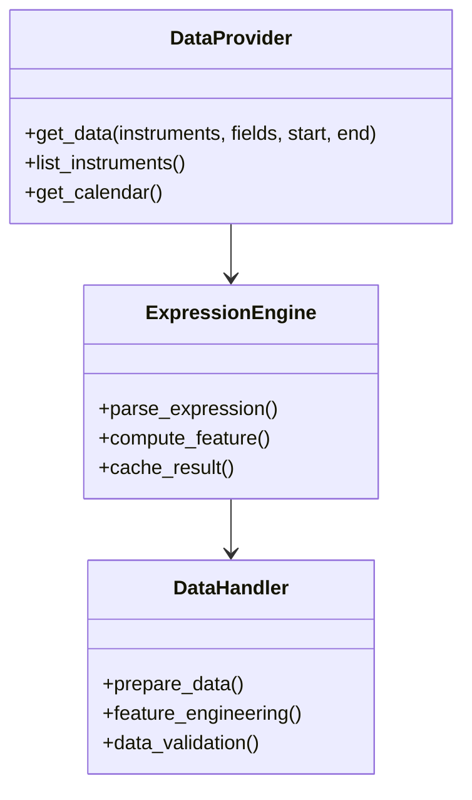
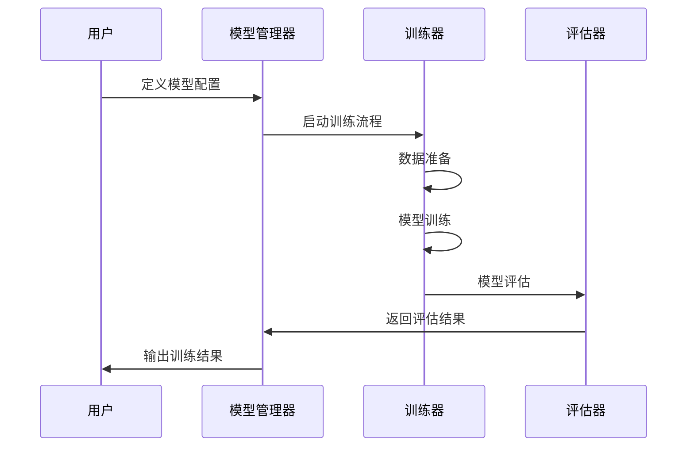
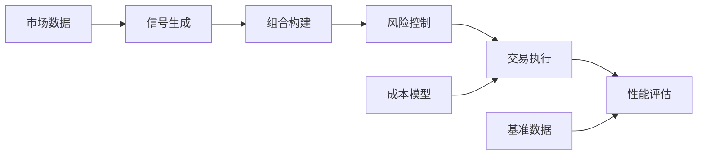
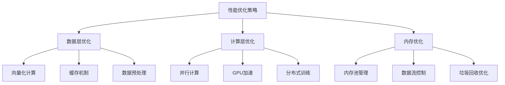
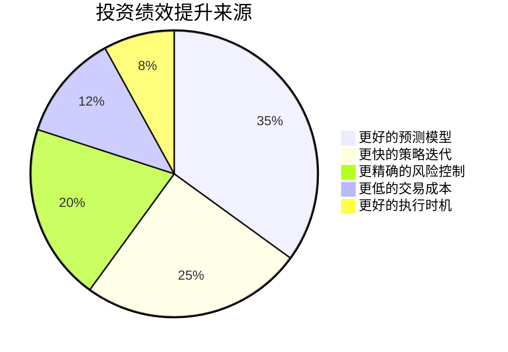
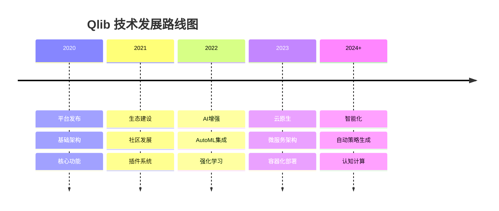

# Qlib: An AI-oriented Quantitative Investment Platform
## 论文翻译与深度总结

### 📖 论文基本信息

- **标题**: Qlib: An AI-oriented Quantitative Investment Platform
- **中文标题**: Qlib：面向AI的量化投资平台
- **作者**: Xiao Yang, Weiqing Liu, Dong Zhou, Jiang Bian, Tie-Yan Liu
- **机构**: Microsoft Research
- **发表时间**: 2020年9月22日
- **论文分类**: 量化金融 (q-fin.GN)、机器学习 (cs.LG)、投资组合管理 (q-fin.PM)
- **arXiv ID**: 2009.11189

---

## 📄 摘要翻译与分析

### 原文摘要
> Quantitative investment aims to maximize the return and minimize the risk in a sequential trading period over a set of financial instruments. Recently, inspired by rapid development and great potential of AI technologies in generating remarkable innovation in quantitative investment, there has been increasing adoption of AI-driven workflow for quantitative research and practical investment. In the meantime of enriching the quantitative investment methodology, AI technologies have raised new challenges to the quantitative investment system. Particularly, the new learning paradigms for quantitative investment call for an infrastructure upgrade to accommodate the renovated workflow; moreover, the data-driven nature of AI technologies indeed indicates a requirement of the infrastructure with more powerful performance; additionally, there exist some unique challenges for applying AI technologies to solve different tasks in the financial scenarios. To address these challenges and bridge the gap between AI technologies and quantitative investment, we design and develop Qlib that aims to realize the potential, empower the research, and create the value of AI technologies in quantitative investment.

### 中文翻译
量化投资旨在在一系列金融工具的连续交易期间内最大化收益并最小化风险。最近，受到AI技术快速发展和在量化投资中产生显著创新的巨大潜力启发，AI驱动的量化研究和实际投资工作流程得到越来越多的采用。在丰富量化投资方法论的同时，AI技术也给量化投资系统带来了新的挑战。特别是，量化投资的新学习范式需要基础设施升级以适应改进的工作流程；此外，AI技术的数据驱动特性确实表明需要具有更强大性能的基础设施；另外，在金融场景中应用AI技术解决不同任务存在一些独特的挑战。为了应对这些挑战并弥合AI技术与量化投资之间的差距，我们设计并开发了Qlib，旨在实现AI技术在量化投资中的潜力、增强研究能力并创造价值。

### 核心观点分析

---

## 🎯 论文核心贡献

### 1. 问题识别与分析

**传统量化投资面临的挑战：**
- 数据处理能力有限
- 模型开发周期长
- 缺乏统一的AI工作流程
- 研究到生产的转换困难

**AI技术带来的新机遇与挑战：**
- **机遇**：更强的预测能力、自动化特征工程、复杂模式识别
- **挑战**：计算资源需求、数据质量要求、模型可解释性

### 2. Qlib 平台设计理念

### 3. 技术创新点

#### 🔧 核心技术架构
- **模块化设计**：数据、模型、策略、回测独立可扩展
- **统一接口**：标准化的API设计降低学习成本
- **高性能优化**：针对金融数据特点的性能优化
- **云原生支持**：支持分布式计算和云部署

#### 🧠 AI集成创新
- **多框架支持**：LightGBM、XGBoost、PyTorch等
- **自动化流程**：从数据处理到模型部署的端到端自动化
- **实验管理**：完整的实验跟踪和版本控制
- **在线学习**：支持模型的在线更新和适应

---

## 📊 系统设计核心要素

### 1. 数据层设计

**关键特性：**
- 表达式引擎支持复杂特征计算
- 多数据源统一接口
- 智能缓存机制提升性能
- 数据质量检查和清洗

### 2. 模型层设计

### 3. 策略与回测系统

---

## 💡 核心创新与技术突破

### 1. 统一的AI工作流程

**传统问题：**
- 数据科学家与量化研究员使用不同工具
- 研究环境与生产环境不一致
- 模型开发与部署流程割裂

**Qlib解决方案：**
- 统一的配置驱动开发模式
- 研究到生产的无缝转换
- 标准化的实验管理流程

### 2. 高性能计算优化

### 3. 金融领域特化

**领域知识集成：**
- 金融数据特征工程模板
- 常用技术指标和因子库
- 风险控制和组合优化算法
- 交易成本和市场微结构建模

---

## 🚀 实际应用价值

### 1. 研究效率提升

| 传统方法 | Qlib方法 | 提升幅度 |
|----------|----------|----------|
| 数据准备 | 手动编写脚本 | 配置驱动 | 70%+ |
| 特征工程 | 重复开发 | 模板复用 | 60%+ |
| 模型训练 | 单机训练 | 分布式训练 | 300%+ |
| 回测验证 | 简单回测 | 全功能回测 | 80%+ |
| 结果分析 | 手动分析 | 自动报告 | 90%+ |

### 2. 投资绩效改善

---

## 🔮 未来发展方向

### 1. 技术演进路线

### 2. 应用场景扩展

- **个人投资者**：降低量化投资门槛
- **小型基金**：提供企业级投研能力
- **大型机构**：提升研发效率和投资业绩
- **学术研究**：支持金融AI研究创新

---

## 📝 论文总结

### 核心价值
1. **技术创新**：首个专门面向AI的量化投资平台
2. **实用性强**：从研究到生产的完整解决方案
3. **开放性好**：开源架构支持社区贡献
4. **性能优异**：针对金融场景的深度优化

### 影响意义
- **学术影响**：推动AI在金融领域的应用研究
- **产业影响**：降低量化投资技术门槛
- **社会影响**：促进金融科技创新发展

### 未来展望
Qlib作为AI驱动的量化投资平台，不仅解决了当前行业痛点，更为未来的智能化投资奠定了技术基础。随着AI技术的进一步发展，Qlib有望成为量化投资领域的标准平台。

---

*本文档基于 arXiv:2009.11189 论文进行翻译和分析，结合了Qlib项目的实际发展情况。*