# Qlib 技术架构深度解析
## 面向AI的量化投资平台技术剖析

---

## 🎯 架构设计理念

### 1. 核心设计原则

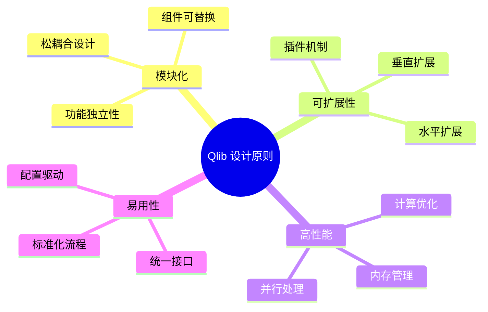

### 2. 技术架构愿景

**传统量化系统 vs Qlib**

| 维度 | 传统系统 | Qlib系统 |
|------|----------|----------|
| 架构模式 | 单体架构 | 微服务架构 |
| 数据处理 | 批处理为主 | 流批一体 |
| 计算模式 | 单机计算 | 分布式计算 |
| AI集成 | 后期集成 | 原生支持 |
| 开发模式 | 代码驱动 | 配置驱动 |
| 部署方式 | 本地部署 | 云原生 |

---

## 🏗️ 系统整体架构

### 1. 分层架构设计

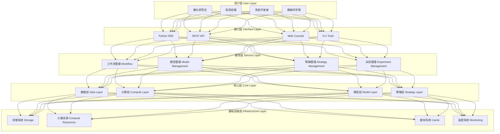

### 2. 核心组件交互

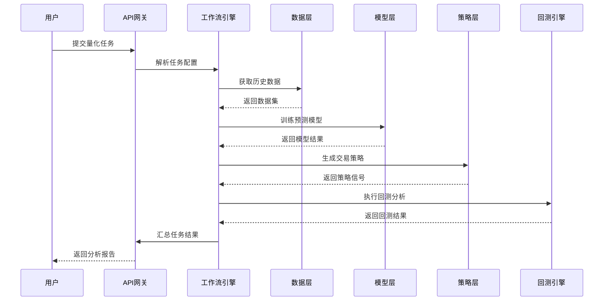

---

## 📊 数据架构设计

### 1. 数据流架构

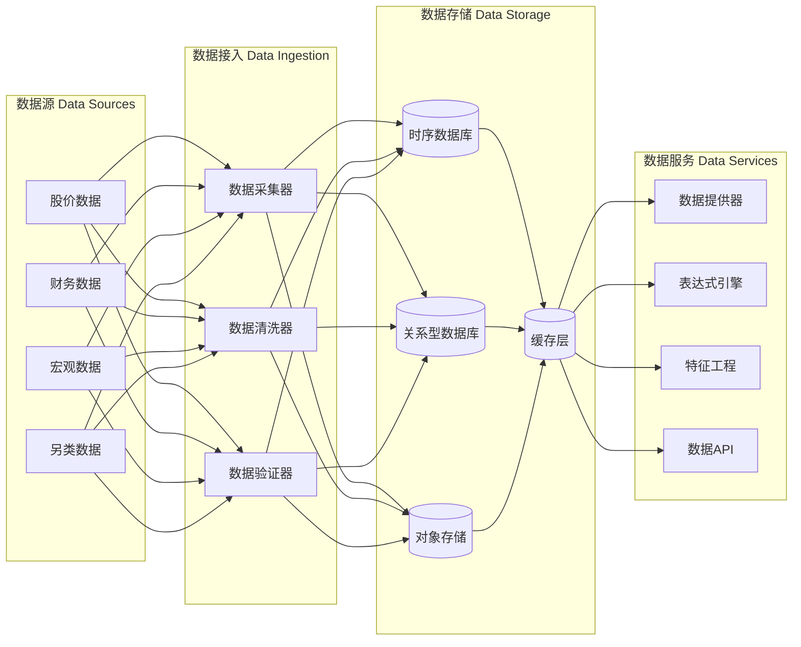

### 2. 数据模型设计

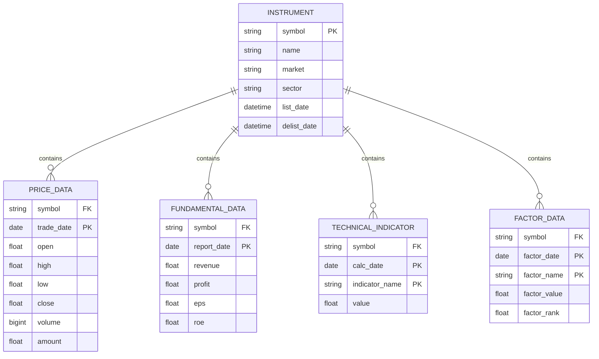

---

## 🧠 AI计算架构

### 1. 机器学习流水线

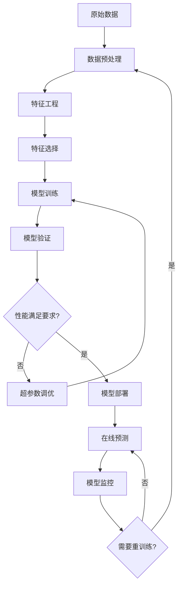

### 2. 分布式训练架构

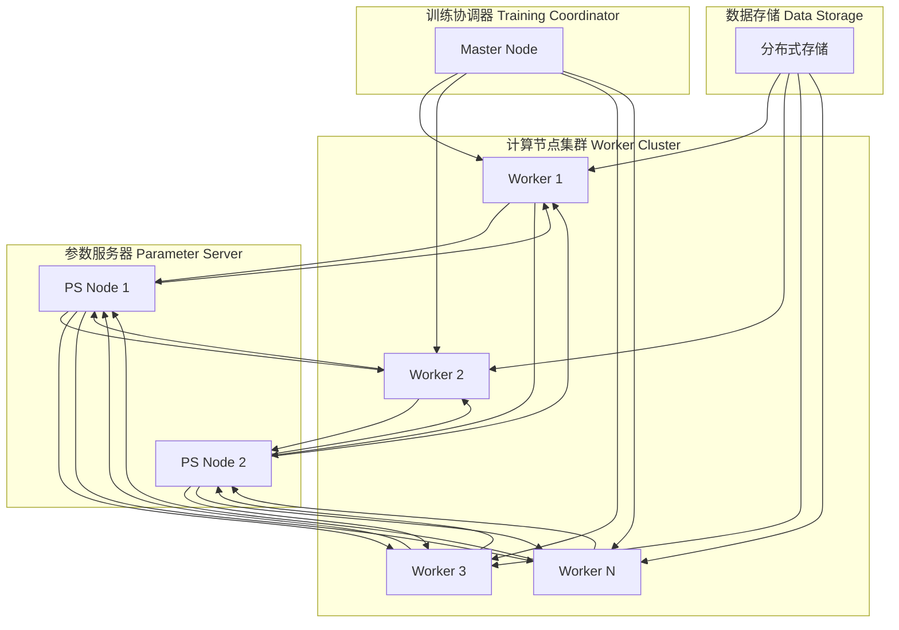

---

## 💼 业务架构设计

### 1. 量化研究工作流

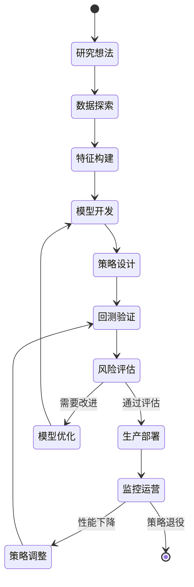

### 2. 实时交易架构

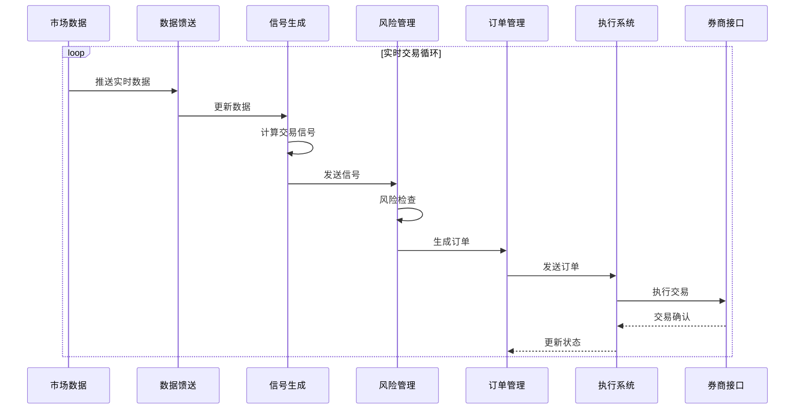

---

## 🔧 技术栈解析

### 1. 核心技术栈

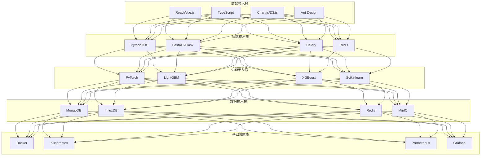

### 2. 性能优化技术

| 优化层面 | 技术方案 | 性能提升 |
|----------|----------|----------|
| 计算优化 | 向量化计算 | 10-100x |
| 内存优化 | 内存池管理 | 30-50% |
| 缓存优化 | 多级缓存 | 50-200% |
| 并行优化 | 多进程/线程 | N倍(N为核数) |
| 分布式优化 | 集群计算 | M倍(M为节点数) |
| GPU优化 | CUDA加速 | 100-1000x |

---

## 🔐 安全架构设计

### 1. 安全防护体系

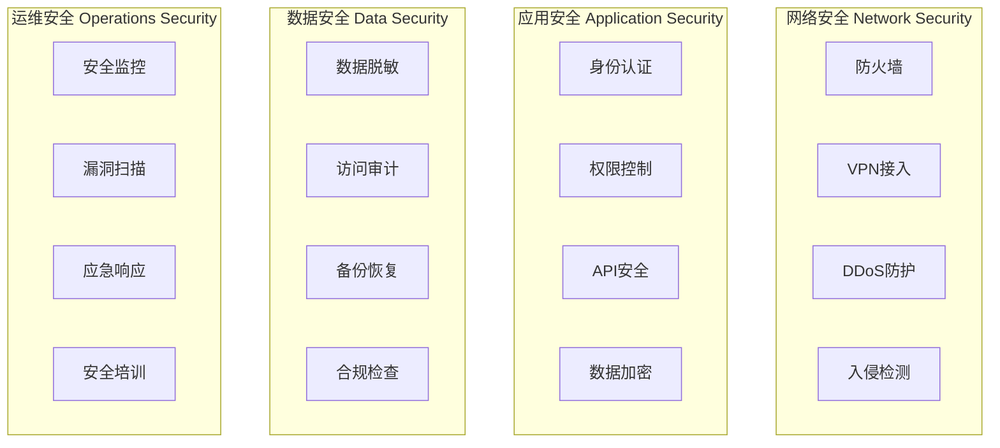

### 2. 权限管理模型

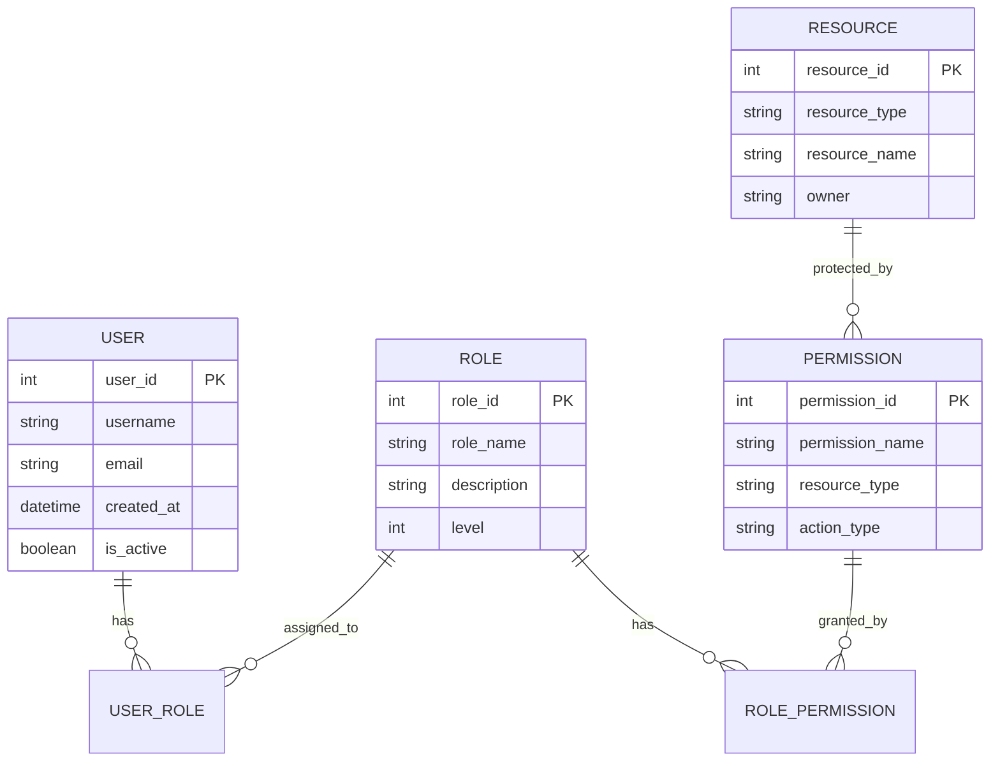

---

## 📈 可扩展性设计

### 1. 水平扩展架构

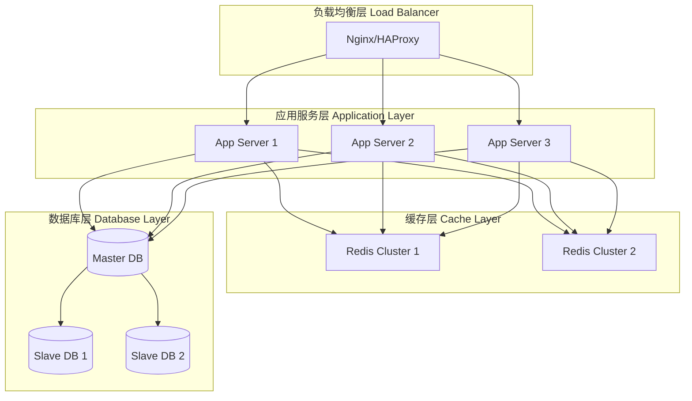

### 2. 微服务架构

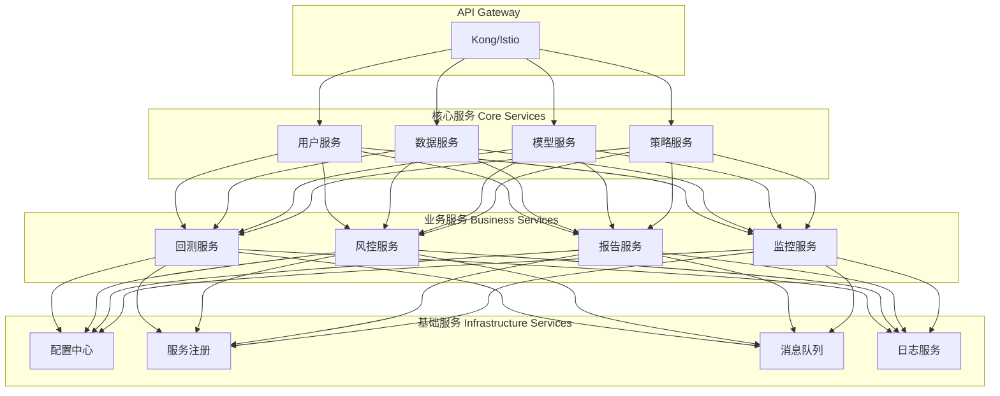

---

## 🌐 云原生架构

### 1. 容器化部署

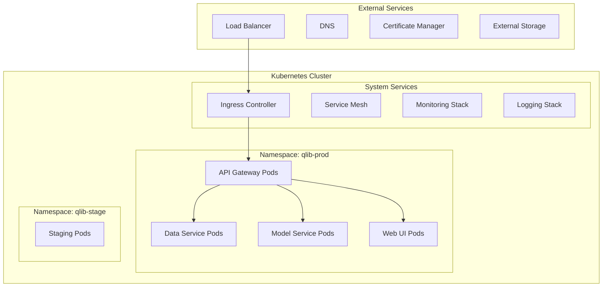

### 2. DevOps流水线

```mermaid
gitgraph
    commit id: "代码提交"
    branch develop
    commit id: "功能开发"
    commit id: "单元测试"
    checkout main
    merge develop id: "代码合并"
    commit id: "构建镜像"
    commit id: "安全扫描"
    commit id: "集成测试"
    branch staging
    commit id: "预生产部署"
    commit id: "性能测试"
    checkout main
    merge staging id: "生产部署"
    commit id: "监控验证"
```

---

## 🎛️ 监控与运维架构

### 1. 全链路监控

```mermaid
graph TD
    subgraph "应用监控 Application Monitoring"
        AM1[业务指标]
        AM2[应用性能]
        AM3[错误追踪]
        AM4[用户行为]
    end
    
    subgraph "基础设施监控 Infrastructure Monitoring"
        IM1[服务器指标]
        IM2[网络监控]
        IM3[存储监控]
        IM4[容器监控]
    end
    
    subgraph "数据监控 Data Monitoring"
        DM1[数据质量]
        DM2[数据完整性]
        DM3[数据延迟]
        DM4[数据血缘]
    end
    
    subgraph "AI模型监控 Model Monitoring"
        MM1[模型性能]
        MM2[预测准确性]
        MM3[数据漂移]
        MM4[模型版本]
    end
    
    subgraph "统一监控平台 Unified Monitoring"
        UM1[Prometheus]
        UM2[Grafana]
        UM3[AlertManager]
        UM4[ELK Stack]
    end
    
    AM1 & AM2 & AM3 & AM4 --> UM1 & UM2 & UM3 & UM4
    IM1 & IM2 & IM3 & IM4 --> UM1 & UM2 & UM3 & UM4
    DM1 & DM2 & DM3 & DM4 --> UM1 & UM2 & UM3 & UM4
    MM1 & MM2 & MM3 & MM4 --> UM1 & UM2 & UM3 & UM4
```

---

## 🚀 技术创新亮点

### 1. 配置驱动开发

**传统开发模式**:
```python
# 传统硬编码方式
model = LGBMRegressor(
    learning_rate=0.1,
    max_depth=6,
    num_leaves=64
)
```

**Qlib配置驱动**:
```yaml
# 配置文件驱动
model:
  class: LGBModel
  module_path: qlib.contrib.model.gbdt
  kwargs:
    learning_rate: 0.1
    max_depth: 6
    num_leaves: 64
```

### 2. 表达式引擎创新

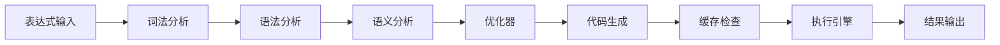

**特色功能**:
- 向量化计算优化
- 智能缓存机制  
- 表达式依赖分析
- 增量计算支持

---

## 📋 架构总结

### 核心优势

1. **模块化设计**：高内聚低耦合的架构设计
2. **性能优化**：多层次的性能优化策略
3. **可扩展性**：支持水平和垂直扩展
4. **云原生**：现代化的容器化和微服务架构
5. **AI友好**：针对AI工作流的深度优化

### 技术创新

1. **统一工作流**：从研究到生产的一体化流程
2. **配置驱动**：声明式的开发和部署模式
3. **表达式引擎**：高性能的特征计算引擎
4. **分布式训练**：大规模机器学习支持
5. **实时处理**：流批一体的数据处理能力

### 未来演进

1. **智能化**：自动化模型选择和超参数优化
2. **边缘计算**：支持边缘部署和计算
3. **联邦学习**：多方数据协作训练
4. **量子计算**：量子算法和量子机器学习集成
5. **AutoML**：全自动机器学习流水线

---

*本文档从技术架构角度深入分析了Qlib平台的设计理念和实现方案，为理解和使用Qlib提供了全面的技术视角。*