# Qlib 应用场景与商业价值分析
## 量化投资平台的商业生态与价值创造

---

## 🎯 市场背景与机遇

### 1. 全球量化投资市场概况

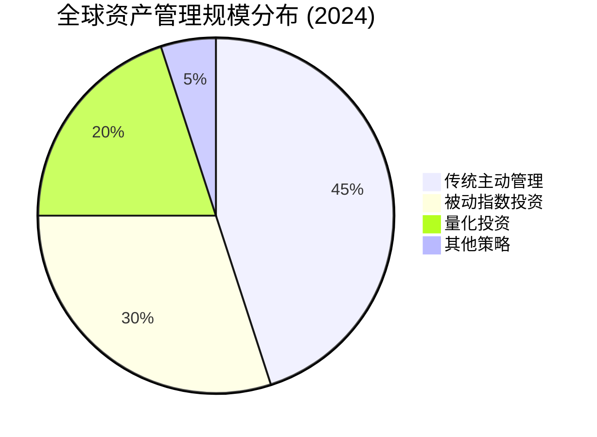

**市场规模数据：**
- 全球资产管理规模：约110万亿美元
- 量化投资规模：约22万亿美元  
- 年增长率：15-20%
- 中国量化投资规模：约8000亿人民币

### 2. 量化投资发展趋势

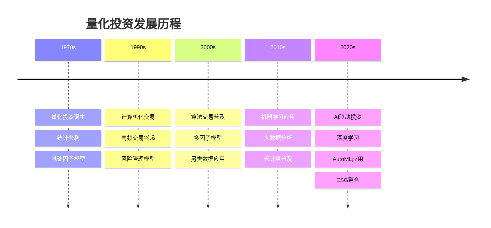

---

## 🏢 目标客户群体分析

### 1. 客户细分矩阵

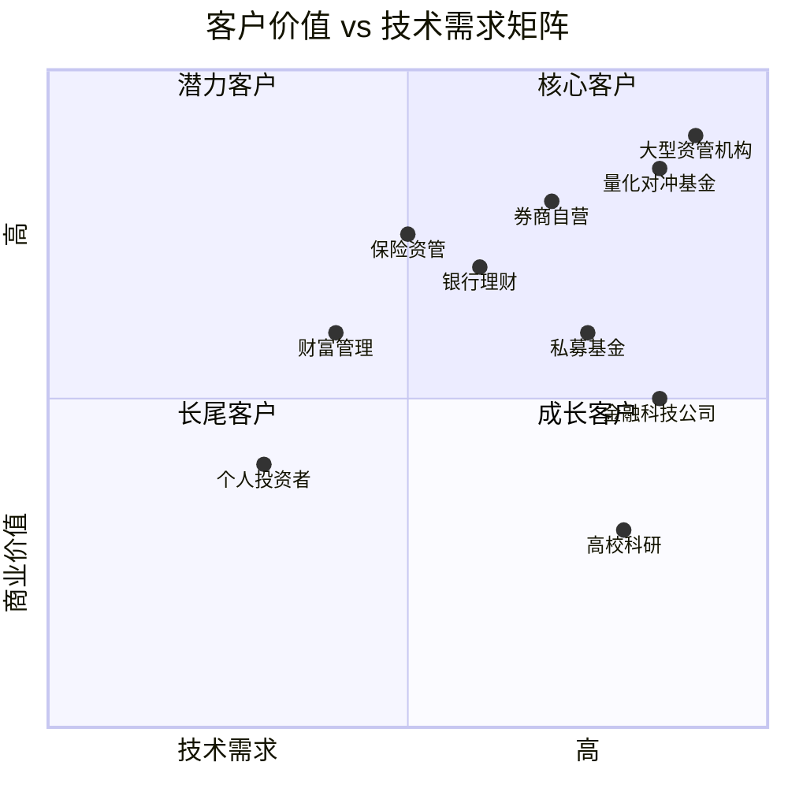

### 2. 细分客户特征

| 客户类型 | 规模特征 | 技术特征 | 商业价值 | 主要痛点 |
|----------|----------|----------|----------|----------|
| **大型资管机构** | AUM > 1000亿 | 技术团队完善 | 极高 | 创新压力、监管要求 |
| **量化对冲基金** | AUM 10-500亿 | 技术驱动 | 很高 | 策略同质化、人才竞争 |
| **券商自营** | 资本金 > 100亿 | 技术基础良好 | 高 | 风控要求、合规压力 |
| **银行理财** | AUM > 500亿 | 技术相对薄弱 | 高 | 净值化转型、投研能力 |
| **保险资管** | AUM > 200亿 | 传统投资为主 | 中高 | 资产配置、久期匹配 |
| **私募基金** | AUM 1-50亿 | 技术参差不齐 | 中 | 资金募集、业绩压力 |

---

## 💼 核心应用场景

### 1. 量化研究平台

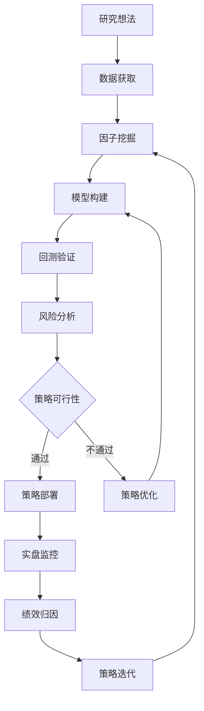

**价值创造：**
- **效率提升**：研究周期从月缩短到周
- **成本降低**：研发成本降低40-60%
- **质量提升**：策略成功率提升30-50%
- **创新能力**：支持更复杂的策略开发

### 2. 智能投顾系统

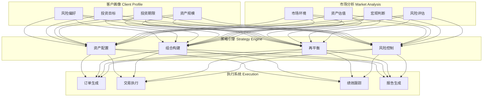

### 3. 风险管理系统

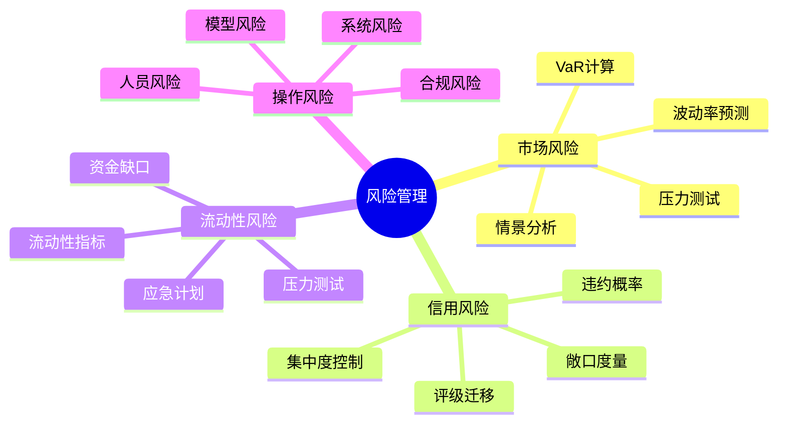

---

## 💰 商业模式分析

### 1. 收入模式结构

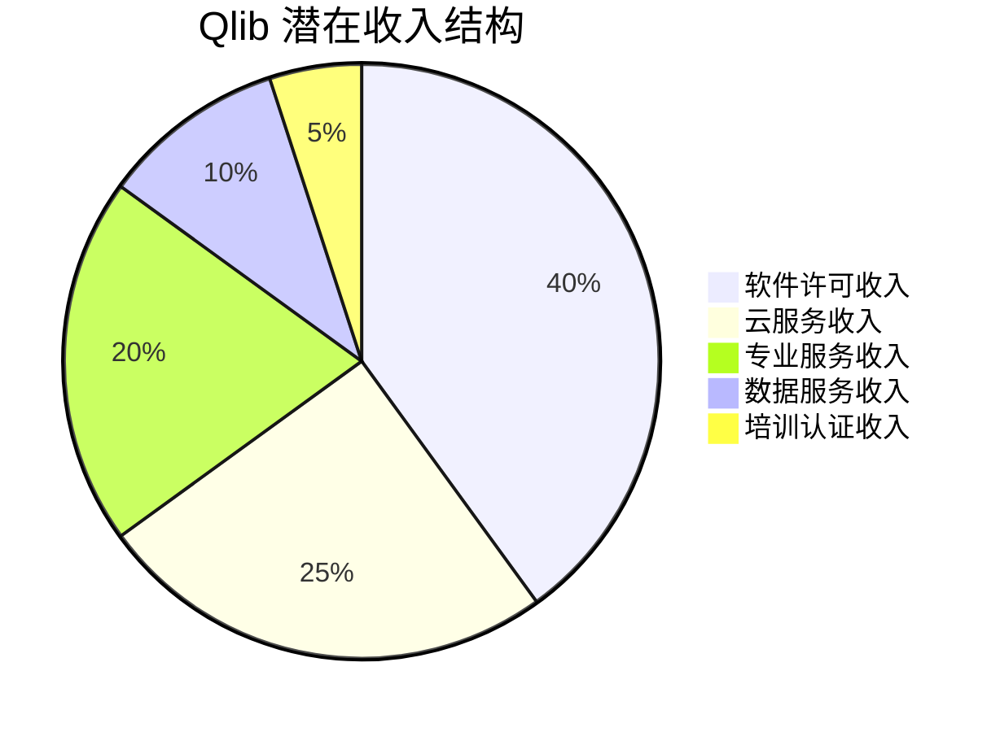

### 2. 盈利模式设计

| 收入类型 | 定价模式 | 目标客户 | 预期占比 | 增长潜力 |
|----------|----------|----------|----------|----------|
| **企业许可** | 年度订阅 | 大中型机构 | 40% | 稳定增长 |
| **云平台服务** | 按使用付费 | 全客户群 | 25% | 快速增长 |
| **专业服务** | 项目制 | 大型客户 | 20% | 中等增长 |
| **数据服务** | 数据包 | 所有客户 | 10% | 高速增长 |
| **教育培训** | 课程费用 | 个人及小机构 | 5% | 稳定增长 |

---

## 🎯 竞争优势分析

### 1. 竞争格局概览

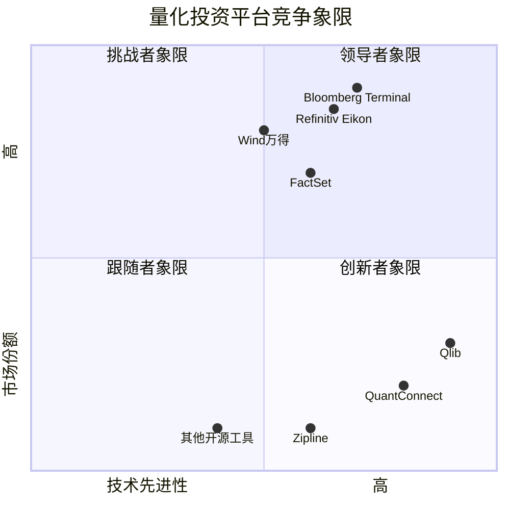

### 2. 核心竞争优势

```mermaid
radar
    title Qlib 竞争力雷达图
    "技术创新性" : 95
    "易用性" : 85
    "性能表现" : 90
    "生态完整性" : 80
    "成本效益" : 95
    "社区支持" : 75
    "企业服务" : 70
    "品牌知名度" : 60
```

**优势详解：**

1. **技术创新性 (95分)**
   - AI原生设计
   - 统一工作流程
   - 高性能计算

2. **成本效益 (95分)**
   - 开源免费
   - 降低开发成本
   - 快速部署

3. **性能表现 (90分)**
   - 分布式计算
   - 内存优化
   - 并行处理

4. **易用性 (85分)**
   - 配置驱动
   - 丰富文档
   - 活跃社区

---

## 📊 市场价值评估

### 1. 直接经济价值

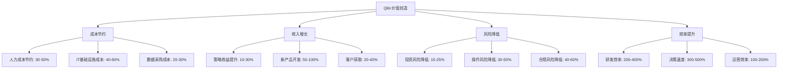

### 2. ROI分析模型

**投资回收期计算：**

```
年度节约成本 = 人力成本节约 + IT成本节约 + 运营效率提升
年度额外收入 = 策略收益提升 + 新产品收入 + 客户增长
年度总价值 = 年度节约成本 + 年度额外收入

投资回收期 = 初始投入成本 / 年度总价值
```

**典型客户ROI：**

| 客户类型 | 初始投入 | 年度价值 | 投资回收期 | 3年ROI |
|----------|----------|----------|------------|---------|
| 大型资管 | 500万 | 2000万 | 3个月 | 1100% |
| 量化基金 | 200万 | 800万 | 3个月 | 1100% |
| 券商自营 | 300万 | 1000万 | 4个月 | 900% |
| 私募基金 | 100万 | 300万 | 4个月 | 800% |

---

## 🌐 生态系统建设

### 1. 产业生态图谱

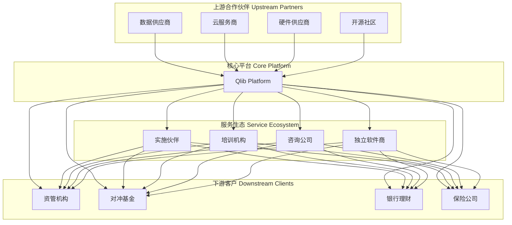

### 2. 价值链分析

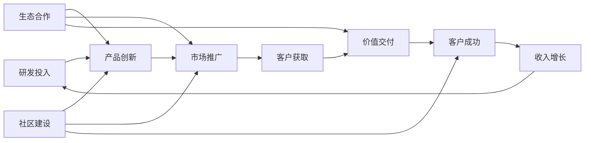

---

## 🚀 市场拓展策略

### 1. 分阶段市场策略

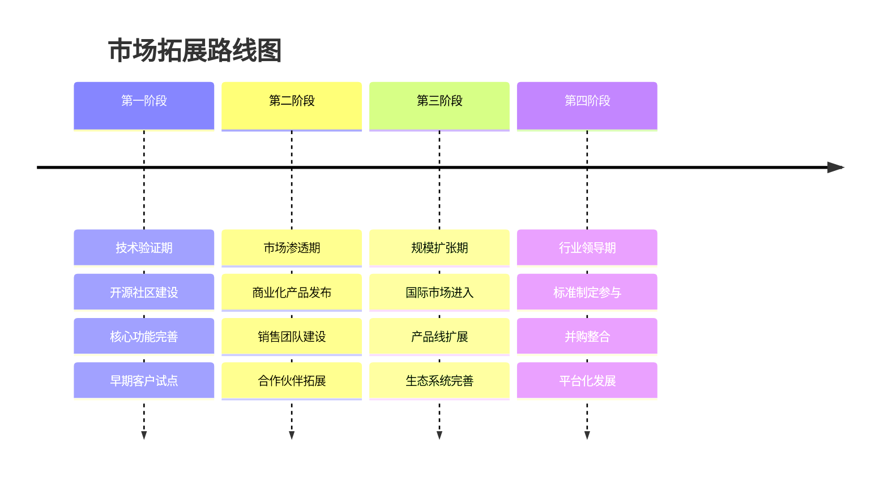

### 2. 客户获取策略

| 策略类型 | 具体措施 | 目标客户 | 预期效果 |
|----------|----------|----------|----------|
| **技术营销** | 开源社区、技术会议 | 技术决策者 | 品牌认知度 |
| **内容营销** | 白皮书、案例研究 | 业务决策者 | 专业权威性 |
| **合作伙伴** | 系统集成商、咨询公司 | 企业客户 | 销售渠道 |
| **直销团队** | 专业销售、解决方案 | 大客户 | 直接转化 |
| **在线销售** | SaaS平台、自助试用 | 中小客户 | 规模化获客 |

---

## 🔮 未来发展机遇

### 1. 新兴技术融合

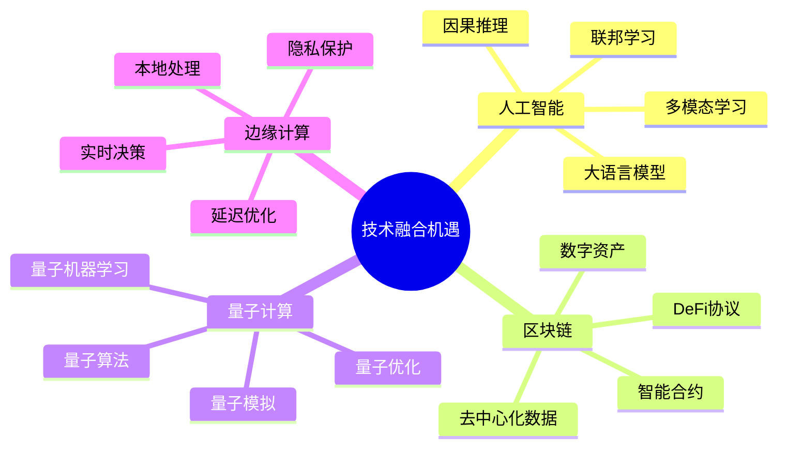

### 2. 监管环境机遇

**有利因素：**
- 金融科技政策支持
- 数字化转型推动
- 资本市场改革深化
- 国际化进程加速

**挑战因素：**
- 数据安全要求
- 算法透明性
- 系统性风险控制
- 跨境数据流动限制

### 3. 市场空间预测

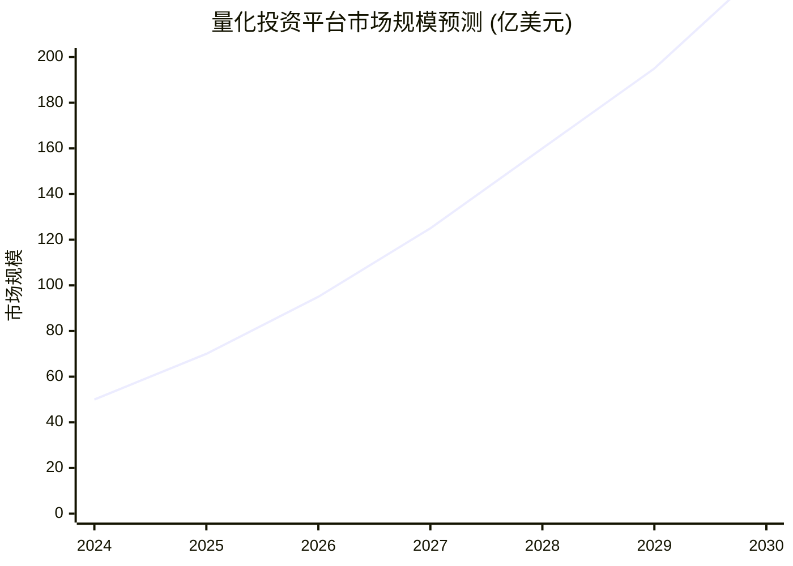

**增长驱动因素：**
- AI技术成熟度提升
- 投资机构数字化需求
- 个人投资者教育普及
- 监管环境逐步完善

---

## 📈 投资价值评估

### 1. 投资亮点

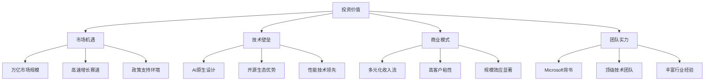

### 2. 风险因素

| 风险类型 | 具体描述 | 影响程度 | 应对策略 |
|----------|----------|----------|----------|
| **技术风险** | 竞争对手技术突破 | 中等 | 持续研发投入 |
| **市场风险** | 经济周期影响 | 中等 | 多元化客户结构 |
| **监管风险** | 政策变化影响 | 中等 | 合规体系建设 |
| **竞争风险** | 大厂入局竞争 | 高 | 生态系统建设 |
| **人才风险** | 核心人才流失 | 中等 | 激励机制完善 |

---

## 🎯 战略建议

### 1. 短期策略 (1-2年)

**产品策略：**
- 完善核心功能
- 提升用户体验
- 增强企业级特性

**市场策略：**
- 聚焦核心客户群
- 建立标杆客户
- 完善渠道体系

**技术策略：**
- 持续技术创新
- 开源社区运营
- 生态伙伴合作

### 2. 中期策略 (3-5年)

**业务拓展：**
- 国际市场进入
- 产品线扩展
- 垂直行业深耕

**能力建设：**
- 销售体系完善
- 服务能力提升
- 品牌影响力扩大

**生态发展：**
- 平台化转型
- 开放API体系
- 第三方应用商店

### 3. 长期愿景 (5-10年)

**行业地位：**
- 量化投资标准制定者
- 全球市场领导者
- 金融AI基础设施

**技术演进：**
- 认知计算能力
- 自动化投资决策
- 全流程智能化

---

## 📋 总结

### 核心价值主张

1. **降本增效**：显著降低量化投资门槛和成本
2. **技术领先**：AI原生设计的技术优势
3. **生态完整**：端到端的解决方案
4. **开放创新**：开源社区驱动的持续创新

### 商业前景

Qlib作为面向AI的量化投资平台，正处在量化投资行业数字化转型的关键节点。凭借其技术优势、生态建设和商业模式创新，有望成为这个万亿市场中的重要参与者，为投资者、机构和整个金融生态创造巨大价值。

### 成功关键因素

1. **技术持续创新**：保持AI技术领先优势
2. **生态系统建设**：构建健康可持续的商业生态
3. **客户成功导向**：以客户价值为核心的业务模式
4. **国际化视野**：把握全球市场机遇
5. **合规风控能力**：满足不断提升的监管要求

---

*本文档从商业角度全面分析了Qlib的市场机遇、竞争优势和发展策略，为理解其商业价值提供了系统性的分析框架。*