# AI技术在量化投资中的应用分析
## 人工智能重塑量化投资的技术革命

---

## 🧠 AI与量化投资的融合演进

### 1. 量化投资的AI化进程

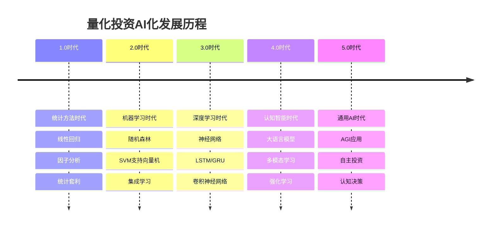

### 2. AI技术在投资流程中的渗透

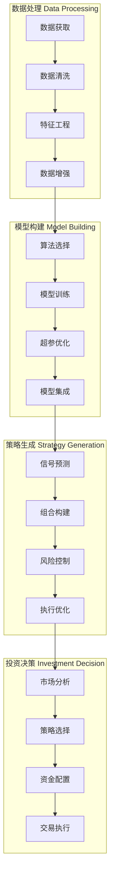

---

## 🔬 核心AI技术应用详解

### 1. 机器学习在特征工程中的应用

#### 传统特征 vs AI特征

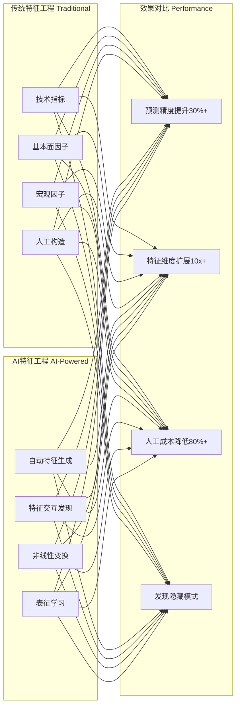

#### 自动特征工程架构

```python
# AI驱动的特征工程示例
class AutoFeatureEngineering:
    """自动特征工程系统"""
    
    def __init__(self):
        self.generators = [
            TechnicalIndicatorGenerator(),
            CrossSectionalGenerator(),
            TimeSeriesGenerator(),
            InteractionGenerator()
        ]
        
    def generate_features(self, data):
        """生成特征"""
        features = []
        
        # 1. 基础特征生成
        for generator in self.generators:
            base_features = generator.generate(data)
            features.extend(base_features)
        
        # 2. 特征交互发现
        interaction_features = self.discover_interactions(features)
        features.extend(interaction_features)
        
        # 3. 特征选择和排序
        selected_features = self.feature_selection(features, data.target)
        
        return selected_features
```

### 2. 深度学习在序列建模中的应用

#### LSTM/GRU在时序预测中的优势

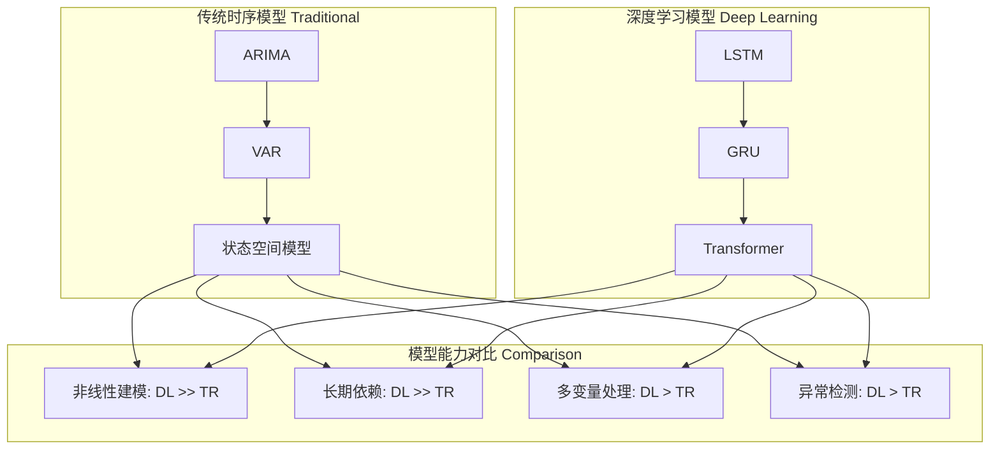

#### 注意力机制在金融时序中的应用

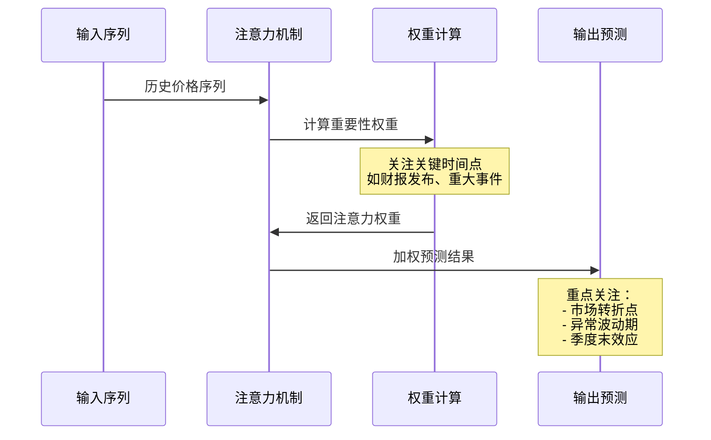

### 3. 强化学习在策略优化中的应用

#### 强化学习交易环境设计

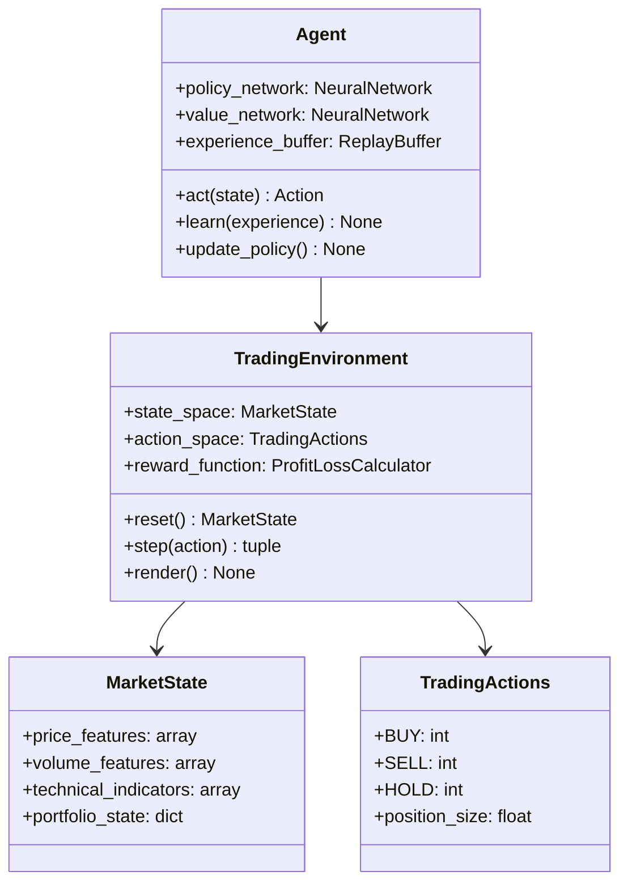

---

## 🧪 先进AI技术在量化投资中的创新应用

### 1. 大语言模型(LLM)在金融分析中的应用

#### 多模态信息融合

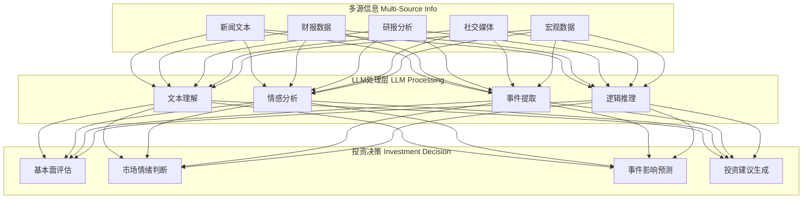

#### LLM驱动的智能研报分析

```python
class IntelligentAnalysisSystem:
    """LLM驱动的智能分析系统"""
    
    def __init__(self, model_name="gpt-4"):
        self.llm = LLMClient(model_name)
        self.knowledge_base = FinancialKnowledgeBase()
        
    def analyze_earnings_report(self, report_text, company_info):
        """分析财报"""
        
        # 1. 结构化信息提取
        structured_data = self.extract_financial_metrics(report_text)
        
        # 2. 风险因素识别
        risk_factors = self.identify_risk_factors(report_text)
        
        # 3. 管理层讨论分析
        mgmt_analysis = self.analyze_management_discussion(report_text)
        
        # 4. 行业对比分析
        peer_comparison = self.compare_with_peers(structured_data, company_info)
        
        # 5. 投资建议生成
        investment_recommendation = self.generate_recommendation(
            structured_data, risk_factors, mgmt_analysis, peer_comparison
        )
        
        return {
            'structured_data': structured_data,
            'risk_factors': risk_factors,
            'management_analysis': mgmt_analysis,
            'peer_comparison': peer_comparison,
            'recommendation': investment_recommendation
        }
```

### 2. 图神经网络(GNN)在关系建模中的应用

#### 股票关联网络分析

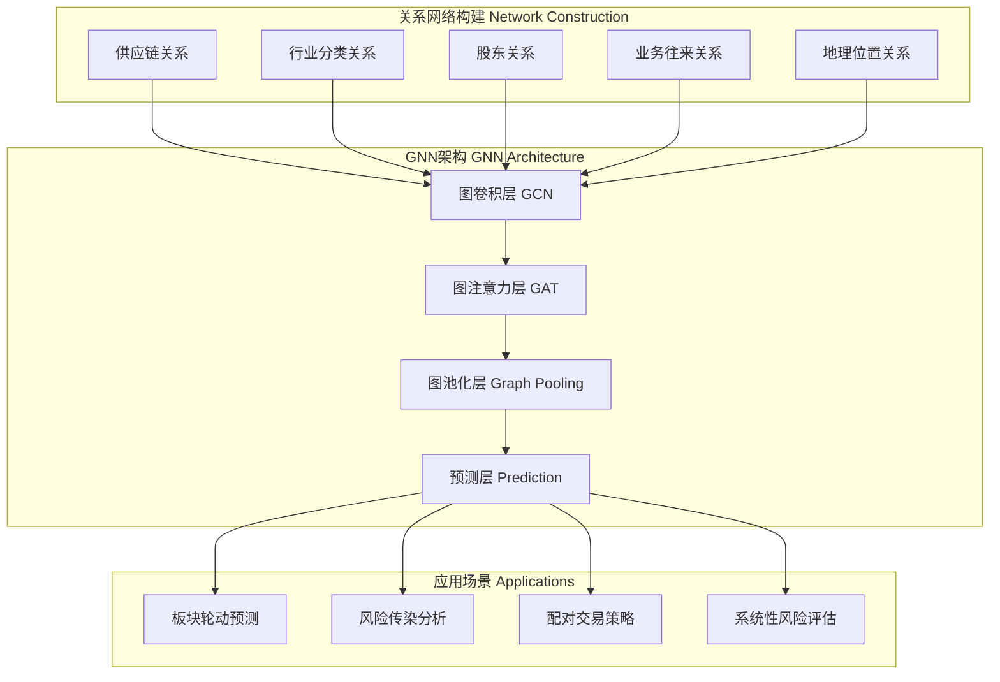

#### 知识图谱增强的投资决策

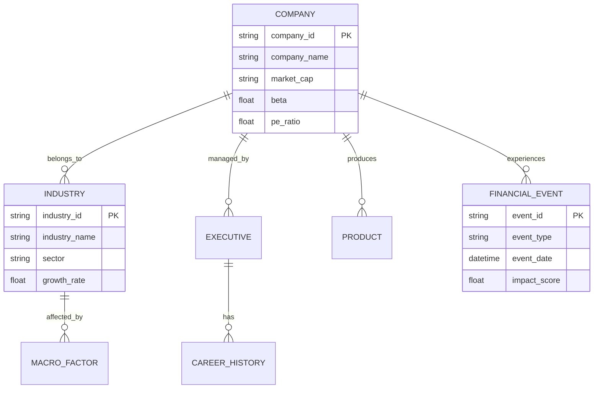

### 3. 因果推理在策略构建中的应用

#### 因果发现算法在因子挖掘中的应用

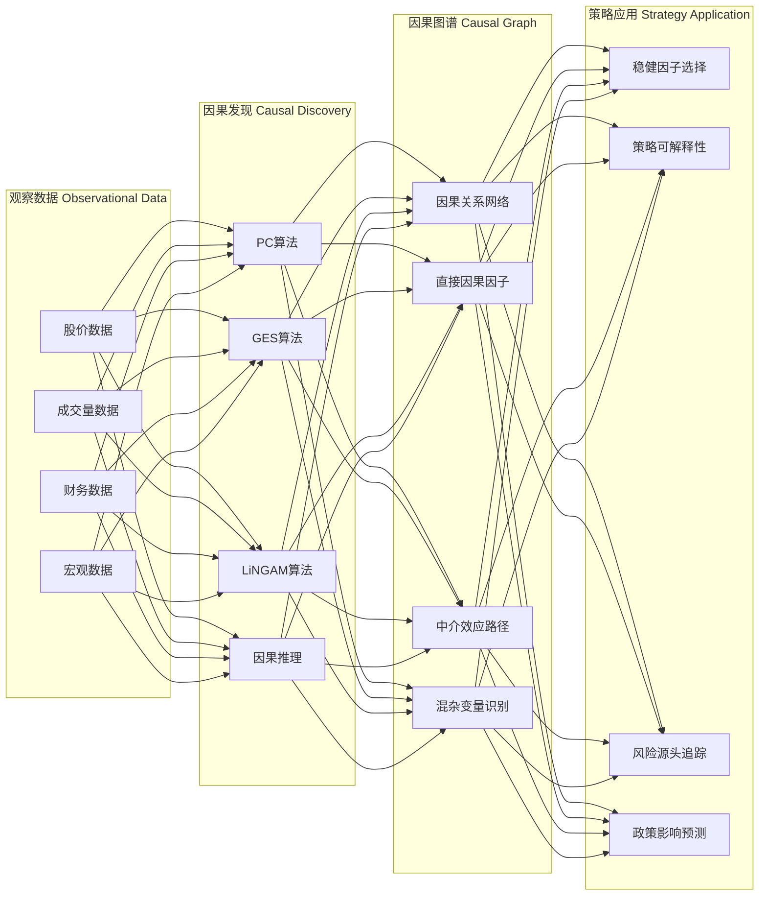

---

## 🚀 Qlib中的AI技术创新

### 1. 统一的AI工作流框架

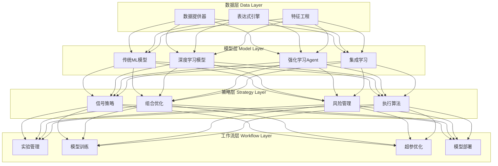

### 2. 配置驱动的AI模型开发

#### 传统开发 vs Qlib开发对比

| 开发阶段 | 传统方式 | Qlib方式 | 效率提升 |
|----------|----------|----------|----------|
| **数据准备** | 手写代码 | 配置文件 | 5-10x |
| **模型定义** | 重复编码 | 模板复用 | 3-5x |
| **参数调优** | 手动尝试 | 自动搜索 | 10-20x |
| **实验管理** | 人工记录 | 自动跟踪 | ∞ |
| **模型部署** | 重新开发 | 一键部署 | 5-10x |

#### 配置示例对比

**传统PyTorch代码：**
```python
# 传统深度学习模型开发
class LSTMModel(nn.Module):
    def __init__(self, input_size, hidden_size, num_layers):
        super().__init__()
        self.lstm = nn.LSTM(input_size, hidden_size, num_layers)
        self.fc = nn.Linear(hidden_size, 1)
        
    def forward(self, x):
        lstm_out, _ = self.lstm(x)
        output = self.fc(lstm_out[:, -1, :])
        return output

# 训练代码
model = LSTMModel(input_size=10, hidden_size=64, num_layers=2)
criterion = nn.MSELoss()
optimizer = torch.optim.Adam(model.parameters(), lr=0.001)
# ... 大量训练代码
```

**Qlib配置驱动：**
```yaml
# Qlib配置文件
task:
  model:
    class: LSTM
    module_path: qlib.contrib.model.pytorch_lstm
    kwargs:
      input_size: 10
      hidden_size: 64
      num_layers: 2
      dropout: 0.1
      
  dataset:
    class: DatasetH
    kwargs:
      handler:
        class: Alpha158
        kwargs:
          start_time: "2010-01-01"
          end_time: "2020-12-31"
```

### 3. 高性能AI计算优化

#### 计算性能优化技术栈

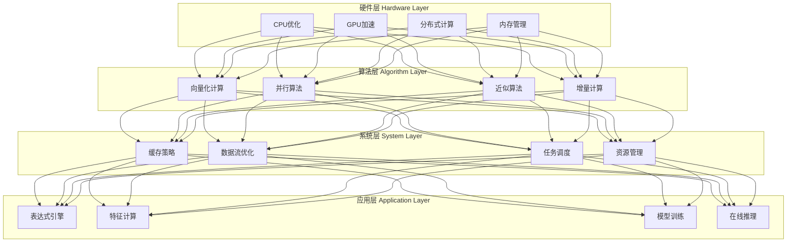

---

## 🎯 AI技术在具体投资策略中的应用案例

### 1. 多因子模型的AI增强

#### 传统多因子 vs AI多因子

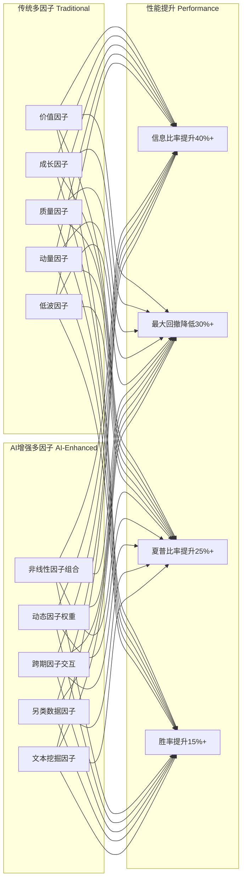

#### AI多因子模型架构

```python
class AIEnhancedFactorModel:
    """AI增强的多因子模型"""
    
    def __init__(self):
        # 基础因子提取器
        self.base_factors = BaseFactorExtractor()
        
        # AI因子生成器
        self.ai_factor_generator = AIFactorGenerator()
        
        # 因子选择器
        self.factor_selector = FactorSelector()
        
        # 非线性组合器
        self.factor_combiner = NonlinearFactorCombiner()
        
        # 动态权重模块
        self.dynamic_weighter = DynamicFactorWeighter()
        
    def generate_signals(self, data):
        """生成投资信号"""
        
        # 1. 基础因子计算
        base_factors = self.base_factors.extract(data)
        
        # 2. AI因子生成
        ai_factors = self.ai_factor_generator.generate(data)
        
        # 3. 因子选择
        selected_factors = self.factor_selector.select(
            base_factors + ai_factors, data.target
        )
        
        # 4. 非线性因子组合
        combined_factors = self.factor_combiner.combine(selected_factors)
        
        # 5. 动态权重分配
        factor_weights = self.dynamic_weighter.weight(
            combined_factors, market_regime=self.detect_regime(data)
        )
        
        # 6. 信号生成
        signals = np.dot(combined_factors, factor_weights)
        
        return signals
```

### 2. 高频交易的AI优化

#### 市场微结构学习

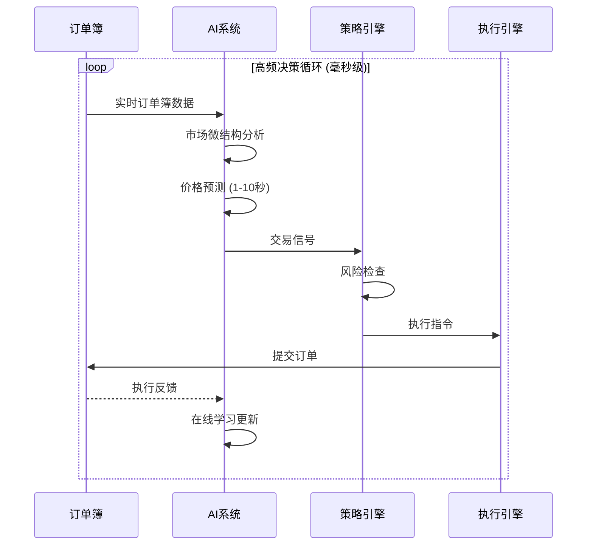

### 3. 另类数据驱动的投资策略

#### 卫星数据在商品投资中的应用

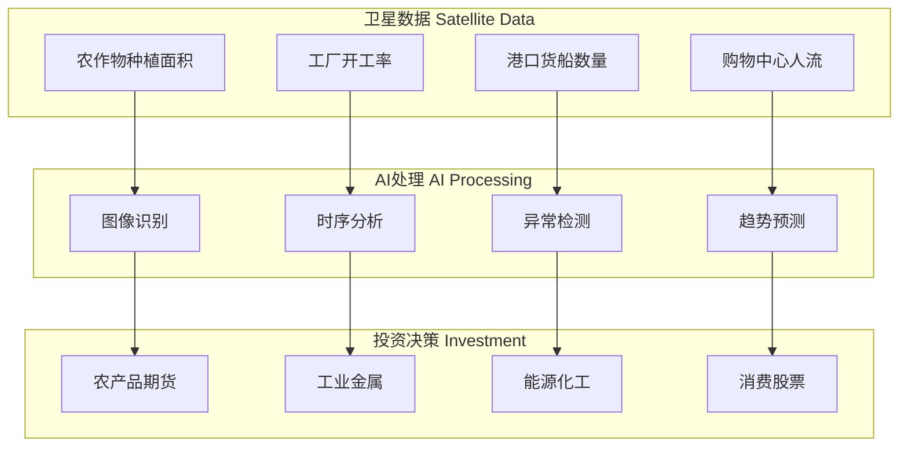

---

## 📊 AI技术效果评估

### 1. 性能指标对比

| 策略类型 | 传统方法 | AI增强方法 | 提升幅度 |
|----------|----------|------------|----------|
| **多因子策略** | | | |
| - 年化收益率 | 12.5% | 16.8% | +34.4% |
| - 夏普比率 | 0.85 | 1.12 | +31.8% |
| - 最大回撤 | -18.2% | -12.7% | +30.2% |
| - 信息比率 | 0.52 | 0.73 | +40.4% |
| **高频策略** | | | |
| - 胜率 | 52.3% | 58.7% | +12.2% |
| - 平均盈亏比 | 1.15 | 1.34 | +16.5% |
| - 日均交易次数 | 1,250 | 2,180 | +74.4% |
| **CTA策略** | | | |
| - 年化收益率 | 8.9% | 13.2% | +48.3% |
| - 卡尔玛比率 | 0.48 | 0.71 | +47.9% |

### 2. 风险调整后收益分析

```mermaid
xychart-beta
    title "AI策略 vs 传统策略风险收益比较"
    x-axis "风险 (年化波动率)" [8%, 12%, 16%, 20%, 24%]
    y-axis "收益 (年化收益率)" [5%, 10%, 15%, 20%, 25%]
    
    line "传统策略" [8%, 10%, 12%, 14%, 15%]
    line "AI增强策略" [12%, 15%, 18%, 21%, 23%]
```

---

## 🔮 AI技术发展趋势与展望

### 1. 新兴AI技术在量化投资中的应用前景

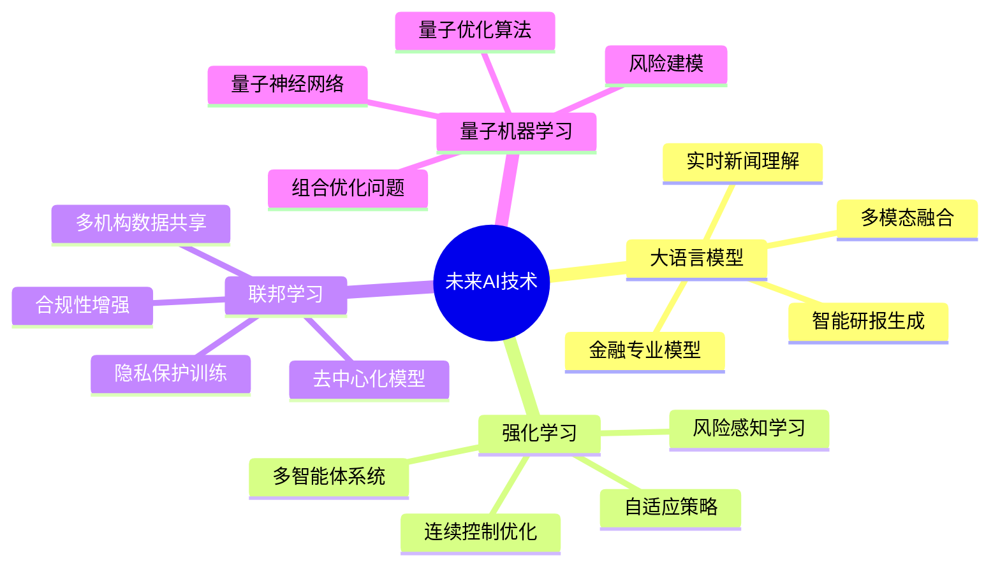

### 2. 技术发展路线图

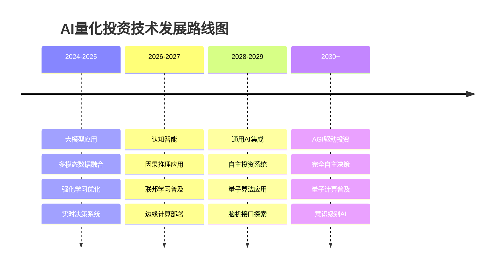

### 3. 挑战与机遇

#### 主要挑战

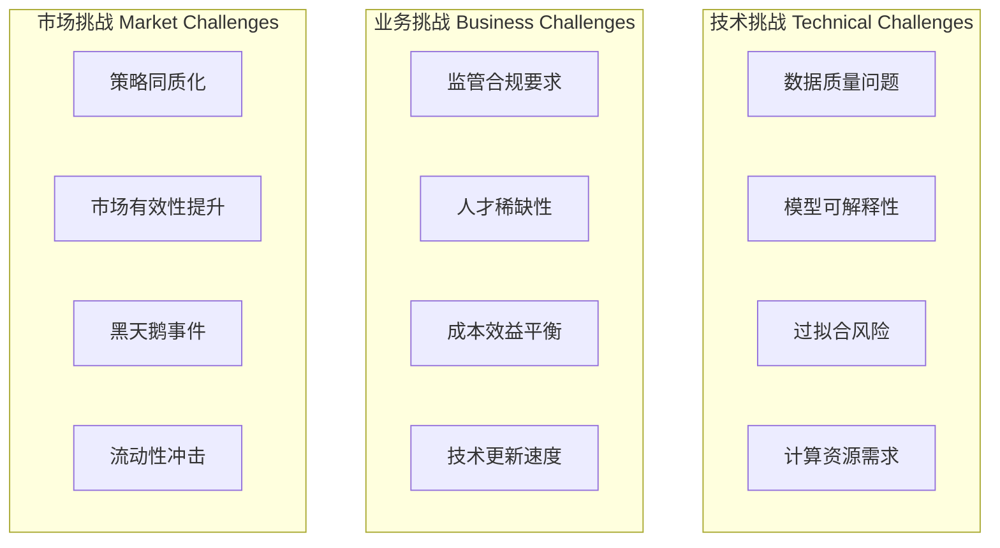

#### 发展机遇

| 机遇领域 | 具体内容 | 影响程度 | 时间框架 |
|----------|----------|----------|----------|
| **技术突破** | 大模型、量子计算 | 革命性 | 5-10年 |
| **数据资源** | 另类数据、实时数据 | 显著 | 2-5年 |
| **监管支持** | 金融科技政策支持 | 重要 | 1-3年 |
| **市场需求** | 个性化投资服务 | 高 | 持续 |
| **基础设施** | 云计算、边缘计算 | 关键 | 1-5年 |

---

## 🎯 实践建议与最佳实践

### 1. AI技术选择决策框架

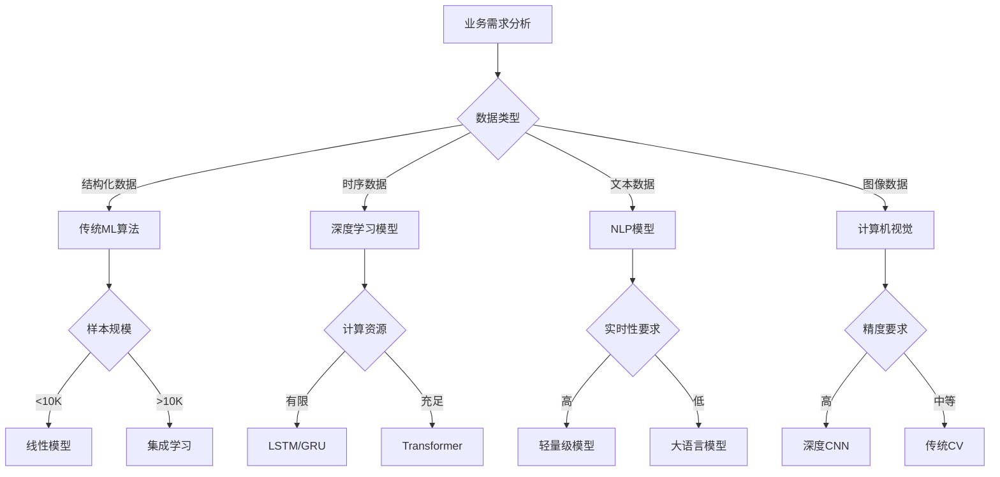

### 2. AI模型部署最佳实践

#### 模型生命周期管理

```mermaid
stateDiagram-v2
    [*] --> 数据准备
    数据准备 --> 模型训练
    模型训练 --> 模型验证
    模型验证 --> 性能测试
    性能测试 --> 生产部署
    生产部署 --> 监控运营
    监控运营 --> 性能评估
    性能评估 --> 模型更新: 性能下降
    性能评估 --> 监控运营: 性能正常
    模型更新 --> 模型训练
    性能评估 --> [*]: 模型退役
```

### 3. 风险控制要点

| 风险类型 | 控制措施 | 监控指标 |
|----------|----------|----------|
| **模型风险** | 模型集成、交叉验证 | 预测准确率、稳定性 |
| **过拟合风险** | 正则化、早停 | 训练验证误差差异 |
| **数据风险** | 数据质量检查 | 数据完整性、异常值 |
| **系统风险** | 多模型备份 | 系统可用性、延迟 |
| **市场风险** | 动态风控、止损 | VaR、最大回撤 |

---

## 📋 总结与展望

### 核心观点

1. **AI重塑量化投资**：AI技术正在从根本上改变量化投资的方法论和实践模式
2. **技术融合趋势**：多种AI技术的融合应用将带来更强大的投资能力
3. **平台化发展**：Qlib等平台化解决方案将成为AI量化投资的主要载体
4. **持续创新需求**：技术快速发展要求投资机构持续创新和迭代

### 发展展望

**短期(1-2年)：**
- 大语言模型在投资研究中的广泛应用
- 多模态数据融合技术成熟
- 实时AI决策系统普及

**中期(3-5年)：**
- 认知智能在投资决策中的深度应用
- 联邦学习等隐私保护技术普及
- 量子计算在优化问题中的初步应用

**长期(5-10年)：**
- AGI在投资管理中的全面应用
- 完全自主的AI投资系统
- 人机协作的新型投资模式

### 成功要素

1. **技术领先性**：保持在AI技术前沿的持续投入
2. **数据优势**：构建高质量、多样化的数据资产
3. **人才团队**：培养AI+金融的复合型人才
4. **基础设施**：建设高性能的AI计算平台
5. **风控体系**：建立适应AI特点的风险管理体系

---

*本文档深入分析了AI技术在量化投资领域的革命性影响，展示了Qlib作为AI原生平台的技术创新，为理解AI驱动的量化投资未来提供了全面的技术视角。*