# Qlib 实践指南与量化投资发展趋势
## 从入门到精通的完整实践路径

---

## 🎯 Qlib 实践入门指南

### 1. 环境准备与安装

#### 系统要求与推荐配置

```mermaid
graph TD
    subgraph "硬件要求 Hardware Requirements"
        H1[CPU: 8核以上]
        H2[内存: 32GB以上]
        H3[存储: 1TB SSD]
        H4[GPU: RTX 3080以上(可选)]
    end
    
    subgraph "软件环境 Software Environment"
        S1[Python 3.8+]
        S2[PyTorch/TensorFlow]
        S3[Pandas/NumPy]
        S4[Docker(推荐)]
    end
    
    subgraph "数据准备 Data Preparation"
        D1[历史股票数据]
        D2[财务数据]
        D3[另类数据(可选)]
        D4[基准数据]
    end
    
    H1 & H2 & H3 & H4 --> S1 & S2 & S3 & S4
    S1 & S2 & S3 & S4 --> D1 & D2 & D3 & D4
```

#### 安装与配置步骤

```bash
# 1. 创建虚拟环境
conda create -n qlib python=3.8
conda activate qlib

# 2. 安装Qlib
pip install pyqlib

# 3. 下载示例数据
python -c "
import qlib
from qlib.tests.data import GetData
from qlib.constant import REG_CN

# 下载中国A股数据
GetData().qlib_data(
    target_dir='~/.qlib/qlib_data/cn_data', 
    region=REG_CN
)
"

# 4. 验证安装
python -c "
import qlib
qlib.init(provider_uri='~/.qlib/qlib_data/cn_data', region='cn')
print('Qlib安装成功!')
"
```

### 2. 第一个量化策略开发

#### 策略开发工作流

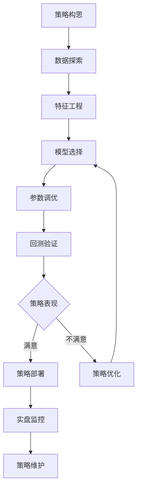

#### 完整策略示例

```python
import qlib
from qlib.constant import REG_CN
from qlib.utils import init_instance_by_config
from qlib.workflow import R
from qlib.workflow.record_temp import SignalRecord, PortAnaRecord

# 1. 初始化Qlib
qlib.init(provider_uri="~/.qlib/qlib_data/cn_data", region=REG_CN)

# 2. 策略配置
strategy_config = {
    # 数据配置
    "dataset": {
        "class": "DatasetH",
        "module_path": "qlib.data.dataset",
        "kwargs": {
            "handler": {
                "class": "Alpha158",
                "module_path": "qlib.contrib.data.handler",
                "kwargs": {
                    "start_time": "2010-01-01",
                    "end_time": "2020-12-31",
                    "fit_start_time": "2010-01-01",
                    "fit_end_time": "2014-12-31",
                    "instruments": "csi300",
                }
            },
            "segments": {
                "train": ("2010-01-01", "2014-12-31"),
                "valid": ("2015-01-01", "2016-12-31"), 
                "test": ("2017-01-01", "2020-12-31"),
            }
        }
    },
    
    # 模型配置
    "model": {
        "class": "LGBModel",
        "module_path": "qlib.contrib.model.gbdt",
        "kwargs": {
            "loss": "mse",
            "colsample_bytree": 0.8879,
            "learning_rate": 0.0421,
            "subsample": 0.8789,
            "lambda_l1": 205.6999,
            "lambda_l2": 580.9768,
            "max_depth": 8,
            "num_leaves": 210,
            "num_threads": 20
        }
    },
    
    # 回测配置  
    "backtest": {
        "start_time": "2017-01-01",
        "end_time": "2020-12-31",
        "account": 100000000,
        "benchmark": "SH000300",
        "exchange_kwargs": {
            "freq": "day",
            "limit_threshold": 0.095,
            "deal_price": "close",
            "open_cost": 0.0005,
            "close_cost": 0.0015,
            "min_cost": 5,
        }
    }
}

# 3. 执行策略
def run_strategy(config):
    """运行量化策略"""
    
    # 数据准备
    dataset = init_instance_by_config(config["dataset"])
    
    # 模型训练
    model = init_instance_by_config(config["model"])
    model.fit(dataset)
    
    # 预测生成
    recorder = R.get_recorder()
    sr = SignalRecord(model, dataset, recorder)
    sr.generate()
    
    # 回测分析
    par = PortAnaRecord(recorder, config["backtest"], "day")
    par.generate()
    
    return recorder

# 4. 运行策略并获取结果
with R.start(experiment_name="my_first_strategy"):
    recorder = run_strategy(strategy_config)
    
# 5. 结果分析
print("策略回测结果:")
print(f"年化收益率: {recorder.get_metrics()['IC']:.2%}")
print(f"夏普比率: {recorder.get_metrics()['ICIR']:.2f}")
print(f"最大回撤: {recorder.get_metrics()['max_drawdown']:.2%}")
```

---

## 💡 进阶实践技巧

### 1. 高效特征工程

#### 特征工程最佳实践

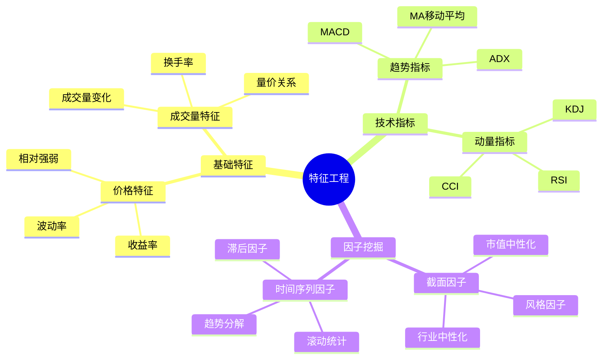

#### 自定义特征表达式

```python
class CustomAlphaFeatures:
    """自定义Alpha特征库"""
    
    @staticmethod
    def alpha_001():
        """
        Alpha001: (-1 * correlation(rank(delta(log(volume), 1)), rank(((close - open) / open)), 6))
        """
        return "(-1 * Corr(Rank(Delta(Log($volume), 1)), Rank(($close - $open) / $open), 6))"
    
    @staticmethod  
    def alpha_002():
        """
        Alpha002: (-1 * delta((((close - low) - (high - close)) / (high - low)), 1))
        """
        return "(-1 * Delta((($close - $low) - ($high - $close)) / ($high - $low), 1))"
    
    @staticmethod
    def momentum_reversal():
        """
        动量反转因子: 短期动量与长期动量的差异
        """
        return "(Mean($close / Ref($close, 5), 5) - Mean($close / Ref($close, 20), 20))"
    
    @staticmethod
    def volatility_adjusted_return():
        """
        波动率调整收益: 收益率除以历史波动率
        """
        return "(($close / Ref($close, 1) - 1) / Std($close / Ref($close, 1) - 1, 20))"

# 使用自定义特征
custom_features = [
    CustomAlphaFeatures.alpha_001(),
    CustomAlphaFeatures.alpha_002(),
    CustomAlphaFeatures.momentum_reversal(),
    CustomAlphaFeatures.volatility_adjusted_return(),
]

# 添加到数据处理器
handler_config = {
    "class": "Alpha158",
    "module_path": "qlib.contrib.data.handler",
    "kwargs": {
        "start_time": "2010-01-01",
        "end_time": "2020-12-31",
        "instruments": "csi300",
        "infer_processors": [
            {
                "class": "RobustZScoreNorm",
                "kwargs": {"fields_group": "feature", "clip_outlier": True}
            },
            {"class": "Fillna", "kwargs": {"fields_group": "feature"}}
        ],
        "learn_processors": [
            {"class": "DropnaLabel"},
            {"class": "CSRankNorm", "kwargs": {"fields_group": "label"}},
        ],
        "label": ["Ref($close, -2) / Ref($close, -1) - 1"],  # 下下个交易日收益率
        "feature": custom_features
    }
}
```

### 2. 模型集成与优化

#### 模型集成策略

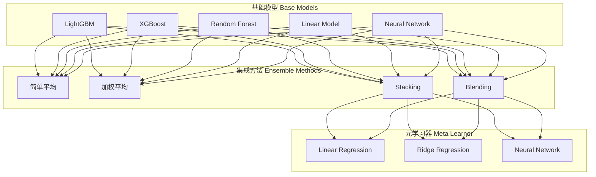

#### 集成模型实现

```python
class EnsembleModel:
    """集成模型实现"""
    
    def __init__(self, base_models, ensemble_method='stacking'):
        self.base_models = base_models
        self.ensemble_method = ensemble_method
        self.meta_learner = None
        
    def fit(self, dataset):
        """训练集成模型"""
        
        # 1. 训练基础模型
        train_preds = []
        valid_preds = []
        
        for name, model_config in self.base_models.items():
            print(f"Training {name}...")
            
            # 创建模型实例
            model = init_instance_by_config(model_config)
            
            # 训练模型
            model.fit(dataset)
            
            # 获取预测结果
            train_pred = model.predict(dataset, segment="train")
            valid_pred = model.predict(dataset, segment="valid")
            
            train_preds.append(train_pred)
            valid_preds.append(valid_pred)
        
        # 2. 训练元学习器
        if self.ensemble_method == 'stacking':
            self.meta_learner = self._train_meta_learner(
                train_preds, dataset.prepare("valid", col_set="label")
            )
        
        return self
    
    def predict(self, dataset, segment="test"):
        """集成预测"""
        
        # 获取基础模型预测
        base_preds = []
        for name, model_config in self.base_models.items():
            model = init_instance_by_config(model_config)
            pred = model.predict(dataset, segment=segment)
            base_preds.append(pred)
        
        # 集成预测
        if self.ensemble_method == 'simple_average':
            return np.mean(base_preds, axis=0)
        elif self.ensemble_method == 'stacking':
            return self.meta_learner.predict(np.column_stack(base_preds))
        
    def _train_meta_learner(self, predictions, labels):
        """训练元学习器"""
        from sklearn.linear_model import Ridge
        
        X = np.column_stack(predictions)
        y = labels.values.ravel()
        
        meta_learner = Ridge(alpha=1.0)
        meta_learner.fit(X, y)
        
        return meta_learner

# 使用示例
ensemble_config = {
    "lgb": {
        "class": "LGBModel",
        "module_path": "qlib.contrib.model.gbdt",
        "kwargs": {"objective": "regression", "num_leaves": 64}
    },
    "xgb": {
        "class": "XGBModel", 
        "module_path": "qlib.contrib.model.gbdt",
        "kwargs": {"objective": "reg:squarederror", "max_depth": 6}
    },
    "nn": {
        "class": "DNNModel",
        "module_path": "qlib.contrib.model.pytorch_nn",
        "kwargs": {"lr": 0.001, "max_steps": 5000}
    }
}

ensemble_model = EnsembleModel(ensemble_config, ensemble_method='stacking')
```

### 3. 风险管理与组合优化

#### 风险模型构建

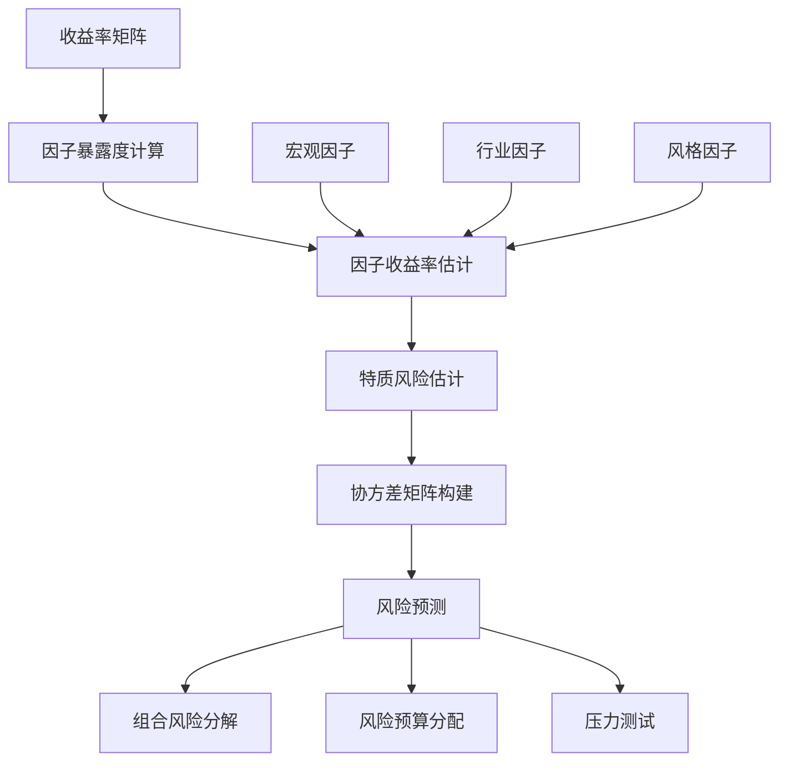

#### 组合优化实现

```python
import cvxpy as cp
import numpy as np
from scipy import linalg

class PortfolioOptimizer:
    """投资组合优化器"""
    
    def __init__(self, risk_model=None, transaction_cost_model=None):
        self.risk_model = risk_model
        self.transaction_cost_model = transaction_cost_model
    
    def optimize(self, expected_returns, current_weights=None, constraints=None):
        """
        投资组合优化
        
        Args:
            expected_returns: 预期收益率
            current_weights: 当前权重
            constraints: 约束条件
        """
        
        n_assets = len(expected_returns)
        
        # 决策变量
        w = cp.Variable(n_assets)  # 目标权重
        
        if current_weights is not None:
            trade = w - current_weights  # 交易量
        else:
            trade = w
        
        # 目标函数：最大化预期收益 - 风险惩罚 - 交易成本
        objective_terms = []
        
        # 1. 预期收益
        expected_return = expected_returns.T @ w
        objective_terms.append(expected_return)
        
        # 2. 风险惩罚
        if self.risk_model is not None:
            risk_penalty = cp.quad_form(w, self.risk_model.cov_matrix)
            objective_terms.append(-0.5 * self.risk_model.risk_aversion * risk_penalty)
        
        # 3. 交易成本
        if self.transaction_cost_model is not None:
            tc_penalty = self.transaction_cost_model.calculate_cost(trade)
            objective_terms.append(-tc_penalty)
        
        objective = cp.Maximize(cp.sum(objective_terms))
        
        # 约束条件
        constraints_list = [
            cp.sum(w) == 1,  # 权重和为1
            w >= 0,          # 多头约束
        ]
        
        # 添加自定义约束
        if constraints:
            constraints_list.extend(constraints)
        
        # 求解问题
        problem = cp.Problem(objective, constraints_list)
        problem.solve(solver=cp.ECOS)
        
        if problem.status not in ["infeasible", "unbounded"]:
            optimal_weights = w.value
            return {
                'weights': optimal_weights,
                'expected_return': expected_returns @ optimal_weights,
                'status': problem.status,
                'objective_value': problem.value
            }
        else:
            raise ValueError(f"优化问题无解: {problem.status}")

# 使用示例
class BarraRiskModel:
    """Barra风险模型简化版"""
    
    def __init__(self, factor_returns, specific_risks, factor_exposures):
        self.factor_returns = factor_returns
        self.specific_risks = specific_risks  
        self.factor_exposures = factor_exposures
        self.risk_aversion = 0.5
        
    @property
    def cov_matrix(self):
        """构建协方差矩阵"""
        # 因子协方差矩阵
        F = np.cov(self.factor_returns.T)
        
        # 特质风险对角矩阵
        D = np.diag(self.specific_risks ** 2)
        
        # 总协方差矩阵: X @ F @ X.T + D
        X = self.factor_exposures
        cov = X @ F @ X.T + D
        
        return cov

# 风险模型和优化器使用
risk_model = BarraRiskModel(factor_returns, specific_risks, factor_exposures)
optimizer = PortfolioOptimizer(risk_model=risk_model)

optimal_portfolio = optimizer.optimize(
    expected_returns=predicted_returns,
    current_weights=current_weights,
    constraints=[
        cp.norm(w, 1) <= 2.0,  # 杠杆约束
        cp.max(w) <= 0.05,     # 单股票最大权重
    ]
)
```

---

## 📊 量化投资发展趋势分析

### 1. 技术发展趋势

#### AI技术演进路线

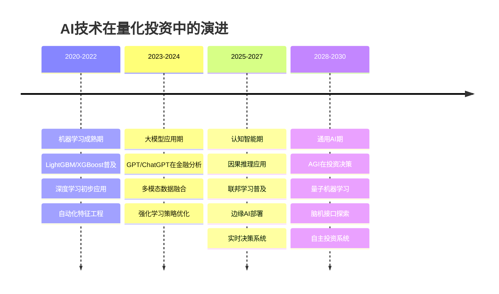

#### 新兴技术影响评估

```mermaid
radar
    title 新兴技术对量化投资的影响力评估
    "大语言模型" : 85
    "强化学习" : 75
    "联邦学习" : 60
    "量子计算" : 40
    "边缘计算" : 70
    "区块链" : 50
    "脑机接口" : 20
    "数字孪生" : 65
```

### 2. 市场结构演变

#### 量化投资生态系统

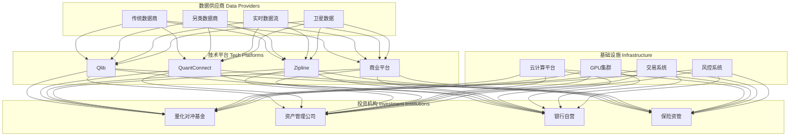

### 3. 监管环境变化

#### 全球监管趋势

| 地区 | 监管重点 | 影响程度 | 应对策略 |
|------|----------|----------|----------|
| **美国** | 算法透明度、系统性风险 | 高 | 可解释AI、压力测试 |
| **欧盟** | AI法案、数据保护 | 高 | 合规框架、隐私技术 |
| **中国** | 数据安全、金融稳定 | 中 | 本地化部署、风控加强 |
| **日本** | 创新监管、数字化 | 中 | 监管沙盒、技术创新 |
| **新加坡** | 金融科技友好 | 低 | 先进技术试点 |

---

## 🚀 未来发展机遇与挑战

### 1. 发展机遇

#### 技术机遇

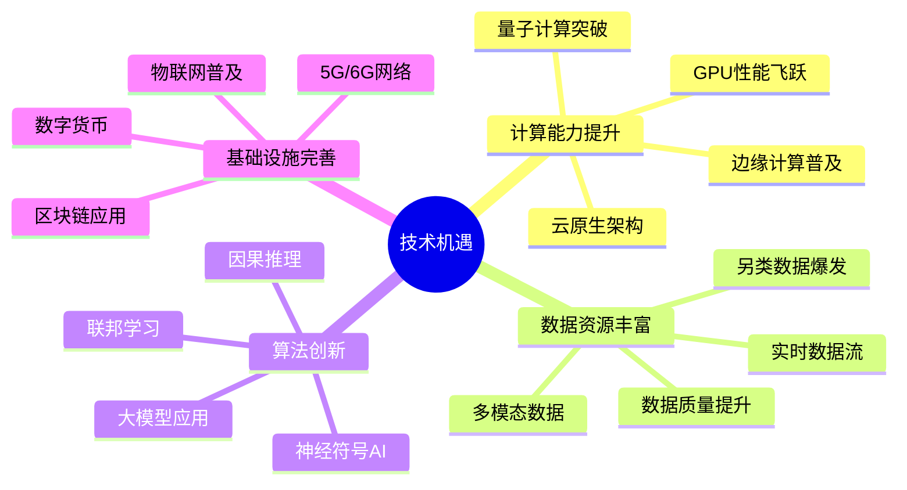

#### 市场机遇

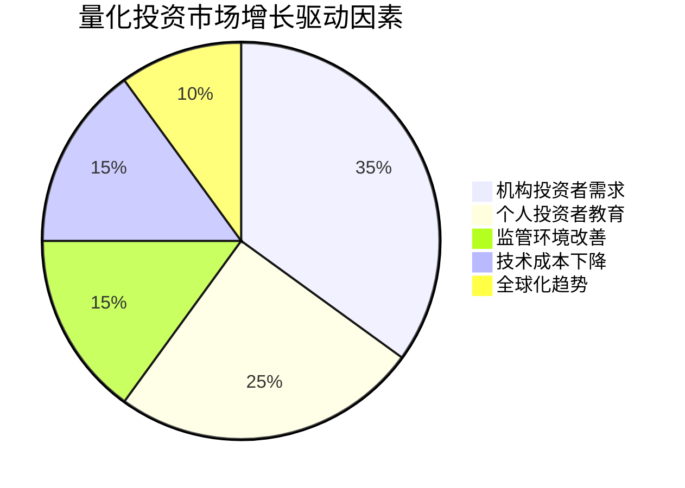

### 2. 面临挑战

#### 技术挑战

| 挑战类型 | 具体问题 | 影响程度 | 解决方向 |
|----------|----------|----------|----------|
| **数据质量** | 噪声数据、缺失值 | 高 | 数据清洗、质量检测 |
| **模型泛化** | 过拟合、分布偏移 | 高 | 正则化、域适应 |
| **计算资源** | 训练成本、推理延迟 | 中 | 模型压缩、硬件优化 |
| **可解释性** | 黑盒模型、监管要求 | 中 | 可解释AI、因果推理 |
| **系统复杂性** | 集成难度、维护成本 | 中 | 标准化、自动化 |

#### 市场挑战

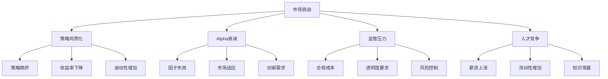

---

## 🎯 成功实践建议

### 1. 组织能力建设

#### 人才团队构建

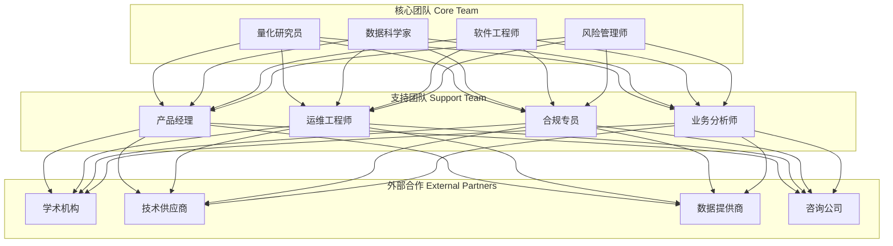

#### 技能发展路径

| 角色 | 核心技能 | 进阶技能 | 学习资源 |
|------|----------|----------|----------|
| **量化研究员** | 统计学、金融学 | 机器学习、因果推理 | 学术论文、实战项目 |
| **数据科学家** | Python/R、SQL | 深度学习、MLOps | 在线课程、开源项目 |
| **软件工程师** | 系统设计、算法 | 分布式计算、云原生 | 技术文档、实践经验 |
| **风险管理师** | 风险建模、合规 | AI风险、模型治理 | 专业认证、案例研究 |

### 2. 技术选型策略

#### 技术栈选择框架

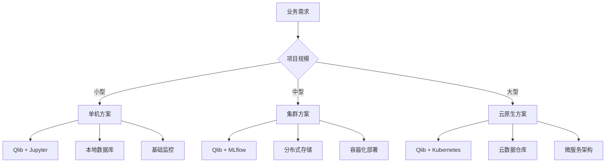

### 3. 风险控制最佳实践

#### 多层风险防护体系

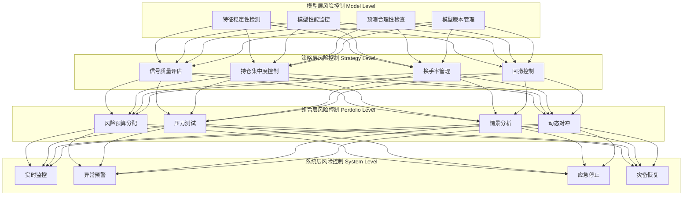

---

## 📈 成功案例分析

### 1. 国际领先案例

#### Two Sigma - AI驱动的系统化投资

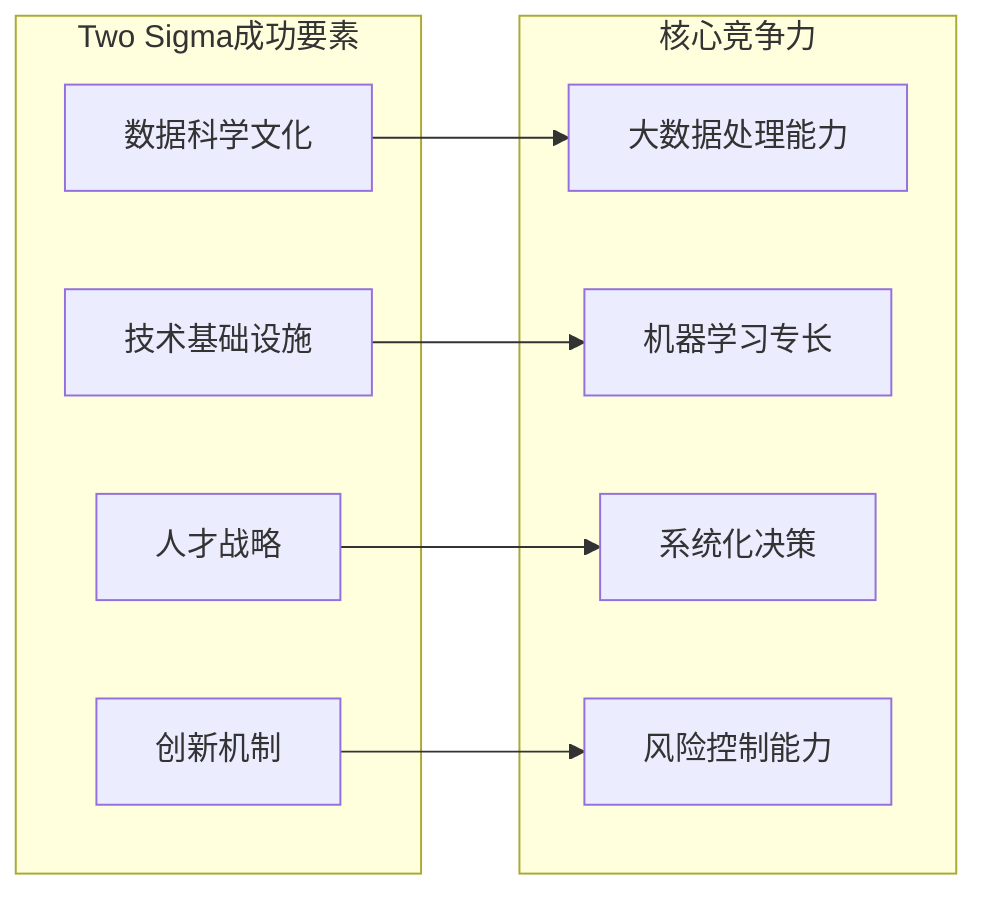

**关键启示：**
- **数据驱动**：将所有投资决策基于数据和模型
- **技术投入**：大量投资于技术基础设施和人才
- **持续创新**：不断探索新的数据源和算法
- **系统化管理**：标准化的研究和投资流程

### 2. 国内成功实践

#### 幻方量化 - 中国AI量化投资先锋

**成功经验总结：**

1. **技术创新**
   - 自主研发的AI平台
   - 深度学习在因子挖掘中的应用
   - 强化学习在策略优化中的实践

2. **数据战略**
   - 多元化数据源整合
   - 另类数据的创新应用
   - 实时数据处理能力

3. **团队建设**
   - 顶尖AI人才引进
   - 产学研合作机制
   - 持续学习文化

4. **风控体系**
   - 多层次风险管理
   - 实时监控预警
   - 应急响应机制

---

## 🔮 量化投资未来展望

### 1. 技术发展预测

#### 下一代量化投资平台特征

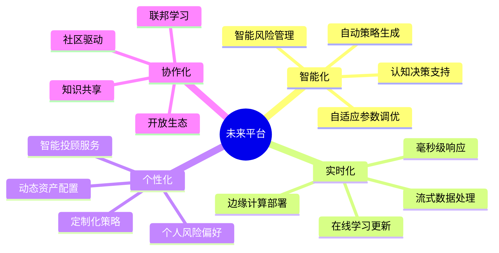

### 2. 市场格局演变

#### 2025-2030年市场预测

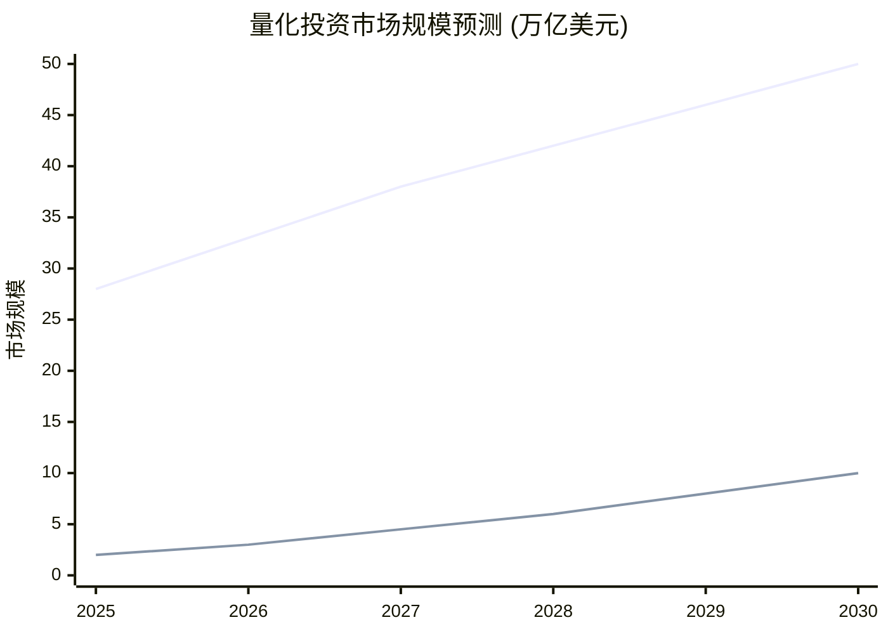

**关键趋势：**
- **市场份额持续扩大**：从20%提升到30%+
- **技术门槛逐步降低**：平台化和标准化发展
- **应用场景不断扩展**：从机构投资到个人理财
- **监管框架日趋完善**：风险可控的创新环境

### 3. 投资策略演进

#### 策略发展路线图

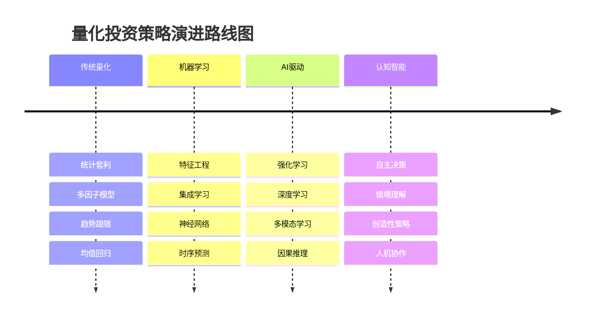

---

## 🎯 实施路线图建议

### 1. 短期目标 (6-12个月)

**技术准备阶段：**
- [x] 完成Qlib环境搭建和数据准备
- [x] 开发第一个基础量化策略
- [x] 建立基本的回测和评估框架
- [x] 组建核心技术团队

**能力建设重点：**
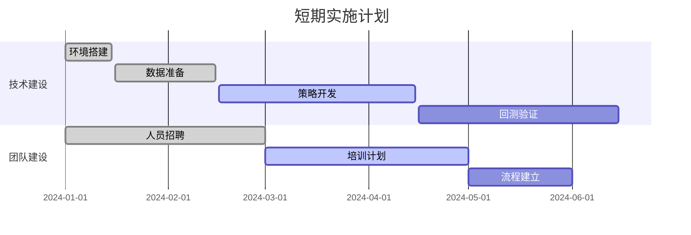

### 2. 中期目标 (1-2年)

**规模化发展阶段：**
- 建立多策略投资体系
- 完善风险管理和监控系统
- 扩展数据源和算法库
- 提升系统自动化水平

### 3. 长期愿景 (3-5年)

**生态系统构建：**
- 成为行业领先的AI量化投资平台
- 建立开放的技术和数据生态
- 推动行业标准和最佳实践
- 培养专业人才和知识体系

---

## 📋 总结与行动建议

### 核心要点回顾

1. **Qlib的价值**：作为AI原生的量化投资平台，Qlib为行业提供了统一、高效的解决方案
2. **技术趋势**：AI技术正在深刻改变量化投资的方法论和实践模式  
3. **市场机遇**：量化投资市场规模快速增长，技术门槛逐步降低
4. **成功要素**：技术创新、数据优势、人才团队、风控体系是成功的关键

### 立即行动建议

**对于个人学习者：**
1. 安装Qlib并完成第一个策略开发
2. 系统学习量化投资和机器学习知识  
3. 参与开源社区和技术交流
4. 持续关注行业发展趋势

**对于机构投资者：**
1. 评估现有技术架构和能力差距
2. 制定AI量化投资发展策略
3. 投资于关键技术和人才建设
4. 建立合作伙伴关系和生态系统

**对于技术服务商：**
1. 深度理解量化投资业务需求
2. 基于Qlib等平台开发专业解决方案
3. 构建端到端的服务能力
4. 培养复合型专业团队

### 未来展望

量化投资正处在AI驱动的变革时代，Qlib等先进平台为这一变革提供了强有力的技术支撑。通过合理应用这些工具和方法，我们有望构建更智能、更高效、更稳健的投资系统，为投资者创造持续的价值。

成功的关键在于：**保持学习，拥抱变化，注重实践，持续创新**。

---

*本指南提供了从入门到精通的完整实践路径，结合最新的技术趋势和市场洞察，为读者在AI驱动的量化投资时代找到方向和方法。*