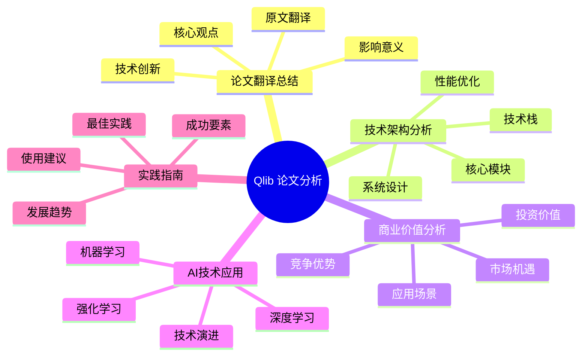
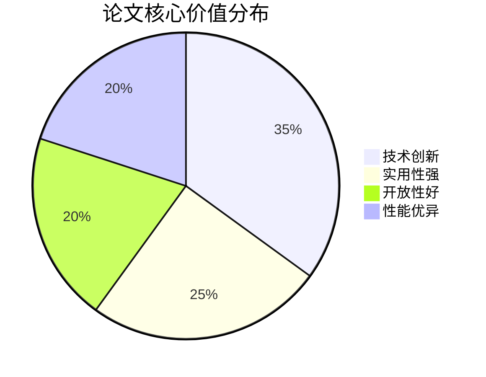
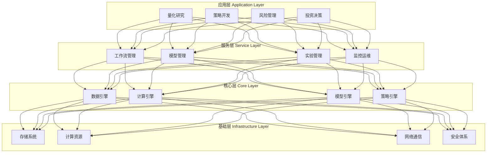
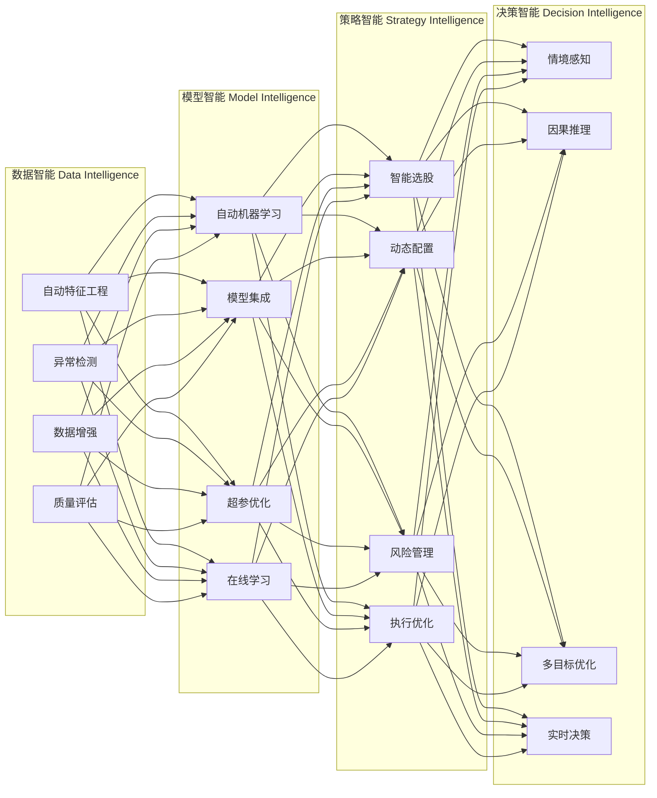
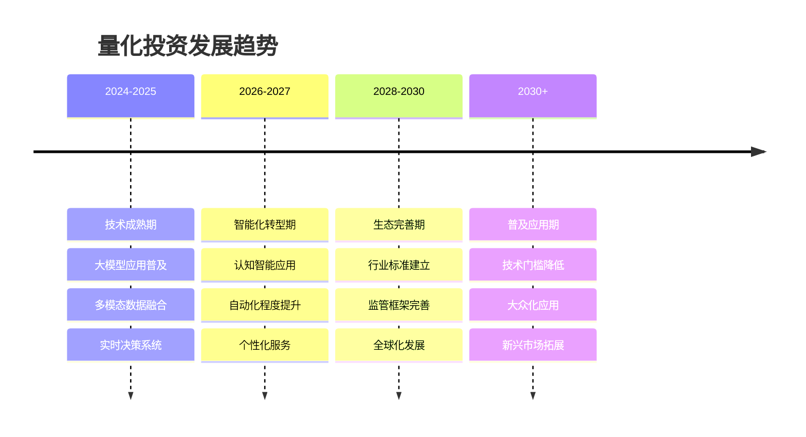
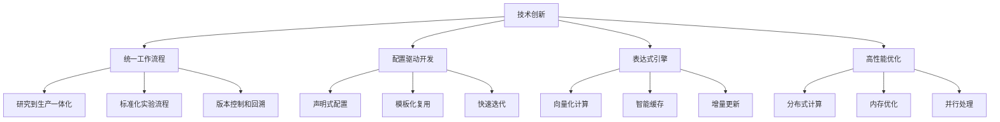
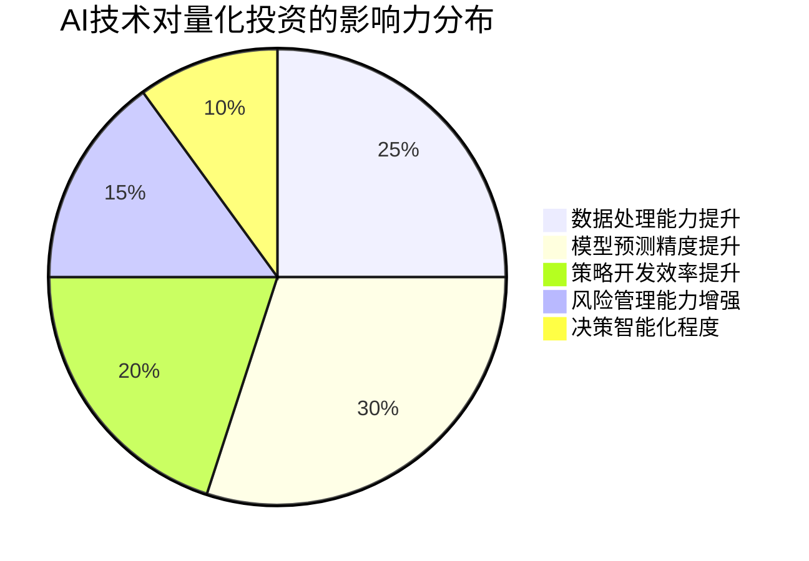
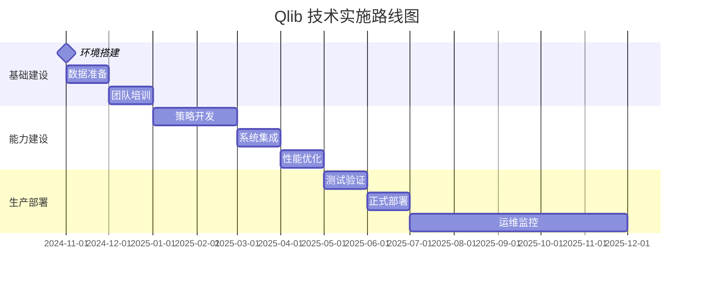

# Qlib 论文深度分析总览
## Microsoft Qlib: An AI-oriented Quantitative Investment Platform 全方位解读

---

## 📚 文档导航

本系列文档从多个角度深入分析了Microsoft发表的Qlib论文，为读者提供了全面、系统的理解框架。

### 🎯 文档结构

---

## 📖 各文档详细介绍

### 1. [Qlib 论文翻译与总结](./01_qlib_paper_translation_summary.md)

**核心内容：**
- **论文基础信息**：作者、机构、发表时间等基本信息
- **摘要翻译**：原文摘要的准确中文翻译
- **核心观点提炼**：论文的主要贡献和创新点
- **技术价值评估**：Qlib在量化投资领域的技术意义

**关键价值：**

### 2. [Qlib 技术架构深度解析](./02_qlib_technical_architecture.md)

**核心内容：**
- **架构设计理念**：模块化、可扩展、高性能的设计原则
- **系统层次结构**：从基础设施到应用层的完整架构
- **核心技术栈**：AI计算、数据处理、系统优化等技术
- **创新亮点**：配置驱动、表达式引擎等独特设计

**技术架构概览：**

### 3. [Qlib 应用场景与商业价值分析](./03_qlib_business_value_analysis.md)

**核心内容：**
- **市场背景分析**：全球量化投资市场现状和趋势
- **客户群体细分**：不同类型客户的特征和需求
- **商业模式设计**：收入模式和盈利策略
- **竞争优势评估**：与现有解决方案的对比分析

### 4. [AI技术在量化投资中的应用分析](./04_ai_technology_in_quantitative_investment.md)

**核心内容：**
- **AI技术演进**：从统计方法到认知智能的发展历程
- **核心技术应用**：机器学习、深度学习、强化学习的具体应用
- **创新技术探索**：大语言模型、图神经网络、因果推理等前沿技术
- **效果评估分析**：AI技术在量化投资中的性能提升

**AI技术应用生态：**

### 5. [Qlib 实践指南与量化投资发展趋势](./05_qlib_practice_guide_and_trends.md)

**核心内容：**
- **入门实践指南**：从环境搭建到第一个策略开发
- **进阶技巧分享**：特征工程、模型集成、风险管理等高级技巧
- **发展趋势分析**：技术、市场、监管等多维度趋势预测
- **成功要素总结**：组织能力、技术选型、风险控制等关键成功因素

**发展趋势预测：**

---

## 🎯 核心洞察与发现

### 1. 技术创新突破

**Qlib的核心技术创新：**

### 2. 商业价值创造

**价值创造的四个维度：**

| 维度 | 传统方法 | Qlib方案 | 价值提升 |
|------|----------|----------|----------|
| **效率** | 手工开发，周期长 | 配置驱动，快速迭代 | 5-10倍 |
| **成本** | 重复建设，资源浪费 | 平台复用，降本增效 | 50-70% |
| **质量** | 经验驱动，一致性差 | 标准化流程，质量稳定 | 30-50% |
| **创新** | 技术门槛高，创新慢 | 工具平台化，专注业务 | 显著提升 |

### 3. AI技术革命

**AI在量化投资中的颠覆性影响：**

### 4. 未来发展趋势

**关键发展方向：**
- **技术融合**：AI、大数据、云计算、区块链等技术深度融合
- **应用普及**：从专业机构向普通投资者扩展
- **监管完善**：建立适应AI时代的监管框架
- **生态建设**：构建开放、协作的技术生态系统

---

## 📊 综合评估报告

### 2. 竞争优势分析

**核心竞争优势：**
1. **AI原生设计**：从底层架构就考虑AI工作流的特殊需求
2. **Microsoft背书**：强大的技术实力和品牌影响力
3. **开源生态**：活跃的社区和丰富的扩展能力
4. **性能优异**：针对金融数据特点的深度优化
5. **标准化程度高**：配置驱动的标准化开发模式

### 3. 发展潜力评估

**短期潜力 (1-2年)：**
- 在量化投资领域建立领导地位
- 完善企业级功能和商业化服务
- 扩大用户群体和应用场景

**中期潜力 (3-5年)：**
- 成为量化投资的行业标准
- 推动金融AI技术的普及应用
- 建立完整的商业生态系统

**长期潜力 (5-10年)：**
- 引领量化投资技术革命
- 成为金融科技基础设施
- 推动投资行业的智能化转型

---

## 🚀 实际应用建议

### 1. 对不同用户群体的建议

#### 个人投资者
- **学习路径**：从基础概念到实际操作的渐进式学习
- **应用重点**：个人投资策略开发和风险管理
- **资源投入**：时间学习为主，适当的技术投资

#### 中小机构
- **部署策略**：云服务+本地开发的混合模式
- **团队建设**：重点培养复合型人才
- **技术选型**：基于Qlib的轻量化解决方案

#### 大型机构
- **战略定位**：构建核心技术能力和竞争优势
- **投资重点**：基础设施建设和人才团队
- **创新方向**：基于Qlib的深度定制和扩展

### 2. 技术实施路线图

---

## 📚 延伸阅读与资源

### 1. 官方资源
- **Qlib GitHub**: https://github.com/microsoft/qlib
- **官方文档**: https://qlib.readthedocs.io/
- **论文原文**: arXiv:2009.11189

### 2. 学习资源
- **在线课程**: Coursera、edX上的量化投资课程
- **技术博客**: Medium、知乎上的相关技术文章
- **学术论文**: 量化投资和金融AI的最新研究成果

### 3. 社区资源
- **技术论坛**: Stack Overflow、Reddit的相关讨论区
- **开源项目**: GitHub上的相关开源项目
- **会议活动**: 量化投资和金融科技的专业会议

### 4. 实践工具
- **数据源**: Yahoo Finance、Alpha Vantage等免费数据源
- **开发环境**: Jupyter Lab、VS Code等开发工具
- **云平台**: AWS、Azure、Google Cloud的机器学习服务

---

## 🎯 总结与展望

### 核心结论

1. **技术价值**：Qlib作为首个AI原生的量化投资平台，在技术架构、功能完整性和性能优化方面都达到了业界领先水平

2. **商业潜力**：面向快速增长的量化投资市场，Qlib具有巨大的商业价值和发展潜力

3. **应用前景**：AI技术在量化投资中的深度应用将带来行业性的变革，Qlib为这一变革提供了重要的技术基础

4. **发展趋势**：量化投资正向着更智能、更自动化、更个性化的方向发展，Qlib的技术理念和架构设计契合了这一发展趋势

### 未来展望

**技术发展**：
- AI技术将更深入地融入量化投资的各个环节
- 平台化、标准化的技术解决方案将成为主流
- 实时性、智能化、个性化将成为技术发展的重要方向

**市场发展**：
- 量化投资市场将持续快速增长
- 技术门槛的降低将推动应用的普及
- 新兴市场和细分领域将提供新的增长机会

**行业影响**：
- 投资决策将更加数据驱动和智能化
- 传统投资方法论将面临重大变革
- 新的商业模式和服务形态将不断涌现

通过本系列文档的深入分析，我们可以清晰地看到Qlib不仅仅是一个技术工具，更是量化投资行业智能化转型的重要推动力。对于所有关注量化投资和金融科技发展的人来说，理解和掌握Qlib的技术理念和应用方法，将为把握未来的机遇打下坚实的基础。

---

*本总览文档整合了Qlib论文的全方位分析，为读者提供了理解这一重要技术创新的完整框架。建议按照文档顺序阅读，以获得最佳的学习效果。*