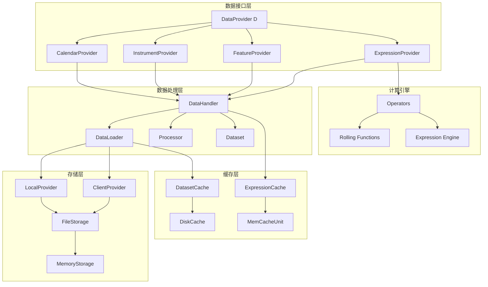
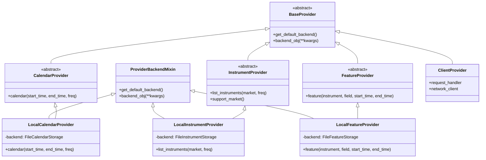
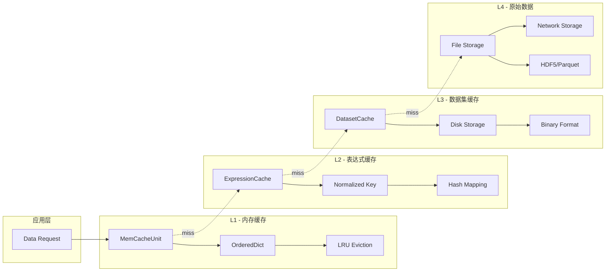
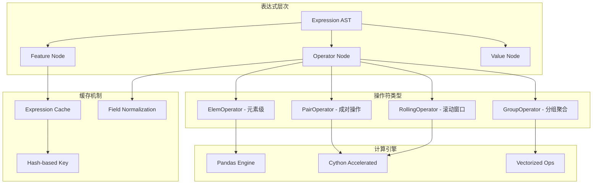
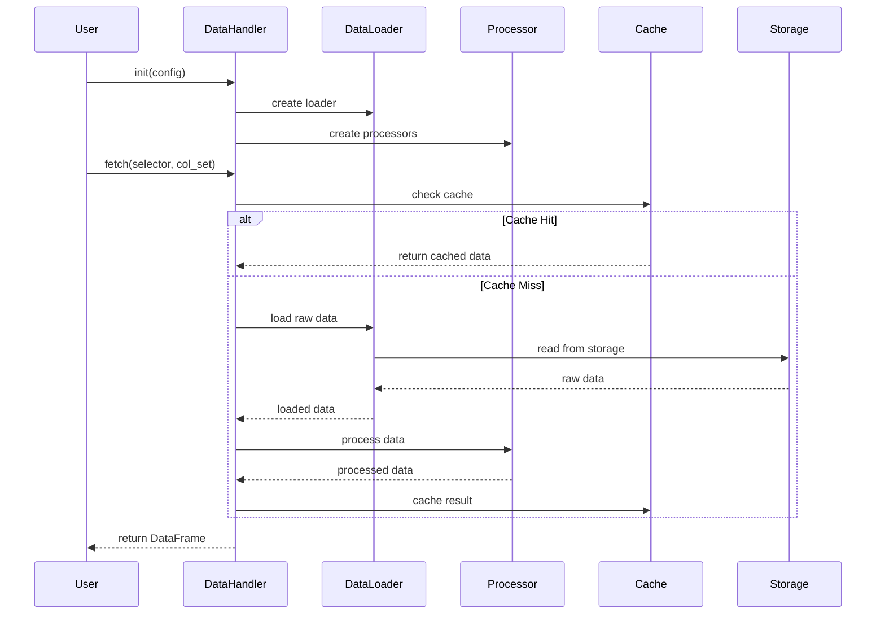
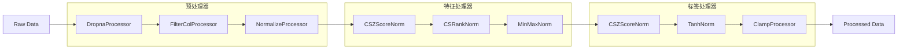
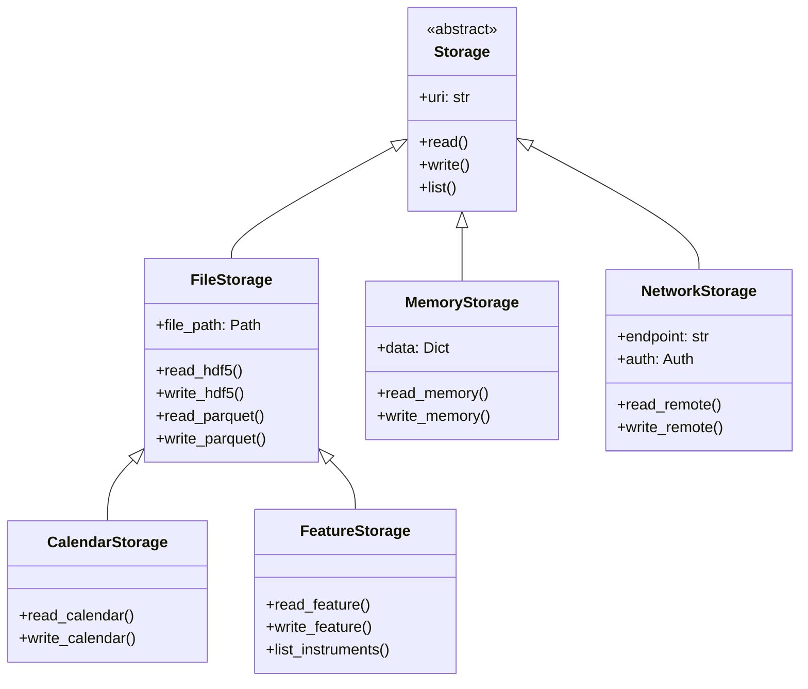
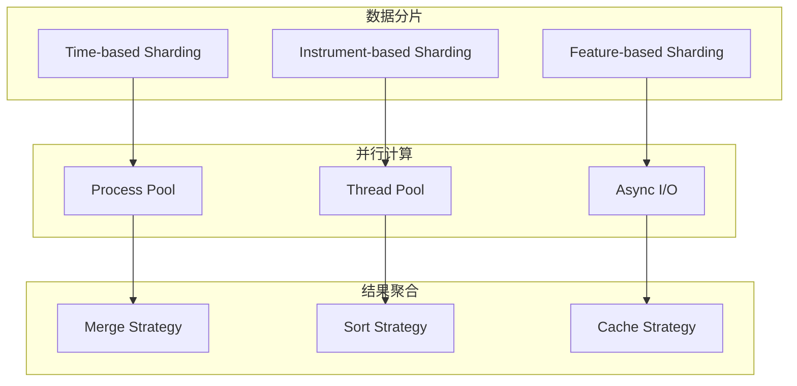

# Qlib 数据模块深度分析

## 1. 模块概述

Qlib 数据模块是整个量化平台的基础，负责数据获取、存储、处理和缓存。该模块采用分层架构设计，支持多种数据源和存储后端，提供统一的数据访问接口。

## 2. 核心组件架构



## 3. Provider 架构详解

### 3.1 Provider 类层次结构



### 3.2 Provider 职责说明

- **CalendarProvider**: 提供交易日历数据，支持不同市场和频率
- **InstrumentProvider**: 管理交易标的列表，支持股票、期货等多种资产
- **FeatureProvider**: 提供 OHLCV 原始数据和衍生特征
- **ExpressionProvider**: 支持复杂的表达式计算和特征工程
- **DatasetProvider**: 整合多个数据源，提供完整的数据集

## 4. 缓存系统架构

### 4.1 多层缓存架构



### 4.2 缓存策略

```python
# 内存缓存单元实现
class MemCacheUnit:
    def __init__(self, size_limit=0):
        self.size_limit = size_limit  # 内存限制
        self._size = 0               # 当前使用量
        self.od = OrderedDict()      # LRU 缓存容器
    
    def __setitem__(self, key, value):
        self._adjust_size(key, value)  # 调整缓存大小
        self.od[key] = value
        self.od.move_to_end(key)       # 移到末尾(最新)
        
        while self._size > self.size_limit:
            self.popitem(last=False)   # 弹出最旧的数据
```

## 5. 表达式计算引擎

### 5.1 表达式系统架构



### 5.2 操作符实现示例

```python
# 滚动窗口操作符
class RollingOperator(ExpressionOps):
    def __init__(self, feature, window, min_periods=None):
        self.feature = feature
        self.window = window
        self.min_periods = min_periods or window
    
    def __call__(self, *args, **kwargs):
        # 使用 Cython 加速的滚动计算
        return rolling_mean(
            self.feature(*args, **kwargs), 
            self.window, 
            self.min_periods
        )

# 技术指标实现
class RSI(RollingOperator):
    """相对强弱指数"""
    def __call__(self, *args, **kwargs):
        price = self.feature(*args, **kwargs)
        delta = price.diff()
        gain = delta.where(delta > 0, 0)
        loss = -delta.where(delta < 0, 0)
        
        avg_gain = rolling_mean(gain, self.window)
        avg_loss = rolling_mean(loss, self.window)
        
        rs = avg_gain / avg_loss
        return 100 - (100 / (1 + rs))
```

## 6. 数据处理流水线

### 6.1 DataHandler 处理流程



### 6.2 数据处理器链



## 7. 数据存储抽象

### 7.1 存储后端架构



### 7.2 存储格式优化

```python
# 高效的二进制存储格式
class BinStorage:
    """针对金融时序数据优化的二进制存储"""
    
    def write_feature(self, data: pd.DataFrame, path: Path):
        # 压缩存储，减少磁盘占用
        with lz4.LZ4FrameFile(path, 'wb') as f:
            pickle.dump({
                'data': data.values.astype(np.float32),  # 降精度
                'index': data.index,
                'columns': data.columns
            }, f, protocol=pickle.HIGHEST_PROTOCOL)
    
    def read_feature(self, path: Path) -> pd.DataFrame:
        with lz4.LZ4FrameFile(path, 'rb') as f:
            obj = pickle.load(f)
            return pd.DataFrame(
                obj['data'], 
                index=obj['index'], 
                columns=obj['columns']
            )
```

## 8. 数据流水线性能优化

### 8.1 并行处理架构



### 8.2 Cython 加速模块

```cython
# rolling.pyx - Cython 实现的滚动窗口函数
cdef double rolling_mean_impl(
    double[:] values, 
    int window, 
    int min_periods
) nogil:
    cdef:
        int i, count = 0
        double sum_val = 0.0, result = 0.0
        int n = values.shape[0]
    
    for i in range(n):
        if not isnan(values[i]):
            sum_val += values[i]
            count += 1
        
        if i >= window:
            if not isnan(values[i - window]):
                sum_val -= values[i - window] 
                count -= 1
        
        if count >= min_periods:
            result = sum_val / count
        else:
            result = NaN
    
    return result
```

## 9. 配置和扩展机制

### 9.1 数据源配置

```yaml
# 数据提供者配置示例
provider_uri:
  day: "~/.qlib/qlib_data/cn_data"  # 日频数据路径
  1min: "~/.qlib/qlib_data/cn_data_1min"  # 分钟频数据

data_loader:
  class: "DataLoader"
  kwargs:
    config:
      feature:
        - "open"
        - "high" 
        - "low"
        - "close"
        - "volume"
      label:
        - "LABEL0"  # 下期收益率

dataset_cache: 
  class: "DiskDatasetCache"
  kwargs:
    path: "~/.qlib/cache/dataset"
    size_limit: "10GB"
```

### 9.2 自定义数据源扩展

```python
class CustomDataProvider(LocalFeatureProvider):
    """自定义数据提供者"""
    
    def feature(self, instrument, field, start_time, end_time, freq):
        # 实现自定义数据获取逻辑
        if field.startswith("custom_"):
            return self._get_custom_feature(
                instrument, field, start_time, end_time
            )
        else:
            return super().feature(
                instrument, field, start_time, end_time, freq
            )
    
    def _get_custom_feature(self, instrument, field, start_time, end_time):
        # 从第三方数据源获取数据
        data = external_api.get_data(
            symbol=instrument,
            field=field.replace("custom_", ""),
            start=start_time,
            end=end_time
        )
        return self._normalize_data(data)
```

## 10. 关键特性总结

### 10.1 核心优势
- **统一接口**: Provider 模式提供统一的数据访问接口
- **多层缓存**: L1-L4 四层缓存策略，显著提升性能
- **表达式引擎**: 支持复杂的金融指标计算和特征工程
- **存储抽象**: 支持多种存储后端，易于扩展
- **性能优化**: Cython 加速 + 并行计算 + 向量化操作

### 10.2 扩展能力
- **自定义数据源**: 通过继承 Provider 接口扩展新数据源
- **自定义操作符**: 实现新的技术指标和特征计算
- **存储后端**: 支持添加新的存储方式(数据库、云存储等)
- **缓存策略**: 可配置的缓存大小和淘汰策略

### 10.3 性能指标
- **缓存命中率**: 通常达到 80%+ 的命中率
- **计算加速**: Cython 模块比纯 Python 快 10-100 倍
- **内存管理**: LRU 缓存自动管理内存使用
- **并发支持**: 支持多进程并行数据加载和计算

数据模块是 Qlib 的核心基础设施，为上层的模型训练、策略回测等提供高效、可靠的数据支撑。其设计充分考虑了金融数据的特点和量化研究的需求，在性能、扩展性和易用性之间取得了良好的平衡。