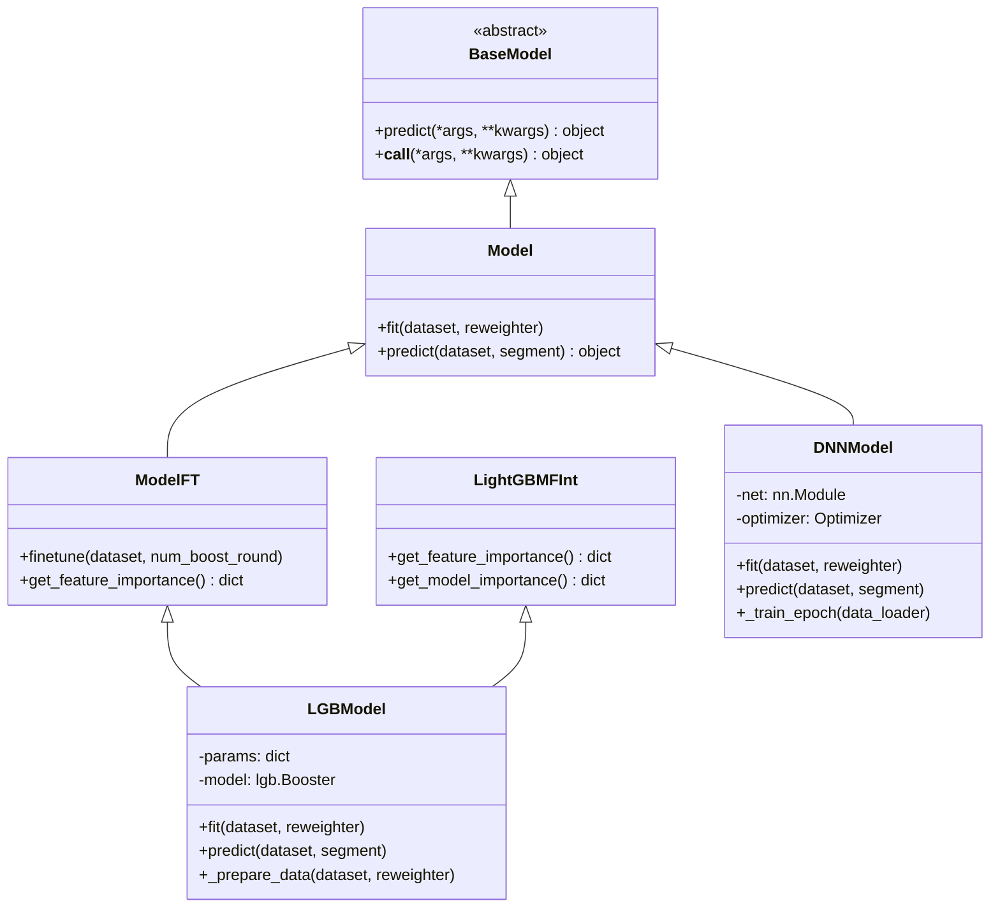
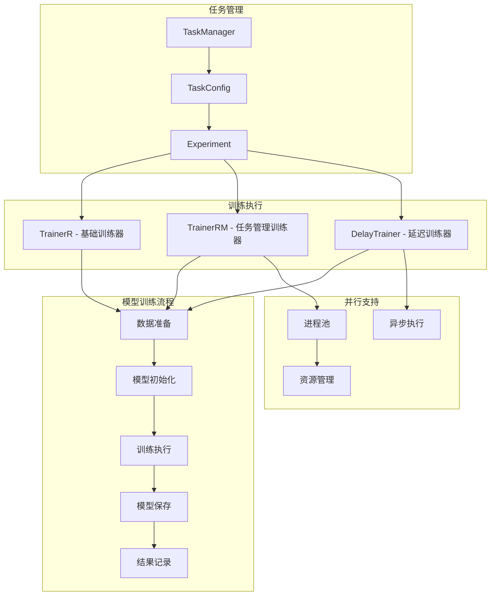
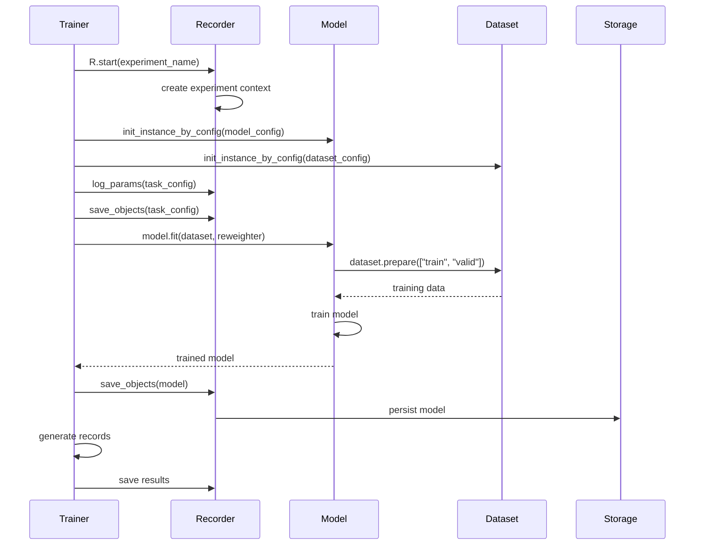
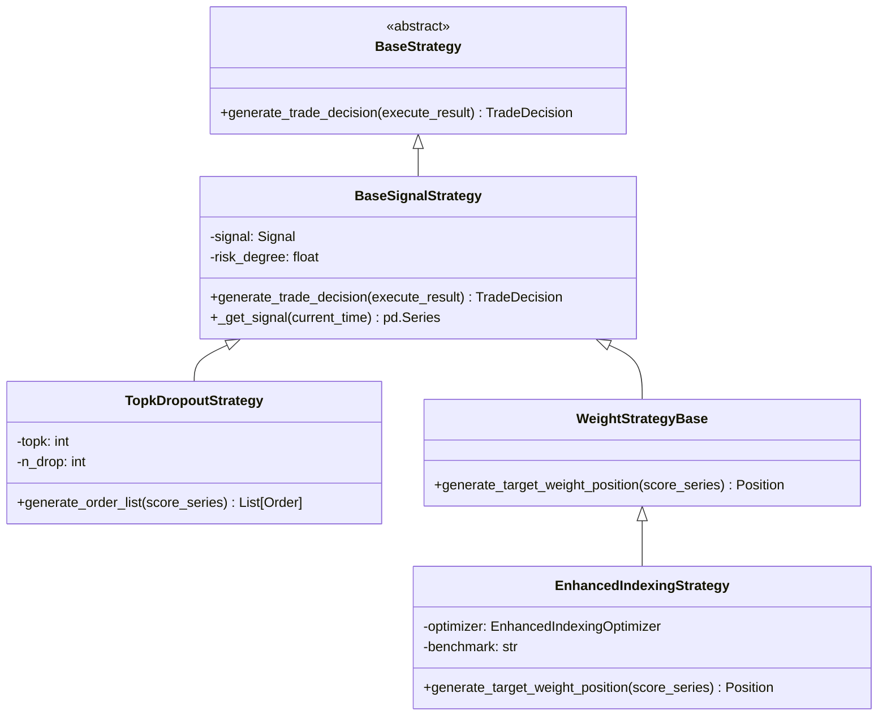
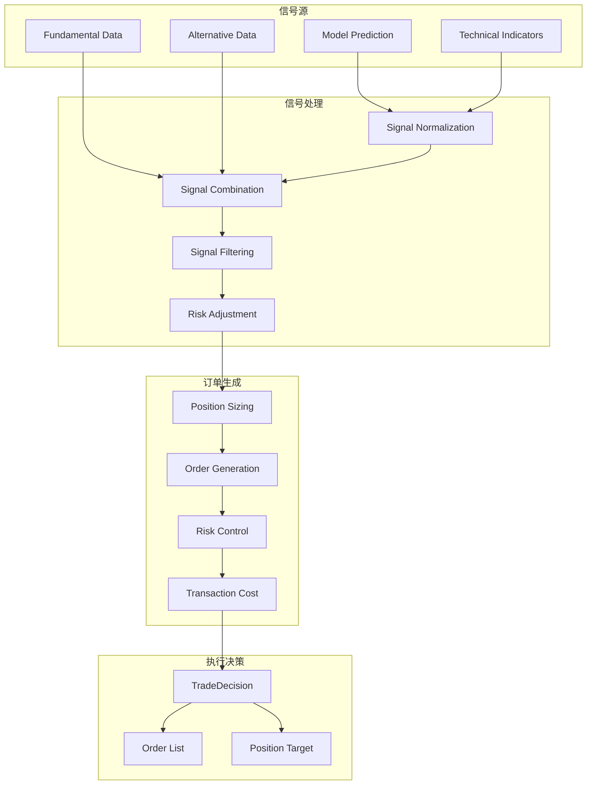
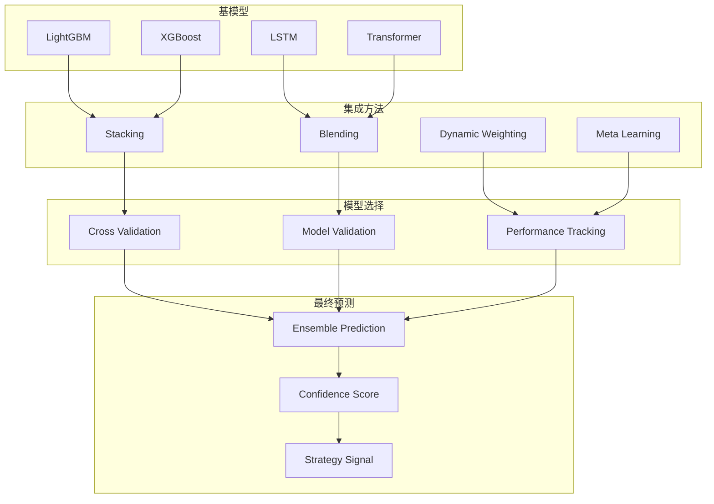
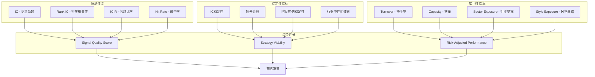

# Qlib 模型和策略模块深度分析

## 1. 模块概述

Qlib 的模型和策略模块是量化投资的核心组件，负责将数据转化为投资信号，并基于信号制定具体的交易策略。该模块采用分层设计，将模型训练、信号生成和策略执行进行了清晰的职责分离。

## 2. 模型系统架构

### 2.1 模型类层次结构



### 2.2 训练器架构



### 2.3 模型训练流程



## 3. 核心模型实现

### 3.1 LightGBM 模型实现

```python
class LGBModel(ModelFT, LightGBMFInt):
    """LightGBM 模型实现"""
    
    def __init__(self, loss="mse", early_stopping_rounds=50, **kwargs):
        self.params = {"objective": loss, "verbosity": -1}
        self.params.update(kwargs)
        self.early_stopping_rounds = early_stopping_rounds
        self.num_boost_round = 1000
    
    def _prepare_data(self, dataset, reweighter=None):
        """数据准备"""
        ds_l = []
        for key in ["train", "valid"]:
            if key in dataset.segments:
                df = dataset.prepare(key, col_set=["feature", "label"])
                x, y = df["feature"], df["label"]
                
                # 处理样本权重
                w = None if reweighter is None else reweighter.reweight(df)
                ds_l.append((lgb.Dataset(x.values, label=y, weight=w), key))
        return ds_l
    
    def fit(self, dataset, **kwargs):
        """模型训练"""
        ds_l = self._prepare_data(dataset)
        ds, names = list(zip(*ds_l))
        
        # 设置回调函数
        callbacks = [
            lgb.early_stopping(self.early_stopping_rounds),
            lgb.log_evaluation(period=20),
            lgb.record_evaluation({})
        ]
        
        self.model = lgb.train(
            self.params,
            ds[0],  # 训练集
            valid_sets=ds[1:] if len(ds) > 1 else None,
            callbacks=callbacks,
            num_boost_round=self.num_boost_round
        )
```

### 3.2 深度学习模型基类

```python
class DNNModelPytorch(Model):
    """PyTorch 深度学习模型基类"""
    
    def __init__(self, loss="mse", lr=1e-3, max_steps=8000, **kwargs):
        self.lr = lr
        self.max_steps = max_steps
        self.device = torch.device("cuda" if torch.cuda.is_available() else "cpu")
        self.loss_fn = self._get_loss_fn(loss)
        
    def fit(self, dataset, **kwargs):
        """训练流程"""
        # 数据准备
        train_loader, valid_loader = self._prepare_data(dataset)
        
        # 模型初始化
        self.net = self._build_model()
        self.net.to(self.device)
        
        # 优化器设置
        self.optimizer = torch.optim.Adam(self.net.parameters(), lr=self.lr)
        
        # 训练循环
        best_score = float('inf')
        early_stop_count = 0
        
        for step in range(self.max_steps):
            # 训练步骤
            train_loss = self._train_epoch(train_loader)
            
            # 验证步骤
            if step % 100 == 0:
                valid_loss = self._valid_epoch(valid_loader)
                
                # 早停机制
                if valid_loss < best_score:
                    best_score = valid_loss
                    early_stop_count = 0
                    torch.save(self.net.state_dict(), 'best_model.pth')
                else:
                    early_stop_count += 1
                    if early_stop_count >= 10:
                        break
        
        # 加载最佳模型
        self.net.load_state_dict(torch.load('best_model.pth'))
```

## 4. 策略系统架构

### 4.1 策略类层次结构



### 4.2 信号处理架构



## 5. 策略实现详解

### 5.1 TopK Dropout 策略

```python
class TopkDropoutStrategy(BaseSignalStrategy):
    """
    Top-K 选股策略 + Dropout 机制
    - 选择信号最强的前 K 只股票
    - 随机丢弃 n_drop 只股票以降低集中度风险
    """
    
    def __init__(self, topk=30, n_drop=3, **kwargs):
        super().__init__(**kwargs)
        self.topk = topk
        self.n_drop = n_drop
    
    def generate_order_list(self, score_series, current_time):
        """生成订单列表"""
        # 获取当前持仓
        current_pos = self.trade_exchange.get_position()
        
        # 信号排序和选股
        score_series = score_series.dropna()
        target_stocks = score_series.nlargest(self.topk + self.n_drop).index.tolist()
        
        # Dropout 机制：随机丢弃部分股票
        if self.n_drop > 0:
            drop_stocks = np.random.choice(
                target_stocks, self.n_drop, replace=False
            )
            target_stocks = [s for s in target_stocks if s not in drop_stocks]
        
        target_stocks = target_stocks[:self.topk]
        
        # 计算目标权重
        target_weight = 1.0 / len(target_stocks)
        
        # 生成订单
        order_list = []
        
        # 卖出不在目标组合中的股票
        for stock in current_pos.get_stock_list():
            if stock not in target_stocks:
                order = Order(
                    stock_id=stock,
                    amount=current_pos.get_stock_amount(stock),
                    direction=OrderDir.SELL
                )
                order_list.append(order)
        
        # 买入目标股票
        total_value = self.trade_exchange.get_cash() + current_pos.get_total_value()
        
        for stock in target_stocks:
            target_amount = total_value * target_weight
            current_amount = current_pos.get_stock_amount(stock, 0)
            
            if target_amount > current_amount:
                order = Order(
                    stock_id=stock,
                    amount=target_amount - current_amount,
                    direction=OrderDir.BUY
                )
                order_list.append(order)
        
        return order_list
```

### 5.2 增强指数策略

```python
class EnhancedIndexingStrategy(WeightStrategyBase):
    """
    增强指数策略
    - 跟踪基准指数的同时追求超额收益
    - 使用二次规划优化投资组合权重
    """
    
    def __init__(self, benchmark="CSI300", tracking_error_limit=0.05, **kwargs):
        super().__init__(**kwargs)
        self.benchmark = benchmark
        self.tracking_error_limit = tracking_error_limit
        self.optimizer = EnhancedIndexingOptimizer()
    
    def generate_target_weight_position(self, score_series, current_time):
        """生成目标权重组合"""
        # 获取基准权重
        benchmark_weight = self._get_benchmark_weight(current_time)
        
        # 获取历史收益率协方差矩阵
        cov_matrix = self._get_covariance_matrix(score_series.index, current_time)
        
        # 设置优化问题
        optimization_params = {
            'expected_return': score_series,
            'cov_matrix': cov_matrix,
            'benchmark_weight': benchmark_weight,
            'tracking_error_limit': self.tracking_error_limit,
            'turnover_limit': 0.3,  # 换手率限制
            'weight_bounds': (0, 0.1)  # 个股权重限制
        }
        
        # 求解优化问题
        optimal_weight = self.optimizer.optimize(**optimization_params)
        
        # 转换为 Position 对象
        position = Position()
        for stock_id, weight in optimal_weight.items():
            if weight > 1e-6:  # 过滤极小权重
                position.set_stock_weight(stock_id, weight)
        
        return position
    
    def _get_benchmark_weight(self, current_time):
        """获取基准指数权重"""
        # 从数据提供者获取基准成分股权重
        instruments = D.list_instruments(
            market="CSI300", 
            as_of_date=current_time
        )
        
        benchmark_weight = {}
        for instrument in instruments:
            weight = D.feature(
                instrument, 
                "CSI300_weight", 
                current_time, 
                current_time
            ).iloc[0]
            benchmark_weight[instrument] = weight
        
        return pd.Series(benchmark_weight)
```

## 6. 模型集成架构

### 6.1 集成学习框架



### 6.2 Double Ensemble 实现

```python
class DoubleEnsembleModel(Model):
    """
    双层集成模型
    - 第一层：多个基模型的集成
    - 第二层：对第一层结果的再次集成
    """
    
    def __init__(self, base_models, meta_model, **kwargs):
        self.base_models = base_models
        self.meta_model = meta_model
        self.trained_models = {}
    
    def fit(self, dataset, **kwargs):
        """训练双层集成模型"""
        # 第一层：训练基模型
        base_predictions = {}
        
        for name, model_config in self.base_models.items():
            print(f"Training base model: {name}")
            
            # 初始化并训练基模型
            model = init_instance_by_config(model_config)
            model.fit(dataset)
            self.trained_models[name] = model
            
            # 生成交叉验证预测作为元特征
            base_predictions[name] = self._cross_val_predict(model, dataset)
        
        # 构建元学习数据集
        meta_features = pd.DataFrame(base_predictions)
        meta_dataset = self._build_meta_dataset(dataset, meta_features)
        
        # 第二层：训练元模型
        print("Training meta model")
        self.meta_model.fit(meta_dataset)
    
    def predict(self, dataset, segment="test"):
        """双层集成预测"""
        # 第一层预测
        base_predictions = {}
        for name, model in self.trained_models.items():
            base_predictions[name] = model.predict(dataset, segment)
        
        # 构建元特征
        meta_features = pd.DataFrame(base_predictions)
        meta_dataset = self._build_meta_dataset(dataset, meta_features, segment)
        
        # 第二层预测
        final_prediction = self.meta_model.predict(meta_dataset, segment)
        return final_prediction
    
    def _cross_val_predict(self, model, dataset, cv_folds=5):
        """交叉验证预测生成元特征"""
        train_data = dataset.prepare("train", col_set=["feature", "label"])
        predictions = pd.Series(index=train_data.index, dtype=float)
        
        # K折交叉验证
        fold_size = len(train_data) // cv_folds
        
        for fold in range(cv_folds):
            start_idx = fold * fold_size
            end_idx = (fold + 1) * fold_size if fold < cv_folds - 1 else len(train_data)
            
            # 分割训练和验证集
            val_indices = train_data.index[start_idx:end_idx]
            train_indices = train_data.index.difference(val_indices)
            
            # 训练模型
            fold_train_data = train_data.loc[train_indices]
            fold_dataset = self._create_fold_dataset(fold_train_data)
            
            fold_model = copy.deepcopy(model)
            fold_model.fit(fold_dataset)
            
            # 预测验证集
            val_data = train_data.loc[val_indices]
            val_dataset = self._create_fold_dataset(val_data)
            val_pred = fold_model.predict(val_dataset)
            
            predictions.loc[val_indices] = val_pred
        
        return predictions
```

## 7. 信号质量评估

### 7.1 信号评估指标



### 7.2 信号分析实现

```python
class SignalAnalyzer:
    """信号质量分析器"""
    
    def __init__(self, freq="daily"):
        self.freq = freq
        
    def analyze_signal(self, predictions, labels, prices):
        """全面的信号分析"""
        results = {}
        
        # 基础性能指标
        results['ic'] = self._calculate_ic(predictions, labels)
        results['rank_ic'] = self._calculate_rank_ic(predictions, labels)
        results['icir'] = results['ic'].mean() / results['ic'].std()
        results['hit_rate'] = self._calculate_hit_rate(predictions, labels)
        
        # 稳定性分析
        results['ic_stability'] = self._calculate_ic_stability(results['ic'])
        results['signal_decay'] = self._calculate_signal_decay(predictions, labels)
        
        # 实用性分析
        results['turnover'] = self._calculate_turnover(predictions)
        results['sector_exposure'] = self._calculate_sector_exposure(predictions)
        
        # 综合评分
        results['quality_score'] = self._calculate_quality_score(results)
        
        return results
    
    def _calculate_ic(self, predictions, labels):
        """计算信息系数"""
        ic_series = []
        
        for date in predictions.index.get_level_values(0).unique():
            pred_slice = predictions.loc[date]
            label_slice = labels.loc[date]
            
            # 计算当日IC
            valid_mask = pred_slice.notna() & label_slice.notna()
            if valid_mask.sum() > 10:  # 至少10个有效样本
                ic = pred_slice[valid_mask].corr(label_slice[valid_mask])
                ic_series.append((date, ic))
        
        return pd.Series(dict(ic_series))
    
    def _calculate_quality_score(self, metrics):
        """计算综合质量分数"""
        weights = {
            'ic_mean': 0.3,
            'icir': 0.3,
            'ic_stability': 0.2,
            'hit_rate': 0.1,
            'low_turnover': 0.1
        }
        
        normalized_metrics = {
            'ic_mean': np.clip(metrics['ic'].mean() / 0.05, 0, 1),
            'icir': np.clip(metrics['icir'] / 1.0, 0, 1),
            'ic_stability': 1 - np.clip(metrics['ic_stability'], 0, 1),
            'hit_rate': np.clip((metrics['hit_rate'] - 0.5) / 0.1, 0, 1),
            'low_turnover': 1 - np.clip(metrics['turnover'] / 2.0, 0, 1)
        }
        
        quality_score = sum(
            weights[key] * normalized_metrics[key] 
            for key in weights.keys()
        )
        
        return quality_score
```

## 8. 核心特性总结

### 8.1 模型系统优势
- **统一接口**: BaseModel 提供统一的预测接口，易于扩展
- **多算法支持**: 从传统机器学习到深度学习的全覆盖
- **集成学习**: 支持多层集成和动态权重调整
- **特征重要性**: 内置模型可解释性分析
- **增量训练**: 支持模型的在线更新和微调

### 8.2 策略系统优势
- **信号驱动**: 清晰的信号→策略→订单流程
- **风险控制**: 内置多维度风险管理机制
- **策略组合**: 支持多策略组合和动态权重
- **事务成本**: 考虑实际交易成本的策略优化
- **回测友好**: 与回测引擎无缝集成

### 8.3 关键创新
- **延迟训练器**: 支持大规模并行训练
- **元学习框架**: 自动模型选择和集成
- **信号质量评估**: 全面的信号分析和评估框架
- **增强指数策略**: 结合量化优化的指数增强方法

模型和策略模块体现了 Qlib 在量化投资领域的深度思考，既保持了学术研究的严谨性，又考虑了工业应用的实用性。其设计哲学是将复杂的量化投资过程模块化、标准化，降低量化研究的门槛，提高研究效率。