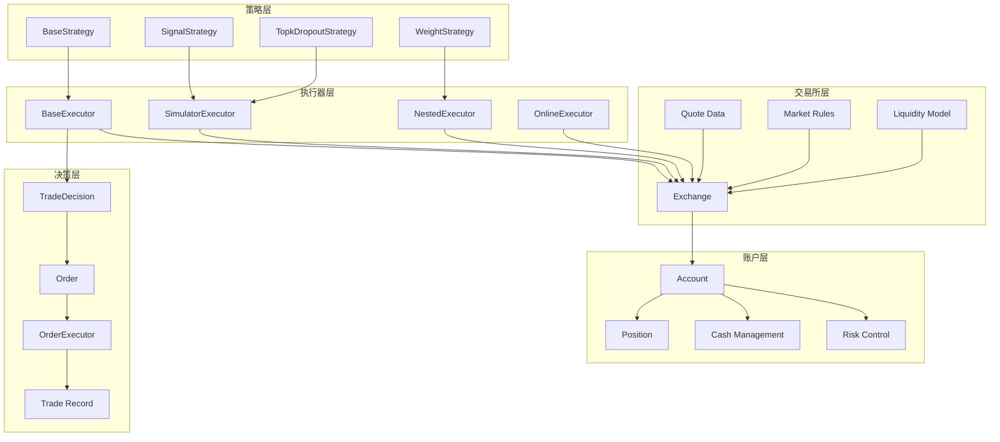
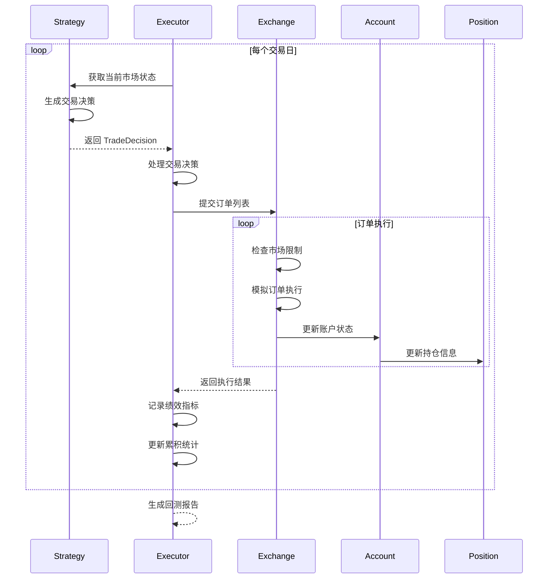
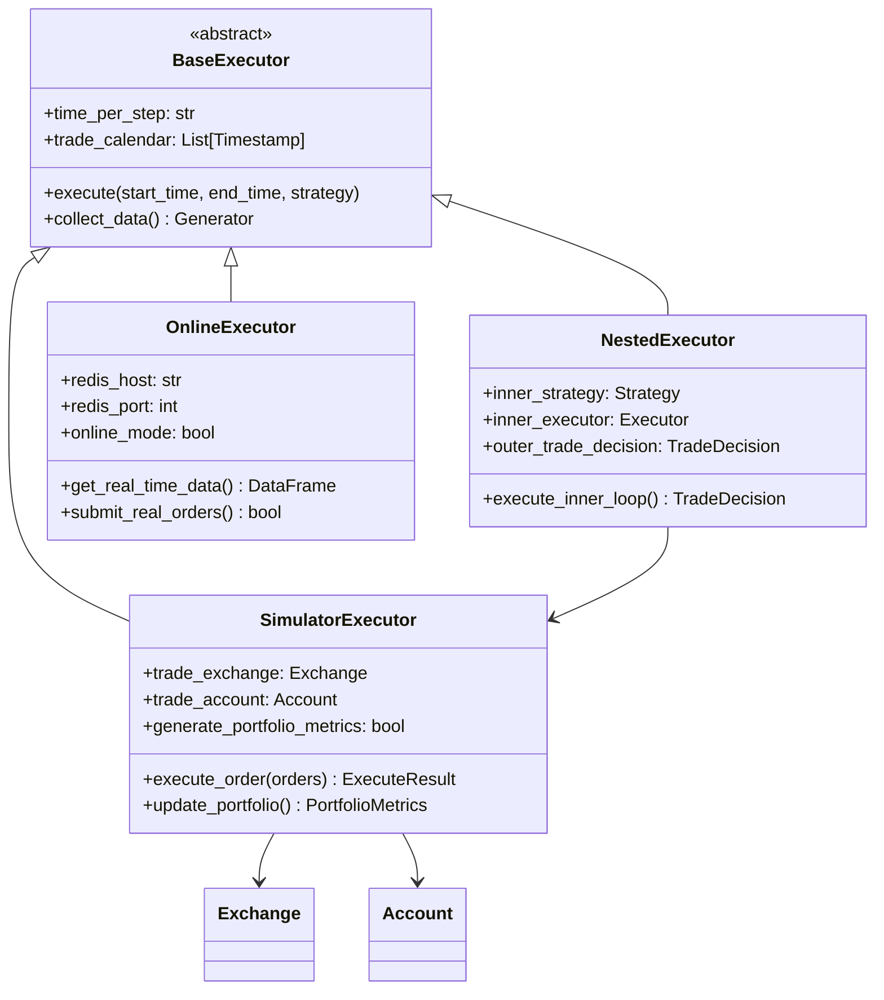
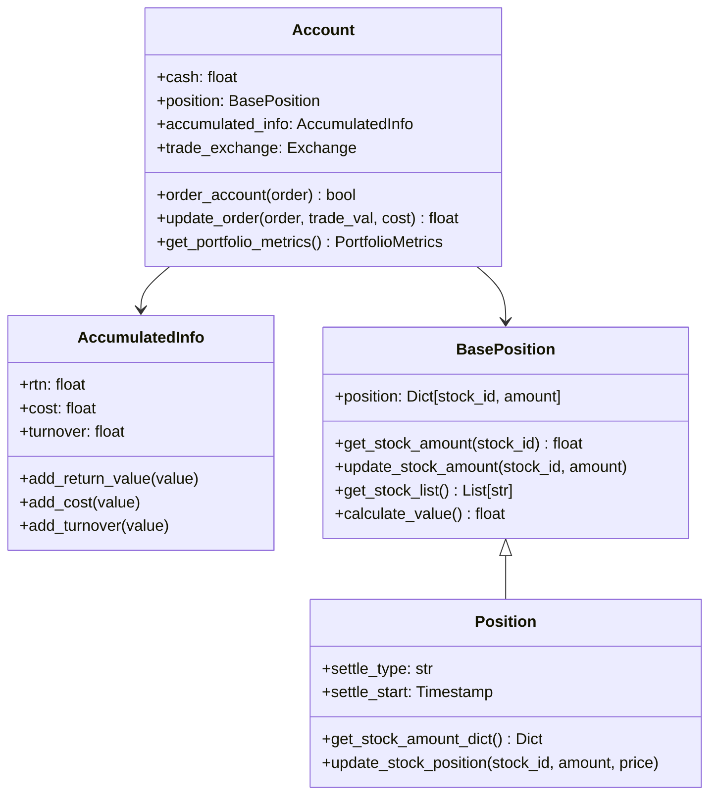
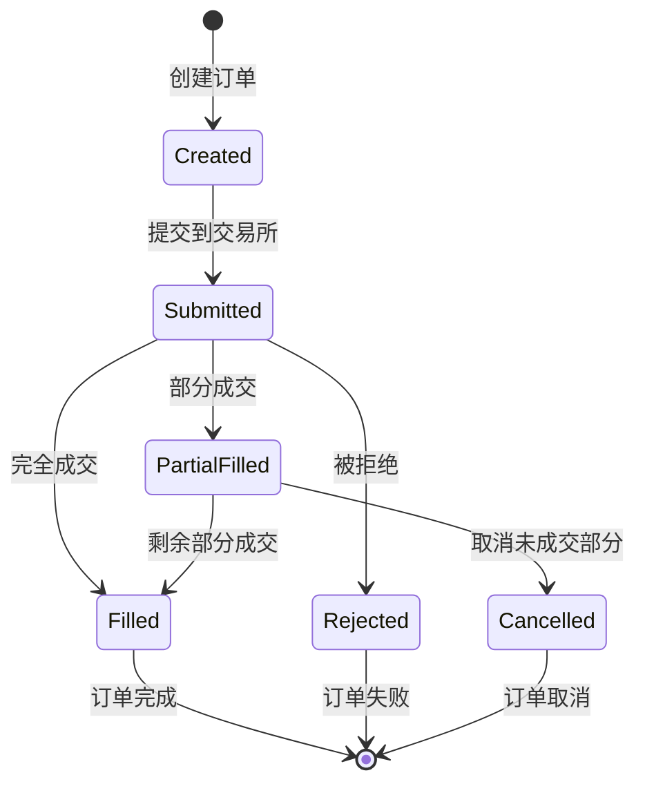
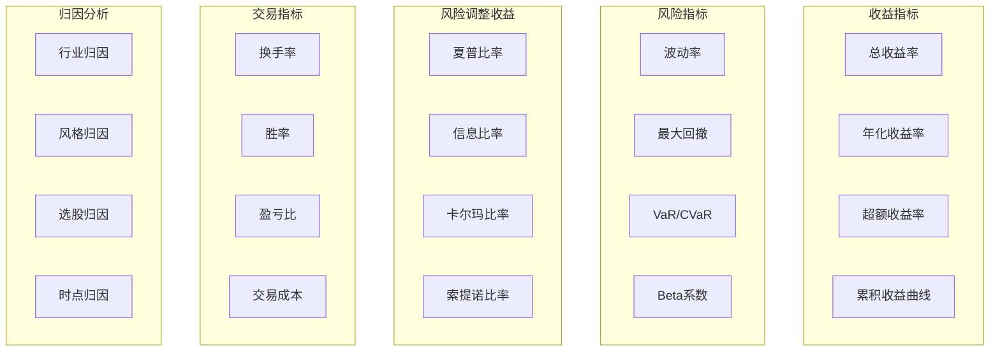
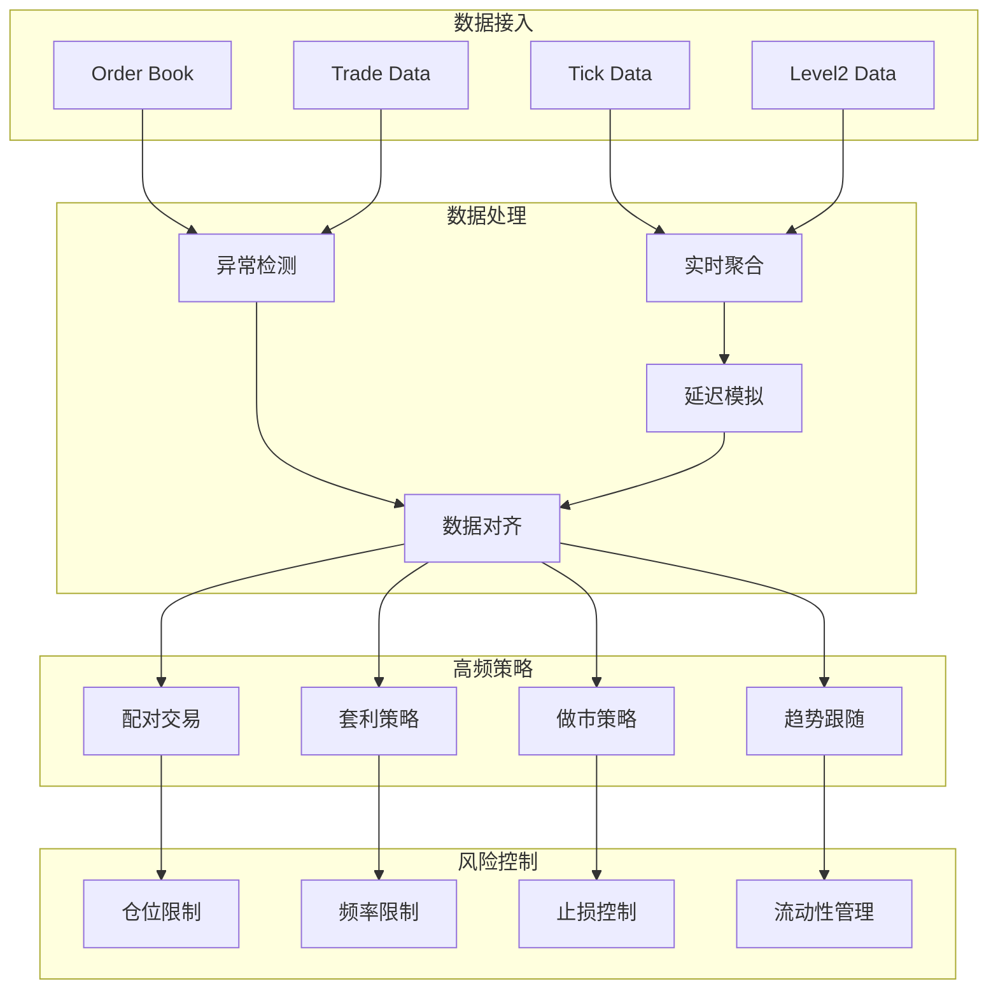
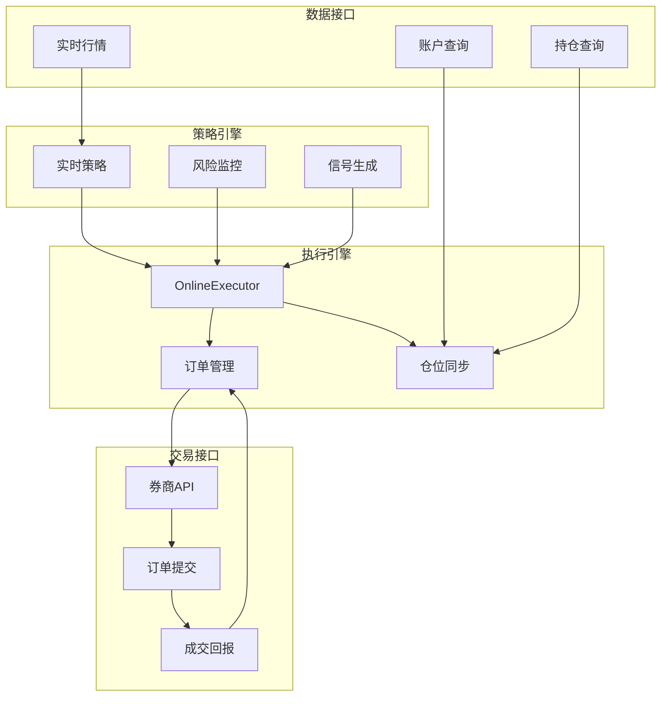

# Qlib 回测引擎深度分析

## 1. 回测系统概述

Qlib 回测引擎是一个高度模块化的交易模拟系统，旨在提供接近真实市场的回测环境。该系统采用分层架构设计，支持多频率交易、复杂订单执行机制、精细化成本模型和全面的风险管理。

## 2. 回测系统整体架构



## 3. 核心组件详解

### 3.1 回测主循环架构



### 3.2 交易执行引擎



### 3.3 Exchange 交易所模拟

```python
class Exchange:
    """交易所模拟引擎"""
    
    def __init__(
        self,
        freq="day",
        deal_price="$close",
        limit_threshold=None,
        open_cost=0.0015,
        close_cost=0.0025,
        min_cost=5.0,
        impact_cost=0.0,
        **kwargs
    ):
        self.freq = freq
        self.deal_price = deal_price
        
        # 交易限制
        self.limit_threshold = limit_threshold  # 涨跌停限制
        self.volume_threshold = kwargs.get('volume_threshold')  # 成交量限制
        
        # 成本模型
        self.open_cost = open_cost      # 开仓手续费率
        self.close_cost = close_cost    # 平仓手续费率  
        self.min_cost = min_cost        # 最小手续费
        self.impact_cost = impact_cost  # 冲击成本率
        
        # 报价数据
        self.quote_df = None
        self.quote = None  # 高性能数据结构
        
    def process_order(self, order: Order, current_time: pd.Timestamp):
        """处理单个订单"""
        stock_id = order.stock_id
        
        # 检查交易限制
        if not self._check_trade_limit(stock_id, current_time, order.direction):
            return ExecuteResult(order, 0, "交易受限")
        
        # 获取成交价格
        deal_price = self._get_deal_price(stock_id, current_time, order.direction)
        if deal_price is None:
            return ExecuteResult(order, 0, "停牌")
        
        # 计算可成交数量
        available_amount = self._get_available_amount(
            stock_id, current_time, order.amount, order.direction
        )
        
        # 计算交易成本
        trade_cost = self._calculate_cost(
            available_amount, deal_price, order.direction
        )
        
        # 执行交易
        trade_val = available_amount * deal_price
        return ExecuteResult(
            order=order,
            deal_amount=available_amount,
            deal_price=deal_price,
            trade_cost=trade_cost,
            trade_val=trade_val
        )
    
    def _check_trade_limit(self, stock_id, current_time, direction):
        """检查交易限制"""
        if self.limit_threshold is None:
            return True
            
        # 涨跌停检查
        if isinstance(self.limit_threshold, float):
            return self._check_price_limit(stock_id, current_time, self.limit_threshold)
        elif isinstance(self.limit_threshold, tuple):
            buy_limit, sell_limit = self.limit_threshold
            if direction == OrderDir.BUY:
                return not self.quote.get_data(stock_id, current_time, buy_limit)
            else:
                return not self.quote.get_data(stock_id, current_time, sell_limit)
        
        return True
    
    def _calculate_cost(self, amount, price, direction):
        """计算交易成本"""
        trade_value = amount * price
        
        # 手续费
        if direction == OrderDir.BUY:
            commission_rate = self.open_cost
        else:
            commission_rate = self.close_cost
            
        commission = max(trade_value * commission_rate, self.min_cost)
        
        # 冲击成本
        if self.impact_cost > 0:
            impact = trade_value * self.impact_cost
        else:
            impact = 0
            
        return commission + impact
```

## 4. 账户和持仓管理

### 4.1 Account 账户系统



### 4.2 持仓管理实现

```python
class Position(BasePosition):
    """持仓管理系统"""
    
    def __init__(self, cash=1e6, position=None):
        self.cash = cash
        self.position = position or {}
        
        # 结算配置
        self.settle_type = BasePosition.ST_NO  # 不结算
        self.settle_start = None
        
    def update_stock_amount(self, stock_id, amount, price=None):
        """更新股票持仓"""
        if stock_id not in self.position:
            self.position[stock_id] = {
                'amount': 0,
                'price': 0,  # 成本价
                'market_value': 0
            }
        
        old_amount = self.position[stock_id]['amount']
        new_amount = old_amount + amount
        
        if new_amount == 0:
            # 清仓
            del self.position[stock_id]
        else:
            # 更新持仓
            if price is not None and amount != 0:
                # 更新成本价（加权平均）
                if old_amount * amount >= 0:  # 同向交易
                    total_cost = (
                        old_amount * self.position[stock_id]['price'] + 
                        amount * price
                    )
                    self.position[stock_id]['price'] = total_cost / new_amount
                
            self.position[stock_id]['amount'] = new_amount
    
    def get_portfolio_metrics(self, current_time):
        """计算组合指标"""
        total_value = self.cash
        positions = {}
        
        for stock_id, pos_info in self.position.items():
            # 获取当前市价
            current_price = self.trade_exchange.get_quote_price(
                stock_id, current_time, "$close"
            )
            
            if current_price is not None:
                market_value = pos_info['amount'] * current_price
                total_value += market_value
                
                positions[stock_id] = {
                    'amount': pos_info['amount'],
                    'price': current_price,
                    'weight': 0,  # 稍后计算
                    'market_value': market_value
                }
        
        # 计算权重
        for stock_id in positions:
            positions[stock_id]['weight'] = (
                positions[stock_id]['market_value'] / total_value
            )
        
        return PortfolioMetrics(
            total_value=total_value,
            cash=self.cash,
            positions=positions,
            timestamp=current_time
        )
```

## 5. 订单处理系统

### 5.1 订单类型和状态



### 5.2 复杂订单类型支持

```python
class OrderHelper:
    """订单辅助工具"""
    
    @staticmethod
    def create_order_list(
        target_position: Dict[str, float],
        current_position: Dict[str, float],
        current_price: Dict[str, float],
        total_value: float
    ) -> List[Order]:
        """根据目标持仓生成订单列表"""
        order_list = []
        
        # 所有涉及的股票
        all_stocks = set(target_position.keys()) | set(current_position.keys())
        
        for stock_id in all_stocks:
            target_weight = target_position.get(stock_id, 0)
            current_weight = current_position.get(stock_id, 0)
            
            weight_diff = target_weight - current_weight
            
            if abs(weight_diff) > 1e-6:  # 避免微小差异
                # 计算交易金额
                trade_value = weight_diff * total_value
                stock_price = current_price.get(stock_id)
                
                if stock_price is not None:
                    trade_amount = trade_value / stock_price
                    
                    if trade_amount > 0:
                        direction = OrderDir.BUY
                    else:
                        direction = OrderDir.SELL
                        trade_amount = abs(trade_amount)
                    
                    order = Order(
                        stock_id=stock_id,
                        amount=trade_amount,
                        direction=direction
                    )
                    order_list.append(order)
        
        return order_list
    
    @staticmethod
    def split_large_order(order: Order, max_amount: float) -> List[Order]:
        """拆分大额订单"""
        if order.amount <= max_amount:
            return [order]
        
        sub_orders = []
        remaining_amount = order.amount
        
        while remaining_amount > 0:
            sub_amount = min(remaining_amount, max_amount)
            sub_order = Order(
                stock_id=order.stock_id,
                amount=sub_amount,
                direction=order.direction
            )
            sub_orders.append(sub_order)
            remaining_amount -= sub_amount
        
        return sub_orders
```

## 6. 绩效分析和报告

### 6.1 绩效指标体系



### 6.2 绩效计算实现

```python
class PortfolioAnalyzer:
    """组合绩效分析器"""
    
    def __init__(self, benchmark_code="CSI300"):
        self.benchmark_code = benchmark_code
        
    def analyze_portfolio(self, returns_df, positions_df, benchmark_returns):
        """全面的组合分析"""
        results = {}
        
        # 基础收益指标
        results.update(self._calculate_return_metrics(returns_df, benchmark_returns))
        
        # 风险指标
        results.update(self._calculate_risk_metrics(returns_df))
        
        # 风险调整收益指标
        results.update(self._calculate_risk_adjusted_metrics(returns_df, benchmark_returns))
        
        # 交易指标
        results.update(self._calculate_trading_metrics(positions_df))
        
        # 回撤分析
        results.update(self._calculate_drawdown_metrics(returns_df))
        
        return results
    
    def _calculate_return_metrics(self, returns, benchmark_returns):
        """计算收益指标"""
        portfolio_returns = returns['portfolio']
        
        # 累积收益
        cum_returns = (1 + portfolio_returns).cumprod() - 1
        total_return = cum_returns.iloc[-1]
        
        # 年化收益
        trading_days = len(portfolio_returns)
        years = trading_days / 252
        annual_return = (1 + total_return) ** (1 / years) - 1
        
        # 超额收益
        excess_returns = portfolio_returns - benchmark_returns
        excess_annual_return = excess_returns.mean() * 252
        
        return {
            'total_return': total_return,
            'annual_return': annual_return,
            'excess_annual_return': excess_annual_return,
            'cum_returns': cum_returns
        }
    
    def _calculate_risk_metrics(self, returns):
        """计算风险指标"""
        portfolio_returns = returns['portfolio']
        
        # 波动率
        volatility = portfolio_returns.std() * np.sqrt(252)
        
        # VaR (5%)
        var_5 = portfolio_returns.quantile(0.05)
        
        # CVaR (5%)
        cvar_5 = portfolio_returns[portfolio_returns <= var_5].mean()
        
        return {
            'volatility': volatility,
            'var_5': var_5,
            'cvar_5': cvar_5
        }
    
    def _calculate_drawdown_metrics(self, returns):
        """计算回撤指标"""
        portfolio_returns = returns['portfolio']
        cum_returns = (1 + portfolio_returns).cumprod()
        
        # 计算回撤
        running_max = cum_returns.expanding().max()
        drawdown = (cum_returns - running_max) / running_max
        
        # 最大回撤
        max_drawdown = drawdown.min()
        
        # 最大回撤持续期
        dd_duration = self._calculate_drawdown_duration(drawdown)
        
        return {
            'max_drawdown': max_drawdown,
            'drawdown_duration': dd_duration,
            'drawdown_series': drawdown
        }
    
    def _calculate_drawdown_duration(self, drawdown_series):
        """计算最大回撤持续期"""
        # 找到所有回撤区间
        in_drawdown = drawdown_series < 0
        drawdown_periods = []
        
        start = None
        for i, is_dd in enumerate(in_drawdown):
            if is_dd and start is None:
                start = i
            elif not is_dd and start is not None:
                drawdown_periods.append(i - start)
                start = None
        
        # 处理结尾仍在回撤的情况
        if start is not None:
            drawdown_periods.append(len(drawdown_series) - start)
        
        return max(drawdown_periods) if drawdown_periods else 0
```

## 7. 高频交易支持

### 7.1 高频数据处理



### 7.2 微观结构建模

```python
class MicrostructureSimulator:
    """市场微观结构模拟器"""
    
    def __init__(self, tick_size=0.01, lot_size=100):
        self.tick_size = tick_size
        self.lot_size = lot_size
        
        # 订单簿模型
        self.order_book = {
            'bid_prices': [],
            'bid_volumes': [],
            'ask_prices': [],
            'ask_volumes': []
        }
        
        # 流动性模型
        self.liquidity_model = None
        
    def simulate_order_execution(self, order, market_data, current_time):
        """模拟订单执行的市场冲击"""
        
        # 获取当前买卖盘
        bid_ask_spread = self._get_bid_ask_spread(market_data, current_time)
        
        # 计算市场冲击
        market_impact = self._calculate_market_impact(
            order.amount, 
            market_data['volume'],
            bid_ask_spread
        )
        
        # 模拟部分成交
        fill_ratio = self._calculate_fill_ratio(
            order.amount,
            market_data['volume'],
            order.direction
        )
        
        executed_amount = order.amount * fill_ratio
        
        # 考虑滑点
        if order.direction == OrderDir.BUY:
            execution_price = market_data['ask'] + market_impact
        else:
            execution_price = market_data['bid'] - market_impact
        
        return {
            'executed_amount': executed_amount,
            'execution_price': execution_price,
            'market_impact': market_impact,
            'slippage': abs(execution_price - market_data['mid_price'])
        }
    
    def _calculate_market_impact(self, order_size, avg_volume, spread):
        """计算市场冲击成本"""
        # 临时冲击（与订单大小和流动性相关）
        volume_ratio = order_size / avg_volume
        temporary_impact = spread * 0.5 * np.sqrt(volume_ratio)
        
        # 永久冲击（较小）
        permanent_impact = spread * 0.1 * volume_ratio
        
        return temporary_impact + permanent_impact
```

## 8. 在线交易支持

### 8.1 在线交易架构



## 9. 核心优势总结

### 9.1 设计优势
- **分层架构**: 策略、执行、交易所、账户的清晰分离
- **模块化设计**: 各组件可独立配置和扩展
- **真实性模拟**: 考虑交易成本、限制、冲击等真实因素
- **多频率支持**: 从日频到高频的全覆盖
- **在线部署**: 支持从回测到实盘交易的无缝迁移

### 9.2 性能特色
- **高性能数据结构**: NumpyQuote 等优化的数据访问
- **并行回测**: 支持多进程并行回测
- **内存优化**: 高效的数据管理和缓存策略
- **精确模拟**: 细致的市场微观结构建模

### 9.3 功能完备性
- **全面的绩效分析**: 涵盖收益、风险、归因等多维度
- **灵活的成本模型**: 支持各种费用和冲击成本
- **复杂订单支持**: 市价单、限价单、条件单等
- **风险管理**: 实时风险监控和控制机制

Qlib 的回测引擎不仅是一个技术实现，更是对金融市场交易机制的深度理解和精确建模。它为量化研究者提供了一个接近真实、功能完备的交易模拟环境，是从学术研究到工业应用的重要桥梁。