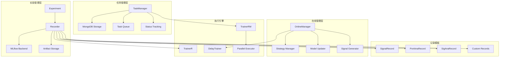
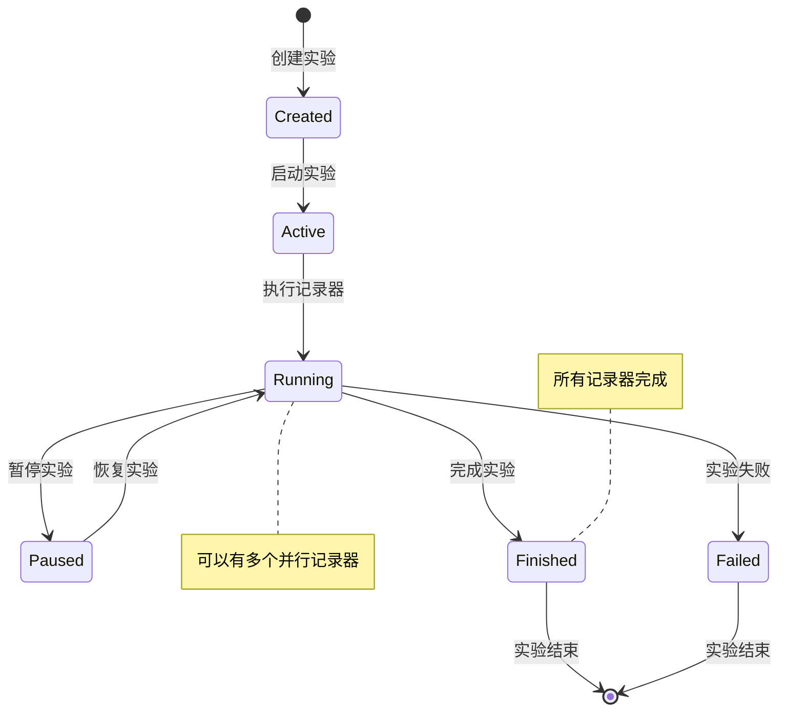
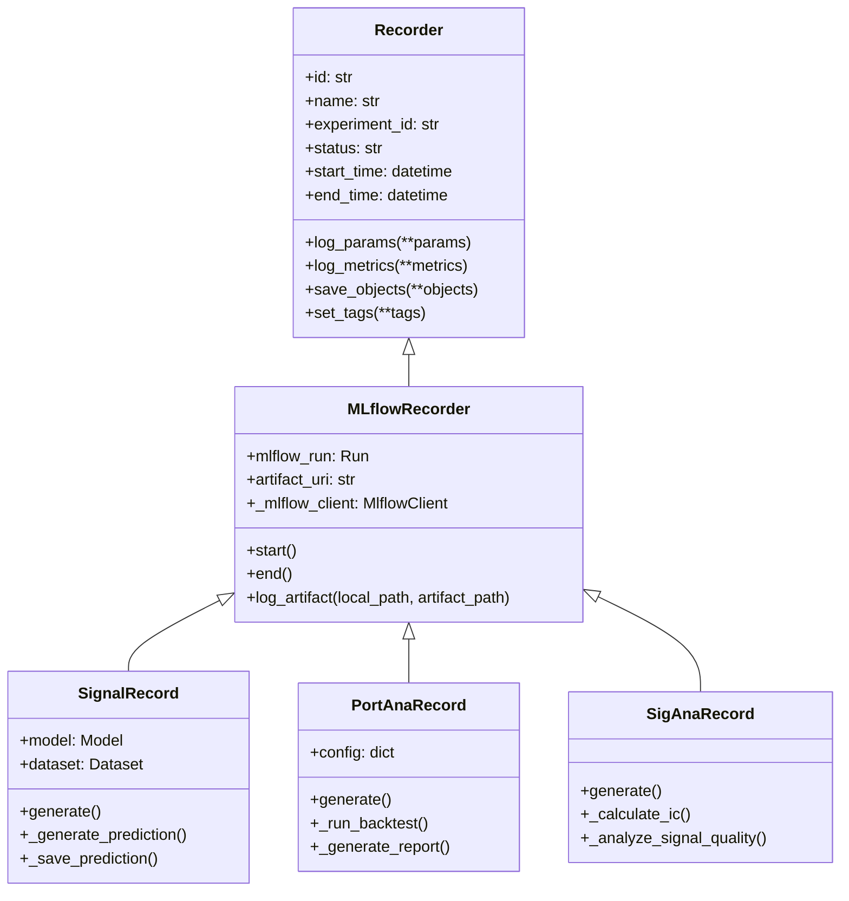
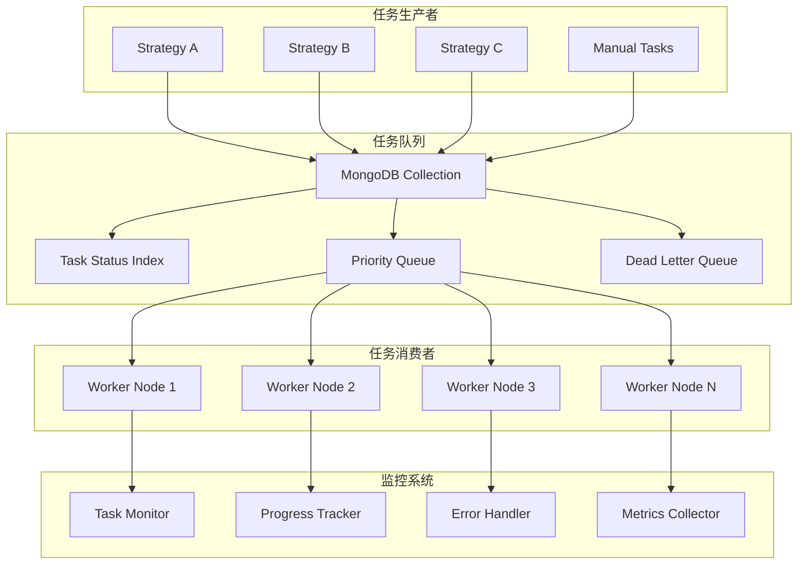
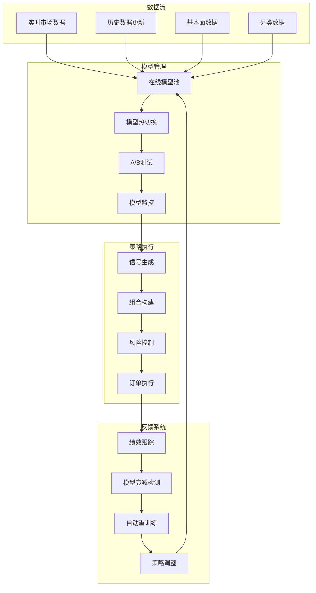
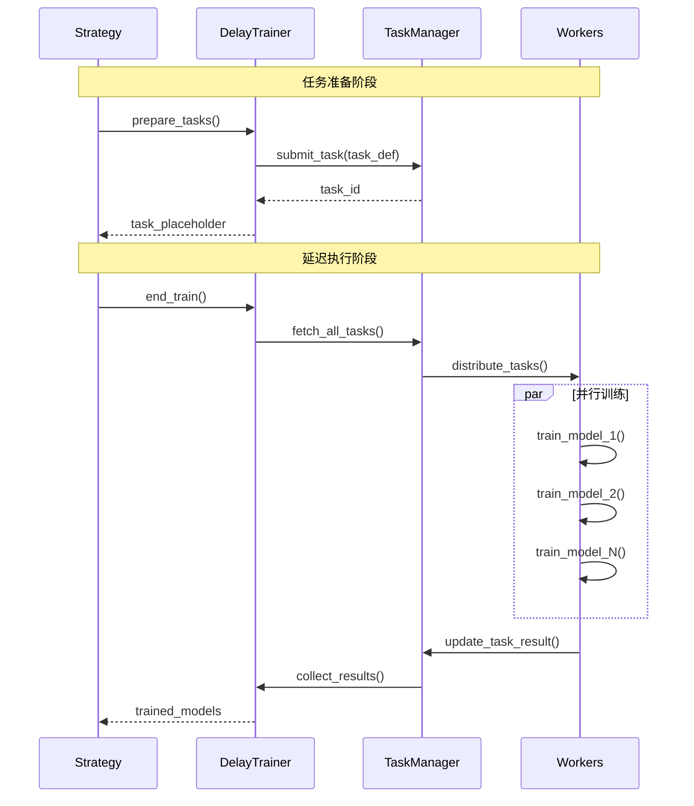
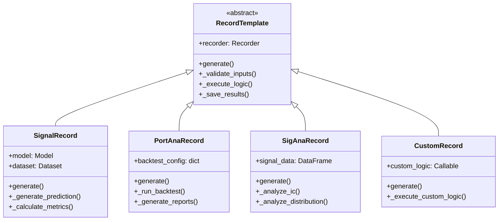

# Qlib 工作流和实验管理系统深度分析

## 1. 系统概述

Qlib 的工作流和实验管理系统是量化研究生命周期管理的核心，提供从实验设计、执行、记录到部署的全流程支持。该系统基于 MLflow 构建，扩展了量化投资特有的功能，支持大规模并行实验、在线模型管理和复杂的任务调度。

## 2. 工作流系统整体架构



## 3. 实验管理系统

### 3.1 实验生命周期管理



### 3.2 Recorder 记录器架构



### 3.3 实验记录实现

```python
class ExperimentManager:
    """实验管理器"""
    
    def __init__(self, mlflow_uri="file:./mlruns"):
        mlflow.set_tracking_uri(mlflow_uri)
        self.logger = get_module_logger("ExperimentManager")
    
    @contextmanager
    def experiment_context(self, experiment_name, recorder_name=None):
        """实验上下文管理器"""
        try:
            # 创建或获取实验
            experiment = mlflow.get_experiment_by_name(experiment_name)
            if experiment is None:
                experiment_id = mlflow.create_experiment(experiment_name)
            else:
                experiment_id = experiment.experiment_id
            
            # 启动记录器
            with mlflow.start_run(
                experiment_id=experiment_id,
                run_name=recorder_name
            ) as run:
                recorder = MLflowRecorder(
                    experiment_id=experiment_id,
                    run_id=run.info.run_id
                )
                
                # 设置全局记录器
                R.set_recorder(recorder)
                
                yield recorder
                
        except Exception as e:
            self.logger.error(f"实验执行失败: {e}")
            if 'recorder' in locals():
                recorder.end(status=Recorder.STATUS_FA)
            raise
        finally:
            # 清理全局状态
            R.clear_recorder()
            
    def run_experiment(self, task_config, experiment_name):
        """运行单个实验"""
        with self.experiment_context(experiment_name) as recorder:
            # 记录任务配置
            recorder.log_params(**flatten_dict(task_config))
            recorder.save_objects(task_config=task_config)
            
            # 初始化模型和数据集
            model = init_instance_by_config(task_config["model"])
            dataset = init_instance_by_config(task_config["dataset"])
            
            # 模型训练
            self.logger.info("开始模型训练")
            model.fit(dataset)
            recorder.save_objects(model=model)
            
            # 生成预测记录
            signal_record = SignalRecord(model, dataset, recorder)
            signal_record.generate()
            
            # 信号分析记录
            sig_ana_record = SigAnaRecord(recorder)
            sig_ana_record.generate()
            
            # 组合分析记录
            if "backtest" in task_config:
                port_ana_record = PortAnaRecord(
                    recorder, 
                    task_config["backtest"]
                )
                port_ana_record.generate()
            
            self.logger.info(f"实验完成: {recorder.id}")
            return recorder
```

## 4. 任务管理系统

### 4.1 TaskManager 架构



### 4.2 任务状态管理

```python
class TaskManager:
    """分布式任务管理器"""
    
    STATUS_WAITING = "waiting"
    STATUS_RUNNING = "running" 
    STATUS_DONE = "done"
    STATUS_PART_DONE = "part_done"
    STATUS_FAILED = "failed"
    
    def __init__(self, task_pool: str, max_workers: int = 4):
        self.task_pool = getattr(get_mongodb(), task_pool)
        self.max_workers = max_workers
        self.logger = get_module_logger("TaskManager")
        
        # 创建索引以优化查询性能
        self._create_indexes()
    
    def _create_indexes(self):
        """创建数据库索引"""
        self.task_pool.create_index([
            ("status", 1),
            ("priority", -1),
            ("created_time", 1)
        ])
        self.task_pool.create_index("task_id", unique=True)
    
    def submit_task(self, task_def, task_id=None, priority=0, **filter_fields):
        """提交任务到队列"""
        task_doc = {
            'task_id': task_id or str(ObjectId()),
            'def': Binary(pickle.dumps(task_def)),
            'status': self.STATUS_WAITING,
            'priority': priority,
            'created_time': time.time(),
            'filter': filter_fields,
            'retry_count': 0,
            'max_retries': 3
        }
        
        try:
            result = self.task_pool.insert_one(task_doc)
            self.logger.info(f"任务提交成功: {task_doc['task_id']}")
            return result.inserted_id
        except Exception as e:
            self.logger.error(f"任务提交失败: {e}")
            raise
    
    def fetch_task(self, worker_id: str, timeout: int = 30):
        """获取待执行任务"""
        # 原子操作：查找并更新状态
        task = self.task_pool.find_one_and_update(
            {
                'status': self.STATUS_WAITING
            },
            {
                '$set': {
                    'status': self.STATUS_RUNNING,
                    'worker_id': worker_id,
                    'start_time': time.time()
                }
            },
            sort=[('priority', -1), ('created_time', 1)],
            return_document=pymongo.ReturnDocument.AFTER
        )
        
        if task:
            # 反序列化任务定义
            task['def'] = pickle.loads(task['def'])
            if 'res' in task:
                task['res'] = pickle.loads(task['res'])
            
            self.logger.info(f"获取任务: {task['task_id']} -> {worker_id}")
            
        return task
    
    def update_task_status(self, task_id: str, status: str, result=None, error=None):
        """更新任务状态"""
        update_doc = {
            'status': status,
            'update_time': time.time()
        }
        
        if result is not None:
            update_doc['res'] = Binary(pickle.dumps(result))
        
        if error is not None:
            update_doc['error'] = str(error)
            update_doc['$inc'] = {'retry_count': 1}
        
        if status == self.STATUS_DONE:
            update_doc['end_time'] = time.time()
        
        self.task_pool.update_one(
            {'task_id': task_id},
            {'$set': update_doc}
        )
        
        self.logger.info(f"任务状态更新: {task_id} -> {status}")
    
    def run_worker(self, worker_id: str):
        """运行工作进程"""
        self.logger.info(f"启动工作进程: {worker_id}")
        
        while True:
            try:
                # 获取任务
                task = self.fetch_task(worker_id)
                if task is None:
                    time.sleep(5)  # 没有任务时等待
                    continue
                
                # 执行任务
                try:
                    result = self._execute_task(task)
                    self.update_task_status(
                        task['task_id'], 
                        self.STATUS_DONE, 
                        result=result
                    )
                except Exception as e:
                    self.logger.error(f"任务执行失败: {task['task_id']}, {e}")
                    
                    # 检查重试次数
                    if task.get('retry_count', 0) < task.get('max_retries', 3):
                        self.update_task_status(
                            task['task_id'],
                            self.STATUS_WAITING,  # 重新排队
                            error=e
                        )
                    else:
                        self.update_task_status(
                            task['task_id'],
                            self.STATUS_FAILED,
                            error=e
                        )
                        
            except KeyboardInterrupt:
                self.logger.info(f"工作进程停止: {worker_id}")
                break
            except Exception as e:
                self.logger.error(f"工作进程异常: {worker_id}, {e}")
                time.sleep(10)
    
    def _execute_task(self, task):
        """执行具体任务"""
        task_def = task['def']
        
        if isinstance(task_def, dict) and 'task_type' in task_def:
            task_type = task_def['task_type']
            
            if task_type == 'model_training':
                return self._execute_training_task(task_def)
            elif task_type == 'backtest':
                return self._execute_backtest_task(task_def)
            elif task_type == 'signal_analysis':
                return self._execute_analysis_task(task_def)
            else:
                raise ValueError(f"未知任务类型: {task_type}")
        else:
            # 兼容旧格式：直接执行函数
            return task_def()
```

## 5. 在线模型管理

### 5.1 在线系统架构



### 5.2 OnlineManager 实现

```python
class OnlineManager:
    """在线模型管理器"""
    
    def __init__(self, provider_uri, region, experiment_name, trainer_config):
        self.provider_uri = provider_uri
        self.region = region
        self.experiment_name = experiment_name
        self.trainer = init_instance_by_config(trainer_config)
        
        # 策略管理
        self.strategies = {}
        self.online_models = {}
        
        # 监控指标
        self.performance_tracker = {}
        self.model_decay_detector = ModelDecayDetector()
        
        self.logger = get_module_logger("OnlineManager")
    
    def register_strategy(self, strategy_name, strategy_config):
        """注册在线策略"""
        strategy = init_instance_by_config(strategy_config)
        self.strategies[strategy_name] = {
            'strategy': strategy,
            'config': strategy_config,
            'last_update': None,
            'performance': []
        }
        self.logger.info(f"注册策略: {strategy_name}")
    
    def first_train(self, start_time, end_time):
        """首次训练所有模型"""
        self.logger.info(f"开始首次训练: {start_time} -> {end_time}")
        
        all_tasks = []
        
        # 收集所有策略的训练任务
        for strategy_name, strategy_info in self.strategies.items():
            strategy = strategy_info['strategy']
            tasks = strategy.prepare_tasks(start_time, end_time, is_first_train=True)
            
            for task in tasks:
                task['strategy_name'] = strategy_name
                all_tasks.append(task)
        
        # 并行训练
        trained_models = self.trainer.train(all_tasks)
        
        # 更新在线模型
        for strategy_name, strategy_info in self.strategies.items():
            strategy = strategy_info['strategy']
            strategy_models = [
                model for model in trained_models 
                if model.task_config.get('strategy_name') == strategy_name
            ]
            strategy.prepare_online_models(strategy_models)
        
        # 结束训练
        self.trainer.end_train(trained_models)
        
        self.logger.info("首次训练完成")
        return trained_models
    
    def routine(self, current_time):
        """日常例行更新"""
        self.logger.info(f"执行例行更新: {current_time}")
        
        updated_strategies = []
        
        for strategy_name, strategy_info in self.strategies.items():
            strategy = strategy_info['strategy']
            
            # 检查是否需要更新
            if strategy.should_update(current_time):
                # 准备新的训练任务
                tasks = strategy.prepare_tasks(current_time)
                
                if tasks:
                    # 训练新模型
                    new_models = self.trainer.train(tasks)
                    
                    # 更新在线模型
                    strategy.prepare_online_models(new_models)
                    
                    # 结束训练
                    self.trainer.end_train(new_models)
                    
                    updated_strategies.append(strategy_name)
                    strategy_info['last_update'] = current_time
        
        # 更新预测信号
        if updated_strategies:
            self._update_online_predictions(current_time, updated_strategies)
        
        self.logger.info(f"例行更新完成, 更新策略: {updated_strategies}")
    
    def _update_online_predictions(self, current_time, updated_strategies):
        """更新在线预测"""
        for strategy_name in updated_strategies:
            strategy_info = self.strategies[strategy_name]
            strategy = strategy_info['strategy']
            
            # 生成新的预测
            predictions = strategy.generate_online_predictions(current_time)
            
            # 保存预测结果
            self._save_predictions(strategy_name, current_time, predictions)
            
            # 性能监控
            self._monitor_strategy_performance(strategy_name, current_time, predictions)
    
    def _monitor_strategy_performance(self, strategy_name, current_time, predictions):
        """监控策略性能"""
        # 获取真实标签（延迟获取）
        if strategy_name not in self.performance_tracker:
            self.performance_tracker[strategy_name] = []
        
        # 计算性能指标
        performance_metrics = self._calculate_performance_metrics(
            strategy_name, current_time, predictions
        )
        
        self.performance_tracker[strategy_name].append({
            'timestamp': current_time,
            'metrics': performance_metrics
        })
        
        # 检查模型衰减
        if self.model_decay_detector.detect_decay(
            strategy_name, self.performance_tracker[strategy_name]
        ):
            self.logger.warning(f"检测到模型衰减: {strategy_name}")
            self._trigger_model_retrain(strategy_name, current_time)
    
    def simulate_online_trading(self, start_time, end_time):
        """模拟在线交易"""
        self.logger.info(f"开始在线交易模拟: {start_time} -> {end_time}")
        
        # 首次训练
        self.first_train(start_time, start_time)
        
        # 获取交易日历
        trading_calendar = D.calendar(start_time, end_time)
        
        # 逐日模拟
        for current_time in tqdm(trading_calendar, desc="在线交易模拟"):
            try:
                # 例行更新
                self.routine(current_time)
                
                # 生成交易信号
                signals = self._generate_trading_signals(current_time)
                
                # 执行交易（模拟）
                self._execute_trades(current_time, signals)
                
            except Exception as e:
                self.logger.error(f"模拟失败 {current_time}: {e}")
                continue
        
        self.logger.info("在线交易模拟完成")
        return self._generate_simulation_report()
```

## 6. 延迟训练机制

### 6.1 DelayTrainer 架构



### 6.2 DelayTrainer 实现

```python
class DelayTrainer:
    """延迟训练器 - 支持大规模并行训练"""
    
    def __init__(self, task_pool="delay_training", max_workers=None):
        self.task_manager = TaskManager(task_pool)
        self.max_workers = max_workers or multiprocessing.cpu_count()
        self.pending_tasks = {}  # 待执行任务
        self.logger = get_module_logger("DelayTrainer")
    
    def train(self, tasks):
        """提交训练任务（不立即执行）"""
        task_ids = []
        
        for task in tasks:
            # 生成任务ID
            task_id = f"train_{int(time.time())}_{len(self.pending_tasks)}"
            
            # 提交到任务队列
            self.task_manager.submit_task(
                task_def={
                    'task_type': 'model_training',
                    'task_config': task,
                    'task_id': task_id
                },
                task_id=task_id
            )
            
            # 创建任务占位符
            task_placeholder = TrainingTaskPlaceholder(task_id, task)
            self.pending_tasks[task_id] = task_placeholder
            task_ids.append(task_id)
        
        self.logger.info(f"提交训练任务: {len(tasks)}个")
        return [self.pending_tasks[tid] for tid in task_ids]
    
    def end_train(self, task_placeholders):
        """执行所有延迟的训练任务"""
        if not task_placeholders:
            return []
        
        self.logger.info(f"开始执行延迟训练: {len(task_placeholders)}个任务")
        
        # 启动工作进程
        self._start_workers()
        
        # 等待所有任务完成
        completed_models = []
        task_ids = [tp.task_id for tp in task_placeholders]
        
        with tqdm(total=len(task_ids), desc="训练进度") as pbar:
            while task_ids:
                for task_id in task_ids[:]:  # 复制列表以安全修改
                    task_result = self._check_task_completion(task_id)
                    
                    if task_result is not None:
                        if task_result['status'] == TaskManager.STATUS_DONE:
                            # 反序列化训练好的模型
                            model = self._deserialize_model(task_result['result'])
                            completed_models.append(model)
                            pbar.update(1)
                        elif task_result['status'] == TaskManager.STATUS_FAILED:
                            self.logger.error(f"任务失败: {task_id}")
                            pbar.update(1)
                        
                        task_ids.remove(task_id)
                
                if task_ids:
                    time.sleep(1)  # 等待未完成的任务
        
        self.logger.info(f"延迟训练完成: {len(completed_models)}个模型")
        return completed_models
    
    def _start_workers(self):
        """启动工作进程池"""
        self.logger.info(f"启动{self.max_workers}个工作进程")
        
        self.worker_processes = []
        for i in range(self.max_workers):
            worker_id = f"worker_{i}"
            process = multiprocessing.Process(
                target=self.task_manager.run_worker,
                args=(worker_id,)
            )
            process.start()
            self.worker_processes.append(process)
    
    def _check_task_completion(self, task_id):
        """检查任务完成状态"""
        task = self.task_manager.task_pool.find_one({'task_id': task_id})
        
        if task and task['status'] in [TaskManager.STATUS_DONE, TaskManager.STATUS_FAILED]:
            return {
                'status': task['status'],
                'result': pickle.loads(task['res']) if 'res' in task else None,
                'error': task.get('error')
            }
        
        return None


class TrainingTaskPlaceholder:
    """训练任务占位符"""
    
    def __init__(self, task_id, task_config):
        self.task_id = task_id
        self.task_config = task_config
        self.status = "pending"
    
    def __repr__(self):
        return f"TaskPlaceholder(id={self.task_id}, status={self.status})"
```

## 7. 记录模板系统

### 7.1 记录模板架构



## 8. 核心优势总结

### 8.1 实验管理优势
- **统一追踪**: 基于 MLflow 的统一实验追踪和管理
- **自动记录**: 自动记录参数、指标、模型和结果
- **版本控制**: 完整的实验版本控制和可复现性
- **分布式支持**: 支持多机器分布式实验管理

### 8.2 任务管理优势
- **高可靠性**: 基于 MongoDB 的持久化任务队列
- **容错机制**: 任务重试、死信队列、错误恢复
- **负载均衡**: 自动任务分发和负载均衡
- **监控可视**: 实时任务状态监控和进度跟踪

### 8.3 在线管理优势
- **实时更新**: 支持模型的实时更新和热切换
- **性能监控**: 持续的模型性能监控和衰减检测
- **自动化**: 自动化的模型重训练和策略调整
- **A/B测试**: 内置的在线A/B测试框架

### 8.4 扩展能力
- **自定义记录**: 灵活的自定义记录模板机制
- **插件架构**: 支持第三方插件和扩展
- **多后端支持**: 支持多种存储和计算后端
- **云原生**: 支持容器化部署和云原生架构

Qlib 的工作流和实验管理系统提供了从研究到生产的完整解决方案，不仅降低了量化研究的技术门槛，更重要的是建立了规范化、自动化的研究流程，这对于量化团队的效率提升和风险控制具有重要意义。