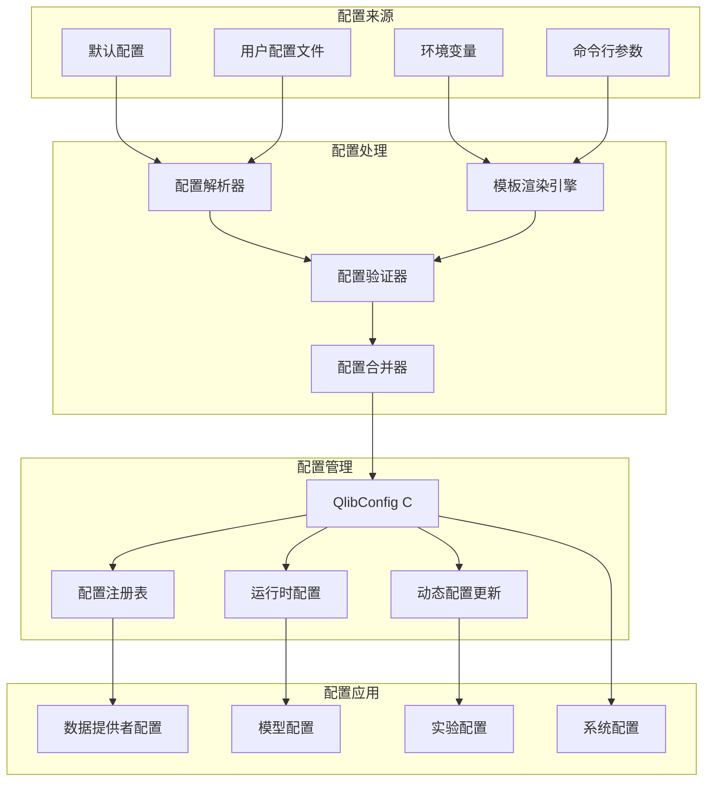
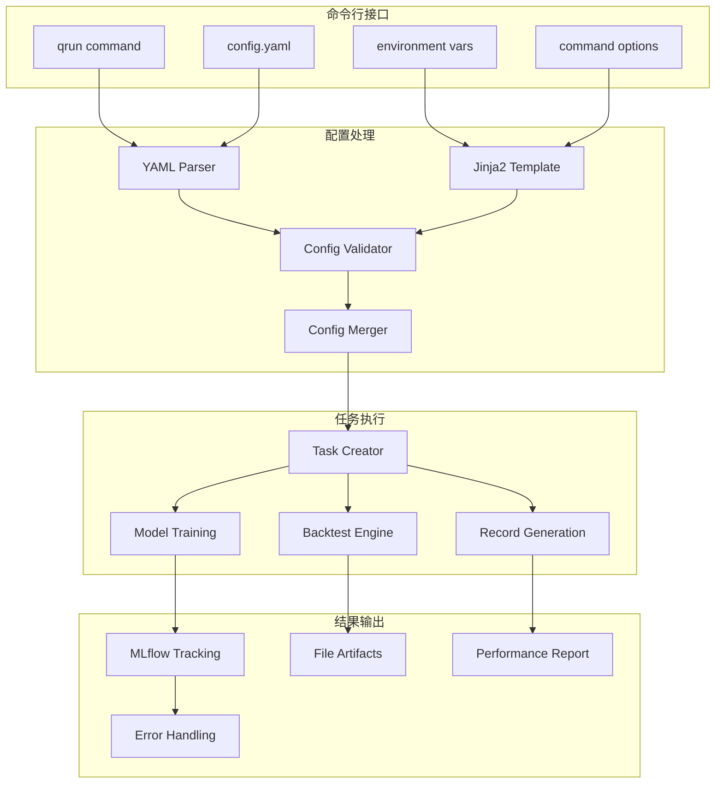
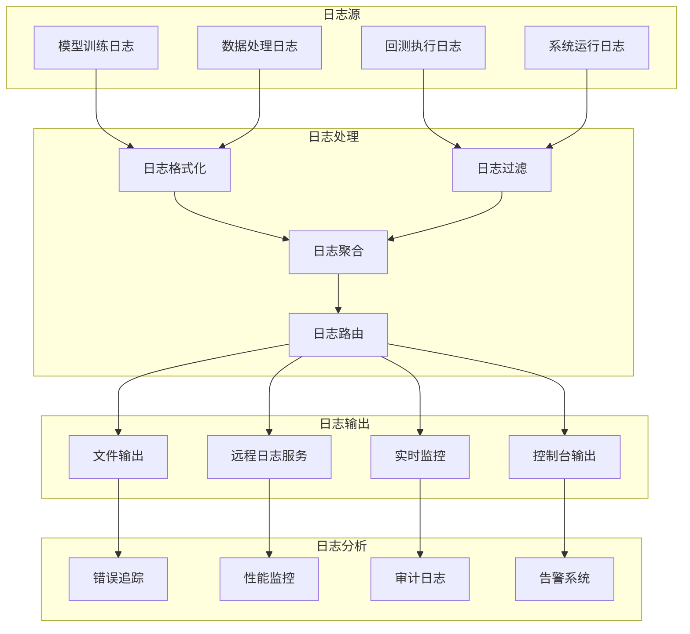

# Qlib 配置系统和工具链深度分析

## 1. 系统概述

Qlib 的配置系统和工具链是整个平台的基础设施，提供了灵活的配置管理、强大的命令行工具、丰富的实用工具函数等。这套系统的设计理念是降低使用门槛，提高开发效率，支持从研究到生产的无缝迁移。

## 2. 配置系统架构

### 2.1 配置层次结构



### 2.2 QlibConfig 核心配置类

```python
class QlibConfig:
    """Qlib 核心配置管理器"""
    
    def __init__(self):
        # 默认配置
        self._default_config = {
            # 数据相关配置
            "provider_uri": "~/.qlib/qlib_data/cn_data",
            "region": "cn",
            "auto_mount": False,
            "mount_path": None,
            "flask_server": None,
            "flask_port": 9710,
            
            # 缓存配置
            "mem_cache_size_limit": "5GB",
            "disk_cache_path": "~/.qlib/cache",
            "expression_cache": True,
            "dataset_cache": True,
            
            # 日志配置
            "logging_level": "INFO",
            "logging_config": {
                "version": 1,
                "formatters": {
                    "default": {
                        "format": "[%(asctime)s] %(levelname)s - %(name)s - %(message)s"
                    }
                },
                "handlers": {
                    "console": {
                        "class": "logging.StreamHandler",
                        "formatter": "default"
                    }
                },
                "root": {
                    "level": "INFO",
                    "handlers": ["console"]
                }
            },
            
            # MLflow 配置
            "mlflow_uri": "file:./mlruns",
            "experiment_name": "default",
            
            # 系统配置
            "multi_proc": True,
            "proc_num": 4,
            "maxtasksperchild": None
        }
        
        self._user_config = {}
        self._runtime_config = {}
        self.registered = False
    
    def set(self, config_name_or_dict=None, **kwargs):
        """设置配置"""
        if config_name_or_dict is None:
            # 使用关键字参数更新配置
            self._user_config.update(kwargs)
        elif isinstance(config_name_or_dict, str):
            # 加载预定义配置
            predefined_config = self._load_predefined_config(config_name_or_dict)
            self._user_config.update(predefined_config)
            self._user_config.update(kwargs)
        elif isinstance(config_name_or_dict, dict):
            # 直接使用字典配置
            self._user_config.update(config_name_or_dict)
            self._user_config.update(kwargs)
        else:
            raise ValueError(f"不支持的配置类型: {type(config_name_or_dict)}")
    
    def get(self, key, default=None):
        """获取配置项"""
        # 优先级：运行时配置 > 用户配置 > 默认配置
        if key in self._runtime_config:
            return self._runtime_config[key]
        elif key in self._user_config:
            return self._user_config[key]
        elif key in self._default_config:
            return self._default_config[key]
        else:
            return default
    
    def __getitem__(self, key):
        """支持字典式访问"""
        value = self.get(key)
        if value is None:
            raise KeyError(f"配置项不存在: {key}")
        return value
    
    def __setitem__(self, key, value):
        """支持字典式设置"""
        self._user_config[key] = value
    
    def register(self):
        """注册配置到全局"""
        self.registered = True
        # 初始化数据提供者管理器
        self.dpm = DataProviderManager()
        
        # 应用系统配置
        self._apply_system_config()
        
        # 初始化缓存系统
        self._init_cache_system()
    
    def _load_predefined_config(self, config_name):
        """加载预定义配置"""
        config_map = {
            "client": {
                "provider_uri": "~/.qlib/qlib_data/cn_data",
                "region": "cn",
                "dataset_cache": True,
                "expression_cache": True
            },
            "server": {
                "provider_uri": "server://localhost:9710",
                "region": "cn",
                "dataset_cache": False,
                "expression_cache": False,
                "flask_server": "0.0.0.0",
                "flask_port": 9710
            }
        }
        
        if config_name not in config_map:
            raise ValueError(f"未知的预定义配置: {config_name}")
        
        return config_map[config_name]
    
    def _apply_system_config(self):
        """应用系统级配置"""
        # 设置日志配置
        set_log_with_config(self.get("logging_config"))
        
        # 设置多进程配置
        if self.get("multi_proc"):
            import multiprocessing as mp
            mp.set_start_method('spawn', force=True)


# 全局配置实例
C = QlibConfig()
```

### 2.3 配置模板系统

```python
class ConfigTemplateManager:
    """配置模板管理器"""
    
    def __init__(self):
        self.templates = {}
        self._load_builtin_templates()
    
    def _load_builtin_templates(self):
        """加载内置模板"""
        # GBDT 基础配置模板
        self.templates["gbdt_basic"] = {
            "market": "csi300",
            "benchmark": "SH000300",
            "data_handler_config": {
                "start_time": "2008-01-01",
                "end_time": "2020-08-01",
                "fit_start_time": "2008-01-01",
                "fit_end_time": "2014-12-31",
                "instruments": "csi300",
                "infer_processors": [
                    {"class": "RobustZScoreNorm", "kwargs": {"fields_group": "feature", "clip_outlier": True}},
                    {"class": "Fillna", "kwargs": {"fields_group": "feature"}}
                ],
                "learn_processors": [
                    {"class": "DropnaLabel"},
                    {"class": "CSRankNorm", "kwargs": {"fields_group": "label"}}
                ]
            },
            "model": {
                "class": "LGBModel",
                "module_path": "qlib.contrib.model.gbdt",
                "kwargs": {
                    "loss": "mse",
                    "colsample_bytree": 0.8879,
                    "learning_rate": 0.0421,
                    "subsample": 0.8789,
                    "lambda_l1": 205.6999,
                    "lambda_l2": 580.9768,
                    "max_depth": 8,
                    "num_leaves": 210,
                    "num_threads": 20
                }
            },
            "dataset": {
                "class": "DatasetH",
                "module_path": "qlib.data.dataset",
                "kwargs": {
                    "handler": {
                        "class": "Alpha158",
                        "module_path": "qlib.contrib.data.handler",
                        "kwargs": "{{data_handler_config}}"
                    },
                    "segments": {
                        "train": ("2008-01-01", "2014-12-31"),
                        "valid": ("2015-01-01", "2016-12-31"),
                        "test": ("2017-01-01", "2020-08-01")
                    }
                }
            }
        }
        
        # 深度学习配置模板
        self.templates["lstm_basic"] = {
            "market": "csi300",
            "benchmark": "SH000300",
            "model": {
                "class": "LSTM",
                "module_path": "qlib.contrib.model.pytorch_lstm",
                "kwargs": {
                    "d_feat": 6,
                    "hidden_size": 64,
                    "num_layers": 2,
                    "dropout": 0.0,
                    "n_epochs": 200,
                    "lr": 1e-3,
                    "early_stop": 20,
                    "batch_size": 2000,
                    "metric": "loss",
                    "optimizer": "adam"
                }
            }
        }
    
    def get_template(self, template_name):
        """获取配置模板"""
        if template_name not in self.templates:
            raise ValueError(f"配置模板不存在: {template_name}")
        
        return copy.deepcopy(self.templates[template_name])
    
    def render_template(self, template_name, **context):
        """渲染配置模板"""
        template = self.get_template(template_name)
        
        # 使用 Jinja2 渲染模板
        from jinja2 import Template
        
        def render_recursive(obj):
            if isinstance(obj, dict):
                return {k: render_recursive(v) for k, v in obj.items()}
            elif isinstance(obj, list):
                return [render_recursive(item) for item in obj]
            elif isinstance(obj, str):
                if "{{" in obj and "}}" in obj:
                    return Template(obj).render(**context)
                return obj
            else:
                return obj
        
        return render_recursive(template)
```

## 3. 命令行工具系统

### 3.1 qrun 核心工具



### 3.2 qrun 实现

```python
def run(config_path: str, experiment_name: str = None, recorder_name: str = None):
    """qrun 主函数"""
    logger.info(f"开始执行配置: {config_path}")
    
    try:
        # 1. 渲染配置模板
        rendered_config = render_template(config_path)
        
        # 2. 解析配置
        yaml = YAML(typ="safe")
        config = yaml.load(rendered_config)
        
        # 3. 系统配置
        sys_config(config, config_path)
        
        # 4. 数据配置更新
        update_config(config, config_path)
        
        # 5. 初始化 Qlib
        qlib_config = config.get("qlib_init", {})
        qlib.init(**qlib_config)
        
        # 6. 执行任务
        task_config = config.get("task", {})
        if not task_config:
            raise ValueError("配置文件中缺少 task 配置")
        
        # 设置实验名称
        if experiment_name is None:
            experiment_name = config.get("experiment_name", "default_experiment")
        
        # 执行任务训练
        task_train(
            task_config,
            experiment_name=experiment_name,
            recorder_name=recorder_name
        )
        
        logger.info("任务执行完成")
        
    except Exception as e:
        logger.error(f"任务执行失败: {e}")
        raise


def render_template(config_path: str) -> str:
    """渲染 Jinja2 配置模板"""
    with open(config_path, "r") as f:
        config_content = f.read()
    
    from jinja2 import Template, meta
    template = Template(config_content)
    
    # 查找模板中的未定义变量
    env = template.environment
    parsed_content = env.parse(config_content)
    variables = meta.find_undeclared_variables(parsed_content)
    
    # 从环境变量获取上下文
    context = {}
    for var in variables:
        if var in os.environ:
            context[var] = os.getenv(var)
        else:
            logger.warning(f"模板变量未定义: {var}")
    
    if context:
        logger.info(f"使用环境变量渲染模板: {context}")
    
    # 渲染模板
    return template.render(**context)


def sys_config(config, config_path):
    """配置系统路径"""
    sys_config_section = config.get("sys", {})
    
    # 添加绝对路径
    for path in get_path_list(sys_config_section.get("path", [])):
        sys.path.append(path)
    
    # 添加相对路径（相对于配置文件）
    config_dir = Path(config_path).parent.resolve()
    for path in get_path_list(sys_config_section.get("rel_path", [])):
        abs_path = str(config_dir / path)
        sys.path.append(abs_path)


# 命令行入口
if __name__ == "__main__":
    fire.Fire(run)
```

## 4. 工具函数库

### 4.1 数据处理工具

```python
class DataUtils:
    """数据处理工具集"""
    
    @staticmethod
    def read_bin(file_path: Union[str, Path], start_index: int, end_index: int):
        """读取二进制文件"""
        file_path = Path(file_path).expanduser().resolve()
        
        with file_path.open("rb") as f:
            # 读取起始索引
            ref_start_index = int(np.frombuffer(f.read(4), dtype="<f")[0])
            si = max(ref_start_index, start_index)
            
            if si > end_index:
                return pd.Series(dtype=np.float32)
            
            # 计算偏移量
            f.seek(4 * (si - ref_start_index) + 4)
            
            # 读取数据
            count = end_index - si + 1
            data = np.frombuffer(f.read(4 * count), dtype="<f")
            series = pd.Series(data, index=pd.RangeIndex(si, si + len(data)))
        
        return series
    
    @staticmethod
    def normalize_cache_fields(fields):
        """标准化缓存字段"""
        if isinstance(fields, str):
            fields = [fields]
        
        normalized = []
        for field in fields:
            # 移除空格并转换为小写
            field = field.strip().lower()
            # 添加 $ 前缀（如果没有）
            if not field.startswith("$"):
                field = "$" + field
            normalized.append(field)
        
        return sorted(normalized)  # 排序以确保一致性
    
    @staticmethod
    def hash_args(*args, **kwargs):
        """参数哈希化"""
        # 将参数转换为字符串并排序
        arg_strs = [str(arg) for arg in args]
        kwarg_strs = [f"{k}={v}" for k, v in sorted(kwargs.items())]
        
        combined = "|".join(arg_strs + kwarg_strs)
        
        # 计算 MD5 哈希
        return hashlib.md5(combined.encode()).hexdigest()[:16]
```

### 4.2 模块管理工具

```python
class ModuleManager:
    """模块管理工具"""
    
    @staticmethod
    def init_instance_by_config(config, **kwargs):
        """根据配置初始化实例"""
        if isinstance(config, dict):
            class_name = config["class"]
            module_path = config.get("module_path", "qlib.model")
            init_kwargs = config.get("kwargs", {})
            init_kwargs.update(kwargs)
            
            # 动态导入模块
            module = importlib.import_module(module_path)
            cls = getattr(module, class_name)
            
            return cls(**init_kwargs)
        else:
            # 直接返回已实例化对象
            return config
    
    @staticmethod
    def get_module_by_module_path(module_path: str):
        """根据路径获取模块"""
        try:
            return importlib.import_module(module_path)
        except ImportError as e:
            logger.error(f"无法导入模块 {module_path}: {e}")
            raise
    
    @staticmethod
    def auto_filter_kwargs(func):
        """自动过滤函数参数"""
        def wrapper(*args, **kwargs):
            # 获取函数签名
            sig = inspect.signature(func)
            
            # 过滤不匹配的参数
            filtered_kwargs = {}
            for param_name in sig.parameters:
                if param_name in kwargs:
                    filtered_kwargs[param_name] = kwargs[param_name]
            
            return func(*args, **filtered_kwargs)
        
        return wrapper
```

### 4.3 并行处理工具

```python
class ParallelExecutor:
    """并行执行工具"""
    
    def __init__(self, max_workers=None, backend="threading"):
        self.max_workers = max_workers or os.cpu_count()
        self.backend = backend
    
    def map(self, func, iterable, chunk_size=None):
        """并行映射"""
        if self.backend == "threading":
            from concurrent.futures import ThreadPoolExecutor
            ExecutorClass = ThreadPoolExecutor
        elif self.backend == "multiprocessing":
            from concurrent.futures import ProcessPoolExecutor
            ExecutorClass = ProcessPoolExecutor
        else:
            raise ValueError(f"不支持的后端: {self.backend}")
        
        with ExecutorClass(max_workers=self.max_workers) as executor:
            if chunk_size is not None:
                # 分块处理
                results = []
                for i in range(0, len(iterable), chunk_size):
                    chunk = iterable[i:i + chunk_size]
                    chunk_results = list(executor.map(func, chunk))
                    results.extend(chunk_results)
                return results
            else:
                return list(executor.map(func, iterable))
    
    def submit(self, func, *args, **kwargs):
        """提交单个任务"""
        if self.backend == "threading":
            from concurrent.futures import ThreadPoolExecutor
            ExecutorClass = ThreadPoolExecutor
        else:
            from concurrent.futures import ProcessPoolExecutor
            ExecutorClass = ProcessPoolExecutor
        
        with ExecutorClass(max_workers=self.max_workers) as executor:
            future = executor.submit(func, *args, **kwargs)
            return future.result()


# 异步调用支持
class AsyncCaller:
    """异步调用器"""
    
    def __init__(self):
        self.futures = []
    
    def call_async(self, func, *args, **kwargs):
        """异步调用函数"""
        import asyncio
        
        async def async_wrapper():
            loop = asyncio.get_event_loop()
            return await loop.run_in_executor(None, func, *args, **kwargs)
        
        future = asyncio.create_task(async_wrapper())
        self.futures.append(future)
        return future
    
    async def wait_all(self):
        """等待所有异步调用完成"""
        if self.futures:
            results = await asyncio.gather(*self.futures)
            self.futures.clear()
            return results
        return []
```

## 5. 日志和调试系统

### 5.1 日志系统架构



### 5.2 高级日志管理

```python
class QlibLogger:
    """Qlib 日志管理器"""
    
    def __init__(self, name, level=logging.INFO):
        self.logger = logging.getLogger(name)
        self.logger.setLevel(level)
        
        # 时间性能监控
        self.time_inspector = TimeInspector()
        
        # 添加处理器（如果还没有）
        if not self.logger.handlers:
            self._setup_handlers()
    
    def _setup_handlers(self):
        """设置日志处理器"""
        # 控制台处理器
        console_handler = logging.StreamHandler()
        console_formatter = logging.Formatter(
            '[%(asctime)s] %(levelname)s - %(name)s - %(message)s'
        )
        console_handler.setFormatter(console_formatter)
        self.logger.addHandler(console_handler)
        
        # 文件处理器（如果配置了）
        if hasattr(C, 'log_file_path') and C.log_file_path:
            file_handler = logging.FileHandler(C.log_file_path)
            file_formatter = logging.Formatter(
                '[%(asctime)s] %(levelname)s - %(name)s - %(funcName)s:%(lineno)d - %(message)s'
            )
            file_handler.setFormatter(file_formatter)
            self.logger.addHandler(file_handler)
    
    def info(self, msg, *args, **kwargs):
        """信息日志"""
        self.logger.info(msg, *args, **kwargs)
    
    def error(self, msg, *args, **kwargs):
        """错误日志"""
        self.logger.error(msg, *args, **kwargs)
    
    def warning(self, msg, *args, **kwargs):
        """警告日志"""
        self.logger.warning(msg, *args, **kwargs)
    
    def debug(self, msg, *args, **kwargs):
        """调试日志"""
        self.logger.debug(msg, *args, **kwargs)
    
    @contextmanager
    def time_it(self, operation_name):
        """时间性能监控上下文"""
        start_time = time.time()
        try:
            yield
        finally:
            elapsed = time.time() - start_time
            self.info(f"{operation_name} 耗时: {elapsed:.3f}秒")


class TimeInspector:
    """时间性能检查器"""
    
    def __init__(self):
        self.records = {}
    
    @contextmanager
    def time_it(self, name):
        """性能计时上下文管理器"""
        start_time = time.time()
        try:
            yield
        finally:
            elapsed = time.time() - start_time
            if name not in self.records:
                self.records[name] = []
            self.records[name].append(elapsed)
    
    def get_summary(self):
        """获取性能总结"""
        summary = {}
        for name, times in self.records.items():
            summary[name] = {
                "count": len(times),
                "total": sum(times),
                "average": sum(times) / len(times),
                "min": min(times),
                "max": max(times)
            }
        return summary


def get_module_logger(module_name, level=logging.INFO):
    """获取模块日志器"""
    return QlibLogger(module_name, level)
```

## 6. 异常处理和错误恢复

### 6.1 异常处理框架

```python
class QlibException(Exception):
    """Qlib 基础异常类"""
    pass


class DataException(QlibException):
    """数据相关异常"""
    pass


class ModelException(QlibException):
    """模型相关异常"""
    pass


class BacktestException(QlibException):
    """回测相关异常"""
    pass


class ConfigException(QlibException):
    """配置相关异常"""
    pass


class ExceptionHandler:
    """异常处理器"""
    
    def __init__(self):
        self.logger = get_module_logger("ExceptionHandler")
        self.error_history = []
    
    @contextmanager
    def exception_context(self, operation_name, reraise=True):
        """异常处理上下文"""
        try:
            yield
        except Exception as e:
            error_info = {
                "operation": operation_name,
                "exception_type": type(e).__name__,
                "message": str(e),
                "timestamp": datetime.datetime.now(),
                "traceback": traceback.format_exc()
            }
            
            self.error_history.append(error_info)
            self.logger.error(f"{operation_name} 执行失败: {e}")
            self.logger.debug(f"详细错误信息:\n{error_info['traceback']}")
            
            if reraise:
                raise
    
    def retry_on_exception(self, func, max_retries=3, delay=1.0, backoff=2.0):
        """异常重试装饰器"""
        def wrapper(*args, **kwargs):
            for attempt in range(max_retries + 1):
                try:
                    return func(*args, **kwargs)
                except Exception as e:
                    if attempt == max_retries:
                        self.logger.error(f"重试{max_retries}次后仍然失败: {func.__name__}")
                        raise
                    
                    wait_time = delay * (backoff ** attempt)
                    self.logger.warning(f"{func.__name__} 第{attempt + 1}次尝试失败, {wait_time:.1f}秒后重试: {e}")
                    time.sleep(wait_time)
        
        return wrapper
```

## 7. 核心优势总结

### 7.1 配置系统优势
- **分层配置**: 支持默认、用户、环境变量、命令行参数的分层覆盖
- **模板支持**: 内置 Jinja2 模板引擎，支持动态配置生成
- **预定义模板**: 提供常用的配置模板，降低使用门槛
- **运行时更新**: 支持运行时配置动态更新和热重载

### 7.2 工具链优势
- **命令行友好**: qrun 工具提供完整的命令行接口
- **模块化设计**: 工具函数按功能模块化组织，易于维护和扩展
- **并行支持**: 内置并行处理工具，提升计算效率
- **跨平台兼容**: 支持 Windows、Linux、macOS 多平台

### 7.3 调试支持
- **结构化日志**: 分级日志系统，支持多种输出格式
- **性能监控**: 内置性能计时和监控工具
- **异常处理**: 完善的异常处理和重试机制
- **错误追踪**: 详细的错误记录和追踪功能

### 7.4 扩展能力
- **插件机制**: 支持第三方插件和自定义扩展
- **配置验证**: 配置项的类型检查和验证
- **自动化支持**: 支持 CI/CD 和自动化部署
- **云原生**: 支持容器化和云环境部署

Qlib 的配置系统和工具链体现了企业级软件的设计理念，不仅提供了强大的功能，更重要的是建立了标准化的开发和部署流程。这套系统让用户能够专注于量化策略的研发，而不必为基础设施的搭建和维护分心。