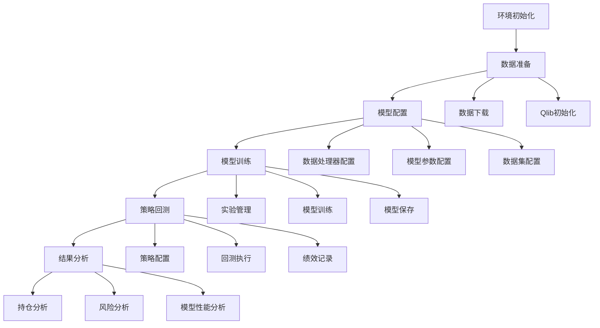
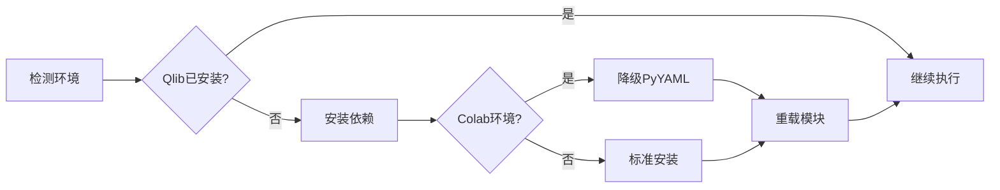
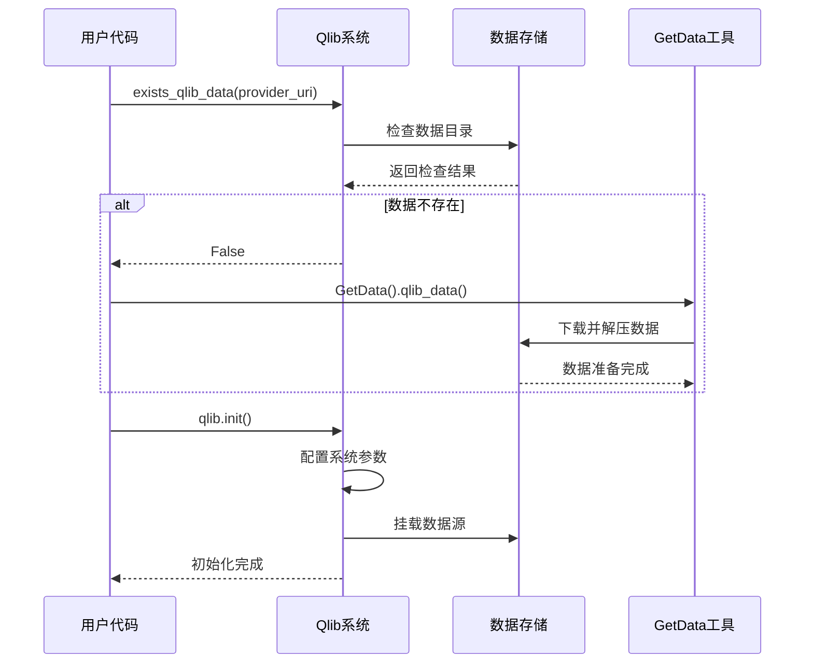
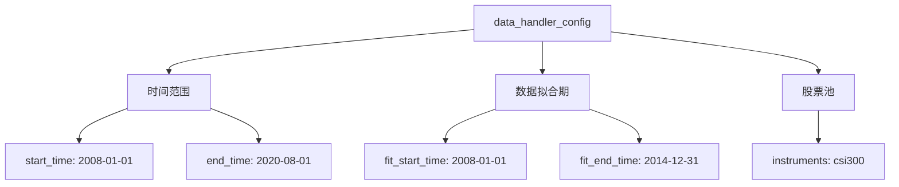
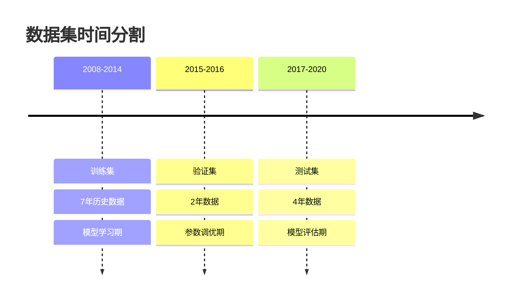
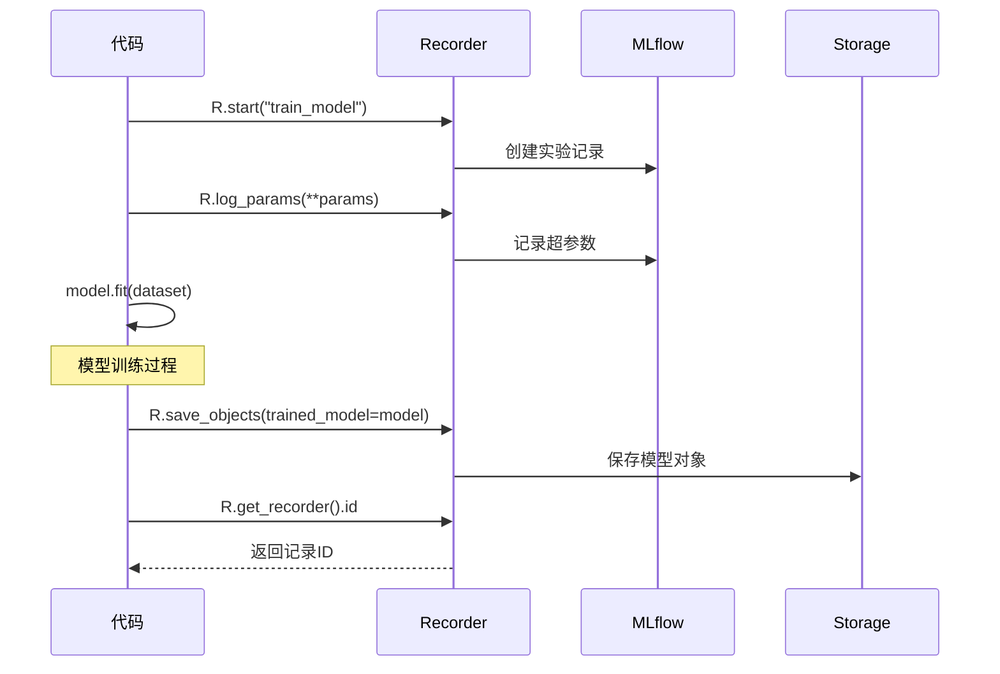
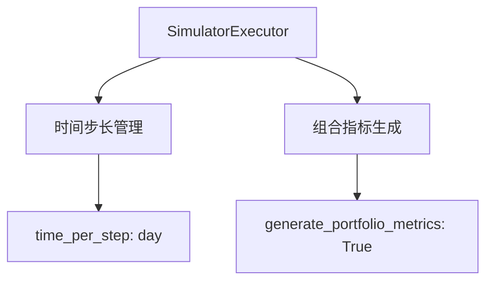
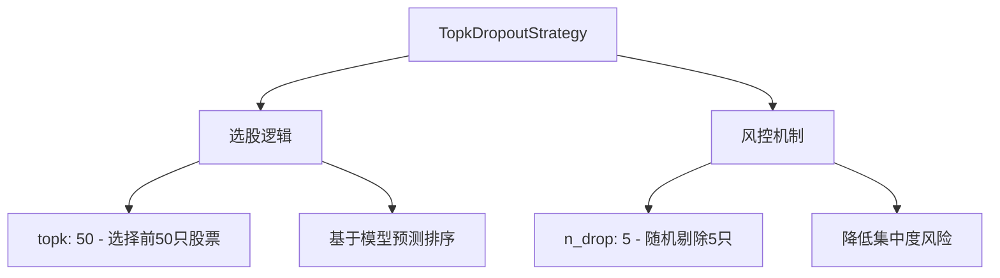
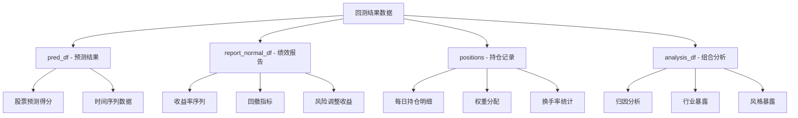

# Qlib 工作流代码深度解析

## 📖 概述

本文档深度解析 `workflow_by_code.ipynb` 示例，这是一个完整的量化投资工作流演示，展示了从数据准备到模型训练、回测分析的全过程。通过这个示例，我们可以理解 Qlib 的核心工作流程和最佳实践。

## 🏗️ 整体工作流架构



## 🔧 代码分段解析

### 1. 环境初始化和依赖管理

```python
import sys, site
from pathlib import Path

try:
    import qlib
except ImportError:
    # install qlib
    ! pip install --upgrade numpy
    ! pip install pyqlib
    if "google.colab" in sys.modules:
        ! pip install pyyaml==5.4.1
    site.main()
```

**设计亮点**：
- **动态依赖安装**：自动检测并安装 Qlib 依赖
- **环境兼容性**：特别处理 Google Colab 环境
- **版本控制**：针对特定环境降级 PyYAML 确保兼容性

**架构模式**：


### 2. 脚本资源管理

```python
scripts_dir = Path.cwd().parent.joinpath("scripts")
if not scripts_dir.joinpath("get_data.py").exists():
    scripts_dir = Path("~/tmp/qlib_code/scripts").expanduser().resolve()
    scripts_dir.mkdir(parents=True, exist_ok=True)
    import requests
    
    with requests.get("https://raw.githubusercontent.com/microsoft/qlib/main/scripts/get_data.py", timeout=10) as resp:
        with open(scripts_dir.joinpath("get_data.py"), "wb") as fp:
            fp.write(resp.content)
```

**技术特点**：
- **路径智能检测**：优先使用本地脚本，不存在则下载
- **网络资源获取**：从 GitHub 动态下载最新脚本
- **容错机制**：创建目录结构，处理网络超时

### 3. 核心模块导入

```python
import qlib
import pandas as pd
from qlib.constant import REG_CN
from qlib.utils import exists_qlib_data, init_instance_by_config
from qlib.workflow import R
from qlib.workflow.record_temp import SignalRecord, PortAnaRecord
from qlib.utils import flatten_dict
```

**模块功能分析**：

| 模块 | 功能 | 用途 |
|------|------|------|
| `qlib` | 核心框架 | 系统初始化和配置 |
| `qlib.constant` | 常量定义 | 区域代码等全局常量 |
| `qlib.utils` | 工具函数 | 数据检查、实例创建、配置处理 |
| `qlib.workflow` | 工作流管理 | 实验记录和管理 |
| `qlib.workflow.record_temp` | 记录模板 | 信号记录和组合分析 |

### 4. 数据准备和系统初始化

```python
provider_uri = "~/.qlib/qlib_data/cn_data"
if not exists_qlib_data(provider_uri):
    print(f"Qlib data is not found in {provider_uri}")
    sys.path.append(str(scripts_dir))
    from get_data import GetData
    GetData().qlib_data(target_dir=provider_uri, region=REG_CN)

qlib.init(provider_uri=provider_uri, region=REG_CN)
```

**数据管理流程**：


### 5. 市场参数配置

```python
market = "csi300"
benchmark = "SH000300"
```

**参数说明**：
- `market = "csi300"`：选择沪深300成分股作为股票池
- `benchmark = "SH000300"`：使用沪深300指数作为基准

### 6. 模型训练配置

```python
data_handler_config = {
    "start_time": "2008-01-01",
    "end_time": "2020-08-01", 
    "fit_start_time": "2008-01-01",
    "fit_end_time": "2014-12-31",
    "instruments": market,
}

task = {
    "model": {
        "class": "LGBModel",
        "module_path": "qlib.contrib.model.gbdt",
        "kwargs": {
            "loss": "mse",
            "colsample_bytree": 0.8879,
            "learning_rate": 0.0421,
            "subsample": 0.8789,
            "lambda_l1": 205.6999,
            "lambda_l2": 580.9768,
            "max_depth": 8,
            "num_leaves": 210,
            "num_threads": 20,
        },
    },
    "dataset": {
        "class": "DatasetH",
        "module_path": "qlib.data.dataset",
        "kwargs": {
            "handler": {
                "class": "Alpha158",
                "module_path": "qlib.contrib.data.handler",
                "kwargs": data_handler_config,
            },
            "segments": {
                "train": ("2008-01-01", "2014-12-31"),
                "valid": ("2015-01-01", "2016-12-31"),
                "test": ("2017-01-01", "2020-08-01"),
            },
        },
    },
}
```

**配置结构分析**：

#### 数据处理器配置


#### LightGBM 模型参数
| 参数 | 值 | 作用 |
|------|-----|------|
| `loss` | "mse" | 均方误差损失函数 |
| `colsample_bytree` | 0.8879 | 每棵树特征采样比例 |
| `learning_rate` | 0.0421 | 学习率 |
| `subsample` | 0.8789 | 数据采样比例 |
| `lambda_l1` | 205.6999 | L1正则化系数 |
| `lambda_l2` | 580.9768 | L2正则化系数 |
| `max_depth` | 8 | 树最大深度 |
| `num_leaves` | 210 | 叶子节点数量 |
| `num_threads` | 20 | 并行线程数 |

#### 数据集分割策略


### 7. 模型训练流程

```python
model = init_instance_by_config(task["model"])
dataset = init_instance_by_config(task["dataset"])

with R.start(experiment_name="train_model"):
    R.log_params(**flatten_dict(task))
    model.fit(dataset)
    R.save_objects(trained_model=model)
    rid = R.get_recorder().id
```

**实验管理机制**：


**核心特性**：
- **实验追踪**：使用 MLflow 记录实验参数和结果
- **参数展开**：`flatten_dict` 将嵌套配置展平为键值对
- **对象持久化**：训练好的模型自动保存
- **ID管理**：获取实验记录ID用于后续引用

### 8. 回测分析配置

```python
port_analysis_config = {
    "executor": {
        "class": "SimulatorExecutor", 
        "module_path": "qlib.backtest.executor",
        "kwargs": {
            "time_per_step": "day",
            "generate_portfolio_metrics": True,
        },
    },
    "strategy": {
        "class": "TopkDropoutStrategy",
        "module_path": "qlib.contrib.strategy.signal_strategy", 
        "kwargs": {
            "model": model,
            "dataset": dataset,
            "topk": 50,
            "n_drop": 5,
        },
    },
    "backtest": {
        "start_time": "2017-01-01",
        "end_time": "2020-08-01",
        "account": 100000000,
        "benchmark": benchmark,
        "exchange_kwargs": {
            "freq": "day",
            "limit_threshold": 0.095,
            "deal_price": "close",
            "open_cost": 0.0005,
            "close_cost": 0.0015,
            "min_cost": 5,
        },
    },
}
```

**回测架构组件**：

#### 执行器 (Executor)


#### 交易策略 (Strategy)


#### 交易成本模型
| 参数 | 值 | 说明 |
|------|-----|------|
| `freq` | "day" | 日频交易 |
| `limit_threshold` | 0.095 | 涨跌停阈值 (9.5%) |
| `deal_price` | "close" | 按收盘价成交 |
| `open_cost` | 0.0005 | 买入费率 (0.05%) |
| `close_cost` | 0.0015 | 卖出费率 (0.15%) |
| `min_cost` | 5 | 最小交易费用 (5元) |

### 9. 回测执行流程

```python
with R.start(experiment_name="backtest_analysis"):
    recorder = R.get_recorder(recorder_id=rid, experiment_name="train_model")
    model = recorder.load_object("trained_model")
    
    # prediction
    recorder = R.get_recorder()
    ba_rid = recorder.id
    sr = SignalRecord(model, dataset, recorder)
    sr.generate()
    
    # backtest & analysis  
    par = PortAnaRecord(recorder, port_analysis_config, "day")
    par.generate()
```

**执行时序图**：
```mermaid
sequenceDiagram
    participant C as 代码
    participant R1 as 训练记录器
    participant R2 as 回测记录器
    participant SR as SignalRecord
    participant PAR as PortAnaRecord
    
    C->>R2: R.start("backtest_analysis")
    C->>R1: 获取训练阶段记录器
    C->>R1: 加载训练好的模型
    
    C->>SR: 创建信号记录器
    SR->>SR: 生成预测信号
    SR->>R2: 保存预测结果
    
    C->>PAR: 创建组合分析记录器
    PAR->>PAR: 执行回测
    PAR->>PAR: 计算绩效指标
    PAR->>R2: 保存分析结果
```

### 10. 结果分析和可视化

```python
from qlib.contrib.report import analysis_model, analysis_position
from qlib.data import D

recorder = R.get_recorder(recorder_id=ba_rid, experiment_name="backtest_analysis")
pred_df = recorder.load_object("pred.pkl")
report_normal_df = recorder.load_object("portfolio_analysis/report_normal_1day.pkl")
positions = recorder.load_object("portfolio_analysis/positions_normal_1day.pkl")
analysis_df = recorder.load_object("portfolio_analysis/port_analysis_1day.pkl")
```

**数据对象结构**：

#### 核心分析数据


#### 分析功能模块
```python
# 持仓分析
analysis_position.report_graph(report_normal_df)  # 绩效报告图表
analysis_position.risk_analysis_graph(analysis_df, report_normal_df)  # 风险分析

# 模型分析
label_df = dataset.prepare("test", col_set="label")
pred_label = pd.concat([label_df, pred_df], axis=1, sort=True).reindex(label_df.index)
analysis_position.score_ic_graph(pred_label)  # IC分析
analysis_model.model_performance_graph(pred_label)  # 模型性能
```

## 📊 关键技术特性

### 1. 配置驱动架构
- **模块化配置**：每个组件都通过配置字典定义
- **动态实例化**：`init_instance_by_config` 实现配置到对象的转换
- **参数传递**：配置参数在组件间无缝传递

### 2. 实验管理系统
- **版本控制**：每次实验都有唯一ID
- **参数记录**：自动记录所有超参数
- **结果追踪**：模型和结果对象持久化存储
- **实验链接**：不同阶段实验通过ID关联

### 3. 回测仿真引擎
- **高保真模拟**：考虑涨跌停、交易成本等现实约束
- **灵活策略框架**：支持多种选股和择时策略
- **性能评估**：全面的风险和收益分析

### 4. 可视化分析系统
- **多维度分析**：持仓、风险、模型性能等多角度
- **交互式图表**：基于 Plotly 的动态可视化
- **专业指标**：IC、IR、回撤、夏普比等量化指标

## 🎯 最佳实践总结

### 1. 环境管理
```python
# ✅ 推荐：动态依赖检测和安装
try:
    import qlib
except ImportError:
    ! pip install pyqlib
    site.main()

# ✅ 推荐：路径自适应处理
scripts_dir = Path.cwd().parent.joinpath("scripts")
if not scripts_dir.exists():
    # 下载或创建必要资源
```

### 2. 配置管理
```python
# ✅ 推荐：结构化配置定义
config = {
    "model": {...},
    "dataset": {...},
    "strategy": {...}
}

# ✅ 推荐：配置参数化
data_handler_config = {
    "start_time": "2008-01-01",
    "instruments": market,
}
```

### 3. 实验追踪
```python
# ✅ 推荐：使用上下文管理器
with R.start(experiment_name="train_model"):
    R.log_params(**flatten_dict(task))
    model.fit(dataset)
    R.save_objects(trained_model=model)
    rid = R.get_recorder().id
```

### 4. 错误处理
```python
# ✅ 推荐：数据存在性检查
if not exists_qlib_data(provider_uri):
    GetData().qlib_data(target_dir=provider_uri, region=REG_CN)

# ✅ 推荐：网络请求超时设置
with requests.get(url, timeout=10) as resp:
    # 处理响应
```

## 🔍 常见问题和解决方案

### 1. 依赖缺失问题
```bash
# 问题：ModuleNotFoundError: No module named 'statsmodels'
# 解决：安装缺失依赖
pip install statsmodels matplotlib seaborn
```

### 2. 数据下载问题
```python
# 问题：数据下载失败或中断
# 解决：检查网络连接，重新下载
if not exists_qlib_data(provider_uri):
    print("重新下载数据...")
    GetData().qlib_data(target_dir=provider_uri, region=REG_CN, delete_old=True)
```

### 3. 内存不足问题
```python
# 问题：大数据集训练内存溢出
# 解决：调整数据处理参数
task["dataset"]["kwargs"]["handler"]["kwargs"]["n_jobs"] = 4  # 减少并行度
```

### 4. 回测速度问题
```python
# 问题：回测执行时间过长
# 解决：减少股票池或调整回测频率
data_handler_config["instruments"] = "csi100"  # 减少股票数量
port_analysis_config["backtest"]["exchange_kwargs"]["freq"] = "week"  # 降低频率
```

## 📈 性能优化建议

### 1. 数据加载优化
- 使用缓存机制减少重复数据读取
- 并行处理提升数据准备速度
- 增量更新而非全量重载

### 2. 模型训练优化
- 合理设置 `num_threads` 参数
- 使用早停机制避免过拟合
- GPU 加速深度学习模型

### 3. 回测优化
- 向量化计算提升回测速度
- 合理设置回测频率
- 并行回测多个策略

## 🎓 学习价值

这个示例代码展示了 Qlib 的核心价值：

1. **完整工作流**：从数据到结果的端到端流程
2. **工程实践**：生产级的代码结构和错误处理
3. **实验管理**：科学的实验设计和结果追踪
4. **性能分析**：专业的量化分析方法

通过深入理解这个示例，开发者可以快速掌握 Qlib 的使用方法，并将其应用到实际的量化投资项目中。