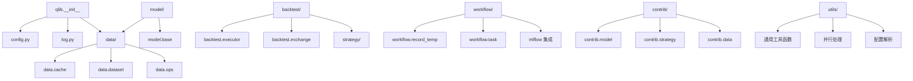
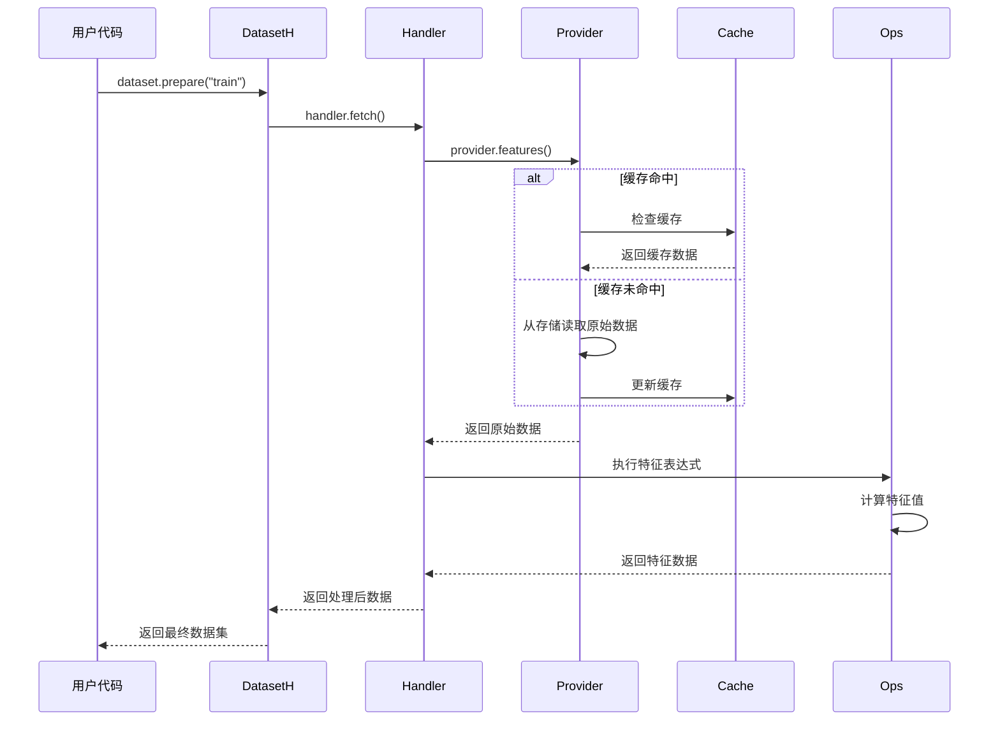
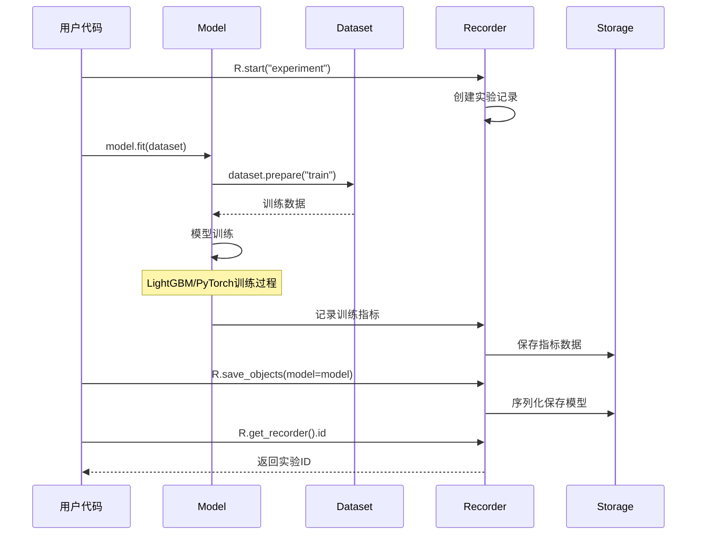

# Qlib 源代码架构 - 开发者视角

## 📚 概述

本文档从开发者角度深入分析 Qlib 的源代码组织结构、设计模式、核心算法实现和扩展机制。通过源码层面的分析，帮助开发者理解 Qlib 的设计理念，并为二次开发和贡献代码提供指导。

## 🏗️ 代码组织架构

### 1. 顶层目录结构

```
qlib/
├── __init__.py              # 框架入口和初始化
├── config.py               # 配置管理系统
├── constant.py             # 全局常量定义
├── log.py                  # 日志系统
├── typehint.py            # 类型提示定义
├── auto_quant/            # 自动化量化模块
├── backtest/              # 回测引擎
├── cli/                   # 命令行工具
├── contrib/               # 社区贡献组件
├── data/                  # 数据处理框架
├── model/                 # 模型基础框架
├── rl/                    # 强化学习模块
├── strategy/              # 策略框架
├── tests/                 # 测试用例
├── utils/                 # 工具函数库
└── workflow/              # 工作流管理
```

### 2. 模块依赖关系



## 🎯 核心设计模式

### 1. 工厂模式 (Factory Pattern)

#### 配置驱动的对象创建
```python
# qlib/utils/__init__.py
def init_instance_by_config(config, default_module=None, **kwargs):
    """
    根据配置字典动态创建对象实例
    
    Parameters:
    -----------
    config : dict
        包含 class, module_path, kwargs 的配置字典
    """
    if isinstance(config, dict):
        klass = config["class"]
        module_path = config.get("module_path", default_module)
        
        # 动态导入模块
        module = importlib.import_module(module_path)
        cls = getattr(module, klass)
        
        # 合并配置参数
        init_kwargs = config.get("kwargs", {})
        init_kwargs.update(kwargs)
        
        return cls(**init_kwargs)
    else:
        return config
```

**应用场景**：
- 模型实例化：`LGBModel`, `DNNModel`, `XGBModel`
- 数据处理器：`Alpha158`, `Alpha360`, 自定义Handler
- 策略创建：`TopkDropoutStrategy`, `WeightStrategyBase`
- 执行器：`SimulatorExecutor`, `NestedExecutor`

#### 使用示例
```python
model_config = {
    "class": "LGBModel",
    "module_path": "qlib.contrib.model.gbdt",
    "kwargs": {
        "loss": "mse",
        "learning_rate": 0.1,
        "max_depth": 6
    }
}

model = init_instance_by_config(model_config)
```

### 2. 策略模式 (Strategy Pattern)

#### 数据提供者策略
```python
# qlib/data/base.py
class BaseProvider:
    """数据提供者基类"""
    
    def __init__(self):
        pass
    
    @abc.abstractmethod
    def features(self, instruments, fields, start_time, end_time, freq):
        """获取特征数据的抽象接口"""
        raise NotImplementedError()
    
    @abc.abstractmethod  
    def calendar(self, start_time, end_time, freq):
        """获取交易日历的抽象接口"""
        raise NotImplementedError()

# qlib/data/provider.py
class LocalFileProvider(BaseProvider):
    """本地文件数据提供者"""
    
    def features(self, instruments, fields, start_time, end_time, freq):
        # 从本地文件读取数据的具体实现
        pass

class RemoteProvider(BaseProvider):
    """远程数据提供者"""
    
    def features(self, instruments, fields, start_time, end_time, freq):
        # 从远程API获取数据的具体实现
        pass
```

#### 策略接口设计
```python
# qlib/strategy/base.py
class BaseStrategy:
    """策略基类定义统一接口"""
    
    @abc.abstractmethod
    def generate_trade_decision(self, execute_result):
        """生成交易决策的核心接口"""
        raise NotImplementedError()

# qlib/contrib/strategy/signal_strategy.py  
class TopkDropoutStrategy(BaseStrategy):
    """基于信号的选股策略实现"""
    
    def generate_trade_decision(self, execute_result):
        # 具体的选股逻辑实现
        current_temp = execute_result[0]
        # 获取信号
        signal = self.signal.get_signal(current_temp)
        # 生成交易订单
        return self.generate_order_list_from_signal(signal, current_temp)
```

### 3. 观察者模式 (Observer Pattern)

#### 回测事件系统
```python
# qlib/backtest/executor.py
class BaseExecutor:
    """执行器基类，实现事件驱动机制"""
    
    def __init__(self):
        self.trade_calendar = None
        self.trade_exchange = None
        self.trade_strategy = None
        self._observers = []  # 观察者列表
    
    def add_observer(self, observer):
        """添加观察者"""
        self._observers.append(observer)
    
    def notify_observers(self, event_type, event_data):
        """通知所有观察者"""
        for observer in self._observers:
            observer.update(event_type, event_data)
    
    def execute(self, start_time, end_time):
        """执行回测，触发事件"""
        for current_time in self.trade_calendar:
            # 触发时间步进事件
            self.notify_observers("time_step", current_time)
            
            # 生成交易决策
            trade_decision = self.trade_strategy.generate_trade_decision(...)
            
            # 触发交易事件
            self.notify_observers("trade_decision", trade_decision)
```

### 4. 装饰器模式 (Decorator Pattern)

#### 缓存装饰器
```python
# qlib/data/cache.py
class DiskCache:
    """磁盘缓存装饰器"""
    
    def __init__(self, cache_dir):
        self.cache_dir = cache_dir
    
    def __call__(self, func):
        @functools.wraps(func)
        def wrapper(*args, **kwargs):
            # 生成缓存键
            cache_key = self._generate_cache_key(func.__name__, args, kwargs)
            cache_path = self.cache_dir / f"{cache_key}.pkl"
            
            # 检查缓存
            if cache_path.exists():
                return pickle.load(cache_path.open("rb"))
            
            # 执行函数并缓存结果
            result = func(*args, **kwargs)
            pickle.dump(result, cache_path.open("wb"))
            
            return result
        return wrapper

# 使用示例
@DiskCache(cache_dir=Path("~/.qlib/cache"))
def expensive_feature_calculation(instruments, start_time, end_time):
    """耗时的特征计算函数"""
    # 复杂的特征计算逻辑
    pass
```

#### 性能监控装饰器
```python
# qlib/utils/time.py
def time_it(func):
    """执行时间监控装饰器"""
    @functools.wraps(func)
    def wrapper(*args, **kwargs):
        start_time = time.time()
        try:
            result = func(*args, **kwargs)
            return result
        finally:
            execution_time = time.time() - start_time
            logger.info(f"{func.__name__} executed in {execution_time:.2f}s")
    return wrapper
```

## 🔧 核心算法实现

### 1. 表达式引擎

#### AST (抽象语法树) 解析
```python
# qlib/data/ops.py
class OpsList(list):
    """操作符列表，支持表达式解析"""
    
    def __init__(self, *args):
        super().__init__()
        for op in args:
            if isinstance(op, str):
                # 解析字符串表达式
                parsed_op = self._parse_expression(op)
                self.append(parsed_op)
            else:
                self.append(op)
    
    def _parse_expression(self, expr):
        """解析表达式字符串为操作符对象"""
        # 示例：将 "$close / Ref($close, 1) - 1" 解析为操作符树
        
        # 词法分析
        tokens = self._tokenize(expr)
        
        # 语法分析  
        ast = self._parse_tokens(tokens)
        
        # 生成操作符
        return self._ast_to_ops(ast)

class Ref(Ops):
    """引用操作符：获取历史数据"""
    
    def __init__(self, feature, N):
        self.feature = feature  # 特征字段
        self.N = N             # 回看天数
    
    def __call__(self, df):
        """执行引用操作"""
        return df[self.feature].shift(self.N)

class Div(Ops):
    """除法操作符"""
    
    def __init__(self, left, right):
        self.left = left
        self.right = right
    
    def __call__(self, df):
        """执行除法操作"""
        left_result = self.left(df) if callable(self.left) else self.left
        right_result = self.right(df) if callable(self.right) else self.right
        return left_result / right_result
```

#### 表达式执行引擎
```python
# qlib/data/dataset/handler.py
class DataHandlerLP:
    """数据处理器基类"""
    
    def __init__(self, fields):
        self.fields = fields  # 特征表达式列表
        self._compiled_fields = None
    
    def _compile_fields(self):
        """编译特征表达式"""
        compiled = {}
        for field_name, field_expr in self.fields:
            if isinstance(field_expr, str):
                # 解析表达式
                compiled[field_name] = OpsList(field_expr)
            else:
                compiled[field_name] = field_expr
        self._compiled_fields = compiled
    
    def fetch(self, instruments, start_time, end_time):
        """获取和计算特征数据"""
        if self._compiled_fields is None:
            self._compile_fields()
        
        results = {}
        for field_name, ops in self._compiled_fields.items():
            # 执行表达式计算
            result = ops(raw_data)
            results[field_name] = result
        
        return pd.DataFrame(results)
```

### 2. 缓存系统实现

#### 多级缓存架构
```python
# qlib/data/cache.py
class MemCacheUnit:
    """内存缓存单元"""
    
    def __init__(self, cache_key, cache_obj):
        self.cache_key = cache_key
        self.cache_obj = cache_obj
        self.visit_count = 0
        self.last_visit = time.time()
    
    def visit(self):
        """访问缓存，更新统计信息"""
        self.visit_count += 1
        self.last_visit = time.time()
        return self.cache_obj

class H:
    """分层缓存管理器"""
    
    def __init__(self):
        self._mem_cache = {}     # L1: 内存缓存
        self._disk_cache = {}    # L2: 磁盘缓存
        self._remote_cache = {}  # L3: 远程缓存
        
        self.mem_cache_size_limit = 1024 * 1024 * 1024  # 1GB
        self.current_mem_usage = 0
    
    def __call__(self, cache_key, cache_func, *args, **kwargs):
        """缓存调用接口"""
        
        # L1: 检查内存缓存
        if cache_key in self._mem_cache:
            unit = self._mem_cache[cache_key]
            return unit.visit()
        
        # L2: 检查磁盘缓存
        disk_path = self._get_disk_cache_path(cache_key)
        if disk_path.exists():
            obj = pickle.load(disk_path.open("rb"))
            self._update_mem_cache(cache_key, obj)
            return obj
        
        # L3: 执行函数并缓存
        obj = cache_func(*args, **kwargs)
        self._update_all_cache(cache_key, obj)
        
        return obj
    
    def _update_mem_cache(self, cache_key, cache_obj):
        """更新内存缓存"""
        obj_size = sys.getsizeof(cache_obj)
        
        # 检查内存限制
        if self.current_mem_usage + obj_size > self.mem_cache_size_limit:
            self._evict_mem_cache(obj_size)
        
        # 添加到内存缓存
        unit = MemCacheUnit(cache_key, cache_obj)
        self._mem_cache[cache_key] = unit
        self.current_mem_usage += obj_size
    
    def _evict_mem_cache(self, required_size):
        """LRU 缓存淘汰策略"""
        # 按访问时间排序，淘汰最久未访问的对象
        sorted_units = sorted(
            self._mem_cache.items(),
            key=lambda x: x[1].last_visit
        )
        
        freed_size = 0
        for cache_key, unit in sorted_units:
            if freed_size >= required_size:
                break
            
            obj_size = sys.getsizeof(unit.cache_obj)
            del self._mem_cache[cache_key]
            self.current_mem_usage -= obj_size
            freed_size += obj_size
```

### 3. 并行处理框架

#### 任务分发器
```python
# qlib/utils/paral.py
class ParallelExt:
    """并行执行扩展"""
    
    def __init__(self, n_jobs=-1, backend="multiprocessing"):
        self.n_jobs = n_jobs
        self.backend = backend
    
    def parallel_fetch(self, func, param_list, **kwargs):
        """并行执行函数"""
        
        if self.n_jobs == 1:
            # 串行执行
            return [func(**params) for params in param_list]
        
        if self.backend == "multiprocessing":
            return self._multiprocessing_fetch(func, param_list, **kwargs)
        elif self.backend == "threading":
            return self._threading_fetch(func, param_list, **kwargs)
        else:
            raise ValueError(f"不支持的后端: {self.backend}")
    
    def _multiprocessing_fetch(self, func, param_list, **kwargs):
        """多进程并行执行"""
        from concurrent.futures import ProcessPoolExecutor
        
        with ProcessPoolExecutor(max_workers=self.n_jobs) as executor:
            futures = []
            for params in param_list:
                future = executor.submit(func, **params)
                futures.append(future)
            
            results = []
            for future in futures:
                try:
                    result = future.result(timeout=kwargs.get("timeout", None))
                    results.append(result)
                except Exception as e:
                    logger.error(f"并行任务执行失败: {e}")
                    results.append(None)
            
            return results

# 使用示例
def fetch_instrument_data(instrument, start_time, end_time):
    """获取单个股票数据"""
    # 数据获取逻辑
    return data

# 并行获取多只股票数据
parallel_ext = ParallelExt(n_jobs=8)
param_list = [
    {"instrument": "000001", "start_time": "2020-01-01", "end_time": "2020-12-31"},
    {"instrument": "000002", "start_time": "2020-01-01", "end_time": "2020-12-31"},
    # ... 更多股票
]
results = parallel_ext.parallel_fetch(fetch_instrument_data, param_list)
```

## 🔍 数据流分析

### 1. 数据处理流水线



### 2. 模型训练流程



## 🎨 扩展机制设计

### 1. 插件系统

#### 自定义数据处理器
```python
# 扩展示例：自定义技术指标处理器
from qlib.contrib.data.handler import DataHandlerLP

class TechnicalIndicatorHandler(DataHandlerLP):
    """技术指标数据处理器"""
    
    def __init__(self, **kwargs):
        # 定义技术指标表达式
        fields = [
            # 移动平均线
            ("MA5", "Mean($close, 5)"),
            ("MA20", "Mean($close, 20)"),
            
            # 相对强弱指数
            ("RSI", "RSI($close, 14)"),
            
            # 布林带
            ("BOLL_UPPER", "Mean($close, 20) + 2 * Std($close, 20)"),
            ("BOLL_LOWER", "Mean($close, 20) - 2 * Std($close, 20)"),
            
            # 自定义复合指标
            ("CUSTOM_SIGNAL", "(RSI($close, 14) < 30) & (($close / Mean($close, 20)) < 0.95)"),
        ]
        
        super().__init__(fields=fields, **kwargs)

# 注册自定义处理器
from qlib.utils import init_instance_by_config

handler_config = {
    "class": "TechnicalIndicatorHandler",
    "module_path": "my_custom_handlers",  # 自定义模块路径
    "kwargs": {
        "start_time": "2020-01-01",
        "end_time": "2021-12-31",
        "instruments": "csi300"
    }
}

handler = init_instance_by_config(handler_config)
```

#### 自定义模型实现
```python
from qlib.model.base import Model
import xgboost as xgb

class XGBModel(Model):
    """XGBoost 模型实现"""
    
    def __init__(self, **kwargs):
        self.params = kwargs
        self.model = None
    
    def fit(self, dataset):
        """训练模型"""
        # 准备训练数据
        train_data = dataset.prepare("train", col_set=["feature", "label"])
        valid_data = dataset.prepare("valid", col_set=["feature", "label"])
        
        x_train, y_train = train_data["feature"], train_data["label"]
        x_valid, y_valid = valid_data["feature"], valid_data["label"]
        
        # XGBoost 数据格式转换
        dtrain = xgb.DMatrix(x_train, label=y_train)
        dvalid = xgb.DMatrix(x_valid, label=y_valid)
        
        # 训练模型
        self.model = xgb.train(
            params=self.params,
            dtrain=dtrain,
            evals=[(dtrain, "train"), (dvalid, "valid")],
            early_stopping_rounds=50,
            verbose_eval=False
        )
    
    def predict(self, dataset, segment="test"):
        """预测"""
        test_data = dataset.prepare(segment, col_set=["feature"])
        x_test = test_data["feature"]
        
        dtest = xgb.DMatrix(x_test)
        predictions = self.model.predict(dtest)
        
        return pd.Series(predictions, index=x_test.index)
```

### 2. 配置系统扩展

#### 环境特定配置
```python
# qlib/config.py 扩展
class QlibConfig(dict):
    """Qlib 配置管理器"""
    
    def load_config_from_env(self):
        """从环境变量加载配置"""
        env_mapping = {
            "QLIB_DATA_PATH": "provider_uri",
            "QLIB_CACHE_PATH": "mem_cache_path", 
            "QLIB_LOG_LEVEL": "logging_level",
            "QLIB_REGION": "region"
        }
        
        for env_key, config_key in env_mapping.items():
            env_value = os.environ.get(env_key)
            if env_value:
                self[config_key] = env_value
    
    def load_config_from_file(self, config_path):
        """从配置文件加载配置"""
        config_path = Path(config_path)
        
        if config_path.suffix == ".yaml":
            import yaml
            with open(config_path) as f:
                config = yaml.safe_load(f)
        elif config_path.suffix == ".json":
            import json
            with open(config_path) as f:
                config = json.load(f)
        else:
            raise ValueError(f"不支持的配置文件格式: {config_path.suffix}")
        
        self.update(config)

# 使用示例
# export QLIB_DATA_PATH="/data/qlib_data"
# export QLIB_LOG_LEVEL="DEBUG"

qlib.init()  # 自动从环境变量加载配置
```

## 🔬 代码质量保证

### 1. 类型提示系统

```python
# qlib/typehint.py
from typing import Union, Dict, List, Optional, Callable, Tuple
import pandas as pd
from pathlib import Path

# 基础类型别名
Instruments = Union[str, List[str]]
TimeRange = Tuple[Union[str, pd.Timestamp], Union[str, pd.Timestamp]]
ConfigDict = Dict[str, Union[str, int, float, Dict]]

# 数据相关类型
FeatureData = pd.DataFrame
LabelData = pd.Series
PredictionData = pd.Series

# 模型相关类型
ModelConfig = ConfigDict
DatasetConfig = ConfigDict
StrategyConfig = ConfigDict

# 函数签名示例
def init_instance_by_config(
    config: ConfigDict,
    default_module: Optional[str] = None,
    **kwargs
) -> object:
    pass

def fetch_data(
    instruments: Instruments,
    fields: List[str],
    start_time: Union[str, pd.Timestamp],
    end_time: Union[str, pd.Timestamp]
) -> FeatureData:
    pass
```

### 2. 异常处理框架

```python
# qlib/exceptions.py
class QlibError(Exception):
    """Qlib 基础异常类"""
    pass

class DataError(QlibError):
    """数据相关异常"""
    pass

class ModelError(QlibError):
    """模型相关异常"""
    pass

class ConfigError(QlibError):
    """配置相关异常"""
    pass

# 使用示例
def fetch_data_with_validation(instruments, start_time, end_time):
    """带验证的数据获取"""
    try:
        # 参数验证
        if not instruments:
            raise DataError("股票列表不能为空")
        
        if start_time >= end_time:
            raise DataError("开始时间必须早于结束时间")
        
        # 数据获取
        data = provider.features(instruments, start_time, end_time)
        
        # 数据质量检查
        if data.empty:
            raise DataError(f"未获取到数据: {instruments}")
        
        return data
        
    except Exception as e:
        logger.error(f"数据获取失败: {e}")
        raise DataError(f"数据获取失败: {e}") from e
```

### 3. 测试框架

```python
# tests/test_model.py
import pytest
import pandas as pd
from qlib.model.base import Model
from qlib.tests.data import GetData

class TestModel:
    """模型测试类"""
    
    @pytest.fixture
    def sample_dataset(self):
        """测试数据集"""
        # 创建测试数据
        dates = pd.date_range("2020-01-01", "2020-12-31", freq="D")
        instruments = ["000001", "000002", "000003"]
        
        # 生成随机特征数据
        features = pd.DataFrame(
            np.random.randn(len(dates) * len(instruments), 10),
            index=pd.MultiIndex.from_product([dates, instruments]),
            columns=[f"feature_{i}" for i in range(10)]
        )
        
        # 生成随机标签数据
        labels = pd.Series(
            np.random.randn(len(dates) * len(instruments)),
            index=features.index,
            name="label"
        )
        
        return features, labels
    
    def test_model_fit_predict(self, sample_dataset):
        """测试模型训练和预测"""
        features, labels = sample_dataset
        
        # 创建模型实例
        model = MockModel()
        
        # 训练模型
        model.fit(features, labels)
        
        # 预测
        predictions = model.predict(features)
        
        # 断言
        assert isinstance(predictions, pd.Series)
        assert len(predictions) == len(features)
        assert not predictions.isnull().any()
    
    @pytest.mark.parametrize("model_class", [
        "qlib.contrib.model.gbdt.LGBModel",
        "qlib.contrib.model.pytorch_nn.DNNModel"
    ])
    def test_different_models(self, model_class, sample_dataset):
        """测试不同模型实现"""
        features, labels = sample_dataset
        
        # 动态创建模型
        model_config = {
            "class": model_class.split(".")[-1],
            "module_path": ".".join(model_class.split(".")[:-1])
        }
        
        model = init_instance_by_config(model_config)
        
        # 基本功能测试
        model.fit(features, labels)
        predictions = model.predict(features)
        
        assert len(predictions) == len(features)
```

## 📈 性能优化技术

### 1. Cython 加速

```python
# qlib/data/ops_alpha158.pyx
import numpy as np
cimport numpy as np
cimport cython

@cython.boundscheck(False)
@cython.wraparound(False) 
def rolling_rank_cython(np.ndarray[np.float64_t, ndim=1] values, int window):
    """Cython 实现的滚动排序"""
    cdef int n = len(values)
    cdef np.ndarray[np.float64_t, ndim=1] result = np.empty(n, dtype=np.float64)
    cdef int i, j
    cdef double[:] window_values = np.empty(window, dtype=np.float64)
    cdef double current_value
    cdef int rank
    
    for i in range(n):
        if i < window - 1:
            result[i] = np.nan
        else:
            # 获取窗口数据
            for j in range(window):
                window_values[j] = values[i - window + 1 + j]
            
            current_value = values[i]
            rank = 0
            
            # 计算排名
            for j in range(window):
                if window_values[j] < current_value:
                    rank += 1
            
            result[i] = rank / float(window - 1)
    
    return result
```

### 2. 内存优化

```python
# qlib/data/dataset/utils.py
class MemoryEfficientDataset:
    """内存高效的数据集实现"""
    
    def __init__(self, data_path, chunk_size=10000):
        self.data_path = Path(data_path)
        self.chunk_size = chunk_size
        self._index = None
        self._column_info = None
    
    def _load_metadata(self):
        """加载元数据"""
        metadata_path = self.data_path / "metadata.json"
        with open(metadata_path) as f:
            metadata = json.load(f)
        
        self._index = pd.DatetimeIndex(metadata["index"])
        self._column_info = metadata["columns"]
    
    def __getitem__(self, key):
        """按需加载数据块"""
        if isinstance(key, slice):
            start_idx = key.start or 0
            stop_idx = key.stop or len(self._index)
            
            # 计算需要加载的数据块
            start_chunk = start_idx // self.chunk_size
            end_chunk = (stop_idx - 1) // self.chunk_size + 1
            
            # 按块加载数据
            chunks = []
            for chunk_idx in range(start_chunk, end_chunk):
                chunk_path = self.data_path / f"chunk_{chunk_idx}.parquet"
                if chunk_path.exists():
                    chunk_data = pd.read_parquet(chunk_path)
                    chunks.append(chunk_data)
            
            # 合并数据块
            if chunks:
                data = pd.concat(chunks, axis=0)
                # 精确切片
                return data.iloc[start_idx - start_chunk * self.chunk_size:
                               stop_idx - start_chunk * self.chunk_size]
            else:
                return pd.DataFrame()
        
        else:
            # 单行访问
            chunk_idx = key // self.chunk_size
            chunk_path = self.data_path / f"chunk_{chunk_idx}.parquet"
            chunk_data = pd.read_parquet(chunk_path)
            return chunk_data.iloc[key - chunk_idx * self.chunk_size]
```

## 🎯 开发指南总结

### 1. 代码贡献流程

1. **Fork 项目**：在 GitHub 上 fork Microsoft/qlib
2. **创建分支**：`git checkout -b feature/new-feature`
3. **代码开发**：遵循项目代码规范
4. **测试验证**：确保所有测试通过
5. **提交 PR**：详细描述变更内容

### 2. 开发环境配置

```bash
# 克隆项目
git clone https://github.com/your-username/qlib.git
cd qlib

# 创建开发环境
conda create -n qlib-dev python=3.8
conda activate qlib-dev

# 安装开发依赖
pip install -e .
pip install -r requirements-dev.txt

# 运行测试
pytest tests/
```

### 3. 代码规范

- **PEP 8**：遵循 Python 代码风格指南
- **类型提示**：为函数添加类型注解
- **文档字符串**：使用 NumPy 风格的文档字符串
- **测试覆盖**：新功能必须包含单元测试

### 4. 性能要求

- **时间复杂度**：优先考虑算法效率
- **内存使用**：避免不必要的内存占用
- **并行化**：支持多进程/多线程处理
- **缓存策略**：合理使用缓存机制

通过深入理解 Qlib 的源代码架构，开发者可以更好地使用和扩展这个强大的量化投资平台，为社区贡献高质量的代码和功能。