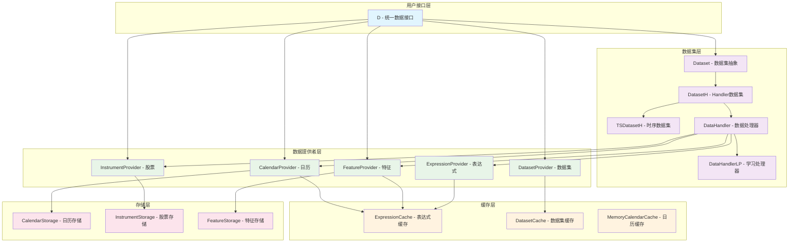
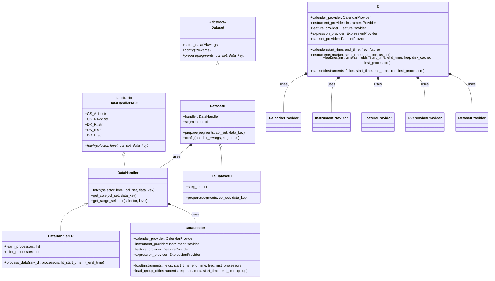
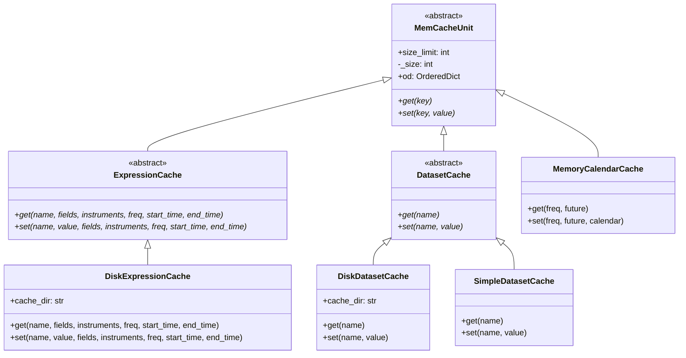
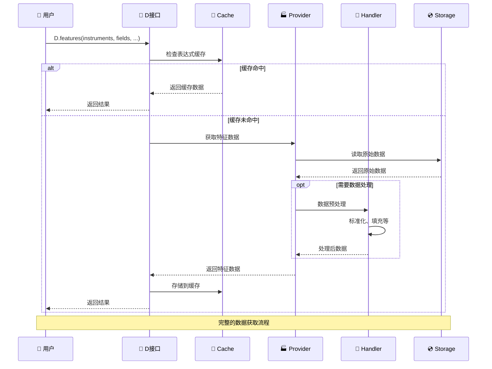
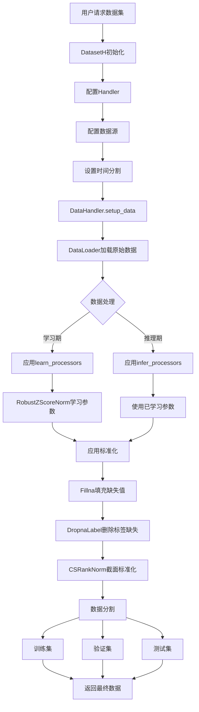
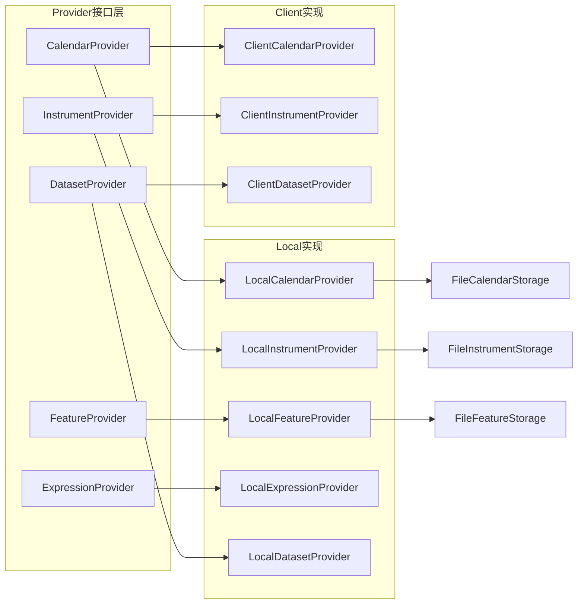
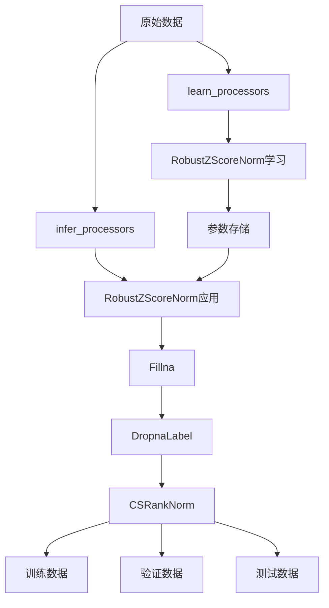

# 📊 Qlib数据模块架构解析

## 🎯 模块概述

Qlib的数据模块是一个**分层架构的数据管理系统**，专门为量化金融场景设计，提供高效、灵活、可扩展的数据处理能力。

## 🏗️ 整体架构层次



## 🔄 核心类继承关系

```mermaid
classDiagram
    %% 基础抽象类
    class BaseProvider {
        <<abstract>>
    }
    
    class ProviderBackendMixin {
        +get_default_backend()
        +backend_obj(**kwargs)
    }
    
    %% Provider抽象层
    class CalendarProvider {
        <<abstract>>
        +calendar(start_time, end_time, freq, future)
        +_get_calendar(freq, future)*
    }
    
    class InstrumentProvider {
        <<abstract>>
        +list_instruments(market, start_time, end_time, as_list)
        +_get_instruments(market)*
    }
    
    class FeatureProvider {
        <<abstract>>
        +feature(instrument, field, start_time, end_time, freq)
        +_get_feature(instrument, field, start_time, end_time, freq)*
    }
    
    class ExpressionProvider {
        <<abstract>>
        +expression(instrument, field, start_time, end_time, freq)
    }
    
    class DatasetProvider {
        <<abstract>>
        +dataset(instruments, fields, start_time, end_time, freq, inst_processors)
    }
    
    %% Local实现层
    class LocalProvider {
        +uri: str
        +backend: dict
    }
    
    class LocalCalendarProvider {
        +calendar(start_time, end_time, freq, future)
        +_get_calendar(freq, future)
    }
    
    class LocalInstrumentProvider {
        +list_instruments(market, start_time, end_time, as_list)
        +_get_instruments(market)
    }
    
    class LocalFeatureProvider {
        +feature(instrument, field, start_time, end_time, freq)
        +_get_feature(instrument, field, start_time, end_time, freq)
    }
    
    class LocalExpressionProvider {
        +expression(instrument, field, start_time, end_time, freq)
    }
    
    class LocalDatasetProvider {
        +dataset(instruments, fields, start_time, end_time, freq, inst_processors)
        +dataset_processor(instruments, fields, start_time, end_time, freq, inst_processors)
    }
    
    %% Client实现层
    class ClientProvider {
        +uri: str
    }
    
    class ClientCalendarProvider {
        +calendar(start_time, end_time, freq, future)
    }
    
    class ClientInstrumentProvider {
        +list_instruments(market, start_time, end_time, as_list)
    }
    
    class ClientDatasetProvider {
        +dataset(instruments, fields, start_time, end_time, freq, inst_processors)
    }
    
    %% 继承关系
    BaseProvider <|-- CalendarProvider
    BaseProvider <|-- InstrumentProvider
    BaseProvider <|-- FeatureProvider
    BaseProvider <|-- ExpressionProvider
    BaseProvider <|-- DatasetProvider
    
    CalendarProvider <|-- LocalCalendarProvider
    InstrumentProvider <|-- LocalInstrumentProvider
    FeatureProvider <|-- LocalFeatureProvider
    ExpressionProvider <|-- LocalExpressionProvider
    DatasetProvider <|-- LocalDatasetProvider
    
    CalendarProvider <|-- ClientCalendarProvider
    InstrumentProvider <|-- ClientInstrumentProvider
    DatasetProvider <|-- ClientDatasetProvider
    
    ProviderBackendMixin <|-- LocalProvider
    LocalProvider <|-- LocalCalendarProvider
    LocalProvider <|-- LocalInstrumentProvider
    LocalProvider <|-- LocalFeatureProvider
    LocalProvider <|-- LocalExpressionProvider
    LocalProvider <|-- LocalDatasetProvider
    
    ClientProvider <|-- ClientCalendarProvider
    ClientProvider <|-- ClientInstrumentProvider
    ClientProvider <|-- ClientDatasetProvider
```



## 📦 数据处理流程



## 💾 缓存系统架构



## 🔄 数据流转序列图



## 📊 数据集构建流程



## 🎯 关键组件功能

### 📄 D类 - 统一数据接口
```python
# 核心API设计
class D:
    @staticmethod
    def calendar(start_time, end_time, freq="day", future=False):
        """获取交易日历"""
        
    @staticmethod
    def instruments(market="all", start_time=None, end_time=None, as_list=False):
        """获取股票列表"""
        
    @staticmethod  
    def features(instruments, fields, start_time, end_time, freq="day", disk_cache=1, inst_processors=None):
        """获取特征数据"""
        
    @staticmethod
    def dataset(instruments, fields, start_time, end_time, freq="day", inst_processors=None):
        """构建完整数据集"""
```

### 🏭 Provider层设计模式



### 🔧 数据处理器配置



## 🚀 架构优势

### 1. 🔌 **高度可扩展性**
- **Provider可插拔**：支持本地文件、远程服务、数据库等多种数据源
- **Storage后端可替换**：文件系统、云存储、分布式存储
- **处理器可组合**：灵活的数据预处理管道

### 2. ⚡ **高性能优化**
- **多级缓存策略**：内存缓存 + 磁盘缓存 + 分布式缓存
- **并行处理支持**：多进程数据加载和计算
- **延迟加载机制**：按需加载减少内存占用

### 3. 🛡️ **高可靠性**
- **完善的错误处理**：异常捕获和恢复机制
- **数据一致性保证**：事务性操作和版本控制
- **向后兼容性**：API版本管理

### 4. 👥 **易用性设计**
- **统一的D接口**：一个入口访问所有数据
- **配置驱动**：通过配置文件灵活控制行为
- **丰富的文档和示例**

## 💡 使用示例

### 基础数据获取
```python
import qlib
from qlib.data import D

# 初始化qlib
qlib.init(region="cn")

# 获取交易日历
calendar = D.calendar(start_time="2020-01-01", end_time="2020-12-31")

# 获取CSI300股票列表  
instruments = D.instruments("csi300")

# 获取OHLCV数据
data = D.features(
    instruments=instruments[:10],  # 前10只股票
    fields=["$open", "$high", "$low", "$close", "$volume"],
    start_time="2020-01-01",
    end_time="2020-12-31"
)
```

### 高级数据集构建
```python
from qlib.utils import init_instance_by_config

# 配置Alpha158特征处理器
dataset_config = {
    "class": "DatasetH",
    "kwargs": {
        "handler": {
            "class": "Alpha158",
            "kwargs": {
                "start_time": "2018-01-01",
                "end_time": "2020-12-31",
                "instruments": "csi300",
                "infer_processors": [
                    {"class": "RobustZScoreNorm", "kwargs": {"clip_outlier": True}},
                    {"class": "Fillna"}
                ],
                "learn_processors": [
                    {"class": "DropnaLabel"}, 
                    {"class": "CSRankNorm"}
                ]
            }
        },
        "segments": {
            "train": ("2018-01-01", "2019-12-31"),
            "valid": ("2019-01-01", "2019-12-31"),
            "test": ("2020-01-01", "2020-12-31")
        }
    }
}

# 创建数据集实例
dataset = init_instance_by_config(dataset_config)

# 获取不同分割的数据
train_data = dataset.prepare("train")
valid_data = dataset.prepare("valid") 
test_data = dataset.prepare("test")
```

这个分层架构使得Qlib能够高效处理大规模金融时间序列数据，同时保持了良好的代码组织结构和扩展能力。🎊