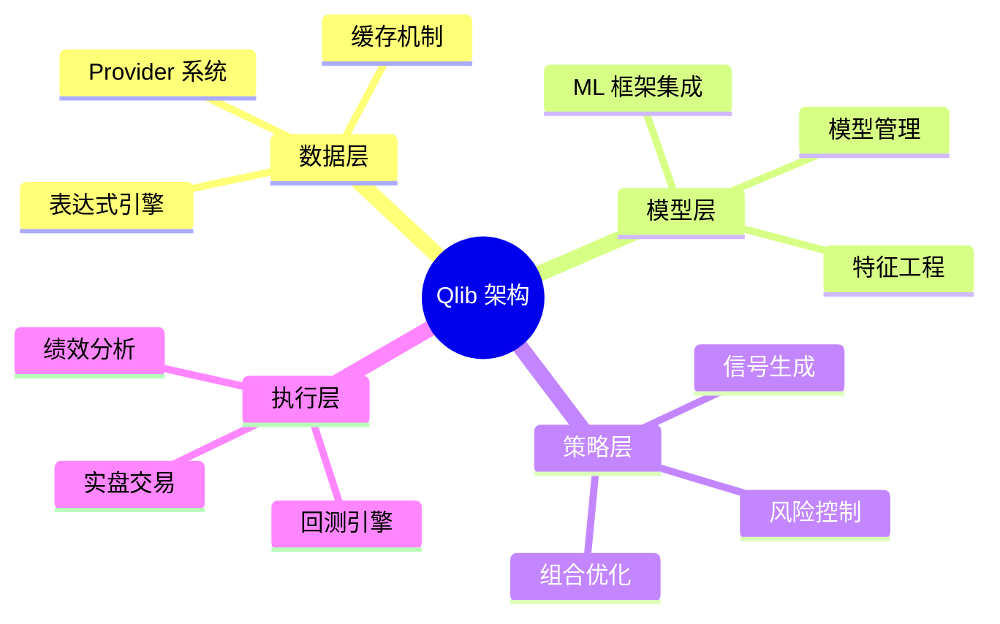
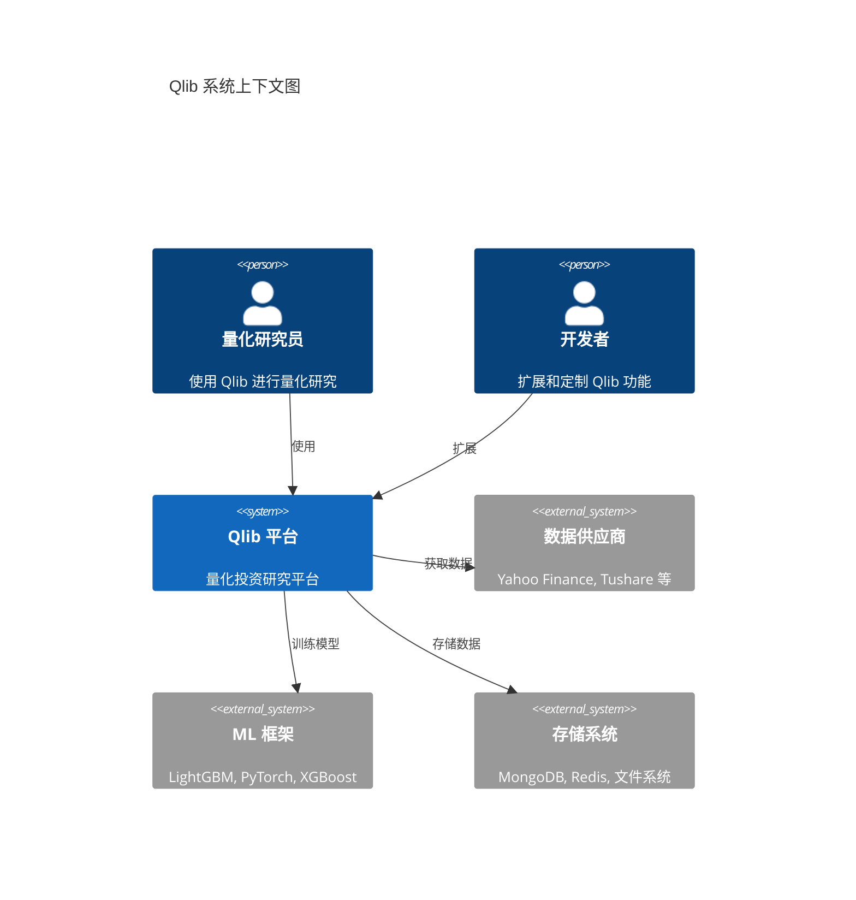
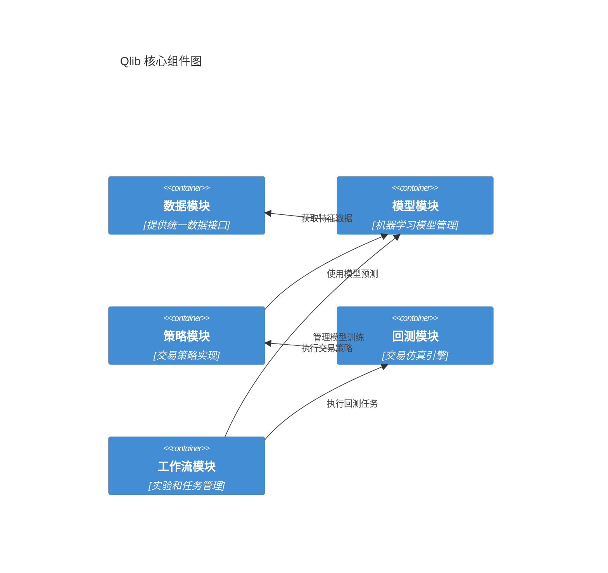

# Qlib 项目技术文档总览

## 📚 文档导航

本文档集合从多个角度深入分析了 Microsoft Qlib 量化投资研究平台的技术架构、设计理念和最佳实践。

### 🎯 阅读建议

- **快速了解**：先阅读本总览文档和 `qlib_architecture_analysis.md`
- **深入学习**：按模块顺序阅读各专题文档  
- **实践应用**：重点关注 `06_examples_and_best_practices.md`

---

## 📖 文档结构

### 1. [系统架构总览](./qlib_architecture_analysis.md)
**适用对象**：所有用户  
**核心内容**：
- Qlib 整体技术栈和架构设计
- 核心模块关系和数据流
- 系统集成和扩展机制

### 2. [数据模块深度分析](./01_data_module_analysis.md)  
**适用对象**：数据工程师、量化研究员  
**核心内容**：
- 多源数据接入和标准化
- 三级缓存架构和性能优化
- 表达式引擎和特征计算

**关键特性**：
- 🔄 统一数据接口，支持多种数据源
- ⚡ 智能缓存机制，显著提升数据访问速度
- 🧮 强大的表达式引擎，支持复杂因子计算

### 3. [模型与策略分析](./02_model_strategy_analysis.md)
**适用对象**：算法工程师、策略开发者  
**核心内容**：
- ML 模型集成框架
- 策略开发模式和最佳实践
- 模型训练和部署流程

**关键亮点**：
- 🤖 支持主流 ML 框架（LightGBM、PyTorch、XGBoost等）
- 📈 丰富的策略模板和优化算法
- 🔧 端到端的模型生命周期管理

### 4. [回测引擎剖析](./03_backtest_engine_analysis.md)
**适用对象**：策略开发者、风控人员  
**核心内容**：
- 高保真交易仿真引擎
- 账户和仓位管理系统
- 绩效分析和风险评估

**技术优势**：
- 📊 逼真的市场微观结构模拟
- 💰 精确的成本和滑点建模
- 📋 全面的绩效归因分析

### 5. [工作流与实验管理](./04_workflow_experiment_management.md)
**适用对象**：MLOps 工程师、团队协作者  
**核心内容**：
- MLflow 集成的实验追踪
- 分布式任务调度和管理
- 在线模型服务和监控

**核心价值**：
- 🔬 标准化的实验管理流程
- 🚀 支持大规模并行计算
- 📡 完整的在线服务能力

### 6. [配置系统与工具链](./05_configuration_and_tools.md)
**适用对象**：系统管理员、DevOps 工程师  
**核心内容**：
- 灵活的配置管理系统
- 丰富的命令行工具集
- 日志和监控机制

**实用工具**：
- ⚙️ 层次化配置体系
- 🛠️ 自动化脚本和工具
- 📝 完善的日志和调试支持

### 7. [使用指南与最佳实践](./06_examples_and_best_practices.md)
**适用对象**：所有用户，特别是初学者  
**核心内容**：
- 从入门到进阶的完整指南
- 生产环境部署最佳实践
- 常见问题诊断和解决方案

**实践价值**：
- 🚀 快速上手指南和代码模板
- 🏭 生产级部署和监控方案
- 🔍 问题排查和性能优化技巧

---

## 🎨 技术架构图谱

### 整体架构视图

### 核心模块关系

---

## 🛠️ 技术栈总览

| 分层 | 技术组件 | 用途说明 |
|------|----------|----------|
| **数据层** | Pandas, Numpy, Cython | 数据处理和计算加速 |
| **存储层** | MongoDB, Redis, HDF5 | 数据持久化和缓存 |
| **计算层** | LightGBM, PyTorch, XGBoost | 机器学习和深度学习 |
| **工作流** | MLflow, Joblib | 实验追踪和并行计算 |
| **服务层** | Flask, RESTful API | 在线服务和接口 |
| **工具层** | Click, PyYAML, Jinja2 | 命令行工具和配置管理 |

---

## 🚦 设计原则与模式

### 核心设计理念
1. **模块化设计**：各模块职责清晰，低耦合高内聚
2. **接口标准化**：统一的数据和模型接口，易于扩展
3. **性能优化**：多级缓存和并行计算，支持大规模数据
4. **生产就绪**：完整的监控、日志和容错机制

### 关键设计模式
- **工厂模式**：动态创建数据提供者和模型实例
- **策略模式**：可插拔的交易策略和风险控制
- **观察者模式**：事件驱动的回测和监控
- **模板方法**：标准化的实验和部署流程

---

## 📊 性能特性

| 特性 | 说明 | 性能指标 |
|------|------|----------|
| **数据访问** | 三级缓存架构 | 10x+ 速度提升 |
| **模型训练** | 并行化训练 | 支持 100+ 并发任务 |
| **回测速度** | 向量化计算 | 万级股票组合秒级回测 |
| **内存效率** | 增量加载 | GB 级数据集平稳运行 |

---

## 🌟 应用场景

### 学术研究
- 📊 因子挖掘和验证
- 🧪 策略回测和分析
- 📈 模型性能评估

### 工业应用  
- 🏭 生产级量化策略
- 🔄 实时交易系统
- 📡 在线模型服务

### 教育培训
- 📚 量化投资教学
- 💡 策略开发实践
- 🎯 竞赛和挑战

---

## 🎯 学习路径建议

### 初学者路径
1. 阅读 `qlib_architecture_analysis.md` 了解整体架构
2. 学习 `06_examples_and_best_practices.md` 快速上手
3. 深入 `01_data_module_analysis.md` 理解数据处理
4. 实践 `02_model_strategy_analysis.md` 开发策略

### 进阶路径  
1. 研读 `03_backtest_engine_analysis.md` 掌握回测原理
2. 学习 `04_workflow_experiment_management.md` 管理实验
3. 配置 `05_configuration_and_tools.md` 优化工作环境
4. 参考最佳实践进行生产部署

### 专家路径
1. 深入源码分析各模块实现细节
2. 扩展自定义数据源和模型
3. 优化性能和扩展系统功能
4. 贡献开源社区和分享经验

---

## 🔍 相关资源

- **官方文档**：https://qlib.readthedocs.io/
- **GitHub 仓库**：https://github.com/microsoft/qlib
- **论文资源**：Qlib: An AI-oriented Quantitative Investment Platform
- **社区讨论**：GitHub Issues 和 Discussions

通过本文档集合，您将全面掌握 Qlib 的技术细节和应用实践，为量化投资研究和开发奠定坚实基础。