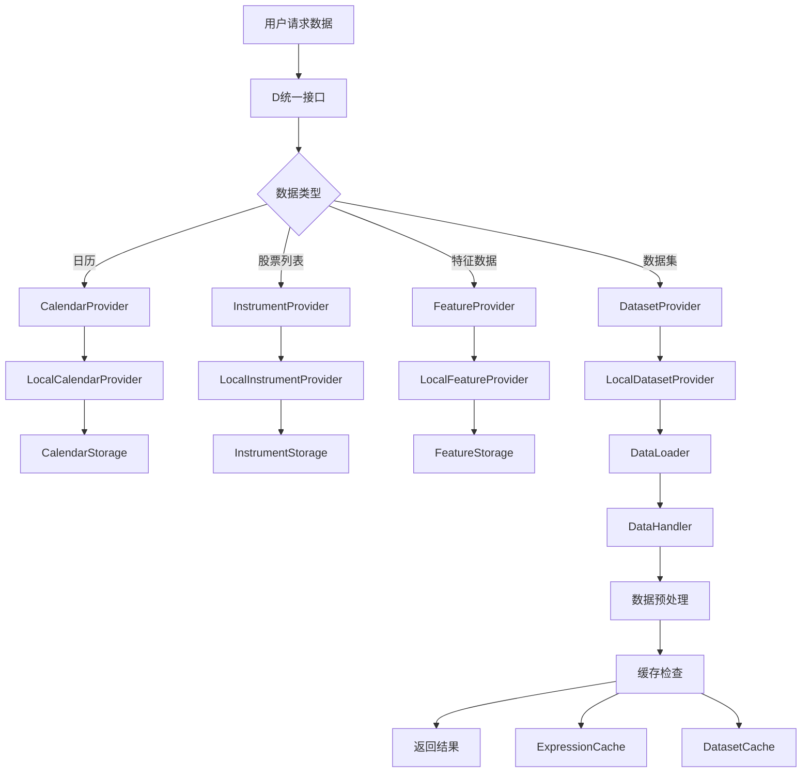

# Qlib数据模块架构解析

## 📊 Qlib Data Module 类图

```mermaid
classDiagram
    %% 基础抽象层
    class Expression {
        <<abstract>>
        +__str__()
        +__repr__()
        +__gt__(other)
        +__ge__(other)
        +__lt__(other)
        +__le__(other)
    }

    class ProviderBackendMixin {
        +get_default_backend()
        +backend_obj(**kwargs)
    }

    %% Provider抽象基类
    class BaseProvider {
        <<abstract>>
    }

    class CalendarProvider {
        <<abstract>>
        +calendar(start_time, end_time, freq, future)
        +_get_calendar(freq, future)*
    }

    class InstrumentProvider {
        <<abstract>>
        +list_instruments(market, start_time, end_time, as_list)
        +_get_instruments(market)*
    }

    class FeatureProvider {
        <<abstract>>
        +feature(instrument, field, start_time, end_time, freq)
        +_get_feature(instrument, field, start_time, end_time, freq)*
    }

    class ExpressionProvider {
        <<abstract>>
        +expression(instrument, field, start_time, end_time, freq)
    }

    class DatasetProvider {
        <<abstract>>
        +dataset(instruments, fields, start_time, end_time, freq, inst_processors)
    }

    %% Local Provider实现
    class LocalProvider {
        +uri: str
        +backend: dict
    }

    class LocalCalendarProvider {
        +calendar(start_time, end_time, freq, future)
        +_get_calendar(freq, future)
    }

    class LocalInstrumentProvider {
        +list_instruments(market, start_time, end_time, as_list)
        +_get_instruments(market)
    }

    class LocalFeatureProvider {
        +feature(instrument, field, start_time, end_time, freq)
        +_get_feature(instrument, field, start_time, end_time, freq)
    }

    class LocalExpressionProvider {
        +expression(instrument, field, start_time, end_time, freq)
    }

    class LocalDatasetProvider {
        +dataset(instruments, fields, start_time, end_time, freq, inst_processors)
        +dataset_processor(instruments, fields, start_time, end_time, freq, inst_processors)
    }

    class LocalPITProvider {
        +period_feature(instrument, field, start_time, end_time)
    }

    %% Client Provider实现
    class ClientProvider {
        +uri: str
    }

    class ClientCalendarProvider {
        +calendar(start_time, end_time, freq, future)
        +_get_calendar(freq, future)
    }

    class ClientInstrumentProvider {
        +list_instruments(market, start_time, end_time, as_list)
    }

    class ClientDatasetProvider {
        +dataset(instruments, fields, start_time, end_time, freq, inst_processors)
    }

    %% 数据处理层
    class DataHandlerABC {
        <<abstract>>
        +CS_ALL: str
        +CS_RAW: str
        +DK_R: str
        +DK_I: str
        +DK_L: str
        +fetch(selector, level, col_set, data_key)*
    }

    class DataHandler {
        +fetch(selector, level, col_set, data_key)
        +get_cols(col_set, data_key)
        +get_range_selector(selector, level)
    }

    class DataHandlerLP {
        +learn_processors: list
        +infer_processors: list
        +process_data(raw_df, processors, fit_start_time, fit_end_time)
    }

    %% 数据加载层
    class DataLoader {
        +calendar_provider: CalendarProvider
        +instrument_provider: InstrumentProvider
        +feature_provider: FeatureProvider
        +expression_provider: ExpressionProvider
        +load(instruments, fields, start_time, end_time, freq, inst_processors)
        +load_group_df(instruments, exprs, names, start_time, end_time, group)
    }

    %% 数据集层
    class Dataset {
        <<abstract>>
        +setup_data(**kwargs)
        +config(**kwargs)
        +prepare(segments, col_set, data_key)
    }

    class DatasetH {
        +handler: DataHandler
        +segments: dict
        +prepare(segments, col_set, data_key)
        +config(handler_kwargs, segments)
    }

    class TSDatasetH {
        +step_len: int
        +prepare(segments, col_set, data_key)
    }

    %% 缓存层
    class MemCacheUnit {
        <<abstract>>
        +size_limit: int
        -_size: int
        +od: OrderedDict
        +get(key)*
        +set(key, value)*
    }

    class ExpressionCache {
        <<abstract>>
        +get(name, fields, instruments, freq, start_time, end_time)*
        +set(name, value, fields, instruments, freq, start_time, end_time)*
    }

    class DatasetCache {
        <<abstract>>
        +get(name)*
        +set(name, value)*
    }

    class DiskExpressionCache {
        +cache_dir: str
        +get(name, fields, instruments, freq, start_time, end_time)
        +set(name, value, fields, instruments, freq, start_time, end_time)
    }

    class DiskDatasetCache {
        +cache_dir: str
        +get(name)
        +set(name, value)
    }

    class SimpleDatasetCache {
        +get(name)
        +set(name, value)
    }

    class MemoryCalendarCache {
        +get(freq, future)
        +set(freq, future, calendar)
    }

    %% 存储层
    class CalendarStorage {
        <<abstract>>
        +calendar(freq, future)*
    }

    class InstrumentStorage {
        <<abstract>>
        +list_instruments(market, start_time, end_time, as_list)*
    }

    class FeatureStorage {
        <<abstract>>
        +feature(instrument, field, start_time, end_time, freq)*
    }

    %% 数据统一接口
    class D {
        +calendar_provider: CalendarProvider
        +instrument_provider: InstrumentProvider
        +feature_provider: FeatureProvider
        +expression_provider: ExpressionProvider
        +dataset_provider: DatasetProvider
        +calendar(start_time, end_time, freq, future)
        +instruments(market, start_time, end_time, as_list)
        +features(instruments, fields, start_time, end_time, freq, disk_cache, inst_processors)
        +dataset(instruments, fields, start_time, end_time, freq, inst_processors)
    }

    %% 继承关系
    BaseProvider <|-- CalendarProvider
    BaseProvider <|-- InstrumentProvider  
    BaseProvider <|-- FeatureProvider
    BaseProvider <|-- ExpressionProvider
    BaseProvider <|-- DatasetProvider

    CalendarProvider <|-- LocalCalendarProvider
    InstrumentProvider <|-- LocalInstrumentProvider
    FeatureProvider <|-- LocalFeatureProvider
    ExpressionProvider <|-- LocalExpressionProvider
    DatasetProvider <|-- LocalDatasetProvider

    CalendarProvider <|-- ClientCalendarProvider
    InstrumentProvider <|-- ClientInstrumentProvider
    DatasetProvider <|-- ClientDatasetProvider

    LocalProvider <|-- LocalCalendarProvider
    LocalProvider <|-- LocalInstrumentProvider
    LocalProvider <|-- LocalFeatureProvider
    LocalProvider <|-- LocalExpressionProvider
    LocalProvider <|-- LocalDatasetProvider
    LocalProvider <|-- LocalPITProvider

    ClientProvider <|-- ClientCalendarProvider
    ClientProvider <|-- ClientInstrumentProvider
    ClientProvider <|-- ClientDatasetProvider

    ProviderBackendMixin <|-- LocalProvider
    ProviderBackendMixin <|-- LocalPITProvider

    DataHandlerABC <|-- DataHandler
    DataHandler <|-- DataHandlerLP

    Dataset <|-- DatasetH
    DatasetH <|-- TSDatasetH

    MemCacheUnit <|-- ExpressionCache
    MemCacheUnit <|-- DatasetCache
    ExpressionCache <|-- DiskExpressionCache
    DatasetCache <|-- DiskDatasetCache
    DatasetCache <|-- SimpleDatasetCache
    MemCacheUnit <|-- MemoryCalendarCache

    %% 组合关系
    D *-- CalendarProvider : uses
    D *-- InstrumentProvider : uses
    D *-- FeatureProvider : uses
    D *-- ExpressionProvider : uses
    D *-- DatasetProvider : uses

    DataHandler *-- DataLoader : uses
    DatasetH *-- DataHandler : uses
    DataLoader *-- CalendarProvider : uses
    DataLoader *-- InstrumentProvider : uses
    DataLoader *-- FeatureProvider : uses
    DataLoader *-- ExpressionProvider : uses

    LocalProvider *-- CalendarStorage : backend
    LocalProvider *-- InstrumentStorage : backend  
    LocalProvider *-- FeatureStorage : backend
```



## 📋 模块功能详解

### 🏗️ 1. 核心架构层次

#### 1.1 Provider层（数据提供者）
- **BaseProvider**: 所有数据提供者的基类
- **CalendarProvider**: 交易日历数据提供者
- **InstrumentProvider**: 股票标的数据提供者
- **FeatureProvider**: 特征数据提供者
- **ExpressionProvider**: 表达式计算提供者
- **DatasetProvider**: 数据集提供者

#### 1.2 实现层
**Local实现** (本地文件存储):
- `LocalCalendarProvider`: 本地日历数据
- `LocalInstrumentProvider`: 本地股票列表
- `LocalFeatureProvider`: 本地特征数据
- `LocalExpressionProvider`: 本地表达式计算
- `LocalDatasetProvider`: 本地数据集构建

**Client实现** (远程服务):
- `ClientCalendarProvider`: 远程日历服务
- `ClientInstrumentProvider`: 远程股票服务
- `ClientDatasetProvider`: 远程数据集服务

### 🔄 2. 数据处理流程

#### 2.1 DataHandler（数据处理器）
```python
# 数据处理流程
DataHandlerABC (抽象接口)
    ↓
DataHandler (基础实现)
    ↓
DataHandlerLP (学习处理器)
    ↓ 
具体业务处理器 (Alpha158, Alpha360等)
```

**关键方法**:
- `fetch()`: 获取处理后的数据
- `setup_data()`: 设置数据源
- `process_data()`: 数据预处理

#### 2.2 DataLoader（数据加载器）
负责从各种Provider加载原始数据并组合成DataFrame

#### 2.3 Dataset（数据集）
- `Dataset`: 抽象数据集基类
- `DatasetH`: 基于Handler的数据集实现
- `TSDatasetH`: 时间序列数据集（支持滑动窗口）

### 💾 3. 缓存系统

#### 3.1 缓存类型
- **ExpressionCache**: 表达式计算结果缓存
- **DatasetCache**: 数据集缓存
- **MemoryCalendarCache**: 内存日历缓存

#### 3.2 缓存实现
- **DiskExpressionCache**: 磁盘表达式缓存
- **DiskDatasetCache**: 磁盘数据集缓存
- **SimpleDatasetCache**: 简单内存缓存

### 💿 4. 存储后端

#### 4.1 存储接口
- **CalendarStorage**: 日历数据存储
- **InstrumentStorage**: 股票数据存储
- **FeatureStorage**: 特征数据存储

#### 4.2 存储实现
- 文件存储 (FileCalendarStorage, FileInstrumentStorage等)
- 数据库存储 (可扩展)
- 云存储 (可扩展)

### 🎯 5. 统一访问接口

#### 5.1 D类 (Data统一接口)
```python
# 使用示例
import qlib
from qlib.data import D

# 获取交易日历
calendar = D.calendar(start_time="2020-01-01", end_time="2020-12-31")

# 获取股票列表
instruments = D.instruments("csi300")

# 获取特征数据
features = D.features(
    instruments=["SH000001", "SZ399001"],
    fields=["$close", "$volume"],
    start_time="2020-01-01",
    end_time="2020-12-31"
)

# 获取数据集
dataset = D.dataset(
    instruments="csi300",
    fields=["$close", "$volume", "$high", "$low"],
    start_time="2020-01-01", 
    end_time="2020-12-31"
)
```

## 🔄 数据流转过程



## 🎯 设计优势

### 1. **分层架构**
- 清晰的职责分离
- 易于扩展和维护
- 支持多种数据源

### 2. **插件化设计**
- Provider可插拔
- Storage后端可替换
- Cache策略可配置

### 3. **高性能**
- 多级缓存机制
- 并行处理支持
- 延迟加载优化

### 4. **易用性**
- 统一的D接口
- 丰富的配置选项
- 完善的错误处理

这个架构使得Qlib能够高效处理大规模金融数据，同时保持灵活性和可扩展性。