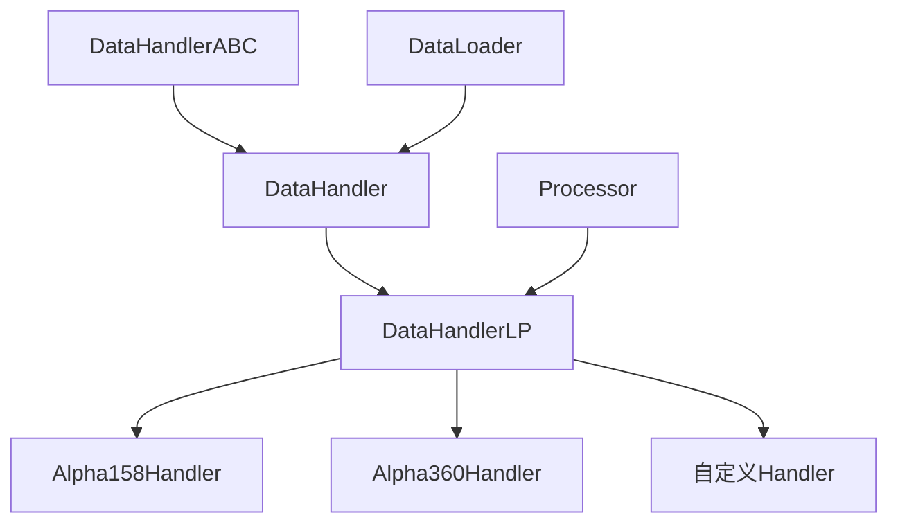
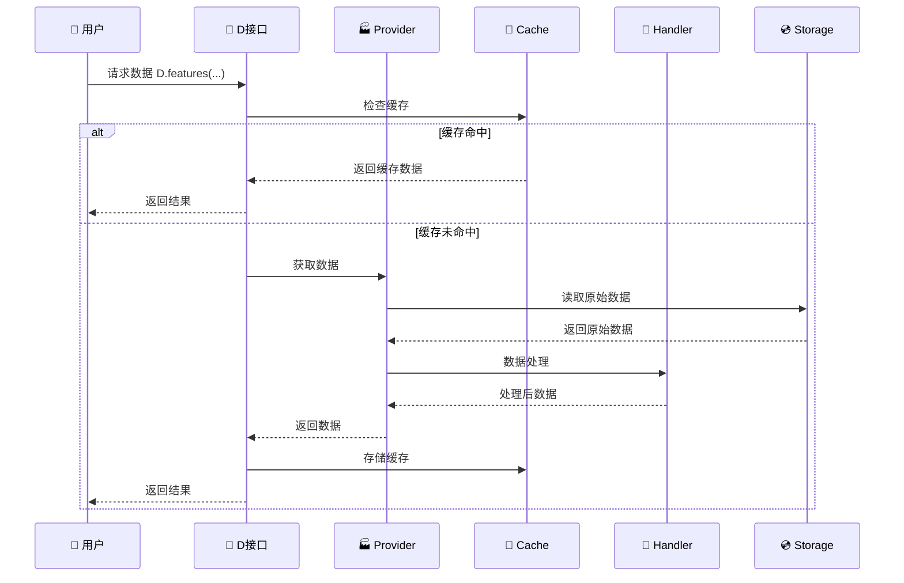

# 📊 Qlib数据模块核心架构解析

## 🎯 模块概述

Qlib的数据模块是一个**分层架构的数据管理系统**，专门为量化金融场景设计，提供高效、灵活、可扩展的数据处理能力。

## 🏗️ 核心架构层次

```
┌─────────────────────────────────────────────────────────┐
│                    用户接口层 (D)                        │
├─────────────────────────────────────────────────────────┤
│              数据集层 (Dataset/DataHandler)              │
├─────────────────────────────────────────────────────────┤
│              数据提供者层 (Provider)                     │
├─────────────────────────────────────────────────────────┤
│               缓存层 (Cache)                            │
├─────────────────────────────────────────────────────────┤
│              存储层 (Storage)                           │
└─────────────────────────────────────────────────────────┘
```

## 📋 关键组件解析

### 1. 📄 **D类 - 统一数据接口**
```python
# 作用：为用户提供简单统一的数据访问API
class D:
    # 核心功能
    calendar()     # 获取交易日历
    instruments()  # 获取股票列表  
    features()     # 获取特征数据
    dataset()      # 获取完整数据集
```

**设计亮点**：
- 🎯 **单一入口**：用户只需要记住D这一个接口
- 🔄 **自动路由**：根据请求类型自动选择合适的Provider
- ⚡ **智能缓存**：自动管理缓存策略

### 2. 🏭 **Provider层 - 数据提供者**

#### 📅 CalendarProvider (交易日历)
```python
# 功能：管理交易日历数据
LocalCalendarProvider   # 本地文件存储
ClientCalendarProvider  # 远程服务接口
```

#### 📈 InstrumentProvider (股票标的)  
```python
# 功能：管理股票标的信息
LocalInstrumentProvider   # 本地股票列表
ClientInstrumentProvider  # 远程股票服务
```

#### 📊 FeatureProvider (特征数据)
```python  
# 功能：管理原始特征数据
LocalFeatureProvider   # 本地OHLCV数据
# ClientFeatureProvider (可扩展)
```

#### 🧮 ExpressionProvider (表达式计算)
```python
# 功能：计算技术指标和衍生特征
LocalExpressionProvider  # 本地表达式引擎
```

#### 📦 DatasetProvider (数据集构建)
```python
# 功能：构建完整的机器学习数据集
LocalDatasetProvider   # 本地数据集构建
ClientDatasetProvider  # 远程数据集服务
```

### 3. 🔄 **DataHandler层 - 数据处理器**



**核心职责**：
- 📥 **数据加载**：从Provider获取原始数据
- 🔧 **数据预处理**：标准化、去噪、特征工程
- 📤 **数据输出**：提供统一的数据访问接口

#### DataHandlerLP特性
```python
class DataHandlerLP:
    learn_processors   # 学习期处理器（如标准化参数学习）
    infer_processors   # 推理期处理器（应用已学习参数）
    
    # 支持的处理器类型
    - RobustZScoreNorm  # 鲁棒Z-score标准化
    - Fillna           # 缺失值填充
    - DropnaLabel      # 删除标签缺失样本
    - CSRankNorm       # 截面排序标准化
```

### 4. 📦 **Dataset层 - 数据集管理**

```python
# 数据集层次结构
Dataset               # 抽象基类
├── DatasetH         # 基于Handler的数据集
└── TSDatasetH       # 时间序列数据集（滑动窗口）
```

**关键功能**：
- 🗂️ **数据分段**：train/valid/test分割
- 🎛️ **灵活配置**：支持各种数据处理配置
- 🔄 **延迟加载**：按需加载数据减少内存占用

### 5. 💾 **Cache层 - 缓存系统**

#### 缓存类型
```python
ExpressionCache      # 表达式计算结果缓存
├── DiskExpressionCache    # 磁盘缓存
└── MemoryExpressionCache  # 内存缓存

DatasetCache         # 数据集缓存  
├── DiskDatasetCache      # 磁盘缓存
├── SimpleDatasetCache    # 简单内存缓存
└── DatasetURICache       # URI缓存

MemoryCalendarCache  # 日历数据内存缓存
```

**缓存策略**：
- 🎯 **智能命中**：基于参数hash自动匹配
- ⏰ **过期管理**：支持TTL和版本控制
- 💿 **持久化**：重要缓存可持久化到磁盘

### 6. 💿 **Storage层 - 存储后端**

```python
# 存储接口
CalendarStorage     # 日历数据存储
InstrumentStorage   # 股票数据存储  
FeatureStorage      # 特征数据存储

# 实现类型
- FileStorage       # 文件系统存储（默认）
- DatabaseStorage   # 数据库存储（可扩展）
- CloudStorage      # 云存储（可扩展）
```

## 🔄 数据流转全过程



## 🎯 使用示例

### 基础数据获取
```python
import qlib
from qlib.data import D

# 1. 获取交易日历
calendar = D.calendar(
    start_time="2020-01-01", 
    end_time="2020-12-31",
    freq="day"
)

# 2. 获取股票列表
instruments = D.instruments("csi300")

# 3. 获取基础数据
data = D.features(
    instruments=["SH000001", "SZ000001"],
    fields=["$close", "$volume", "$high", "$low"],
    start_time="2020-01-01",
    end_time="2020-12-31"
)
```

### 高级数据集构建
```python
from qlib.data.dataset import DatasetH
from qlib.contrib.data.handler import Alpha158

# 配置数据处理器
handler_config = {
    "class": "Alpha158",
    "kwargs": {
        "start_time": "2018-01-01",
        "end_time": "2020-12-31", 
        "instruments": "csi300",
        "infer_processors": [
            {"class": "RobustZScoreNorm", "kwargs": {"clip_outlier": True}},
            {"class": "Fillna"}
        ],
        "learn_processors": [
            {"class": "DropnaLabel"},
            {"class": "CSRankNorm"}
        ]
    }
}

# 创建数据集
dataset_config = {
    "class": "DatasetH", 
    "kwargs": {
        "handler": handler_config,
        "segments": {
            "train": ("2018-01-01", "2019-12-31"),
            "valid": ("2019-01-01", "2019-12-31"), 
            "test": ("2020-01-01", "2020-12-31")
        }
    }
}

dataset = init_instance_by_config(dataset_config)

# 获取训练数据
train_data = dataset.prepare("train")
```

## 🚀 设计优势

### 1. **🔌 高度可扩展**
- Provider可插拔设计，支持多种数据源
- Storage后端可替换，支持各种存储方式
- 处理器可组合，支持复杂数据处理流程

### 2. **⚡ 高性能**
- 多级缓存策略，减少重复计算
- 并行处理支持，充分利用多核资源
- 延迟加载机制，节省内存使用

### 3. **🛡️ 高可靠性**
- 完善的错误处理和异常恢复
- 数据一致性保证
- 版本兼容性管理

### 4. **👥 易用性**
- 统一的D接口，学习成本低
- 丰富的配置选项，满足各种需求
- 详细的文档和示例

## 💡 最佳实践

1. **合理使用缓存**：对于计算密集的表达式，启用磁盘缓存
2. **数据预处理**：在Handler中配置合适的处理器链
3. **内存管理**：对于大数据集，使用TSDatasetH的滑动窗口
4. **性能优化**：合理设置并行处理参数

这个架构使得Qlib能够高效处理大规模金融时间序列数据，同时保持代码的清晰性和可维护性。🎊