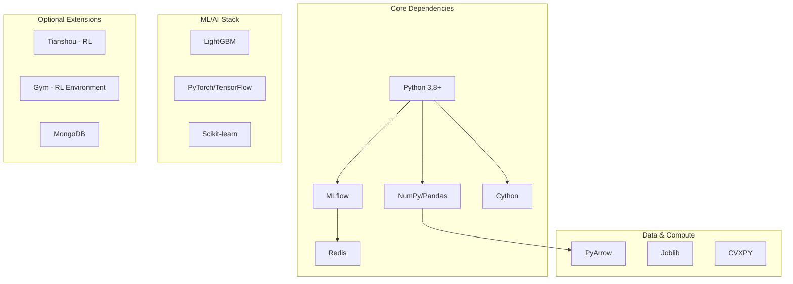
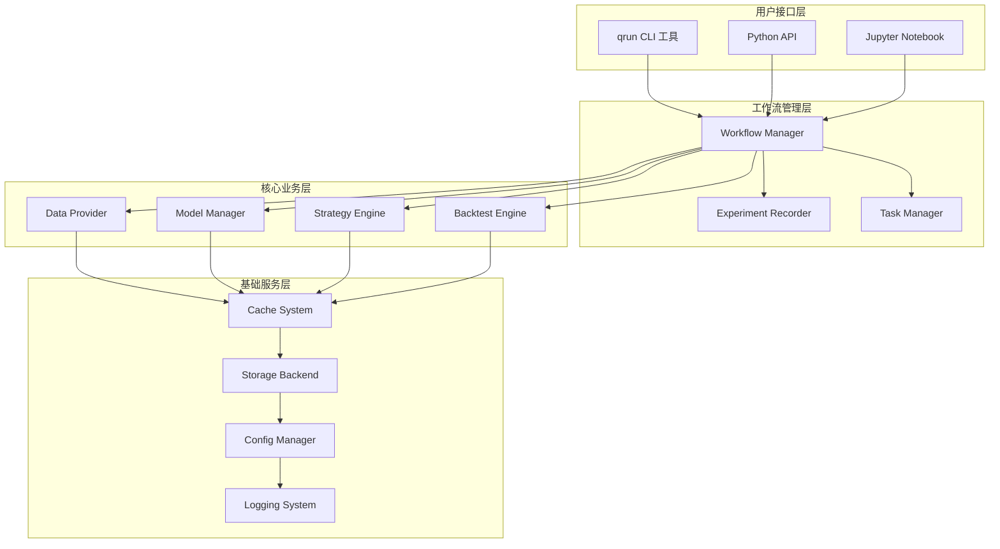
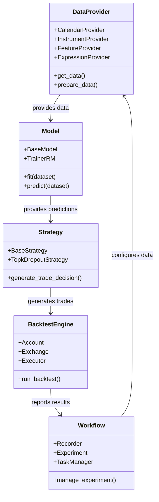
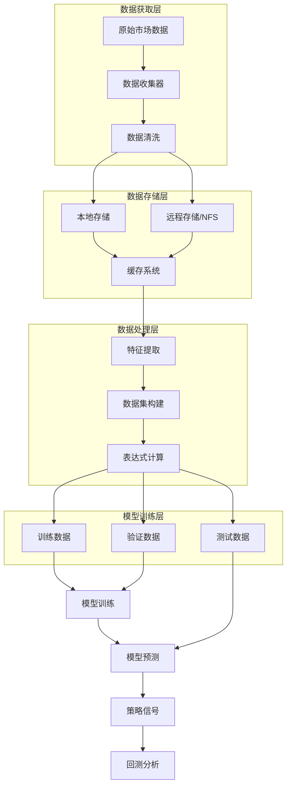
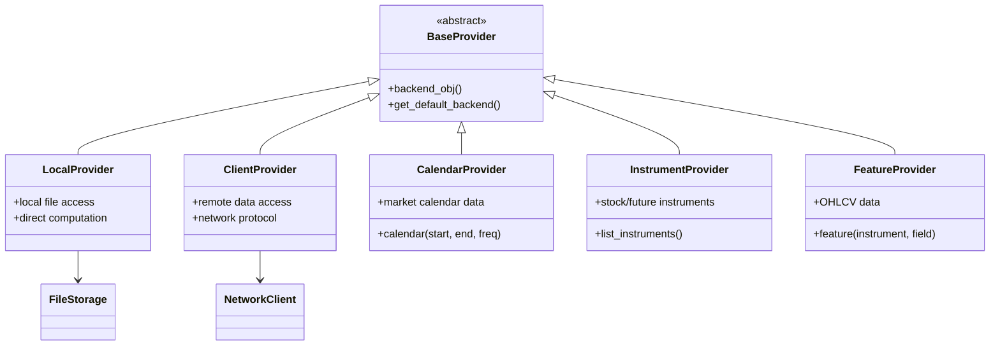
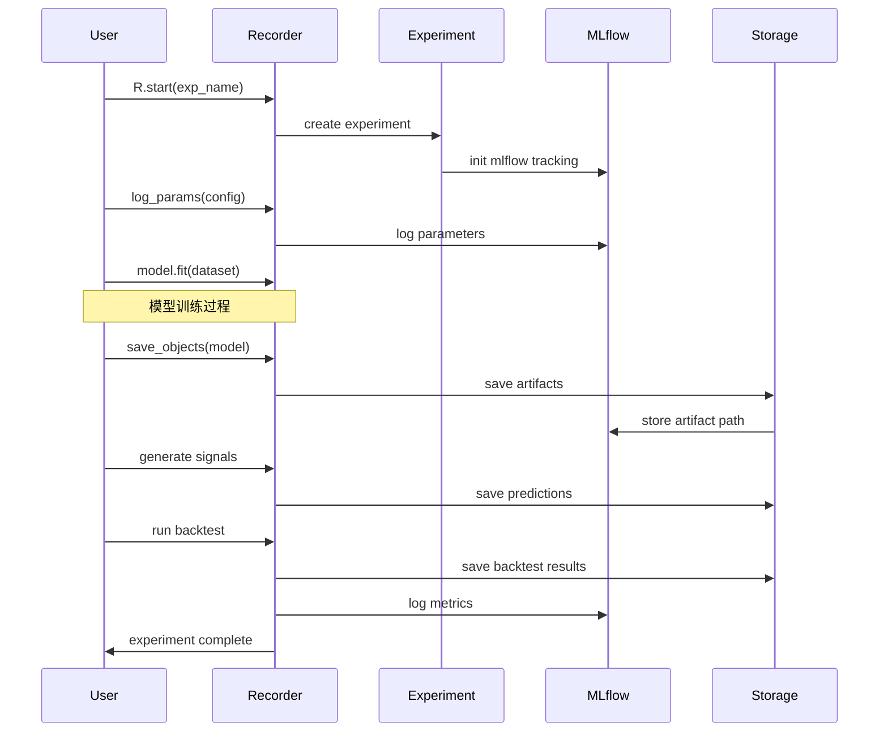
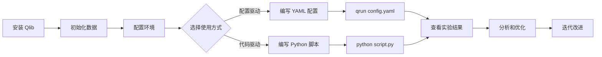

# Qlib 量化研究平台架构分析

## 项目概述

Qlib 是微软开源的量化投资研究平台，专注于提供完整的量化投资研究工作流。该平台采用模块化设计，支持配置驱动和代码驱动两种使用方式，涵盖数据获取、特征工程、模型训练、策略回测等量化研究全流程。

## 1. 技术栈分析

**技术栈说明：**
- **核心依赖**：基于 Python 生态，使用 NumPy/Pandas 进行数据处理，MLflow 做实验管理，Cython 提升性能
- **机器学习**：集成多种 ML 框架，默认支持 LightGBM，可扩展 PyTorch 等深度学习框架
- **数据处理**：PyArrow 提供高效存储，Joblib 支持并行计算
- **扩展能力**：支持强化学习（Tianshou+Gym）、分布式存储（MongoDB+Redis）

## 2. 系统整体架构

**架构层次说明：**
- **用户接口层**：提供多种交互方式，从命令行工具到编程接口，满足不同用户习惯
- **工作流管理层**：统一管理实验流程，记录实验状态和结果，支持任务调度
- **核心业务层**：实现量化研究的核心功能模块，各模块相对独立又相互协作
- **基础服务层**：提供底层支撑服务，保证系统高性能和可扩展性

## 3. 核心模块架构

**模块关系说明：**
- **DataProvider** 负责数据获取和预处理，是整个流程的起点
- **Model** 接收处理后的数据进行训练和预测，输出信号
- **Strategy** 基于模型信号制定交易策略，生成具体交易决策
- **BacktestEngine** 模拟交易执行过程，评估策略效果
- **Workflow** 统筹整个流程，记录和管理实验过程

## 4. 数据流架构

**数据流说明：**
- **数据获取**：支持多源数据接入，包括股票、期货等金融数据
- **存储架构**：采用多层存储策略，本地存储+远程存储+缓存，提升访问效率
- **处理流程**：特征工程 → 数据集构建 → 表达式计算，支持复杂的金融指标计算
- **应用层面**：数据最终流向模型训练和策略回测，形成完整的研究闭环

## 5. Provider 架构模式

**Provider 模式说明：**
- **基类抽象**：BaseProvider 定义统一接口，支持本地和远程两种访问模式
- **职责分离**：不同 Provider 负责不同类型的数据，CalendarProvider 处理交易日历，FeatureProvider 处理 OHLCV 数据
- **存储抽象**：通过 backend_obj 方法抽象存储后端，可以灵活切换存储方式
- **扩展性**：新增数据源只需实现对应 Provider，符合开闭原则

## 6. 实验管理架构

**实验管理说明：**
- **生命周期管理**：从实验创建到结束的完整生命周期跟踪
- **参数记录**：自动记录模型配置、超参数等关键信息
- **产物管理**：统一管理模型文件、预测结果、回测报告等实验产物
- **可复现性**：基于 MLflow 确保实验的可追溯和可复现

## 7. 快速入门流程

**入门流程说明：**
- **环境准备**：通过 pip 安装，自动下载样例数据
- **使用选择**：支持 YAML 配置文件和 Python 代码两种方式
- **执行方式**：qrun 命令行工具或直接运行 Python 脚本
- **结果分析**：集成的可视化和分析工具帮助理解实验结果

## 8. 设计模式分析

### 8.1 工厂模式
通过 `init_instance_by_config` 动态创建对象实例，支持配置驱动的组件实例化。

### 8.2 策略模式  
不同的交易策略(TopkDropoutStrategy等)实现统一的策略接口，支持策略的灵活切换。

### 8.3 观察者模式
Recorder 观察并记录整个实验过程，实现实验状态的统一管理。

### 8.4 适配器模式
Provider 系统适配不同的数据源和存储后端，提供统一的数据访问接口。

## 9. 核心优势

1. **模块化设计**：各模块职责清晰，低耦合高内聚，易于扩展和维护
2. **配置驱动**：支持 YAML 配置，降低使用门槛，提高复用性
3. **实验管理**：集成 MLflow，提供完整的实验生命周期管理
4. **性能优化**：使用 Cython 加速计算，多层缓存提升数据访问效率
5. **生态兼容**：兼容主流机器学习框架，支持自定义扩展

## 10. 扩展建议

1. **分布式计算**：可考虑集成 Dask 或 Ray 支持大规模数据处理
2. **实时交易**：增加实时数据接口和交易执行模块
3. **可视化增强**：开发 Web 界面提供更友好的交互体验
4. **云原生**：支持容器化部署和 Kubernetes 编排

---

*本文档基于 Qlib 源代码分析生成，涵盖了系统的核心架构、设计模式和使用流程，为理解和使用 Qlib 提供技术参考。*