# Tidy3D网格系统架构分析

## 目录

- [1. 概述](#1-概述)
- [2. 类图](#2-类图)
- [3. 核心架构分析](#3-核心架构分析)
  - [3.1 Tidy3dBaseModel - 基础模型类](#31-tidy3dbasemodel---基础模型类)
  - [3.2 GridSpec1d - 一维网格规范抽象类](#32-gridspec1d---一维网格规范抽象类)
  - [3.3 Mesher - 网格生成器抽象类](#33-mesher---网格生成器抽象类)
- [4. 具体网格类型详解](#4-具体网格类型详解)
  - [4.1 UniformGrid - 均匀网格](#41-uniformgrid---均匀网格)
  - [4.2 CustomGrid系列 - 自定义网格](#42-customgrid系列---自定义网格)
  - [4.3 AutoGrid - 自动网格](#43-autogrid---自动网格)
  - [4.4 GradedMesher - 梯度网格生成器](#44-gradedmesher---梯度网格生成器)
- [5. 网格数据结构](#5-网格数据结构)
  - [5.1 Coords - 坐标系统](#51-coords---坐标系统)
  - [5.2 Grid - 完整网格系统](#52-grid---完整网格系统)
  - [5.3 YeeGrid - Yee网格布局](#53-yeegrid---yee网格布局)
  - [5.4 FieldGrid - 场网格](#54-fieldgrid---场网格)
- [6. 设计模式与架构优势](#6-设计模式与架构优势)
  - [6.1 策略模式](#61-策略模式)
  - [6.2 模板方法模式](#62-模板方法模式)
  - [6.3 抽象工厂模式](#63-抽象工厂模式)
  - [6.4 组合模式](#64-组合模式)
- [7. 关键技术特性](#7-关键技术特性)
  - [7.1 自适应网格生成](#71-自适应网格生成)
  - [7.2 几何感知网格](#72-几何感知网格)
  - [7.3 性能优化](#73-性能优化)
  - [7.4 数值稳定性](#74-数值稳定性)
- [8. 实际应用场景](#8-实际应用场景)
  - [8.1 光子晶体仿真](#81-光子晶体仿真)
  - [8.2 波导器件设计](#82-波导器件设计)
  - [8.3 超材料建模](#83-超材料建模)
  - [8.4 大规模器件仿真](#84-大规模器件仿真)
- [9. 总结](#9-总结)

## 1. 概述

Tidy3D是一款高性能的电磁仿真软件，其网格系统是整个仿真引擎的核心组件。本文深入分析Tidy3D网格系统的架构设计，包括核心类结构、继承关系、设计模式和关键技术特性，以帮助开发者和用户更好地理解和使用这一系统。

网格系统的主要功能包括：

- 生成适合FDTD算法的结构化网格
- 支持多种网格类型（均匀、自定义、自适应）
- 实现Yee网格布局以确保数值稳定性
- 提供高效的网格数据结构和操作接口

## 2. 类图

以下类图展示了Tidy3D网格系统的核心类及其关系：

```mermaid
classDiagram
    class Tidy3dBaseModel {
        +dict() dict
        +json() str
        +copy() Self
        +validate() Self
    }
    
    class GridSpec {
        +grid_x GridType
        +grid_y GridType
        +grid_z GridType
        +wavelength float
        +override_structures tuple[StructureType, ...]
        +snapping_points tuple[CoordinateOptional, ...]
        +layer_refinement_specs tuple[LayerRefinementSpec, ...]
    }
    
    class GridSpec1d {
        <<abstract>>
        +make_coords() Coords1D
        +_make_coords_initial()* Coords1D
        +estimated_min_dl()* float
        +_add_pml_to_bounds() Coords1D
        +_postprocess_unaligned_grid() Coords1D
    }
    
    class GridRefinement {
        +refinement_factor Optional[float]
        +dl Optional[float]
        +num_cells int
        +_refinement_factor property
        +_grid_size property
        +override_structure() MeshOverrideStructure
    }
    
    class CornerFinderSpec {
        +medium Literal["metal", "dielectric", "all"]
        +angle_threshold float
        +distance_threshold Optional[float]
        +concave_resolution Optional[int]
        +convex_resolution Optional[int]
        +mixed_resolution Optional[int]
        +_no_min_dl_override property
        +_merged_pec_on_plane() list[tuple[Any, Shapely]]
        +_corners_and_convexity() tuple[ArrayFloat2D, ArrayFloat1D]
        +corners() ArrayFloat2D
        +_filter_collinear_vertices() tuple[ArrayFloat2D, ArrayFloat1D]
    }
    
    class LayerRefinementSpec {
        +axis Axis
        +min_steps_along_axis int
        +bounds_refinement Optional[GridRefinement]
        +bounds_snapping Literal["bounds", "lower", "upper", "center"]
        +corner_finder Optional[CornerFinderSpec]
        +corner_snapping bool
        +corner_refinement Optional[GridRefinement]
        +refinement_inside_sim_only bool
        +gap_meshing_iters int
        +dl_min_from_gap_width bool
        +from_layer_bounds() LayerRefinementSpec
        +from_bounds() LayerRefinementSpec
        +from_structures() LayerRefinementSpec
    }
    
    class UniformGrid {
        +dl PositiveFloat
        +_make_coords_initial() Coords1D
        +estimated_min_dl() float
    }
    
    class CustomGridBoundaries {
        +coords Coords1D
        +_make_coords_initial() Coords1D
        +estimated_min_dl() float
    }
    
    class CustomGrid {
        +dl tuple[PositiveFloat, ...]
        +custom_offset float
        +_make_coords_initial() Coords1D
        +estimated_min_dl() float
    }
    
    class AbstractAutoGrid {
        <<abstract>>
        +max_scale float
        +mesher MesherType
        +dl_min NonNegativeFloat
        +_preprocessed_structures()* list[StructureType]
        +_dl_collapsed_axis()* float
        +_dl_min* float
        +_min_steps_per_wvl* float
        +_dl_max()* float
    }
    
    class AutoGrid {
        +min_steps_per_wvl NonNegativeInt
        +_preprocessed_structures() list[StructureType]
        +_dl_collapsed_axis() float
        +_dl_min float
        +_min_steps_per_wvl float
        +_dl_max() float
    }
    
    class QuasiUniformGrid {
        +dl PositiveFloat
        +_preprocessed_structures() list[StructureType]
        +_dl_collapsed_axis() float
        +_dl_min float
        +_min_steps_per_wvl float
        +_dl_max() float
    }
    
    class Mesher {
        +parse_structures()* tuple[ArrayFloat1D, ArrayFloat1D]
        +insert_snapping_points()* tuple[ArrayFloat1D, ArrayFloat1D]
        +make_grid_multiple_intervals()* list[ArrayFloat1D]
        +structure_step() ArrayFloat1D
        +make_shapely_box() shapely_box
    }
    
    class GradedMesher {
        +insert_snapping_points() tuple[ArrayFloat1D, ArrayFloat1D]
        +parse_structures() tuple[ArrayFloat1D, ArrayFloat1D]
        +insert_bbox() dict[str, list]
        +reorder_structures() tuple[int, list[StructureType]]
        +structure_steps() ArrayFloat1D
        +grid_grow_decrease_in_interval() ArrayFloat1D
        +grid_multiple_interval_analy_refinement() tuple[ArrayFloat1D, ArrayFloat1D]
        +filter_structures_effective_dl() list[StructureType]
    }
    
    class Coords {
        +x Coords1D
        +y Coords1D
        +z Coords1D
        +to_dict property
        +to_list property
        +cell_sizes SpatialDataArray
        +cell_size_meshgrid property
        +spatial_interp() SpatialDataArray
        +_interp_from_xarray() Union[SpatialDataArray, ScalarFieldDataArray]
        +_interp_from_unstructured() SpatialDataArray
    }
    
    class FieldGrid {
        +x Coords
        +y Coords
        +z Coords
    }
    
    class YeeGrid {
        +E FieldGrid
        +H FieldGrid
        +grid_dict property
    }
    
    class Grid {
        +boundaries Coords
        +centers Coords
        +sizes Coords
        +num_cells tuple[int, int, int]
        +min_size property
        +max_size property
        +info property
        +_primal_steps property
        +_dual_steps property
        +yee YeeGrid
        +discretize_inds() list[tuple[int, int]]
        +_avg() ArrayFloat1D
        +_min() ArrayFloat1D
        +_yee_e() Coords
        +_yee_h() Coords
        +extended_subspace() Coords1D
        +__getitem__() Coords
    }
    
    %% 继承关系
    Tidy3dBaseModel <|-- GridSpec1d
    Tidy3dBaseModel <|-- GridSpec
    Tidy3dBaseModel <|-- Mesher
    Tidy3dBaseModel <|-- Coords
    Tidy3dBaseModel <|-- FieldGrid
    Tidy3dBaseModel <|-- YeeGrid
    Tidy3dBaseModel <|-- Grid
    Tidy3dBaseModel <|-- GridRefinement
    Tidy3dBaseModel <|-- CornerFinderSpec
    Box <|-- LayerRefinementSpec
    
    GridSpec1d <|-- UniformGrid
    GridSpec1d <|-- CustomGridBoundaries
    GridSpec1d <|-- CustomGrid
    GridSpec1d <|-- AbstractAutoGrid
    
    AbstractAutoGrid <|-- AutoGrid
    AbstractAutoGrid <|-- QuasiUniformGrid
    
    Mesher <|-- GradedMesher
    
    %% 组合关系
    Grid *-- Coords
    Grid *-- YeeGrid
    YeeGrid *-- FieldGrid
    FieldGrid *-- Coords
    AbstractAutoGrid *-- Mesher
    AutoGrid *-- GradedMesher
    QuasiUniformGrid *-- GradedMesher
    GridSpec *-- GridSpec1d
```

## 3. 核心架构分析

### 3.1 Tidy3dBaseModel - 基础模型类

`Tidy3dBaseModel` 是所有网格相关类的基础，提供了：

- **数据验证**：基于 Pydantic 的自动数据验证
- **序列化支持**：JSON 序列化和反序列化
- **不可变性**：确保对象创建后的数据一致性
- **类型安全**：静态类型检查支持

### 3.2 GridSpec1d - 一维网格规范抽象类

`GridSpec1d` 定义了一维网格生成的统一接口：

**核心方法**：

- `make_coords`：生成网格边界坐标的主入口
- `_make_coords_initial`：抽象方法，子类实现具体的网格生成逻辑
- `estimated_min_dl`：估算最小网格尺寸

**设计特点**：

- 使用模板方法模式，定义网格生成的标准流程
- 支持对称性处理和 PML 层添加
- 提供网格后处理功能

**核心目的**：

- **生成Coords1D结构的数据**，这些数据代表了网格的边界坐标

各种网格类型（如UniformGrid、CustomGrid、AutoGrid等）都是GridSpec1d的具体实现，它们通过不同的策略生成Coords1D数据：

- **UniformGrid**：生成均匀分布的网格边界坐标
- **CustomGrid**：根据用户定义的网格单元尺寸生成网格边界坐标
- **CustomGridBoundaries**：直接使用用户提供的自定义边界坐标
- **AutoGrid**：根据材料属性和波长自动生成非均匀网格边界坐标
- **QuasiUniformGrid**：生成准均匀的网格边界坐标，但会在特定位置进行局部调整

这些实现类的主要区别在于它们如何计算和生成Coords1D数据，这些数据最终被用于构建完整的网格系统。

### 3.3 GridSpec - 三维网格规范类

`GridSpec` 是整个网格系统的核心类，它组合了三个维度的网格规范：

**核心属性**：

- `grid_x`、`grid_y`、`grid_z`：三个维度的网格规范，类型为 `GridType`，默认为 `AutoGrid`
- `wavelength`：用于自动非均匀网格的自由空间波长
- `override_structures`：用于网格生成过程中添加额外的结构，以调整网格细化程度
- `snapping_points`：强制网格边界通过特定点的坐标集合
- `layer_refinement_specs`：用于层状结构的网格细化规范

**设计特点**：

- 灵活组合不同类型的一维网格规范，支持混合使用均匀和非均匀网格
- 提供波长参数用于自动网格生成，确保足够的空间分辨率
- 支持通过额外结构和捕捉点微调网格生成
- 专门针对层状结构提供优化的网格细化机制

**核心作用**：

- 作为整个网格系统的配置中心，协调三个维度的网格生成
- 为仿真提供统一的网格接口，简化用户配置
- 支持高级网格优化功能，平衡计算精度和效率

### 3.4 Mesher - 网格生成器抽象类

`Mesher` 定义了自动网格生成的核心接口：

**抽象方法**：

- `parse_structures`：解析结构并计算边界位置
- `insert_snapping_points`：插入捕捉点
- `make_grid_multiple_intervals`：在多个区间内创建网格

## 4. 具体网格类型详解

### 4.1 UniformGrid - 均匀网格

`UniformGrid` 是最简单的网格类型：

**核心属性**：

- `dl`：网格尺寸，必须为正数

**特点**：

- 生成等间距的网格点
- 计算简单，性能优异
- 适用于均匀介质的仿真

### 4.2 CustomGrid系列 - 自定义网格

#### CustomGridBoundaries

- 直接指定网格边界坐标
- 提供最大的灵活性
- 适用于特殊几何结构

#### CustomGrid

- 指定网格尺寸列表
- 支持自定义偏移
- 在仿真中心周围生成网格

### 4.3 AutoGrid - 自动网格

`AutoGrid` 是最智能的网格类型：

**核心属性**：

- `min_steps_per_wvl`：每波长最小步数
- `max_scale`：相邻网格尺寸的最大比例
- `mesher`：网格生成器
- `dl_min`：网格尺寸下界

**工作原理**：

1. 分析仿真中的所有结构
2. 根据介质属性计算所需的网格密度
3. 使用梯度网格算法生成非均匀网格
4. 在高折射率区域自动加密网格

### 4.4 GradedMesher - 梯度网格生成器

`GradedMesher` 实现了智能的非均匀网格生成：

**核心算法**：

1. 结构解析：分析所有结构的边界框
2. 区间划分：根据结构边界创建网格区间
3. 尺寸计算：为每个区间计算最大允许的网格尺寸
4. 梯度控制：确保相邻网格尺寸变化平滑

**核心方法**：

- `parse_structures`：解析结构列表，生成网格间隔坐标和每个间隔的最大步长
- `insert_bbox`：确定结构边界框坐标的插入位置
- `reorder_structures`：重新排序结构列表，优先处理无阴影覆盖结构和强制覆盖结构
- `filter_structures_effective_dl`：过滤掉指定轴上 `dl` 为 None 的结构
- `grid_grow_decrease_in_interval`：在区间内生成单调增长或减小的网格步长序列
- `grid_multiple_interval_analy_refinement`：在多个连接区间中创建网格步长，支持分析细化

**高级特性**：

- 支持结构包含关系处理
- 实现捕捉点功能
- 处理强制网格覆盖
- 优化计算复杂度

### 4.5 GridRefinement - 网格细化规范

`GridRefinement` 定义了局部网格细化的规范：

**核心属性**：

- `refinement_factor`：网格细化因子，用于在真空中细化网格步长
- `dl`：细化区域的网格步长
- `num_cells`：细化区域的网格单元数量，默认为3

**工作原理**：

1. 如果同时定义了 `refinement_factor` 和 `dl`，则网格步长由两者中较小的值决定
2. 如果两者都未定义，则使用默认的细化因子（2）
3. 生成覆盖结构，用于在网格生成过程中实现局部细化

**核心方法**：

- `_refinement_factor`：获取内部应用的细化因子
- `_grid_size`：计算细化区域的网格步长
- `override_structure`：生成用于网格细化的覆盖结构

### 4.6 LayerRefinementSpec - 层状结构网格细化规范

`LayerRefinementSpec` 继承自 `Box`，专门用于层状结构的自动网格细化和捕捉：

**核心属性**：

- `axis`：层的法线轴（0,1,2对应x,y,z）
- `min_steps_along_axis`：沿轴方向的最小步数
- `bounds_refinement`：层边界附近的网格细化规范
- `bounds_snapping`：层边界处的网格捕捉方式（"bounds", "lower", "upper", "center"）
- `corner_finder`：平面内角点检测规范
- `corner_snapping`：是否在角点处放置网格捕捉点
- `corner_refinement`：角点周围的网格细化规范
- `refinement_inside_sim_only`：是否仅在仿真域内应用网格细化
- `gap_meshing_iters`：解析薄间隙的递归迭代次数
- `dl_min_from_gap_width`：是否在确定 `dl_min` 时考虑自动检测到的最小PEC间隙宽度

**工作原理**：

1. 在层的中间平面上执行角点检测
2. 在检测到的角点处应用网格捕捉和细化
3. 在层边界处应用网格捕捉和细化
4. 自动处理薄间隙，确保足够的网格分辨率

**核心方法**：

- `from_layer_bounds`：从层边界构造 `LayerRefinementSpec` 对象
- `from_bounds`：从最小和最大坐标边界构造 `LayerRefinementSpec` 对象
- `from_structures`：从结构列表构造 `LayerRefinementSpec` 对象

### 4.7 CornerFinderSpec - 角点检测规范

`CornerFinderSpec` 用于在二维平面上检测结构的角点：

**核心属性**：

- `medium`：指定要检测角点的材料类型（"metal"、"dielectric"、"all"）
- `angle_threshold`：角点检测的角度阈值，顶点的两条边之间的角度必须大于此阈值的补角才被视为角点
- `distance_threshold`：基于Douglas-Peucker算法的距离阈值，如果顶点到相邻顶点的距离低于此阈值，则不被视为角点
- `concave_resolution`：凹区域分辨率，指定基于凹特征确定 `dl_min` 的步数
- `convex_resolution`：凸区域分辨率，指定基于凸特征确定 `dl_min` 的步数
- `mixed_resolution`：混合区域分辨率，指定基于混合特征确定 `dl_min` 的步数

**工作原理**：

1. 在指定的二维平面上合并相同材料类型的几何体
2. 对合并后的几何体进行多边形提取
3. 分析多边形的顶点，根据角度和距离阈值过滤出角点
4. 确定每个角点的凸凹性质
5. 根据凸凹区域分辨率确定最小步长

**核心方法**：

- `_merged_pec_on_plane`：在二维平面上合并PEC材料的几何体
- `_corners_and_convexity`：计算角点坐标和凸凹性
- `corners`：获取指定平面上结构的角点坐标
- `_filter_collinear_vertices`：过滤多边形中的共线顶点，返回角点位置和凸凹性信息

## 5. 网格数据结构

### 5.1 Coords - 坐标系统

`Coords` 存储三维坐标信息：

**核心功能**：

- 存储 x、y、z 方向的坐标数组
- 计算网格单元尺寸
- 提供空间插值功能
- 支持非结构化网格插值

**核心方法**：

- `to_dict`：将坐标转换为字典
- `to_list`：将坐标转换为列表
- `cell_sizes`：计算网格单元尺寸
- `cell_size_meshgrid`：生成网格单元尺寸的多维网格
- `spatial_interp`：对空间数据进行插值，支持结构化和非结构化网格数据
- `_interp_from_xarray`：从 xarray 数据进行插值
- `_interp_from_unstructured`：从非结构化网格数据进行插值

### 5.2 Grid - 完整网格系统

`Grid` 是最终的网格表示：

**核心属性**：

- `boundaries`：网格边界坐标
- `centers`：网格中心坐标
- `sizes`：网格单元尺寸
- `num_cells`：三个方向上的网格单元数量
- `min_size`：最小网格尺寸
- `max_size`：最大网格尺寸
- `info`：网格统计信息
- `_primal_steps`：原始步长
- `_dual_steps`：对偶步长
- `yee`：Yee 网格布局

**重要方法**：

- `discretize_inds`：将几何体离散化为网格索引
- `_avg`：计算一维坐标的平均位置
- `_min`：返回一维坐标的最小值
- `_yee_e`：计算电场 Yee 网格位置
- `_yee_h`：计算磁场 Yee 网格位置
- `extended_subspace`：获取扩展子空间
- `__getitem__`：通过键快速获取网格元素

### 5.3 YeeGrid - Yee网格布局

`YeeGrid` 实现 FDTD 的 Yee 网格：

**核心属性**：

- `E`：电场网格（FieldGrid 类型）
- `H`：磁场网格（FieldGrid 类型）
- `grid_dict`：网格字典属性

**设计原理**：

- 电场和磁场分量在空间上交错排列
- 确保 Maxwell 方程的数值稳定性
- 支持各种场分量的精确定位

### 5.4 FieldGrid - 场网格

`FieldGrid` 用于存储单个场的网格数据：

**核心属性**：

- `x`：x 方向的坐标（Coords 类型）
- `y`：y 方向的坐标（Coords 类型）
- `z`：z 方向的坐标（Coords 类型）

**功能特点**：

- 为单个场分量（如 Ex、Ey、Ez、Hx、Hy、Hz）提供网格位置
- 支持场分量在 Yee 网格上的精确定位
- 与 YeeGrid 配合使用，构建完整的 FDTD 网格系统

## 6. 设计模式与架构优势

### 6.1 策略模式

- 不同的网格生成策略（均匀、自定义、自动）
- 可以根据仿真需求灵活选择
- 易于扩展新的网格类型

### 6.2 模板方法模式

- GridSpec1d.make_coords() 定义标准流程
- 子类实现具体的网格生成逻辑
- 确保一致的处理流程（对称性、PML 等）

### 6.3 抽象工厂模式

- Mesher 抽象类定义网格生成接口
- 不同的 Mesher 实现不同的算法
- 支持算法的热插拔

### 6.4 组合模式

- Grid 组合多个 Coords 对象
- YeeGrid 组合电场和磁场网格
- 层次化的数据结构

## 7. 关键技术特性

### 7.1 自适应网格生成

- 根据介质属性自动调整网格密度
- 在高折射率区域自动加密
- 平滑的网格尺寸过渡

### 7.2 几何感知网格

- 分析结构边界自动生成网格
- 处理复杂的几何包含关系
- 支持网格捕捉点功能

### 7.3 性能优化

- 使用空间索引（STRtree）加速几何查询
- 智能的结构过滤和排序
- 最小化不必要的计算

### 7.4 数值稳定性

- Yee 网格确保 FDTD 算法稳定性
- 网格尺寸比例控制
- 边界条件的正确处理

## 8. 实际应用场景

### 8.1 光子晶体仿真

- 使用 AutoGrid 自动处理周期性结构
- 在高折射率对比区域自动加密网格
- 确保布拉格散射的准确计算

### 8.2 波导器件设计

- 使用 QuasiUniformGrid 在传播方向保持均匀
- 在横向使用自适应网格
- 优化模式计算精度

### 8.3 超材料建模

- 使用 CustomGrid 精确控制亚波长结构
- 处理复杂的多尺度几何
- 平衡计算精度和效率

### 8.4 大规模器件仿真

- 使用梯度网格减少总网格数
- 在关键区域保持高精度
- 优化内存使用和计算时间

## 9. 总结

Tidy3D 的网格系统展现了优秀的软件架构设计：

1. **模块化设计**：清晰的职责分离，每个类都有明确的功能
2. **可扩展性**：通过抽象类和接口支持新功能的添加
3. **性能优化**：智能算法和数据结构确保高效计算
4. **用户友好**：从简单的均匀网格到复杂的自适应网格，满足不同需求
5. **数值可靠**：基于成熟的 FDTD 理论，确保仿真精度

这个网格系统不仅是 Tidy3D 仿真引擎的核心组件，也是现代科学计算软件设计的优秀范例。