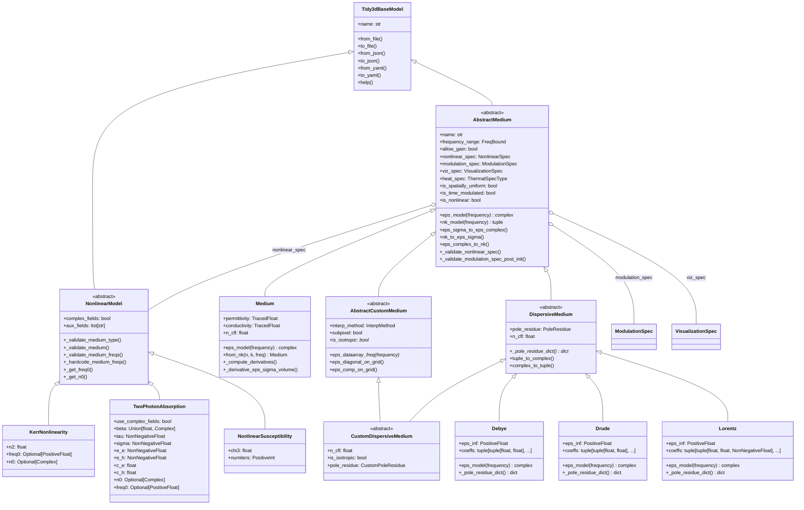

# Tidy3D Medium 类体系架构解析

## 概述

Tidy3D 的 Medium 类体系是电磁仿真中材料光学特性建模的核心框架。该体系基于面向对象设计原则，从简单的无色散介质到复杂的自定义色散介质，为各种材料的电磁特性提供了完整而灵活的建模能力。本文将深入解析这一类体系的架构设计、核心功能和实际应用。

## 类层次结构图

## 核心架构分析
### 基础框架：Tidy3dBaseModel
Tidy3dBaseModel 作为整个类体系的根基，提供了统一的数据序列化和文件操作接口。它支持多种格式的数据导入导出（JSON、YAML、HDF5），为材料参数的存储和交换提供了便利。

### 抽象介质基类：AbstractMedium
AbstractMedium 是所有介质类型的核心抽象，定义了材料建模的通用接口和基础属性：

核心属性：

- frequency_range ：定义材料模型的有效频率范围
- allow_gain ：控制是否允许增益介质（激光器等应用）
- nonlinear_spec ：非线性特性配置
- modulation_spec ：时间调制特性配置
关键方法：

- eps_model(frequency) ：计算复介电常数的抽象方法
- nk_model(frequency) ：计算折射率和消光系数
- 多种验证方法确保物理参数的合理性
### 非线性模型框架：NonlinearModel
NonlinearModel 采用策略模式设计，为不同类型的非线性材料响应提供统一接口。它负责：

- 介质兼容性验证
- 频率相关参数处理
- 自动微分支持
## 具体介质类型详解
### 1. 基础介质（Medium）
特征： 无色散特性，介电常数与频率无关

物理模型： $D(t) = \varepsilon E(t)$

核心参数：

- permittivity ：相对介电常数（≥1）
- conductivity ：电导率
适用场景： 简单电介质材料、通过复介电常数建模的金属

### 2. 色散介质（DispersiveMedium）
特征： 介电常数随频率变化

物理模型： $D(t) = \int \varepsilon(t - t') E(t') dt'$

核心概念： 采用极点-留数模型进行高效的FDTD实现

子类实现：
 Lorentz 模型
- 适用材料： 具有共振吸收特性的材料
- 物理机制： 洛伦兹振子模型
- 典型应用： 介电材料的共振吸收建模 Drude 模型
- 适用材料： 金属材料
- 物理机制： 自由电子气体模型
- 典型应用： 金属的等离子体频率以下的光学响应 Debye 模型
- 适用材料： 极性分子材料
- 物理机制： 分子取向极化
- 典型应用： 介电弛豫现象建模
### 3. 自定义介质（AbstractCustomMedium）
特征： 支持空间变化的介质特性

核心功能：

- 多种空间插值方法
- 亚像素平均技术
- 各向同性/各向异性材料支持
应用场景： 梯度折射率材料、复杂几何结构的材料分布

## 非线性模型深度解析
### 1. 非线性磁化率（NonlinearSusceptibility）
物理模型： $P_{NL} = \varepsilon_0 \chi_3 |E|^2 E$

应用领域： 克尔效应、自聚焦现象等三阶非线性效应

### 2. 双光子吸收（TwoPhotonAbsorption）
复杂物理过程包括：

- 双光子吸收（TPA）
- 自由载流子吸收（FCA）
- 自由载流子等离子体色散（FCPD）
典型应用： 硅光子学器件、非线性光学开关

### 3. 克尔非线性（KerrNonlinearity）
物理模型： 强度相关折射率 $n = n_0 + n_2 I$

应用领域： 光纤通信、超快光学器件

## 设计模式与架构优势
### 1. 模板方法模式
- AbstractMedium 定义通用算法框架
- 子类实现具体的 eps_model() 方法
- 保证了接口一致性和代码复用
### 2. 策略模式
- NonlinearModel 系列提供可插拔的非线性行为
- ModulationSpec 提供灵活的时间调制策略
- 支持运行时行为切换
### 3. 组合模式
- 介质可以组合多种特性（非线性、调制、可视化等）
- 支持复杂材料行为的模块化构建
- 提高了系统的可扩展性
### 4. 工厂方法
- Medium.from_nk() 等类方法提供便捷的构造方式
- 简化了常见材料的创建过程
## 关键技术特性
### 1. 自动微分支持
- 使用 TracedFloat 等类型支持梯度计算
- 为逆向设计和参数优化提供基础
- 支持端到端的可微分仿真
### 2. 物理约束验证
- 被动性检查（防止非物理增益）
- 因果性保证
- 数值稳定性验证
- 确保仿真结果的物理合理性
### 3. 性能优化
- @cached_property 缓存计算结果
- 极点-留数模型的高效FDTD实现
- CFL条件自动计算
- 优化了大规模仿真的计算效率
## 核心概念详解
### 1. 介质有效频率范围（frequency_range）
通俗理解： 如同眼镜只对特定光线有效，每种材料的光学特性也只在特定频率范围内准确。

技术含义：

- 作用范围： 定义材料模型的有效性边界
- 物理基础： 材料的光学特性（折射率、吸收系数）随光频率变化
- 实际意义： 超出范围的计算结果可能不可靠，系统会发出警告
实例说明：

- 普通玻璃：可见光下透明，紫外线下强烈吸收
- 硅材料：近红外（1550nm）透明，可见光下不透明
### 2. 增益介质（allow_gain）
通俗理解： 类似信号放大器，增益介质能够放大通过的光信号。

物理机制：

- 常规材料： 光通过时被吸收，强度衰减
- 增益材料： 光通过时被放大，强度增强
技术考量：

- 数值稳定性： 增益可能导致仿真发散
- 物理合理性： 需要外部能量泵浦
- 安全机制： 防止意外配置导致计算失败
应用场景：

- 激光器增益介质
- 光学放大器
- 发光二极管（LED）
### 3. 调制规格（modulation_spec）
通俗理解： 如同调节音响音量，可使材料特性随时间动态变化。

技术实现：

- 时间变化： 介电常数、导电率等参数的周期性调制
- 调制形式： 正弦波调制 $\varepsilon(t) = \varepsilon_0 + \Delta\varepsilon \cdot \sin(\omega t)$
应用领域：

1. 电光调制器
   
   - 电场控制材料折射率
   - 实现光信号开关和调制
2. 声光器件
   
   - 声波改变光学特性
   - 光束偏转和频率调制
3. 时间超材料
   
   - 材料特性快速时间变化
   - 非互易传输等新奇效应
4. 动态光子晶体
   
   - 周期结构动态调制
   - 光子带隙时间控制
实际器件：

- 液晶显示器中的液晶材料
- 电光调制器中的铌酸锂晶体
- 声光调制器中的石英晶体
技术参数：

- 可调制介电常数和电导率
- 调制深度和频率可控
- 需保证调制后的物理合理性
限制条件：

- 不可与非线性效应同时使用
- 某些介质类型（如2D介质）不支持调制
- 必须保证调制后材料的物理合理性
## 实际应用场景
### 1. 光子学器件设计
- 线性器件： 波导、谐振器等使用Medium或简单色散模型
- 非线性器件： 结合NonlinearModel系列实现复杂光学效应
### 2. 材料建模
- 标准材料： 从材料库导入或使用预定义模型
- 新材料： 通过色散拟合工具创建自定义模型
### 3. 多物理场仿真
- 热光效应： 通过heat_spec耦合热学特性
- 电光效应： 通过modulation_spec实现动态调制
## 总结
Tidy3D的Medium类体系展现了优秀的面向对象设计实践。通过清晰的抽象层次和灵活的组合机制，该框架为复杂电磁材料建模提供了强大而易用的工具。从静态线性材料到动态非线性增益介质，这一设计体现了Tidy3D在处理复杂光学现象时的精细化建模能力，为各种先进光子器件的设计和仿真提供了坚实的技术基础。

无论是学术研究还是工业应用，这一架构都能够满足从基础材料建模到前沿光子学器件设计的广泛需求，体现了现代科学计算软件在架构设计上的先进理念。