## 1. 系统架构概览
Tidy3D Monitor 系统采用多层次继承设计，包含以下核心模块：

- 基础抽象层 ： AbstractMonitor - 定义监视器的基础接口
- 时域/频域分类 ： TimeMonitor 、 FreqMonitor - 按时间域分类
- 功能分类 ：场监视器、通量监视器、模式监视器、投影监视器等
- 几何分类 ：平面监视器、体积监视器、表面积分监视器
## 2. 类层次结构图

```mermaid
classDiagram
    class Tidy3dBaseModel {
        +dict() dict
        +copy() Self
        +json() str
    }
    
    class Box {
        +center: Coordinate
        +size: Size
        +geometry: Box
    }
    
    class AbstractMonitor {
        +name: str
        +plot_params: PlotParams
        +geometry: Box
        +storage_size(num_cells, tmesh) int
        +downsample(arr, axis) Numpy
        +downsampled_num_cells(num_cells) tuple
    }
    
    class Monitor {
        +interval_space: tuple
        +colocate: bool
        +storage_size(num_cells, tmesh) int
    }
    
    class FreqMonitor {
        +freqs: FreqArray
        +apodization: ApodizationSpec
        +frequency_range: FreqBound
    }
    
    class TimeMonitor {
        +start: float
        +stop: float
        +interval: int
        +time_inds(tmesh) tuple
        +num_steps(tmesh) int
    }
    
    class AbstractFieldMonitor {
        +fields: tuple_EMField
        +interval_space: tuple
        +colocate: bool
    }
    
    class AbstractAuxFieldMonitor {
        +fields: tuple_AuxField
        +interval_space: tuple
        +colocate: bool
    }
    
    class PlanarMonitor {
        +normal_axis: Axis
    }
    
    class SurfaceIntegrationMonitor {
        +normal_dir: Direction
        +exclude_surfaces: tuple
        +integration_surfaces: list
    }
    
    class FieldMonitor {
        +storage_size(num_cells, tmesh) int
    }
    
    class FieldTimeMonitor {
        +storage_size(num_cells, tmesh) int
    }
    
    class AuxFieldTimeMonitor {
        +storage_size(num_cells, tmesh) int
    }
    
    class PermittivityMonitor {
        +colocate: False
        +interval_space: tuple
        +storage_size(num_cells, tmesh) int
    }
    
    class AbstractFluxMonitor {
        <<abstract>>
    }
    
    class FluxMonitor {
        +storage_size(num_cells, tmesh) int
    }
    
    class FluxTimeMonitor {
        +storage_size(num_cells, tmesh) int
    }
    
    class AbstractModeMonitor {
        +mode_spec: ModeSpec
        +store_fields_direction: Direction
        +colocate: bool
        +plot() Ax
    }
    
    class ModeMonitor {
        +storage_size(num_cells, tmesh) int
    }
    
    class ModeSolverMonitor {
        +direction: Direction
        +fields: tuple_EMField
        +storage_size(num_cells, tmesh) int
    }
    
    class AbstractFieldProjectionMonitor {
        +custom_origin: Coordinate
        +far_field_approx: bool
        +interval_space: tuple
        +window_size: tuple
        +medium: MediumType
        +projection_surfaces: tuple
        +local_origin: Coordinate
    }
    
    class FieldProjectionAngleMonitor {
        +proj_axis: Axis
        +proj_distance: float
        +theta: ObsGridArray
        +phi: ObsGridArray
        +storage_size(num_cells, tmesh) int
    }
    
    class FieldProjectionCartesianMonitor {
        +proj_axis: Axis
        +proj_distance: float
        +x: ObsGridArray
        +y: ObsGridArray
        +storage_size(num_cells, tmesh) int
    }
    
    class FieldProjectionKSpaceMonitor {
        +proj_axis: Axis
        +proj_distance: float
        +ux: ObsGridArray
        +uy: ObsGridArray
        +storage_size(num_cells, tmesh) int
    }
    
    class DiffractionMonitor {
        +normal_dir: Direction
        +colocate: False
        +storage_size(num_cells, tmesh) int
    }
    
    %% Base inheritance
    Tidy3dBaseModel <|-- Box
    Box <|-- AbstractMonitor
    AbstractMonitor <|-- Monitor
    
    %% Time/Frequency domain classification
    Monitor <|-- FreqMonitor
    Monitor <|-- TimeMonitor
    
    %% Field monitor inheritance
    Monitor <|-- AbstractFieldMonitor
    Monitor <|-- AbstractAuxFieldMonitor
    
    %% Frequency domain field monitors
    AbstractFieldMonitor <|-- FieldMonitor
    
    %% Time domain field monitors
    AbstractFieldMonitor <|-- FieldTimeMonitor
    
    %% Auxiliary field time monitors
    AbstractAuxFieldMonitor <|-- AuxFieldTimeMonitor
    
    %% Permittivity monitors
    FreqMonitor <|-- PermittivityMonitor
    
    %% Geometric classification
    Monitor <|-- PlanarMonitor
    Monitor <|-- SurfaceIntegrationMonitor
    
    %% Flux monitors
    SurfaceIntegrationMonitor <|-- AbstractFluxMonitor
    AbstractFluxMonitor <|-- FluxMonitor
    AbstractFluxMonitor <|-- FluxTimeMonitor
    
    %% Mode monitors
    PlanarMonitor <|-- AbstractModeMonitor
    AbstractModeMonitor <|-- ModeMonitor
    AbstractModeMonitor <|-- ModeSolverMonitor
    
    %% Field projection monitors
    SurfaceIntegrationMonitor <|-- AbstractFieldProjectionMonitor
    AbstractFieldProjectionMonitor <|-- FieldProjectionAngleMonitor
    AbstractFieldProjectionMonitor <|-- FieldProjectionCartesianMonitor
    AbstractFieldProjectionMonitor <|-- FieldProjectionKSpaceMonitor
    
    %% Diffraction monitors
    PlanarMonitor <|-- DiffractionMonitor
```

## 3. 核心架构分析
### 3.1 基础抽象层 (AbstractMonitor)
设计理念 ：所有监视器的统一基类，继承自 Box ，具有空间几何属性。

核心特性 ：

- 命名机制 ：通过 name 属性唯一标识监视器
- 几何表示 ：继承 Box 的 center 和 size 属性
- 存储计算 ：抽象方法 storage_size() 计算存储需求
- 数据降采样 ： downsample() 方法支持空间降采样
- 可视化支持 ：提供 plot_params 属性
### 3.2 时域/频域分类系统
设计模式 ：策略模式，将时间特性封装为独立的类层次。
 FreqMonitor（频域监视器）
- 核心属性 ： freqs （频率数组）、 apodization （窗函数规格）
- 频率管理 ： frequency_range 属性提供频率范围
- 性能优化 ：频率数量警告机制，防止过多频率点 TimeMonitor（时域监视器）
- 时间控制 ： start 、 stop 、 interval 控制采样时间
- 智能采样 ： time_inds() 计算采样索引， num_steps() 计算步数
- 默认处理 ：自动设置合理的默认采样间隔
### 3.3 场监视器系统
设计理念 ：专门用于记录电磁场分布的监视器类族。
1. **AbstractFieldMonitor（抽象场监视器）**
   - 场分量选择：fields 属性选择记录的场分量（Ex, Ey, Ez, Hx, Hy, Hz）
   - 空间采样：interval_space 控制空间降采样
   - 场定位：colocate 控制场的网格定位
   - 存储优化：智能计算求解器内部存储需求

2. **FieldMonitor（频域场监视器）**
   - 应用场景：稳态场分布分析
   - 实现机制：离散傅里叶变换，原位计算
   - 存储计算：BYTES_COMPLEX * num_cells * len(freqs) * len(fields)

3. **FieldTimeMonitor（时域场监视器）**
   - 应用场景：场的时间演化、动画制作
   - 优化建议：适合单点监测或低分辨率动画
   - 存储计算：BYTES_REAL * num_steps * num_cells * len(fields)

4. **AuxFieldTimeMonitor（辅助场时域监视器）**
   - 特殊用途：记录非线性材料中的辅助场（如载流子密度）
   - 场类型：Nfx, Nfy, Nfz 等辅助场分量
   - 应用：双光子吸收等非线性效应分析
### 3.4 通量监视器系统
设计理念 ：基于表面积分计算功率通量的监视器。
 AbstractFluxMonitor（抽象通量监视器）
- 继承关系 ：继承自 SurfaceIntegrationMonitor
- 积分机制 ：在监视器表面进行场积分 FluxMonitor（频域通量监视器）
- 功能 ：计算频域功率通量
- 几何支持 ：2D平面（穿过通量）、3D体积（流出通量）
- 存储效率 ：每频率点仅存储一个实数 FluxTimeMonitor（时域通量监视器）
- 功能 ：计算时域功率通量
- 应用 ：功率传输的时间演化分析
- 存储 ：每时间步存储一个实数
### 3.5 模式监视器系统
设计理念 ：基于模式分解的监视器，用于波导和光学器件分析。
 AbstractModeMonitor（抽象模式监视器）
- 核心组件 ： mode_spec （模式规格）定义求解参数
- 场存储 ： store_fields_direction 控制场分布存储
- 几何限制 ：必须为平面监视器
- 可视化 ：支持模式传播方向的箭头显示 ModeMonitor（模式监视器）
- 功能 ：记录模式分解的振幅
- 应用 ：前向/后向传播功率分析
- 归一化 ：自动按源功率谱归一化
- 存储 ：振幅数据 + 可选的场分布数据 ModeSolverMonitor（模式求解器监视器）
- 功能 ：存储模式求解器返回的场分布
- 传播方向 ： direction 指定模式传播方向
- 场分量 ：可选择存储的场分量
- 精度控制 ：支持单精度/双精度计算
### 3.6 场投影监视器系统
设计理念 ：将近场投影到远场的监视器，用于天线和散射分析。
 AbstractFieldProjectionMonitor（抽象场投影监视器）
- 投影原理 ：基于格林函数的近场到远场变换
- 坐标系统 ： custom_origin 定义局部坐标原点
- 远场近似 ： far_field_approx 控制是否使用远场近似
- 窗函数 ： window_size 控制边缘衰减窗口
- 介质设置 ： medium 指定投影介质 FieldProjectionAngleMonitor（角度投影监视器）
- 坐标系统 ：球坐标系（theta, phi）
- 应用 ：天线方向图、远场辐射分析
- 参数 ： theta （极角）、 phi （方位角） FieldProjectionCartesianMonitor（笛卡尔投影监视器）
- 坐标系统 ：笛卡尔坐标系（x, y）
- 应用 ：平面波前分析、成像系统
- 参数 ： x 、 y 观测点坐标 FieldProjectionKSpaceMonitor（k空间投影监视器）
- 坐标系统 ：归一化k空间（ux, uy）
- 应用 ：衍射分析、傅里叶光学
- 参数 ： ux 、 uy 归一化波矢分量
- 范围限制 ：ux, uy ∈ [-1, 1]
### 3.7 特殊监视器 PermittivityMonitor（介电常数监视器）
- 功能 ：记录复介电常数张量的对角分量
- 网格定位 ： colocate=False ，记录Yee网格位置的值
- 2D材料 ：支持2D材料的体积等效介电常数
- 存储 ：每网格点、每频率存储3个复数 DiffractionMonitor（衍射监视器）
- 功能 ：计算衍射级次的振幅和效率
- 实现机制 ：2D傅里叶变换
- 几何要求 ：横向尺寸必须为无穷大
- 应用 ：光栅效率分析、周期结构
## 4. 设计模式与架构优势
### 4.1 多重继承模式
- 时域/频域分离 ： TimeMonitor 和 FreqMonitor 独立定义时间特性
- 功能/几何分离 ：功能类（如 AbstractFieldMonitor ）与几何类（如 PlanarMonitor ）正交组合
### 4.2 模板方法模式
- 存储计算 ： storage_size() 方法在各子类中具体实现
- 求解器接口 ： _storage_size_solver() 处理求解器内部存储
### 4.3 策略模式
- 采样策略 ：不同监视器采用不同的时空采样策略
- 投影策略 ：不同坐标系统的场投影策略
### 4.4 组合模式
- 表面组合 ： SurfaceIntegrationMonitor 将复杂几何分解为表面集合
- 投影表面 ： FieldProjectionSurface 封装投影所需的表面信息
## 5. 关键技术特性
### 5.1 存储优化
- 精确计算 ：每种监视器都有精确的存储需求计算
- 求解器优化 ：区分最终存储和求解器临时存储
- 数据类型 ：区分实数（BYTES_REAL）和复数（BYTES_COMPLEX）存储
### 5.2 性能优化
- 空间降采样 ： interval_space 支持空间降采样
- 时间降采样 ： interval 支持时间降采样
- 边界保持 ：降采样时保持首末点
### 5.3 数值稳定性
- 窗函数 ：场投影监视器支持边缘衰减窗口
- 精度控制 ：模式监视器支持单/双精度选择
- 边界处理 ：自动处理监视器边界条件
### 5.4 用户友好性
- 智能默认值 ：自动设置合理的默认参数
- 警告机制 ：对可能影响性能的设置发出警告
- 验证机制 ：全面的参数验证和错误提示
## 6. 实际应用场景
### 6.1 天线设计
- 近场分析 ： FieldMonitor 记录天线附近场分布
- 远场分析 ： FieldProjectionAngleMonitor 计算辐射方向图
- 效率分析 ： FluxMonitor 计算辐射功率
### 6.2 光学器件
- 波导分析 ： ModeMonitor 分析模式传输
- 耦合效率 ： FluxMonitor 计算耦合功率
- 场分布 ： FieldMonitor 分析稳态场分布
### 6.3 散射分析
- RCS计算 ： FieldProjectionAngleMonitor 计算雷达截面
- 衍射分析 ： DiffractionMonitor 分析衍射效率
- 近场扫描 ： FieldTimeMonitor 记录散射过程
### 6.4 材料表征
- 介电常数 ： PermittivityMonitor 提取材料参数
- 非线性效应 ： AuxFieldTimeMonitor 监测载流子等辅助场
- 色散分析 ：多频率 FieldMonitor 分析色散特性
### 6.5 成像系统
- 点扩散函数 ： FieldProjectionCartesianMonitor 分析成像质量
- 傅里叶分析 ： FieldProjectionKSpaceMonitor 进行k空间分析
- 像差分析 ：多点 FieldMonitor 分析波前畸变
## 7. 总结
Tidy3D Monitor 系统展现了优秀的面向对象设计：

1. 高度模块化 ：时域/频域、功能/几何、存储/计算多维度分离
2. 强扩展性 ：通过多重继承支持新监视器类型的灵活组合
3. 性能优化 ：精确的存储计算和多层次的采样优化
4. 用户友好 ：智能默认值、全面验证、清晰的错误提示
5. 应用广泛 ：覆盖从基础场分析到高级投影计算的完整需求
该架构成功地将复杂的电磁场监测需求分解为清晰的类层次结构，为用户提供了强大而灵活的仿真数据采集能力，是电磁仿真软件中监视器系统设计的优秀范例。