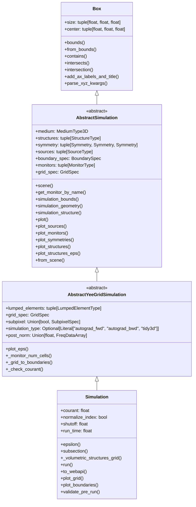
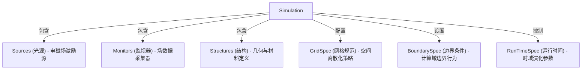
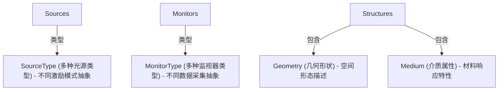
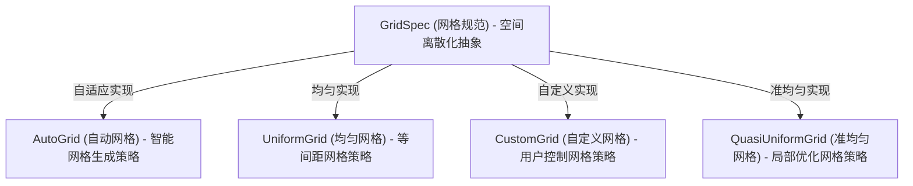
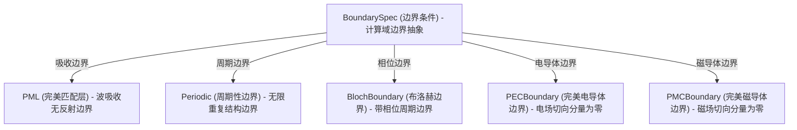
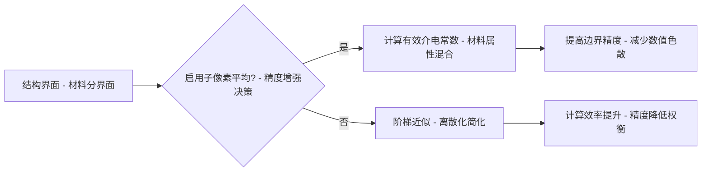
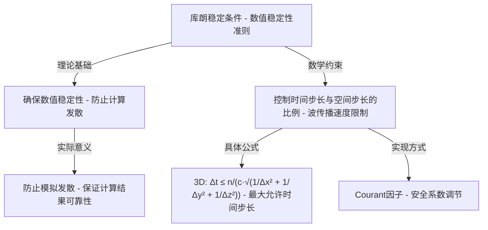
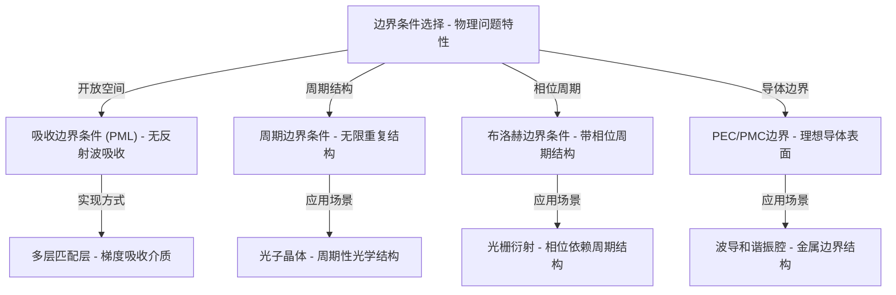

# Tidy3D Simulation 系统架构分析

## 目录

1. [系统概述](#系统概述)
2. [类层次结构](#类层次结构)
   - [UML类图](#uml类图)
   - [类和参数详解](#类和参数详解)
3. [核心组件](#核心组件)
   - [Simulation类详解](#simulation-类详解---fdtd模拟核心实体)
   - [GridSpec组件](#gridspec-类---空间离散化策略集合)
   - [BoundarySpec组件](#boundaryspec-组件---边界条件系统)
4. [关键功能](#主要功能)
   - [模拟设置](#模拟设置)
   - [子像素平均技术](#子像素平均-subpixel-averaging---网格精度增强技术)
   - [可视化功能](#可视化功能)
   - [网格生成与验证](#网格生成与验证)
5. [使用示例](#使用示例)
6. [理论基础](#关键概念---电磁场数值模拟基础理论)
   - [FDTD方法](#fdtd-方法---时域有限差分算法)
   - [库朗稳定条件](#库朗稳定条件---fdtd算法稳定性保障)
   - [边界条件类型](#边界条件---计算域边界处理策略)
7. [系统架构总结](#总结---模拟框架的系统架构与组合逻辑)
8. [参考文献](#参考文献)

## 系统概述

Tidy3D是一个高性能的电磁场仿真软件，基于时域有限差分(FDTD)方法实现。本文深入分析其模拟系统架构，揭示其设计理念、组件结构和核心算法实现。Tidy3D采用面向对象的设计方法，通过抽象类层次和组件化设计，实现了高度灵活且易于扩展的模拟框架。

Tidy3D的Simulation模块是整个系统的核心，它通过组合多种组件类（网格、边界条件、光源、监视器、结构等）构建完整的电磁场模拟环境。系统采用三层抽象架构：

1. **抽象基类层**：`AbstractSimulation`（继承自`Box`）定义模拟系统的基本接口和行为，包含背景介质、结构、光源、监视器等核心组件
2. **中间抽象层**：`AbstractYeeGridSimulation` 实现特定算法框架（如Yee网格FDTD）的通用功能
3. **具体实现层**：`Simulation` 提供最终用户可直接使用的模拟类

这种分层设计使系统能够灵活支持不同的算法实现，同时保持统一的用户接口。模块化的组件设计（如GridSpec、BoundarySpec等）进一步增强了系统的可扩展性和可维护性。

## 类层次结构

本节详细介绍Tidy3D的类层次结构，包括核心类的继承关系、组件类的定义以及它们之间的关联关系。通过这些类的组织和交互，Tidy3D实现了模块化、可扩展的电磁场模拟系统。

### UML类图

以下UML类图展示了Tidy3D模拟系统的核心类结构，包括继承关系、组件类定义和关联关系：



上图展示了Tidy3D模拟系统的类层次结构，包括：

- **继承关系**：从抽象基类到具体实现类的层次结构
- **组件类**：各种功能组件的接口定义
- **实现类**：针对不同需求的具体实现
- **关联关系**：类之间的组合、聚合和使用关系

### 类和参数详解

#### Box 类核心方法详解

`Box` 类是 Tidy3D 中表示三维空间中的矩形盒子的基础几何类，提供了丰富的空间操作方法：

- **bounds()**: 返回盒子的边界坐标，以 (xmin, xmax, ymin, ymax, zmin, zmax) 的形式表示。
- **from_bounds(bounds)**: 静态方法，通过给定的边界坐标创建一个 Box 实例。
- **contains(point)**: 判断给定点是否包含在盒子内部。
- **intersects(other_box)**: 判断当前盒子是否与另一个盒子相交。
- **intersection(other_box)**: 计算当前盒子与另一个盒子的交集，返回一个新的 Box 实例。
- **add_ax_labels_and_title(ax, title)**: 为绘图轴添加标签和标题。
- **parse_xyz_kwargs(kwargs)**: 解析与 x、y、z 坐标相关的关键字参数。

#### AbstractSimulation 类核心方法详解

AbstractSimulation 类作为 Tidy3D 模拟系统的抽象基类，定义了一系列重要方法，这些方法构成了模拟系统的核心功能接口：

1. **scene()** - 返回 Scene 实例，该实例包含并管理模拟中的所有几何组件（结构、光源、监视器等），是组件可视化和空间关系管理的核心。

2. **get_monitor_by_name()** - 根据名称获取特定监视器对象，支持用户通过字符串标识符快速访问和操作监视器，简化了数据分析流程。

3. **simulation_bounds()** - 获取模拟的边界范围，返回定义计算域物理边界的坐标值，是网格生成和边界条件设置的基础。

4. **simulation_geometry()** - 获取表示整个模拟区域的几何体对象（Box），用于空间关系计算和可视化。

5. **simulation_structure()** - 获取表示模拟区域的结构对象，将模拟域作为一个特殊结构处理，便于与其他结构进行统一操作。

6. **plot()** - 综合绘制模拟的所有组件，包括结构、光源、监视器、边界条件和对称性设置，提供模拟设置的直观可视化。

7. **plot_sources()** - 专门绘制模拟中的光源，支持在指定平面上可视化光源位置、类型和属性，便于验证光源设置。

8. **plot_monitors()** - 专门绘制模拟中的监视器，支持在指定平面上可视化监视器位置和类型，便于验证数据采集设置。

9. **plot_symmetries()** - 专门绘制模拟中的对称性设置，通过可视化对称平面帮助用户理解和验证对称性配置，优化计算资源利用。

10. **plot_structures()** - 专门绘制模拟中的结构，支持在指定平面上可视化结构几何形状和空间分布，便于验证模型构建。

11. **plot_structures_eps()** - 绘制结构的介电常数分布，通过颜色映射直观展示材料属性在空间中的分布，是模型验证的重要工具。

12. **from_scene()** - 从 Scene 实例创建模拟对象的类方法，支持从预先构建的场景快速创建模拟，简化了模拟设置流程。

这些方法共同构成了 AbstractSimulation 类的功能框架，为派生类提供了统一的接口规范，确保了不同实现之间的一致性和互操作性。通过这些方法，用户可以方便地设置、验证和可视化模拟环境，大大提高了模型构建和分析的效率。

#### AbstractYeeGridSimulation 类核心方法详解

`AbstractYeeGridSimulation` 类是基于 Yee 网格的 FDTD 模拟的抽象基类，扩展了 `AbstractSimulation` 类，提供了以下核心方法：

- **plot_eps()**: 绘制模拟区域内的介电常数分布，可视化材料属性。
- **_monitor_num_cells()**: 计算每个监视器占用的网格单元数量，用于资源估算。
- **_grid_to_boundaries()**: 将网格点映射到模拟边界，确保网格与边界条件的一致性。
- **_check_courant()**: 验证模拟设置是否满足库朗稳定条件，确保数值稳定性。

#### Simulation 类核心方法详解

`Simulation` 类是 Tidy3D 的核心模拟类，继承自 `AbstractYeeGridSimulation`，实现了完整的 FDTD 模拟功能：

- **epsilon()**: 计算模拟区域内的介电常数分布，考虑所有结构和材料。
- **subsection(bounds)**: 创建模拟的子区域，允许聚焦分析特定区域。
- **_volumetric_structures_grid()**: 生成体素化的结构网格，将连续几何转换为离散网格表示。
- **run()**: 执行模拟计算，是启动 FDTD 求解过程的主要入口。
- **to_webapi()**: 将模拟配置转换为 Web API 可接受的格式，用于云端计算。
- **plot_grid()**: 绘制计算网格，可视化空间离散化。
- **plot_boundaries()**: 绘制边界条件设置，展示模拟区域的边界处理方式。
- **validate_pre_run()**: 在运行前验证模拟设置的有效性，检查参数一致性和物理合理性。

这些方法使 Simulation 类成为一个功能完备的模拟工具，能够满足各种电磁场模拟需求，从简单的波导分析到复杂的光子器件设计。


## 核心组件

本节详细介绍Tidy3D模拟系统的核心组件，包括网格系统、边界条件和模拟主体类。这些组件共同构成了完整的电磁场模拟环境，每个组件都有其特定的功能和责任。

#### GridSpec 类 - 空间离散化策略集合
GridSpec 是一个集合类，用于指定三个维度的网格规范，是FDTD算法的核心空间采样策略定义器。它通过组合不同维度的网格规范，实现了计算精度与效率的平衡。它包含以下主要组件：

- **grid_x, grid_y, grid_z**: 分别指定 x、y、z 轴方向的网格规范，是空间各向异性采样的基础，可以是以下类型之一：
  - **UniformGrid**: 均匀网格 - 恒定步长采样策略，通过指定固定的网格步长 `dl` 创建，适合结构简单区域
  - **AutoGrid**: 自动非均匀网格 - 自适应采样策略，根据材料和波长自动调整网格密度，优化计算资源分配
  - **QuasiUniformGrid**: 准均匀网格 - 边界感知采样策略，类似于均匀网格，但会在结构边界处进行局部微调
  - **CustomGrid**: 自定义网格 - 用户定义采样策略，允许用户指定网格边界坐标，提供最大灵活性

- **wavelength**: 自由空间波长 - 物理特征尺度参考，用于自动非均匀网格生成，确保足够的空间采样率
- **override_structures**: 网格规范覆盖结构 - 局部网格控制机制，用于在特定区域细化或粗化网格，实现计算资源的优先分配
- **snapping_points**: 网格对齐点 - 精确位置锚定机制，强制网格边界通过这些点，确保关键结构特征被准确捕获

#### simulation_type 参数 - 计算模式选择器
`simulation_type` 是一个内部使用的标签，用于区分不同类型的模拟，是算法行为的高级控制开关，特别是在自动微分梯度处理中：

- **"tidy3d"**: 标准模拟模式 - 常规电磁场求解器（默认值），执行直接的麦克斯韦方程数值求解
- **"autograd_fwd"**: 自动微分前向传播模式 - 梯度计算的第一阶段，记录计算图并存储中间结果，为反向传播做准备
- **"autograd_bwd"**: 自动微分反向传播模式 - 梯度计算的第二阶段，利用伴随方法计算敏感度，实现高效的多参数优化

## Simulation 类详解 - FDTD模拟核心实体
Simulation 类是 Tidy3D 的核心类，用于定义和执行FDTD电磁场模拟。它作为电磁场求解的中央控制器，协调各组件之间的交互，并封装了完整的模拟环境定义。



### 组件间的逻辑关系
- **Sources ↔ Monitors**: 激励-响应关系，光源产生的场被监视器记录
- **Structures ↔ GridSpec**: 适应关系，网格根据结构特征自动调整
- **BoundarySpec ↔ Sources**: 兼容性关系，边界条件需与光源类型匹配
- **GridSpec ↔ RunTimeSpec**: 稳定性关系，网格细化程度影响时间步长


    




#### BoundarySpec 类 - 边界条件规范

BoundarySpec 是边界条件的抽象接口，用于定义计算域边界的处理方式，是FDTD模拟中波动传播行为的关键控制器。它通过指定不同类型的边界条件，实现了对无限空间的有限近似和特殊物理条件的模拟。主要包含以下边界类型：

- **PML (完美匹配层)**：吸收边界条件 - 通过梯度介质层吸收入射波，最小化反射，模拟开放空间
- **Periodic (周期性边界)**：周期重复条件 - 将一侧边界上的场值复制到对侧，用于模拟无限周期结构
- **BlochBoundary (布洛赫边界)**：相位周期条件 - 带相位因子的周期边界，用于模拟具有相位变化的周期结构
- **PECBoundary (完美电导体边界)**：电场切向分量为零 - 模拟理想导体表面的电磁场行为
- **PMCBoundary (完美磁导体边界)**：磁场切向分量为零 - 模拟理想磁导体表面的电磁场行为

每种边界条件都有其特定的应用场景和物理意义，选择合适的边界条件对于准确模拟电磁波传播至关重要。

## 主要功能

本节介绍Tidy3D模拟系统的核心功能，包括模拟参数设置、精度增强技术、可视化功能和验证机制。这些功能共同构成了一个完整、高效的电磁场模拟环境。

### 模拟设置

Simulation 类允许用户设置以下关键参数，构建完整的模拟环境：

- **网格规格 (grid_spec)** : 定义模拟域的空间离散化策略，控制计算精度和效率
- **边界条件 (boundary_spec)** : 定义模拟域边界的处理方式，模拟无限空间或特定物理边界
- **结构 (structures)** : 定义模拟中的物理对象及其材料属性，构建模拟场景
- **光源 (sources)** : 定义电磁场的激励源，提供能量输入
- **监视器 (monitors)** : 定义用于收集模拟数据的监视器，记录场分布和演化
- **对称性 (symmetry)** : 利用问题的对称性减少计算量，提高计算效率
- **运行时间 (run_time)** : 定义模拟的总时间，控制时域演化范围

### 子像素平均 (Subpixel Averaging) - 网格精度增强技术

子像素平均是一种提高FDTD模拟精度的关键技术，通过在网格单元内部进行材料属性的加权平均，实现对结构边界的更精确表示，而无需增加网格密度。


子像素平均技术可以在不增加网格密度的情况下提高模拟精度，特别是在材料界面处，这对于复杂结构的精确模拟至关重要。

### 可视化功能

Simulation 类提供了多种可视化方法，帮助用户直观理解模拟设置和结果：

- **plot()** : 在指定平面上绘制模拟组件，展示整体结构布局
- **plot_eps()** : 绘制介电常数分布，显示材料属性空间分布
- **plot_boundaries()** : 绘制边界条件，明确计算域边界设置
- **plot_grid()** : 绘制计算网格，展示空间离散化细节

这些可视化工具不仅有助于模型调试，还能帮助用户更好地理解和分析模拟结果。

### 网格生成与验证

Simulation 类包含多种验证器和网格生成机制，确保模拟设置的正确性和计算效率：

- **边界条件验证**：检查边界条件设置的一致性和物理合理性
- **光源与边界条件兼容性验证**：确保光源类型与边界条件相互兼容
- **对称性设置验证**：检查对称性设置的有效性和一致性
- **网格质量评估**：分析网格质量，确保数值稳定性和计算精度
- **自动网格优化**：根据结构特征和波长自动调整网格，平衡精度和效率

这些验证和优化机制大大降低了用户设置错误的可能性，同时提高了模拟的可靠性和效率。
- 网格分辨率验证

## 使用示例

本节提供了Tidy3D模拟系统的典型使用示例，展示了如何创建和配置一个完整的模拟环境，包括几何结构、材料属性、光源、监视器和边界条件等关键组件。

### 基本模拟设置

以下示例展示了一个典型的Tidy3D模拟设置，包含一个立方体结构、高斯脉冲光源和通量监视器：

```python
from tidy3d import Simulation, Structure, Box, Medium
from tidy3d import UniformCurrentSource, GaussianPulse
from tidy3d import FluxMonitor
from tidy3d import GridSpec, AutoGrid
from tidy3d import BoundarySpec, Boundary

# 创建模拟对象
sim = Simulation(
    # 设置模拟域大小
    size=(3.0, 3.0, 3.0),
    # 配置自动网格生成
    grid_spec=GridSpec(
        grid_x = AutoGrid(min_steps_per_wvl = 20),  # x方向每波长至少20个网格点
        grid_y = AutoGrid(min_steps_per_wvl = 20),  # y方向每波长至少20个网格点
        grid_z = AutoGrid(min_steps_per_wvl = 20)   # z方向每波长至少20个网格点
    ),
    # 设置模拟总时间
    run_time=40e-11,
    # 添加几何结构
    structures=[
        Structure(
            geometry=Box(size=(1, 1, 1), center=(0, 0, 0)),  # 中心位置的立方体
            medium=Medium(permittivity=2.0),  # 介电常数为2的材料
        ),
    ],
    # 添加电磁场源
    sources=[
        UniformCurrentSource(
            size=(0, 0, 0),            # 点源
            center=(0, 0.5, 0),         # 源位置
            polarization="Hx",           # 磁场x方向极化
            source_time=GaussianPulse(   # 高斯脉冲时间依赖
                freq0=2e14,              # 中心频率
                fwidth=4e13,             # 频率宽度
            ),
        )
    ],
    # 添加监视器
    monitors=[
        FluxMonitor(size=(1, 1, 0),           # xy平面
                    center=(0, 0, 0),          # 中心位置
                    freqs=[2e14, 2.5e14],      # 监测频率
                    name='flux'),              # 监视器名称
    ],
    # 设置对称性（无对称性）
    symmetry=(0, 0, 0),
    # 配置边界条件
    boundary_spec=BoundarySpec(
        x = Boundary.pml(num_layers=20),    # x方向使用20层PML
        y = Boundary.pml(num_layers=30),    # y方向使用30层PML
        z = Boundary.periodic(),            # z方向使用周期边界条件
    ),
    # 能量关断阈值
    shutoff=1e-6,
    # 库朗因子
    courant=0.8,
    # 禁用子像素平均
    subpixel=False,
)
```

### 运行模拟

完成模拟设置后，可以使用以下代码运行模拟并获取结果：

```python
# 运行模拟
sim_data = sim.run()

# 获取监视器数据
flux_data = sim_data["flux"]

# 可视化结果
import matplotlib.pyplot as plt
plt.figure()
plt.plot(flux_data.freqs, flux_data.flux)
plt.xlabel("频率 (Hz)")
plt.ylabel("通量")
plt.title("通量频谱")
plt.show()
```
## 关键概念 - 电磁场数值模拟基础理论

本节介绍Tidy3D模拟系统的理论基础，包括FDTD方法、库朗稳定条件和边界条件等核心概念，这些是理解电磁场数值模拟的关键要素。

### FDTD 方法 - 时域有限差分算法

FDTD方法是一种求解麦克斯韦方程组的数值技术，通过空间和时间上的离散化，将连续的电磁场问题转化为可计算的离散问题。它采用交错的网格结构（Yee网格）来表示电场和磁场分量，实现了高效且直观的电磁场演化模拟。


### 库朗稳定条件 - FDTD算法稳定性保障

库朗稳定条件是FDTD模拟中的关键约束，它定义了时间步长与空间步长之间必须满足的数学关系，以确保数值计算的稳定性。这一条件源自波动方程的数值解析，是保证模拟结果收敛而非发散的基础。



### 边界条件 - 计算域边界处理策略

边界条件定义了电磁场在计算域边界处的行为，是FDTD模拟中的重要组成部分。不同类型的边界条件适用于不同的物理问题，正确选择边界条件对于获得准确的模拟结果至关重要。



## 总结 - 模拟框架的系统架构与组合逻辑

本节总结Tidy3D模拟系统的核心架构特点和设计理念，展示其如何通过抽象层次和组件化设计实现高度灵活且高效的电磁场模拟框架。

### 核心设计理念

Tidy3D的Simulation模块是一个高度抽象且组合灵活的电磁场模拟框架，它通过以下核心设计理念实现了强大的功能：

1. **组件化设计** - Simulation类作为中央协调器，将不同功能模块（网格、边界、结构、光源、监视器等）组合成完整的模拟环境，体现了高内聚低耦合软件架构原则。

2. **抽象层次划分** - 从底层的Maxwell方程求解到高层的用户接口，通过多层抽象（如GridSpec、BoundarySpec等）隐藏了复杂的数值计算细节，使用户能够专注于物理问题本身。

3. **组合逻辑关系** - 各组件之间通过明确的逻辑关系（如适应关系、兼容性关系、稳定性关系等）相互作用，形成一个有机整体，确保模拟的正确性和高效性。

4. **算法与物理的融合** - 将数值算法（FDTD、子像素平均等）与物理概念（电磁场、材料属性等）无缝结合，在保持物理直观性的同时实现高计算效率。

### 架构优势

这种设计架构带来了以下优势：

- **灵活性** - 用户可以根据需要自由组合不同的组件，构建适合特定问题的模拟环境
- **可扩展性** - 新的组件类型可以轻松集成到现有框架中，无需修改核心架构
- **可维护性** - 组件之间的清晰边界和接口定义使代码更易于理解和维护
- **性能优化** - 通过专门的算法实现（如子像素平均、自动网格生成）提高计算效率

通过这种抽象的组合逻辑架构，Tidy3D能够支持从简单的波导分析到复杂的光子集成电路设计等各种电磁学应用场景，为用户提供既灵活又高效的模拟工具。

## 参考文献

1. Taflove, A., & Hagness, S. C. (2005). *Computational Electrodynamics: The Finite-Difference Time-Domain Method*. Artech House.

2. Oskooi, A. F., Roundy, D., Ibanescu, M., Bermel, P., Joannopoulos, J. D., & Johnson, S. G. (2010). MEEP: A flexible free-software package for electromagnetic simulations by the FDTD method. *Computer Physics Communications*, 181(3), 687-702.

3. Gedney, S. D. (2011). *Introduction to the Finite-Difference Time-Domain (FDTD) Method for Electromagnetics*. Morgan & Claypool Publishers.

4. Schneider, J. B. (2010). *Understanding the Finite-Difference Time-Domain Method*. Self-published.

5. Tidy3D Documentation. (2023). *Tidy3D: A Modern FDTD Simulator for Electromagnetic Design*. [https://docs.flexcompute.com/projects/tidy3d/](https://docs.flexcompute.com/projects/tidy3d/)
