# Tidy3D Source系统架构解析

## 1. 系统架构概览
Tidy3D Source 系统采用分层设计，包含以下核心模块：

- 基础抽象层 ： base.py - 定义源的基础接口
- 电流源模块 ： current.py - 实现各种电流源
- 场源模块 ： field.py - 实现各种场源
- 时间依赖模块 ： time.py - 定义源的时间特性
- 工具模块 ： utils.py - 提供类型定义和工具函数
## 2. 类层次结构图

```mermaid
classDiagram
    class Tidy3dBaseModel {
        +dict() dict
        +copy() Self
        +json() str
    }
    
    class Source {
        +source_time: SourceTime
        +name: str
        +interpolate: bool
        +plot() None
        +plot_field() None
        +plot_3d() None
    }
    
    class CurrentSource {
        +current_dataset: FieldDataset
        +polarization: Polarization
    }
    
    class FieldSource {
        +size: Size
        +center: Coordinate
        +source_time: SourceTime
    }
    
    class SourceTime {
        +amplitude: float
        +phase: float
        +freq0: float
        +fwidth: float
        +amp_time(time) complex
        +spectrum(freqs) complex
    }
    
    class GaussianPulse {
        +offset: float
        +remove_dc_component: bool
        +from_fwidth() GaussianPulse
        +from_fmax() GaussianPulse
    }
    
    class ContinuousWave {
        +amp_time(time) complex
        +end_time() Optional[float]
    }
    
    class CustomSourceTime {
        +offset: float
        +source_time_dataset: TimeDataset
        +from_values() CustomSourceTime
        +amp_time(time) complex
    }
    
    class UniformCurrentSource {
        +size: Size
        +center: Coordinate
        +polarization: Polarization
    }
    
    class PointDipole {
        +center: Coordinate
        +polarization: Polarization
        +interpolate: bool
    }
    
    class CustomCurrentSource {
        +current_dataset: FieldDataset
        +interpolate: bool
    }
    
    class PlaneWave {
        +size: Size
        +center: Coordinate
        +direction: Direction
        +angle_theta: float
        +angle_phi: float
        +pol_angle: float
    }
    
    class ModeSource {
        +size: Size
        +center: Coordinate
        +direction: Direction
        +mode_spec: ModeSpec
        +mode_index: int
    }
    
    class GaussianBeam {
        +size: Size
        +center: Coordinate
        +direction: Direction
        +pol_angle: float
        +angle_theta: float
        +angle_phi: float
        +waist_radius: float
        +waist_distance: float
    }
    
    class AstigmaticGaussianBeam {
        +size: Size
        +center: Coordinate
        +direction: Direction
        +pol_angle: float
        +angle_theta: float
        +angle_phi: float
        +waist_sizes: Tuple[float, float]
        +waist_distances: Tuple[float, float]
    }
    
    class CustomFieldSource {
        +field_dataset: FieldDataset
        +interpolate: bool
    }
    
    class TFSF {
        +size: Size
        +center: Coordinate
        +direction: Direction
        +angle_theta: float
        +angle_phi: float
        +pol_angle: float
    }
    
    %% 继承关系
    Tidy3dBaseModel <|-- Source
    Source <|-- CurrentSource
    Source <|-- FieldSource
    Tidy3dBaseModel <|-- SourceTime
    
    %% 时间依赖类继承
    SourceTime <|-- GaussianPulse
    SourceTime <|-- ContinuousWave
    SourceTime <|-- CustomSourceTime
    
    %% 电流源继承
    CurrentSource <|-- UniformCurrentSource
    CurrentSource <|-- PointDipole
    CurrentSource <|-- CustomCurrentSource
    
    %% 场源继承
    FieldSource <|-- PlaneWave
    FieldSource <|-- ModeSource
    FieldSource <|-- GaussianBeam
    FieldSource <|-- AstigmaticGaussianBeam
    FieldSource <|-- CustomFieldSource
    FieldSource <|-- TFSF
    
    %% 组合关系
    Source --> SourceTime : contains
```

## 3. 核心架构分析
### 3.1 基础抽象层 (Source)
设计理念 ：所有源的统一基类，定义了源的基本属性和行为接口。

核心特性 ：

- 时间依赖性 ：通过 source_time 属性统一管理时间特性
- 命名机制 ：提供 name 属性用于源的标识
- 插值控制 ： interpolate 属性控制场的插值行为
- 可视化接口 ：提供 plot() , plot_field() , plot_3d() 等可视化方法
### 3.2 时间依赖系统 (SourceTime)
设计模式 ：策略模式，将时间依赖行为封装为独立的类层次。

核心组件 ：
1. GaussianPulse（高斯脉冲）
- 特点 ：最常用的脉冲源，具有良好的时频特性
- 参数控制 ： freq0 （中心频率）、 fwidth （频率宽度）、 offset （时间偏移）
- 高级功能 ：
  - remove_dc_component ：移除直流分量
  - from_fwidth() ：从频率宽度创建
  - from_fmax() ：从最大频率创建 

2. ContinuousWave（连续波）

- 特点 ：连续振荡源，适用于稳态分析
- 行为 ：逐渐上升到连续振荡状态
- 注意 ：不会自然衰减，需要完整运行时间 

3. CustomSourceTime（自定义时间依赖）
- 特点 ：用户自定义的时间包络
- 数据结构 ：基于 TimeDataset 存储时间序列
- 插值机制 ：线性插值到仿真时间步
### 3.3 电流源系统 (CurrentSource)
设计理念 ：基于电流密度的源实现，适用于天线和导体建模。
 1. UniformCurrentSource（均匀电流源）
- 应用场景 ：简单的偶极子天线建模
- 几何定义 ：通过 size 和 center 定义源区域
- 极化控制 ： polarization 定义电流方向

2.  PointDipole（点偶极子）
- 特点 ：理想点源，计算效率高
- 应用 ：远场分析、散射计算
- 优势 ：无需定义源区域大小 

3. CustomCurrentSource（自定义电流源）
- 灵活性 ：完全自定义的电流分布
- 数据结构 ：基于 FieldDataset 存储空间分布
- 应用 ：复杂天线阵列、非标准源

### 3.4 场源系统 (FieldSource)

设计理念 ：直接定义电磁场分布的源，适用于波导、光束等应用。
1. PlaneWave（平面波）
- 特点 ：理想平面波源
- 参数 ： direction （传播方向）、 angle_theta/phi （入射角）、 pol_angle （极化角）
- 应用 ：散射分析、RCS计算
2. ModeSource（模式源）
- 特点 ：波导模式激励
- 核心 ： mode_spec （模式规格）、 mode_index （模式索引）
- 应用 ：波导器件、光纤通信 
3. GaussianBeam（高斯光束）
- 特点 ：高斯光束分布
- 参数 ： waist_radius （束腰半径）、 waist_distance （束腰距离）
- 应用 ：自由空间光学、激光建模 
3. AstigmaticGaussianBeam（散光高斯光束）
- 特点 ：椭圆高斯光束
- 参数 ： waist_sizes （两个方向的束腰）、 waist_distances （两个方向的束腰距离）
- 应用 ：复杂光学系统 
4. CustomFieldSource（自定义场源）
- 灵活性 ：完全自定义的场分布
- 数据结构 ：基于 FieldDataset 存储场分布
- 应用 ：复杂波前、特殊光束 
5. TFSF（总场/散射场）
- 特点 ：分离入射场和散射场
- 应用 ：散射分析、RCS计算
- 优势 ：避免边界反射影响
## 4. 设计模式与架构优势
### 4.1 策略模式
- 时间依赖 ： SourceTime 类族实现不同的时间策略
- 源类型 ： CurrentSource 和 FieldSource 实现不同的激励策略
### 4.2 组合模式
- 时间与空间分离 ：源的时间特性和空间特性独立定义
- 灵活组合 ：任意源类型可配合任意时间依赖
### 4.3 工厂模式
- 便捷创建 ：如 GaussianPulse.from_fwidth() 等工厂方法
- 参数优化 ：自动计算最优参数组合
### 4.4 数据驱动设计
- 数据集支持 ： CustomCurrentSource 和 CustomFieldSource 基于数据集
- 插值机制 ：自动处理时空插值
## 5. 关键技术特性
### 5.1 时频域统一
- 频谱计算 ：所有 SourceTime 都提供 spectrum() 方法
- 时域采样 ： amp_time() 方法提供时域采样
### 5.2 几何灵活性
- 尺寸控制 ：通过 size 参数控制源区域
- 位置定义 ：通过 center 参数定义源位置
- 方向控制 ：通过 direction 参数控制传播方向
### 5.3 极化控制
- 线极化 ：通过 pol_angle 控制极化角度
- 任意极化 ：通过 polarization 向量定义任意极化
### 5.4 数值稳定性
- 插值控制 ： interpolate 参数控制插值行为
- 边界处理 ：自动处理源边界条件
## 6. 实际应用场景
### 6.1 天线设计
- 偶极子天线 ： PointDipole + GaussianPulse
- 阵列天线 ： CustomCurrentSource + 相位控制
- 宽带天线 ： UniformCurrentSource + 宽带脉冲
### 6.2 光学器件
- 波导耦合 ： ModeSource + 波导模式
- 自由空间传播 ： GaussianBeam + 高斯光束
- 散射分析 ： PlaneWave + TFSF
### 6.3 电磁兼容
- 辐射测试 ： PlaneWave + 平面波入射
- 耦合分析 ： CustomFieldSource + 复杂场分布
### 6.4 生物电磁学
- SAR计算 ： PointDipole + 人体模型
- 医疗器械 ： CustomCurrentSource + 特定电流分布
## 7. 总结
Tidy3D Source 系统展现了优秀的面向对象设计：

1. 高度模块化 ：时间、空间、类型三个维度独立设计
2. 强扩展性 ：通过继承和组合支持新源类型
3. 用户友好 ：提供从简单到复杂的完整解决方案
4. 性能优化 ：针对不同应用场景优化的实现
5. 数据驱动 ：支持基于实验数据的自定义源
该架构成功地将复杂的电磁源建模问题分解为清晰的类层次结构，为用户提供了强大而灵活的电磁仿真源定义能力。