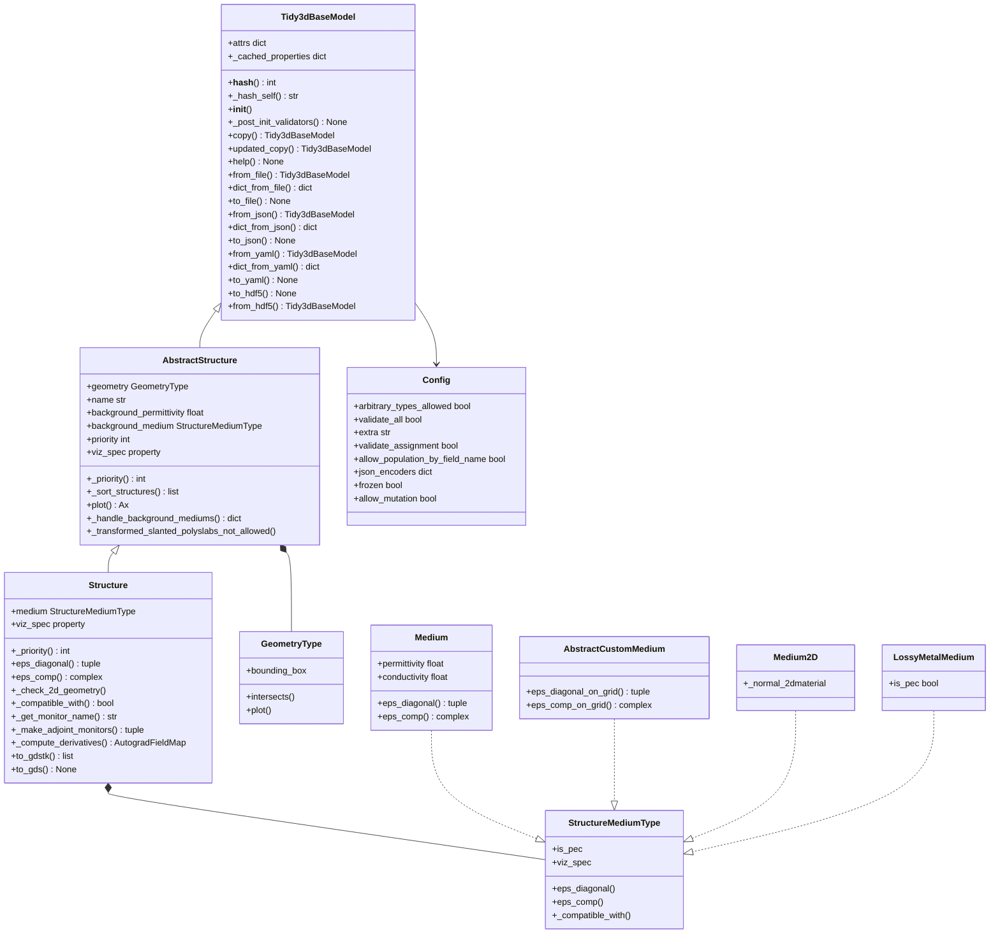

# Tidy3D Structure 类体系架构解析

## 概述

Tidy3D 的 Structure 类体系是电磁仿真中几何结构建模的核心框架。该体系通过面向对象设计，将几何形状与材料属性有机结合，为复杂的电磁结构提供了灵活而强大的建模能力。本文将深入解析这一类体系的架构设计、核心功能和实际应用。

## 类层次结构图


## 核心架构分析
### 基础框架：Tidy3dBaseModel
Tidy3dBaseModel 作为整个类体系的根基，继承自 Pydantic 的 BaseModel，为所有 Tidy3D 组件提供统一的基础功能。

核心功能：

1. 序列化与反序列化
   
   - 支持 JSON、YAML、HDF5 等多种格式的文件读写
   - 提供统一的数据交换接口
   - 便于配置文件管理和数据持久化
2. 数据验证机制
   
   - 基于 Pydantic 的强类型验证
   - 字段约束和自定义验证器
   - 确保数据的完整性和一致性
3. 缓存与性能优化
   
   - 通过 _cached_properties 实现属性缓存
   - 避免重复计算，提升性能
   - 支持大规模仿真的高效运行
4. 对象管理
   
   - 哈希支持，用于对象比较和去重
   - 不可变性保证（frozen=True）
   - 深拷贝和浅拷贝功能
重要特性：

- frozen=True ：对象创建后不可修改，确保数据一致性
- validate_assignment=True ：赋值时重新验证，防止无效数据
- 支持复杂类型（numpy 数组、xarray 等）的 JSON 编码
### 抽象结构基类：AbstractStructure
AbstractStructure 定义了所有结构类型的通用接口和基础属性，但不包含具体的材料信息。

核心属性：

- geometry ：几何形状（必需）
  
  - 使用判别器模式支持多种几何类型
  - 包括 Box、Sphere、Cylinder、Polygon 等
  - 支持复杂的几何组合和变换
- name ：结构名称（可选）
  
  - 便于识别和管理
  - 支持结构的分组和查找
- background_medium ：背景介质
  
  - 用于自动微分优化
  - 支持梯度计算和参数优化
- priority ：优先级
  
  - 处理结构重叠时的优先级规则
  - 支持复杂场景的结构管理
重要方法：

- _priority() ：根据优先级模式计算实际优先级
- _sort_structures() ：按优先级排序结构列表
- plot() ：绘制结构的几何截面图，支持可视化分析
### 具体结构类：Structure
Structure 是完整的物理结构实现，将几何形状与材料属性有机结合。

核心属性：

- medium ：材料介质（必需），定义结构的电磁特性
核心功能模块：
 1. 电磁特性计算
- eps_diagonal() ：计算介电常数张量的对角元素
- eps_comp() ：计算介电常数张量的单个分量
- 支持频率相关和空间相关的材料属性
- 提供精确的电磁场计算基础 2. 自动微分支持
- _make_adjoint_monitors() ：创建伴随场监视器
- _compute_derivatives() ：计算梯度信息
- 支持形状优化和拓扑优化
- 为逆向设计提供技术基础 3. 几何处理与导出
- to_gdstk() 、 to_gds() ：导出为 GDS 格式
- 支持光刻掩模制作
- _compatible_with() ：检查结构兼容性
- 确保仿真设置的合理性
## 材料系统架构
### StructureMediumType 接口
材料系统通过 StructureMediumType 接口统一管理，支持多种材料类型：
 1. 标准介质（Medium）
- 特征 ：基础的介电材料
- 参数 ：介电常数、电导率
- 应用 ：常规的介电材料建模 2. 自定义介质（AbstractCustomMedium）
- 特征 ：空间变化的材料属性
- 功能 ：支持复杂的材料分布
- 应用 ：梯度折射率材料、复合材料 3. 二维材料（Medium2D）
- 特征 ：具有二维特性的材料
- 应用 ：石墨烯、过渡金属硫化物等 4. 有损金属（LossyMetalMedium）
- 特征 ：考虑损耗的金属材料
- 应用 ：等离子体器件、金属纳米结构
## 设计模式与架构优势
### 1. 继承层次设计
- 清晰的抽象层次 ：从抽象到具体的逐步细化
- 代码复用 ：公共功能在基类中实现
- 易于扩展 ：新的结构类型可以方便地添加
### 2. 组合模式
- 灵活组合 ：Structure 包含 Geometry（几何）和 Medium（材料）
- 模块化设计 ：几何和材料可以独立变化
- 高度可配置 ：支持各种几何-材料组合
### 3. 验证器模式
- 数据完整性 ：使用 Pydantic 验证器确保数据一致性
- 依赖验证 ： @skip_if_fields_missing 装饰器处理复杂依赖
- 错误预防 ：在数据输入阶段就发现问题
### 4. 工厂模式
- 多态支持 ：通过 discriminator 支持多态的几何和材料类型
- 运行时创建 ：根据类型标签创建正确的对象
- 类型安全 ：编译时和运行时的双重类型检查
## 关键技术特性
### 1. 类型安全与验证
- 强类型系统 ：Pydantic 提供的强类型验证
- 运行时检查 ：动态类型验证和约束检查
- 错误定位 ：精确的错误信息和位置提示
### 2. 性能优化
- 缓存机制 ： @cached_property 缓存计算结果
- 不可变性 ：避免意外修改带来的性能损失
- 延迟计算 ：按需计算复杂属性
### 3. 序列化友好
- 多格式支持 ：JSON、YAML、HDF5 等格式
- 版本兼容 ：向后兼容的数据格式
- 压缩存储 ：支持大型数据的高效存储
### 4. 科学计算集成
- NumPy 集成 ：与 numpy 数组的无缝集成
- Autograd 支持 ：自动微分功能
- XArray 兼容 ：支持标记数组和坐标系统
## 实际应用场景
### 1. 光子学器件设计
```
# 创建一个硅波导结构
from tidy3d import Box, Medium, Structure

# 定义几何形状
waveguide = Box(center=(0, 0, 0), size=(10, 0.5, 0.
22))

# 定义材料
silicon = Medium(permittivity=12.25)  # 硅的介电常数

# 创建结构
wg_structure = Structure(
    geometry=waveguide, 
    medium=silicon, 
    name='silicon_waveguide'
)
```
### 2. 复杂器件建模
```
# 创建多层结构
structures = [
    Structure(geometry=substrate, medium=sio2, 
    name='substrate'),
    Structure(geometry=core, medium=silicon, 
    name='core'),
    Structure(geometry=cladding, medium=sio2, 
    name='cladding')
]

# 设置优先级
for i, struct in enumerate(structures):
    struct.priority = i
```
### 3. 数据管理与交换
```
# 保存结构配置
structure.to_file('waveguide_config.json')
structure.to_yaml('waveguide_config.yaml')

# 加载结构配置
loaded_structure = Structure.from_file
('waveguide_config.json')

# 批量处理
structures = [Structure.from_file(f'config_{i}.
json') for i in range(10)]
```
### 4. 电磁特性分析
```
# 计算介电常数
frequency = 1e14  # Hz
coords = np.array([[0, 0, 0], [1, 0, 0], [0, 1, 0]])

# 获取对角元素
eps_diag = structure.eps_diagonal
(frequency=frequency, coords=coords)

# 获取特定分量
eps_xx = structure.eps_comp(row=0, col=0, 
frequency=frequency, coords=coords)
```
### 5. 优化与设计
```
# 自动微分优化
from tidy3d.plugins.autograd import TracedFloat

# 可优化参数
width = TracedFloat(0.5)  # 波导宽度
height = TracedFloat(0.22)  # 波导高度

# 创建可优化结构
optimizable_geometry = Box(
    center=(0, 0, 0), 
    size=(10, width, height)
)

optimizable_structure = Structure(
    geometry=optimizable_geometry,
    medium=silicon,
    name='optimizable_waveguide'
)
```
## 扩展性与未来发展
### 1. 新材料类型支持
- 量子材料 ：支持量子点、量子阱等结构
- 超材料 ：人工设计的周期性结构
- 非线性材料 ：支持非线性光学效应
### 2. 高级几何功能
- 参数化几何 ：支持参数驱动的几何变化
- 拓扑优化 ：自动生成最优几何形状
- 多尺度建模 ：从纳米到宏观的跨尺度建模
### 3. 性能优化
- 并行计算 ：支持多核和GPU加速
- 内存优化 ：大规模结构的高效内存管理
- 分布式计算 ：支持集群和云计算
## 总结
Tidy3D 的 Structure 类体系展现了现代科学计算软件的优秀设计理念。通过清晰的抽象层次、灵活的组合机制和强大的验证系统，该框架为复杂电磁结构的建模提供了坚实的技术基础。

主要优势：

1. 类型安全 ：Pydantic 提供的强类型验证确保数据可靠性
2. 高度可扩展 ：通过继承和组合易于添加新功能
3. 序列化友好 ：支持多种文件格式，便于数据交换
4. 性能优化 ：缓存机制和不可变性保证高效运行
5. 科学计算集成 ：与 numpy、autograd 等库的深度集成
这一架构不仅满足了当前电磁仿真的需求，也为未来的技术发展预留了充足的扩展空间。无论是学术研究还是工业应用，都能在这个框架基础上构建出功能强大、性能优异的电磁仿真应用。

从简单的几何-材料组合到复杂的多物理场耦合，从静态结构分析到动态优化设计，Tidy3D 的 Structure 类体系为现代光子学和电磁学的研究与应用提供了强有力的技术支撑。