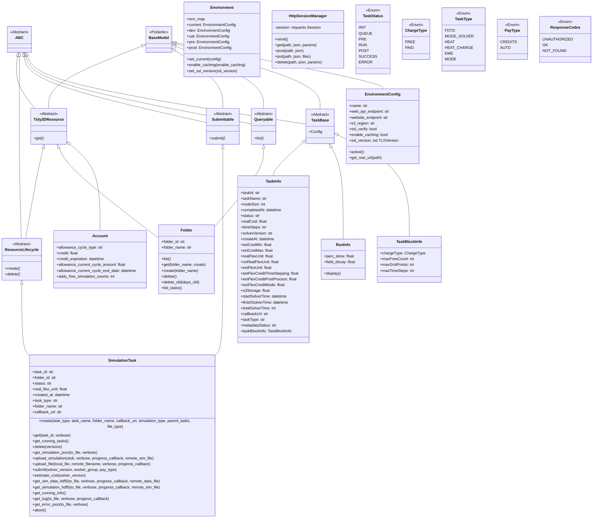
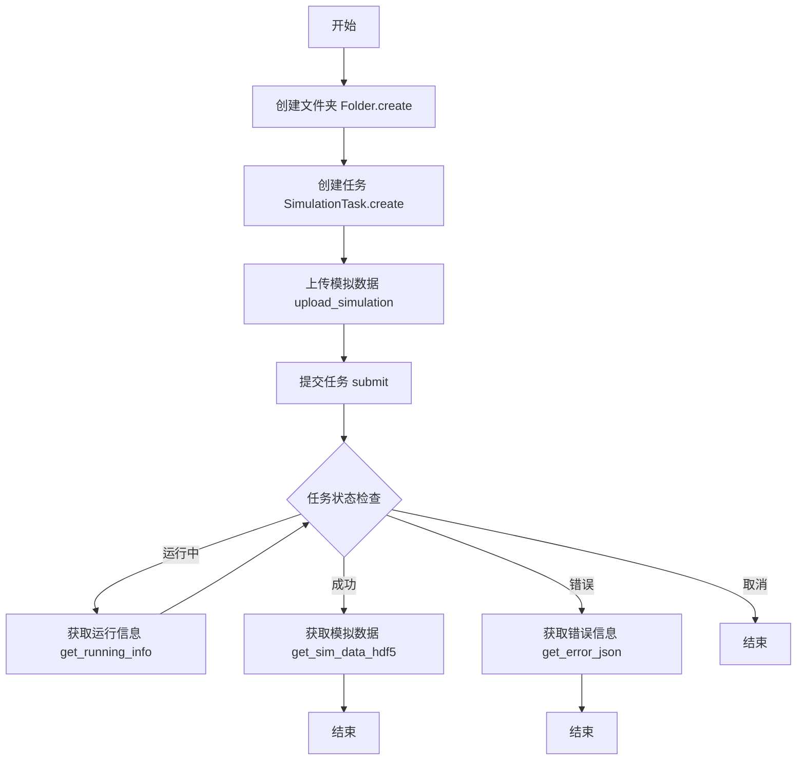
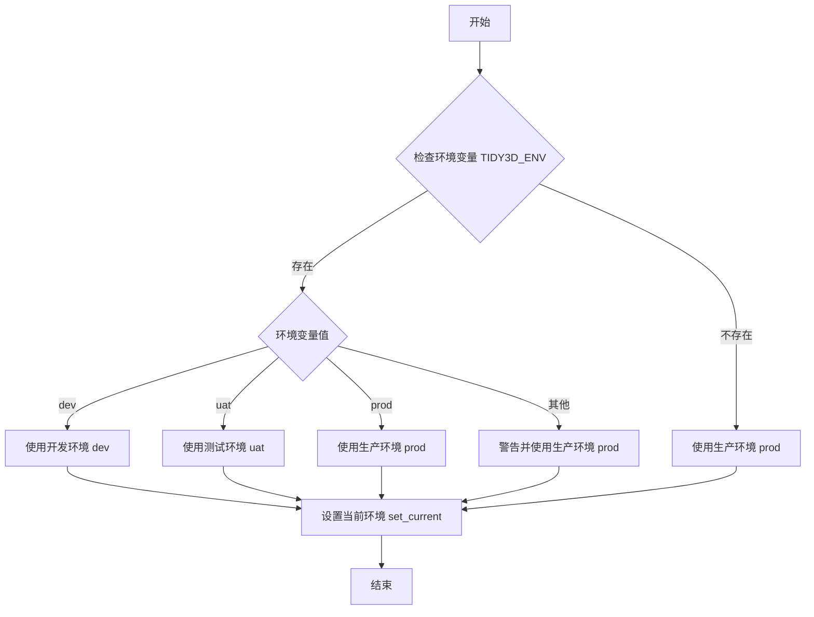
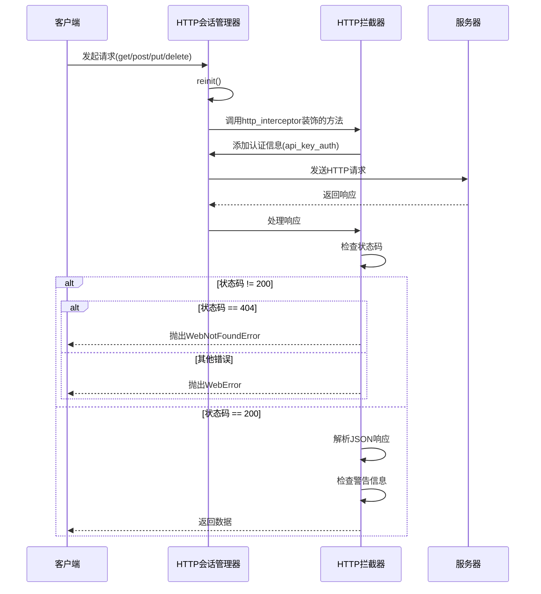
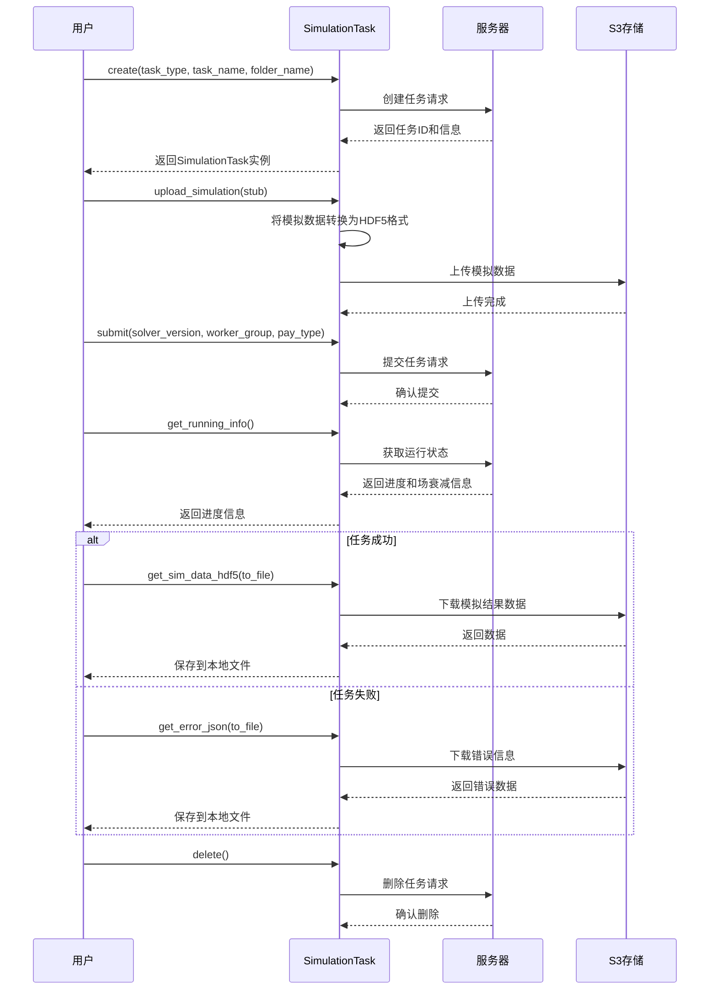

# Tidy3D Web Core 模块分析

1. 类图

2. 任务处理流程图

3. 环境配置流程图

4. HTTP请求处理泳道图

5. 任务生命周期泳道图

## 总结
Tidy3D Web Core 模块是一个用于与Tidy3D云服务进行交互的核心组件，主要功能包括：

1. 资源管理 ：通过抽象基类定义了资源的基本操作（获取、创建、删除、查询）
2. 任务处理 ：提供了创建、提交、监控和获取模拟任务结果的完整流程
3. 环境配置 ：支持多环境（开发、测试、生产）的灵活配置
4. HTTP通信 ：封装了与服务器的HTTP通信，包括认证、错误处理等
5. 文件处理 ：提供了文件压缩、上传、下载等功能
这些组件共同构成了一个完整的客户端SDK，使用户能够方便地使用Tidy3D的云计算服务进行电磁场模拟计算。