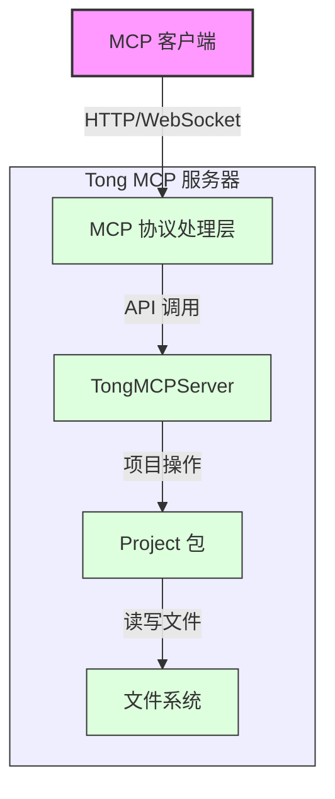

# Tong MCP 服务器使用指南与架构分析

## 1. 简介

Tong MCP（Model Context Protocol）服务器是基于 `project` 包构建的服务端组件，它通过 Model Context Protocol 协议提供项目文件管理、代码编辑、项目结构分析等功能。MCP 是一种为大型语言模型（LLM）设计的协议，允许模型与外部工具和资源交互，从而增强模型的能力。

## 2. 使用指南

### 2.1 启动 MCP 服务器

可以通过命令行启动 Tong MCP 服务器：

```bash
# 基本用法
tong mcp

# 指定端口
tong mcp --port 9000

# 指定项目目录
tong mcp --project /path/to/your/project

# 同时指定端口和项目目录
tong mcp --port 9000 --project /path/to/your/project
```

简写形式：

```bash
tong mcp -p 9000 -d /path/to/your/project
```

### 2.2 MCP 服务器功能

MCP 服务器提供的主要功能包括：

#### 文件操作工具

- **listFiles**：列出项目中或指定目录下的所有文件
- **readFile**：读取指定文件的内容
- **writeFile**：写入内容到指定文件
- **createFile**：创建一个新文件
- **createDirectory**：创建一个新目录
- **deleteFile**：删除指定文件或目录

#### 编辑器工具

- **findText**：在文件中查找文本
- **replaceText**：在文件中替换文本
- **formatCode**：格式化代码文件

#### 项目工具

- **getProjectInfo**：获取项目的基本信息
- **analyzeDependencies**：分析项目依赖
- **searchProject**：在项目中搜索内容
- **exportProject**：导出项目文档（支持 markdown 或 pdf 格式）

### 2.3 与 MCP 服务器交互

MCP 服务器启动后，会暴露一个 HTTP 端点（默认为 `http://localhost:8080/mcp`）。客户端可以通过该端点与 MCP 服务器进行交互。

交互方式基于 MCP 协议，通常需要一个支持 MCP 的客户端来调用服务器提供的工具和资源。

## 3. 架构分析

### 3.1 整体架构

Tong MCP 服务器采用了分层架构设计，主要包括以下几个层次：

1. **协议层**：基于 MCP 协议，处理客户端请求和响应
2. **服务层**：TongMCPServer 实现，提供工具注册和处理逻辑
3. **项目层**：利用 project 包提供的项目文件树管理功能
4. **文件系统层**：直接与操作系统的文件系统交互



### 3.2 核心组件

#### 3.2.1 TongMCPServer

`TongMCPServer` 是整个系统的核心组件，它负责：

- 初始化 MCP 服务器
- 注册工具和资源处理器
- 提供各种工具的具体实现

主要结构：

```go
type TongMCPServer struct {
    project     *project.Project
    projectPath string
    handlers    map[string]func(context.Context, mcp.CallToolRequest) (*mcp.CallToolResult, error)
}
```

#### 3.2.2 Project 包

`Project` 包提供了项目文件树的管理功能，是 MCP 服务器操作文件的基础：

- `Node`：表示文件树中的节点（文件或目录）
- `Project`：表示整个项目，包含根节点和项目路径
- 提供文件操作方法：创建、读取、写入、删除等

核心数据结构：

```go
type Node struct {
    Name     string
    IsDir    bool
    modified bool
    Info     os.FileInfo
    Content  []byte
    Children map[string]*Node
    Parent   *Node
    mu       sync.RWMutex
}

type Project struct {
    root     *Node
    rootPath string
    mu       sync.RWMutex
}
```

#### 3.2.3 MCP-Go 库

`mcp-go` 是实现 Model Context Protocol 的 Go 语言库，提供：

- MCP 服务器的基础框架
- 工具和资源的抽象
- 协议通信的处理

主要组件：

- `server.MCPServer`：MCP 服务器的基础实现
- `mcp.Tool`：工具定义
- `mcp.Resource`：资源定义

### 3.3 工作流程

1. **服务器启动**：
   - 通过 `cmd/mcp.go` 中的 `runMCP` 函数初始化并启动服务器
   - 创建项目实例和 MCP 服务器实例
   - 注册工具和资源处理器
   - 启动 HTTP 服务监听请求

2. **请求处理**：
   - 客户端发送 MCP 协议请求
   - MCP 服务器解析请求并路由到相应的工具或资源处理器
   - 处理器调用 Project 包中的方法执行实际操作
   - 返回结果给客户端

3. **工具执行**：
   - 每个工具都有对应的处理函数
   - 处理函数接收参数，调用 Project 包的方法
   - 返回执行结果

### 3.4 关键技术特点

1. **异步处理**：
   - 使用 Go 的 goroutine 进行并发处理
   - 支持优雅关闭服务器

2. **项目树结构**：
   - 内存中维护完整的项目文件树
   - 利用互斥锁（mutex）保证并发安全

3. **MCP 协议集成**：
   - 完全兼容 Model Context Protocol
   - 支持工具和资源的注册与调用

4. **文件系统操作**：
   - 实现文件的创建、读取、更新、删除
   - 支持目录操作和文件内容搜索

## 4. 扩展与优化

### 4.1 扩展方向

1. **更多工具支持**：
   - 代码分析工具（静态分析、类型检查等）
   - 代码生成工具
   - 项目构建与测试工具

2. **权限控制**：
   - 增加用户认证机制
   - 文件操作权限控制

3. **多项目支持**：
   - 管理多个项目
   - 项目间资源共享

### 4.2 性能优化

1. **缓存机制**：
   - 文件内容缓存
   - 查询结果缓存

2. **并发控制**：
   - 更细粒度的锁控制
   - 读写分离优化

3. **内存管理**：
   - 大文件处理优化
   - 内存使用监控

## 5. 总结

Tong MCP 服务器是一个将项目管理能力通过 Model Context Protocol 暴露给大型语言模型的服务端组件。它利用 `project` 包提供的文件树管理功能，结合 `mcp-go` 库的协议支持，实现了丰富的项目文件操作、编辑和分析功能。

这种架构设计使得 LLM 可以直接访问和操作项目文件，大大增强了 AI 辅助编程的能力。同时，分层的设计也使系统具有良好的可扩展性和可维护性，为未来添加更多功能提供了基础。

通过 MCP 服务器，开发者可以构建更强大的 AI 辅助开发工具，让 AI 不仅能理解代码，还能直接参与到代码的创建和修改过程中。
