# Tong Project 包分析

## 概述

Tong 项目的 `project` 包是整个系统的核心组件之一，负责管理和操作项目的文件结构。该包实现了一个内存中的文件系统树，支持文件和目录的创建、读取和写入操作，并提供了遍历、访问和导出功能。此外，它还包含了一个现代编辑器 API，用于高效、精确地对项目内文件进行文本编辑操作，并支持与大模型和自动化工具的集成。

在最新的设计中，该包采用了更加面向对象的方法，明确划分了 `Node` 和 `Project` 的职责。`Node` 负责管理自身的内容和结构，提供内容读写、子节点管理等功能；而 `Project` 则专注于路径解析、节点查找和整体协调，通过调用相应 `Node` 的方法来实现文件操作。这种责任分离使得代码结构更加清晰，也更符合单一职责原则。

## 架构设计

### 核心数据结构

```mermaid
classDiagram
    class Node {
        +string Name
        +bool IsDir
        +os.FileInfo Info
        +[]byte Content
        +map[string]*Node Children
        +Node* Parent
        +sync.RWMutex mu
        +CalculateHash() string
        +ReadContent() ([]byte, error)
        +WriteContent(content []byte) error
        +CountNodes() int
        +GetFiles(basePath string) []string
        +ListFiles() []string
        +AddChild(child *Node) error
        +GetChild(name string) (*Node, bool)
    }
    
    class Project {
        -Node* root
        -string rootPath
        -sync.RWMutex mu
        +CreateDir(path string, info os.FileInfo) error
        +CreateFile(path string, content []byte, info os.FileInfo) error
        +ReadFile(path string) ([]byte, error)
        +WriteFile(path string, content []byte) error
        +IsEmpty() bool
        +GetAbsolutePath(path string) string
        +GetTotalNodes() int
        +GetAllFiles() []string
        +ListFiles() []string
        +GetName() string
        +FindNode(path string) (*Node, error)
    }
    
    class TreeTraverser {
        -Project* project
        -TraverseOrder order
        -TraverseOption* option
        -sync.WaitGroup wg
        +SetOption(option *TraverseOption)
        +SetTraverseOrder(order TraverseOrder) *TreeTraverser
        +TraverseTree(visitor NodeVisitor) error
        +Traverse(node *Node, path string, level int, visitor NodeVisitor) error
    }
    
    class NodeVisitor {
        <<interface>>
        +VisitDirectory(node *Node, path string, level int) error
        +VisitFile(node *Node, path string, level int) error
    }
    
    class Exporter {
        <<interface>>
        +Export(outputPath string) error
    }
    
    class ContentCollector {
        <<interface>>
        +AddTitle(title string, level int) error
        +AddContent(content string) error
        +AddTOCItem(title string, level int) error
        +Render(outputPath string) error
    }
    
    class EditorAPI {
        -Project* project
        +ApplyEdit(filePath string, edit TextEdit) error
        +ApplyEdits(filePath string, edits []TextEdit) error
        +FindText(filePath string, searchText string, caseSensitive bool) ([]Range, error)
        +ReplaceAll(filePath string, searchText, replaceText string, caseSensitive bool) (int, error)
    }
    
    class EditorSession {
        -EditorAPI* editor
        -string filePath
        -[]TextEdit editHistory
        -[]TextEdit undoStack
        -[]TextEdit redoStack
        +ApplyEdit(edit TextEdit) error
        +Undo() error
        +Redo() error
        +SmartIndent(line int) error
        +FormatCode(startLine, endLine int) error
    }
    
    class EditorIntegration {
        -EditorAPI* editor
        -CommandRegistry* commandRegistry
        -map[string]*EditorSession openSessions
        +OpenFile(filePath string) (*EditorSession, error)
        +ExecuteCommand(cmdType CommandType, name string, filePath string, args map[string]any) (*CommandResult, error)
        +ProcessModelRequest(req ModelIntegrationRequest) (*ModelIntegrationResponse, error)
    }
    
    class CommandRegistry {
        -map[string]EditorCommand commands
        +RegisterCommand(cmd EditorCommand)
        +ExecuteCommand(cmdType CommandType, name string, editor *EditorAPI, session *EditorSession, args map[string]any) (*CommandResult, error)
    }
    
    Project "1" *-- "1" Node : contains
    Node "1" *-- "*" Node : children
    Project "1" -- "1" TreeTraverser : uses
    TreeTraverser "1" -- "1" NodeVisitor : uses
    Exporter --|> NodeVisitor : implements
    BaseExporter --|> Exporter : implements
    BaseExporter "1" -- "1" ContentCollector : uses
    Project "1" -- "1" EditorAPI : used by
    EditorAPI "1" -- "*" EditorSession : creates
    EditorIntegration "1" -- "1" EditorAPI : uses
    EditorIntegration "1" -- "1" CommandRegistry : uses
    EditorIntegration "1" -- "*" EditorSession : manages
```



### 文件组织

`project` 包由以下文件组成：

1. **type.go**: 定义了基本的数据结构，包括 `Node` 和 `Project` 结构体，以及 `Item` 和 `Response` 结构体。
2. **node.go**: 实现了 `Node` 结构体的方法，包括内容读写、哈希计算、子节点管理等核心功能。
3. **project.go**: 实现了 `Project` 结构体的方法，包括文件和目录的创建、路径解析和节点查找等操作。
4. **traverser.go**: 实现了树遍历器，支持前序、中序和后序遍历，以及并发遍历。
5. **visitor.go**: 实现了访问者模式，用于在遍历过程中处理节点。
6. **builder.go**: 提供了从实际文件系统构建项目树的功能。
7. **exporter.go**: 定义了项目导出的接口和基本实现。
8. **editor.go**: 实现了编辑器 API 的核心功能，如文本编辑、查找替换等。
9. **editor_session.go**: 实现了编辑会话，包括撤销/重做、智能缩进等功能。
10. **editor_commands.go**: 实现了命令系统，支持格式化、重构等操作。
11. **editor_integration.go**: 提供了与大模型和自动化工具集成的接口。

## 核心功能分析

### 1. 项目树构建

`builder.go` 中的 `BuildProjectTree` 函数负责从实际文件系统构建内存中的项目树。它支持：

- 排除特定目录（如 `.git`、`node_modules` 等）
- 处理 `.gitignore` 规则
- 根据文件扩展名过滤文件
- 支持自定义排除规则

### 2. 树遍历与访问

`traverser.go` 和 `visitor.go` 实现了灵活的树遍历机制：

- 支持前序、中序和后序三种遍历顺序
- 实现了访问者模式，将遍历和节点处理逻辑分离
- 支持并发遍历，提高处理效率
- 提供错误处理和超时机制

### 3. 项目导出

`exporter.go` 定义了项目导出的接口和基本实现：

- 定义了 `ContentCollector` 接口，用于收集导出内容
- 实现了 `BaseExporter`，提供基本的导出功能
- 支持目录结构和文件内容的导出

### 4. 节点功能与职责

`node.go` 实现了 `Node` 结构体的功能，作为整个项目树的基本构建单元：

- **内容管理**: 通过 `ReadContent` 和 `WriteContent` 方法，负责自身内容的读取和写入
- **子节点管理**: 提供 `AddChild` 和 `GetChild` 方法，实现节点树结构的管理
- **节点统计**: 通过 `CountNodes` 方法，可以递归计算节点及其子树包含的节点数量
- **文件获取**: 通过 `GetFiles` 方法，可以获取节点子树中的所有文件路径，通过 `ListFiles` 方法可以获取所有文件名
- **哈希计算**: 计算节点及其子树的哈希值，用于内容比较和变更检测

```go
// Node 功能示例
node, _ := project.FindNode("src/main.go")

// 读取内容
content, _ := node.ReadContent()

// 修改内容
node.WriteContent([]byte("package main\n\nfunc main() {\n}\n"))

// 获取子节点
child, exists := node.GetChild("subdir")

// 统计节点数量
count := node.CountNodes()

// 获取所有文件名
fileNames := node.ListFiles()
```

### 5. 编辑器 API

`editor.go` 实现了编辑器 API 的核心功能，提供了类似现代编辑器的文本操作能力：

- **文本编辑**: 支持在文件的任意位置进行文本插入、删除和替换
- **查找替换**: 支持基本和高级的文本查找和替换，包括大小写敏感、整词匹配等选项
- **范围操作**: 支持对文本范围进行读取和编辑
- **行尾处理**: 支持不同操作系统的行尾格式（LF、CRLF、CR）

```go
// EditorAPI 示例用法
editor := NewEditorAPI(project)

// 插入文本
editor.InsertText("main.go", 10, 5, "新代码")

// 查找替换
count, _ := editor.ReplaceAll("main.go", "oldText", "newText", true)
fmt.Printf("替换了 %d 处文本\n", count)
```

### 6. 编辑会话

`editor_session.go` 实现了编辑会话功能，为编辑操作提供了更高级的功能：

- **撤销/重做**: 支持对编辑操作进行撤销和重做
- **智能缩进**: 根据上下文自动调整代码缩进
- **智能选择**: 智能识别和选择代码块或语法元素
- **批量编辑**: 支持对多行进行批量操作

```go
// EditorSession 示例用法
session := NewEditorSession(editor, "main.go")

// 应用编辑并记录历史
edit := TextEdit{StartLine: 5, StartColumn: 0, EndLine: 5, EndColumn: 10, NewText: "修改后的文本"}
session.ApplyEdit(edit)

// 撤销上一次编辑
session.Undo()

// 智能缩进当前行
session.SmartIndent(5)
```

### 7. 命令系统

`editor_commands.go` 实现了可扩展的命令系统，支持各种高级编辑操作：

- **格式化**: 对代码进行格式化
- **重构**: 支持代码重构
- **整理导入**: 自动整理和排序导入语句
- **代码生成**: 生成常用代码片段
- **自定义命令**: 支持注册和执行自定义命令

```go
// CommandRegistry 示例用法
registry := NewCommandRegistry()

// 注册自定义命令
registry.RegisterCommand(EditorCommand{
    Type: CommandCustom,
    Name: "generateGetter",
    ApplyFunc: func(editor *EditorAPI, session *EditorSession, args map[string]interface{}) error {
        // 命令实现...
        return nil
    },
})

// 执行命令
result, _ := registry.ExecuteCommand(CommandFormat, "document", editor, session, nil)
```

### 8. 大模型与自动化工具集成

`editor_integration.go` 提供了与大模型和自动化工具集成的接口，实现了：

- **会话管理**: 管理多个文件的编辑会话
- **命令执行**: 提供统一的命令执行接口
- **模型集成**: 支持与大模型进行交互，处理格式化、自动完成等请求
- **代码操作**: 支持获取和应用代码操作建议

```go
// EditorIntegration 示例用法
integration := NewEditorIntegration(project)

// 打开文件
session, _ := integration.OpenFile("main.go")

// 执行命令
result, _ := integration.ExecuteCommand(CommandFormat, "document", "main.go", nil)

// 处理大模型请求
response, _ := integration.ProcessModelRequest(ModelIntegrationRequest{
    Action:   "format",
    FilePath: "main.go",
})
```

## 编辑器 API 与 Project 的关系

编辑器 API 是对 Project 功能的扩展和增强，两者之间形成了紧密的协作关系：

1. **依赖关系**:
   - `EditorAPI` 持有对 `Project` 的引用，依赖 `Project` 提供的文件路径解析和节点查找能力
   - 编辑操作通过 `Project` 查找到相应的 `Node`，然后使用 `Node` 的 `ReadContent` 和 `WriteContent` 方法实现

2. **分层结构**:
   ```
   +-------------------+
   | EditorIntegration |
   +-------------------+
            |
            V
   +-------------------+
   |    EditorSession  |
   +-------------------+
            |
            V
   +-------------------+
   |     EditorAPI     |
   +-------------------+
            |
            V
   +-------------------+
   |      Project      |
   +-------------------+
            |
            V
   +-------------------+
   |        Node       |
   +-------------------+
   ```

3. **功能扩展**:
   - `Node` 提供基础的内容管理功能（读取、写入内容）
   - `Project` 提供路径解析和节点组织功能（查找节点、创建文件/目录）
   - `EditorAPI` 在此基础上提供了更细粒度的文本操作（插入、删除、替换、查找）
   - `EditorSession` 进一步提供了高级编辑功能（撤销/重做、智能缩进）
   - `EditorIntegration` 最终提供了与外部系统集成的能力

4. **数据流动**:
   - 编辑操作 → `EditorAPI` → `Project.FindNode` → `Node.ReadContent` → 文本处理 → `Node.WriteContent` → 更新文件

## 设计模式应用

### 在原有项目中的设计模式

1. **组合模式**: `Node` 结构体通过 `Children` 和 `Parent` 字段形成树状结构。
2. **访问者模式**: `NodeVisitor` 接口和 `VisitorFunc` 类型实现了访问者模式，将数据结构和操作分离。
3. **策略模式**: `TraverseOrder` 类型和相关方法实现了不同的遍历策略。
4. **适配器模式**: `VisitorFunc` 类型适配了函数到 `NodeVisitor` 接口。

### 在编辑器 API 中的设计模式

1. **命令模式**: `EditorCommand` 和 `CommandRegistry` 实现了命令模式，将请求封装为对象，支持请求排队、记录日志和撤销操作。

2. **备忘录模式**: `EditorSession` 中的撤销/重做功能利用了备忘录模式，保存对象的内部状态，以便在需要时恢复。

3. **外观模式**: `EditorIntegration` 为复杂的编辑功能提供了一个统一的简化接口，对外部系统隐藏内部复杂性。

4. **工厂模式**: 各种创建函数（如 `NewEditorAPI`、`NewEditorSession`）实现了工厂模式，封装对象的创建过程。

5. **观察者模式**: 编辑操作和命令执行可以通过事件系统通知观察者，实现松耦合的通信。

## 并发控制

该包在多处使用了并发控制机制：

1. `sync.RWMutex` 用于保护 `Node` 和 `Project` 的并发访问。
2. `sync.WaitGroup` 用于等待并发任务完成。
3. 信号量（通过 channel 实现）用于限制并发数量。
4. 超时机制防止长时间阻塞。

## 架构优化建议

### 原有架构优化建议

1. **接口分离**: 当前 `NodeVisitor` 接口同时处理文件和目录，可以考虑分离为 `FileVisitor` 和 `DirectoryVisitor`，遵循接口分离原则。

2. **错误处理增强**: 可以考虑使用更结构化的错误处理机制，如定义特定类型的错误和错误码。

3. **配置抽象**: 当前的排除规则和遍历选项可以进一步抽象，提供更灵活的配置机制。

4. **缓存机制**: 对于频繁访问的节点或计算结果（如哈希值），可以考虑添加缓存机制。

5. **Node接口化**: 考虑将 `Node` 的功能定义为接口，允许不同的实现（例如内存节点、远程节点等）。

6. **路径解析优化**: 将部分路径解析逻辑进一步下移到 `Node` 中，例如添加 `FindDescendant` 方法。

### 编辑器 API 优化建议

1. **索引与缓存**: 对于大文件的操作，可以实现文本索引和缓存机制，加速文本查找和编辑操作。

2. **语言服务集成**: 扩展 `EditorIntegration` 以支持与语言服务器（Language Server Protocol）的集成，提供更强大的代码智能功能。

3. **增量更新机制**: 实现文件内容的增量更新机制，减少文件读写操作，提高性能。

4. **插件系统**: 设计插件系统，允许通过插件扩展编辑器功能，增强灵活性。

5. **并发编辑优化**: 增强并发编辑的支持，处理多个会话对同一文件的并发编辑。

## 总结

`project` 包是 Tong 项目的核心组件，提供了强大的项目文件结构管理和编辑功能。它采用了多种设计模式，实现了灵活的树遍历、访问机制和高效的文本编辑能力。通过 `EditorAPI`、`EditorSession` 和 `EditorIntegration` 三个层次，形成了完整的编辑器功能体系，支持从基本的文本操作到高级的智能编辑和外部集成。

在最新的设计中，通过增强 `Node` 的职责，使其直接管理自身内容和子节点，同时将 `Project` 的职责聚焦于路径解析和节点协调，整个架构变得更加符合面向对象设计原则和单一职责原则。这种责任明确的分层结构既保持了关注点分离，又实现了功能的递进增强，使得系统具有高度的模块化和可扩展性。

通过合理的并发控制和优化机制，该包能够高效地处理大型项目结构和复杂的编辑操作，为用户提供类似现代编辑器的高效、精确的文本处理体验。这种职责分明的设计也为未来的功能扩展和性能优化提供了良好的基础。