# UVF Controller 架构解读

## 概述

UVF (Unified Visualization Framework) 的 Controller 架构是一个复杂的 3D 场景管理系统，通过多个专业化的 Controller 组件来管理几何对象、分组、材质、环境和用户交互。整个架构基于信号系统 (Signal System) 实现响应式状态管理。

## 核心架构图

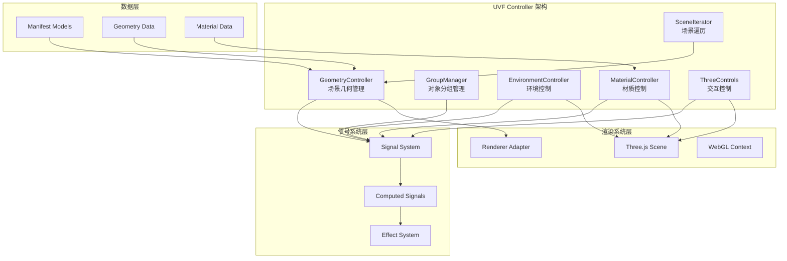
```mermaid
graph TB
    subgraph "UVF Controller 架构"
        GC[GeometryController<br/>场景几何管理]
        GM[GroupManager<br/>对象分组管理]
        EC[EnvironmentController<br/>环境控制]
        MC[MaterialController<br/>材质控制]
        TC[ThreeControls<br/>交互控制]
        SI[SceneIterator<br/>场景遍历]
    end
    
    subgraph "信号系统层"
        Signal[Signal System]
        Computed[Computed Signals]
        Effects[Effect System]
    end
    
    subgraph "渲染系统层"
        Renderer[Renderer Adapter]
        ThreeJS[Three.js Scene]
        WebGL[WebGL Context]
    end
    
    subgraph "数据层"
        Manifest[Manifest Models]
        Geometry[Geometry Data]
        Materials[Material Data]
    end
    
    GC --> Signal
    GM --> Signal
    EC --> Signal
    MC --> Signal
    TC --> Signal
    
    Signal --> Computed
    Computed --> Effects
    
    GC --> Renderer
    EC --> ThreeJS
    MC --> ThreeJS
    TC --> ThreeJS
    
    Manifest --> GC
    Geometry --> GC
    Materials --> MC
    
    SI --> GC
```

## GeometryController - 核心场景管理器

### 职责概述

`GeometryController` 是 UVF 的核心控制器，负责管理整个 3D 场景的几何对象生命周期、实例化、层次结构和状态同步。

### 核心特性

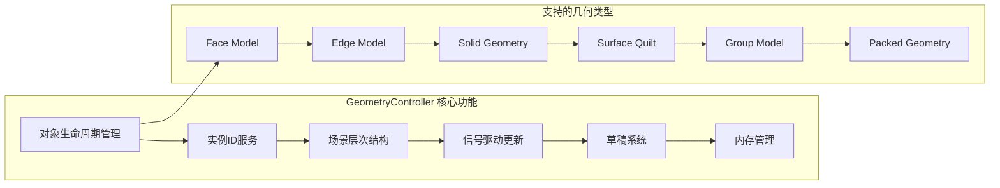
```mermaid
graph LR
    subgraph "GeometryController 核心功能"
        A[对象生命周期管理] --> B[实例ID服务]
        B --> C[场景层次结构]
        C --> D[信号驱动更新]
        D --> E[草稿系统]
        E --> F[内存管理]
    end
    
    subgraph "支持的几何类型"
        G[Face Model] --> H[Edge Model]
        H --> I[Solid Geometry]
        I --> J[Surface Quilt]
        J --> K[Group Model]
        K --> L[Packed Geometry]
    end
    
    A --> G
```

### 主要组件

1. **信号映射系统**
   ```typescript
   private signals: Map<ManifestObjectId, ManifestObjectSignal<AnyManifestObjectModel>>
   private draftSignals: Map<ManifestObjectId, AnyDraftableModel>
   ```

2. **根组信号**
   ```typescript
   private readonly rootGroupSignalSignal = signal<
     ReadonlyManifestObjectSignal<GeometryGroupModel> | undefined
   >()
   ```

3. **分层数据管理**
   ```typescript
   private orphansById = new MultiMap<ManifestObjectId, ManifestObjectId, Set<ManifestObjectId>>()
   private draftsByGroupId = new MultiMap<GeometryGroupId, AnyDraftableModel | null>()
   ```

### 生命周期管理

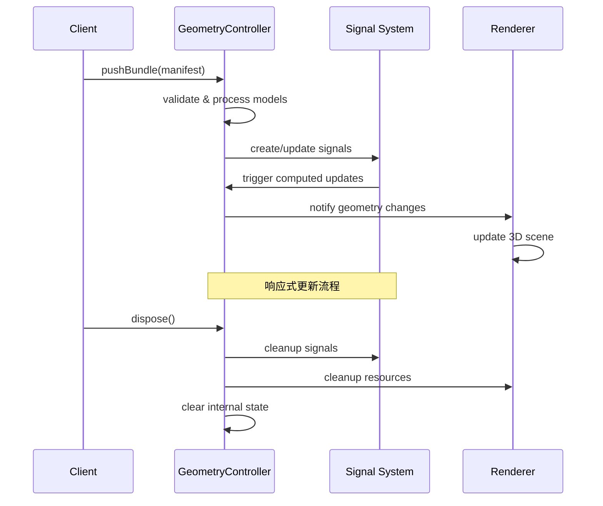
```mermaid
sequenceDiagram
    participant Client
    participant GC as GeometryController
    participant Signal as Signal System
    participant Renderer
    
    Client->>GC: pushBundle(manifest)
    GC->>GC: validate & process models
    GC->>Signal: create/update signals
    Signal->>GC: trigger computed updates
    GC->>Renderer: notify geometry changes
    Renderer->>Renderer: update 3D scene
    
    Note over GC,Signal: 响应式更新流程
    
    Client->>GC: dispose()
    GC->>Signal: cleanup signals
    GC->>Renderer: cleanup resources
    GC->>GC: clear internal state
```

## GroupManager - 对象分组管理

### 设计理念

`GroupManager` 提供了一个灵活的对象分组系统，允许将多个几何对象归类到命名组中，并为每个组定义共享属性。

### 核心数据结构

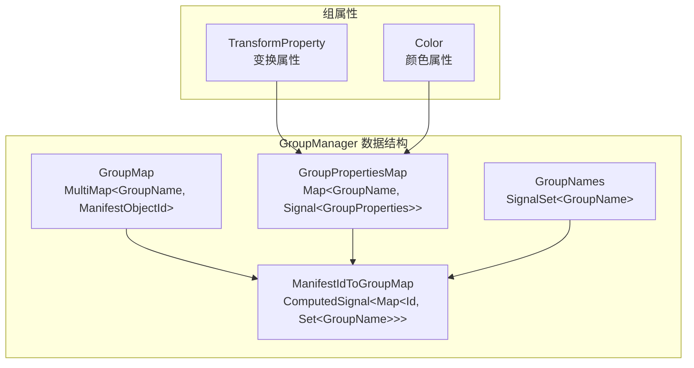
```mermaid
graph TB
    subgraph "GroupManager 数据结构"
        A[GroupMap<br/>MultiMap&lt;GroupName, ManifestObjectId&gt;] 
        B[GroupPropertiesMap<br/>Map&lt;GroupName, Signal&lt;GroupProperties&gt;&gt;]
        C[GroupNames<br/>SignalSet&lt;GroupName&gt;]
        D[ManifestIdToGroupMap<br/>ComputedSignal&lt;Map&lt;Id, Set&lt;GroupName&gt;&gt;&gt;]
    end
    
    A --> D
    B --> D
    C --> D
    
    subgraph "组属性"
        E[TransformProperty<br/>变换属性]
        F[Color<br/>颜色属性]
    end
    
    E --> B
    F --> B
```

### 分组操作流程

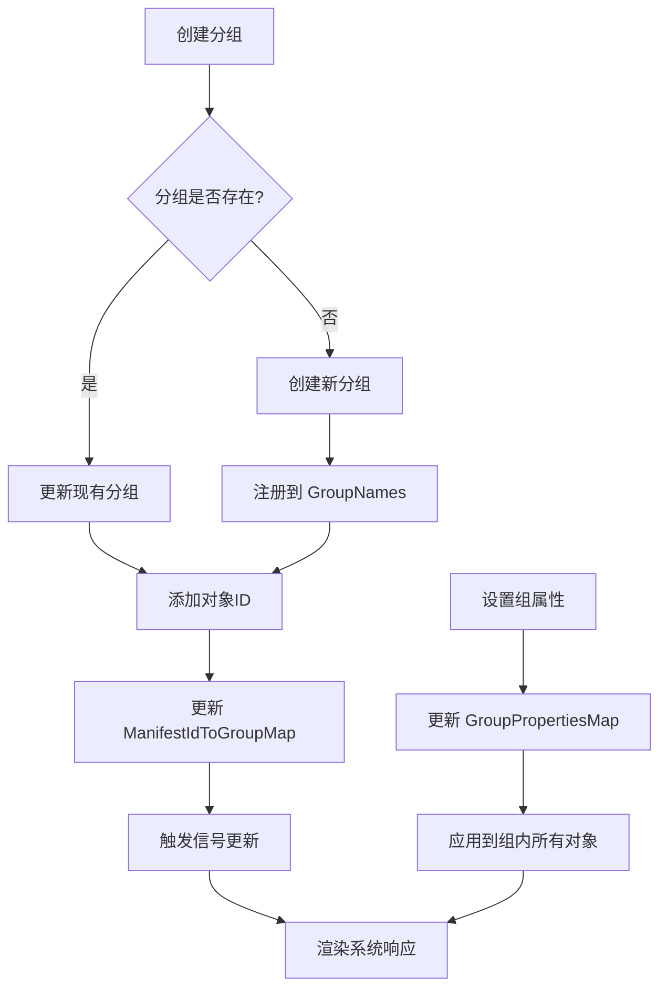
```mermaid
flowchart TD
    A[创建分组] --> B{分组是否存在?}
    B -->|否| C[创建新分组]
    B -->|是| D[更新现有分组]
    
    C --> E[注册到 GroupNames]
    D --> F[添加对象ID]
    E --> F
    
    F --> G[更新 ManifestIdToGroupMap]
    G --> H[触发信号更新]
    H --> I[渲染系统响应]
    
    J[设置组属性] --> K[更新 GroupPropertiesMap]
    K --> L[应用到组内所有对象]
    L --> I
```

## SceneIterator - 场景遍历系统

### 节点类型层次

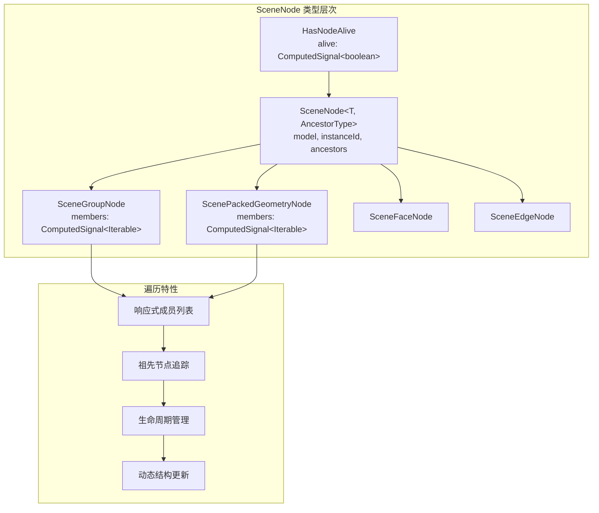
```mermaid
graph TB
    subgraph "SceneNode 类型层次"
        A[HasNodeAlive<br/>alive: ComputedSignal&lt;boolean&gt;]
        B[SceneNode&lt;T, AncestorType&gt;<br/>model, instanceId, ancestors]
        C[SceneGroupNode<br/>members: ComputedSignal&lt;Iterable&gt;]
        D[ScenePackedGeometryNode<br/>members: ComputedSignal&lt;Iterable&gt;]
        E[SceneFaceNode]
        F[SceneEdgeNode]
    end
    
    A --> B
    B --> C
    B --> D
    B --> E
    B --> F
    
    subgraph "遍历特性"
        G[响应式成员列表] --> H[祖先节点追踪]
        H --> I[生命周期管理]
        I --> J[动态结构更新]
    end
    
    C --> G
    D --> G
```

### 场景遍历模式

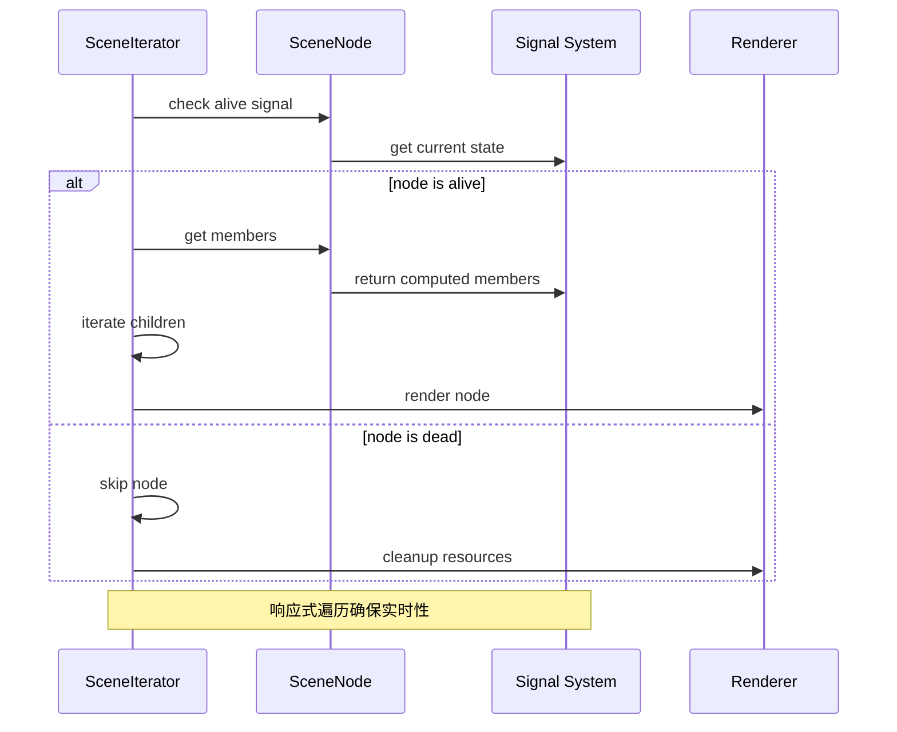
```mermaid
sequenceDiagram
    participant Iterator as SceneIterator
    participant Node as SceneNode
    participant Signal as Signal System
    participant Renderer
    
    Iterator->>Node: check alive signal
    Node->>Signal: get current state
    
    alt node is alive
        Iterator->>Node: get members
        Node->>Signal: return computed members
        Iterator->>Iterator: iterate children
        Iterator->>Renderer: render node
    else node is dead
        Iterator->>Iterator: skip node
        Iterator->>Renderer: cleanup resources
    end
    
    Note over Iterator,Signal: 响应式遍历确保实时性
```

## EnvironmentController - 环境控制

### 环境管理职责

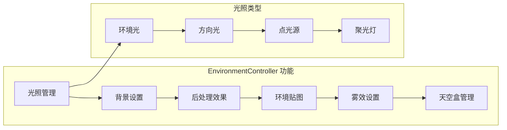
```mermaid
graph LR
    subgraph "EnvironmentController 功能"
        A[光照管理] --> B[背景设置]
        B --> C[后处理效果]
        C --> D[环境贴图]
        D --> E[雾效设置]
        E --> F[天空盒管理]
    end
    
    subgraph "光照类型"
        G[环境光] --> H[方向光]
        H --> I[点光源]
        I --> J[聚光灯]
    end
    
    A --> G
```

### 环境状态管理

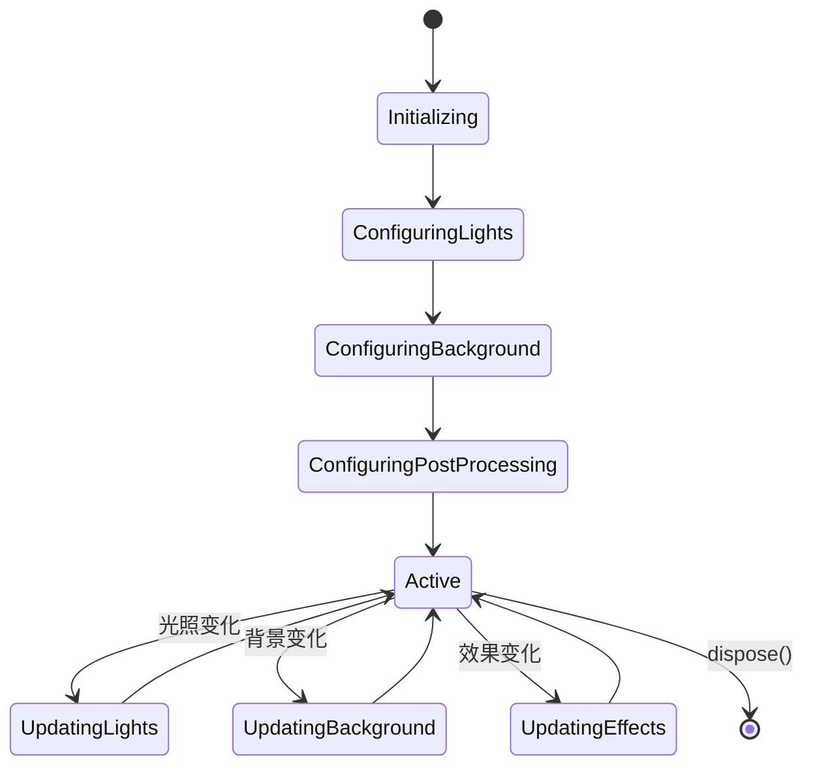
```mermaid
stateDiagram-v2
    [*] --> Initializing
    Initializing --> ConfiguringLights
    ConfiguringLights --> ConfiguringBackground
    ConfiguringBackground --> ConfiguringPostProcessing
    ConfiguringPostProcessing --> Active
    
    Active --> UpdatingLights: 光照变化
    UpdatingLights --> Active
    
    Active --> UpdatingBackground: 背景变化
    UpdatingBackground --> Active
    
    Active --> UpdatingEffects: 效果变化
    UpdatingEffects --> Active
    
    Active --> [*]: dispose()
```

## MaterialController - 材质控制

### 材质管理架构

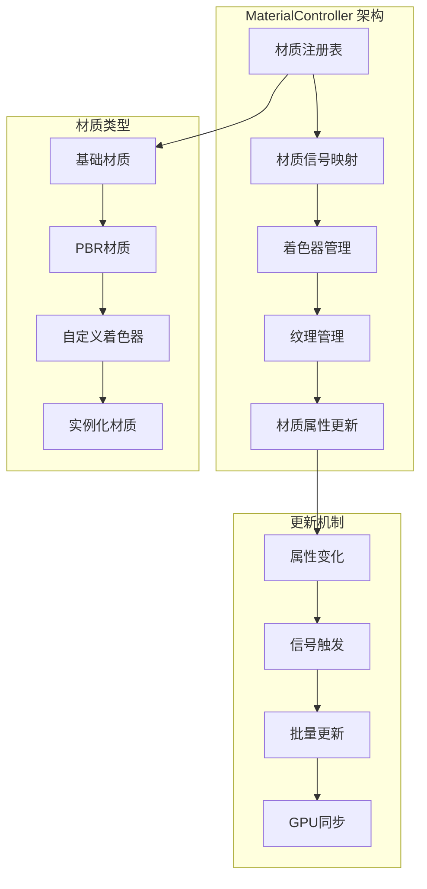
```mermaid
graph TB
    subgraph "MaterialController 架构"
        A[材质注册表] --> B[材质信号映射]
        B --> C[着色器管理]
        C --> D[纹理管理]
        D --> E[材质属性更新]
    end
    
    subgraph "材质类型"
        F[基础材质] --> G[PBR材质]
        G --> H[自定义着色器]
        H --> I[实例化材质]
    end
    
    A --> F
    
    subgraph "更新机制"
        J[属性变化] --> K[信号触发]
        K --> L[批量更新]
        L --> M[GPU同步]
    end
    
    E --> J
```

## ThreeControls - 交互控制

### 控制系统组件

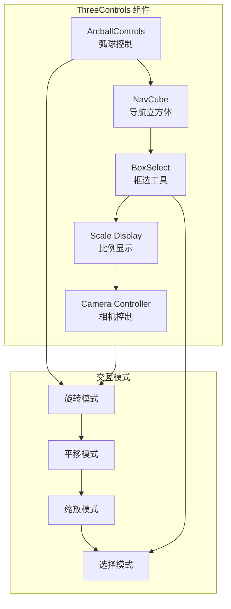
```mermaid
graph TB
    subgraph "ThreeControls 组件"
        A[ArcballControls<br/>弧球控制] --> B[NavCube<br/>导航立方体]
        B --> C[BoxSelect<br/>框选工具]
        C --> D[Scale Display<br/>比例显示]
        D --> E[Camera Controller<br/>相机控制]
    end
    
    subgraph "交互模式"
        F[旋转模式] --> G[平移模式]
        G --> H[缩放模式]
        H --> I[选择模式]
    end
    
    A --> F
    C --> I
    E --> F
```

### 交互事件流

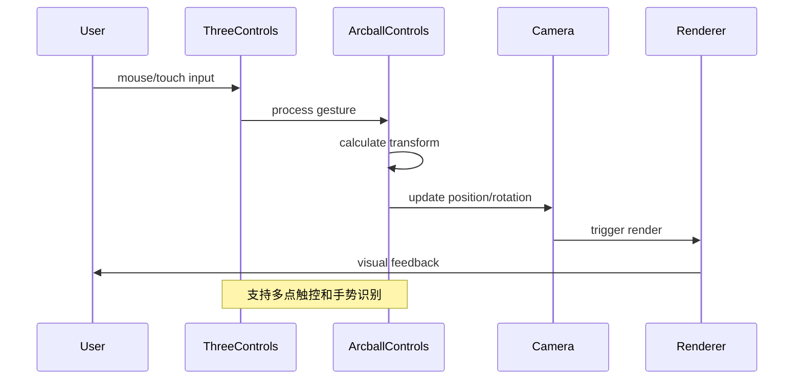
```mermaid
sequenceDiagram
    participant User
    participant TC as ThreeControls
    participant AC as ArcballControls
    participant Camera
    participant Renderer
    
    User->>TC: mouse/touch input
    TC->>AC: process gesture
    AC->>AC: calculate transform
    AC->>Camera: update position/rotation
    Camera->>Renderer: trigger render
    Renderer->>User: visual feedback
    
    Note over TC,AC: 支持多点触控和手势识别
```

## 信号驱动的响应式架构

### 信号流向图

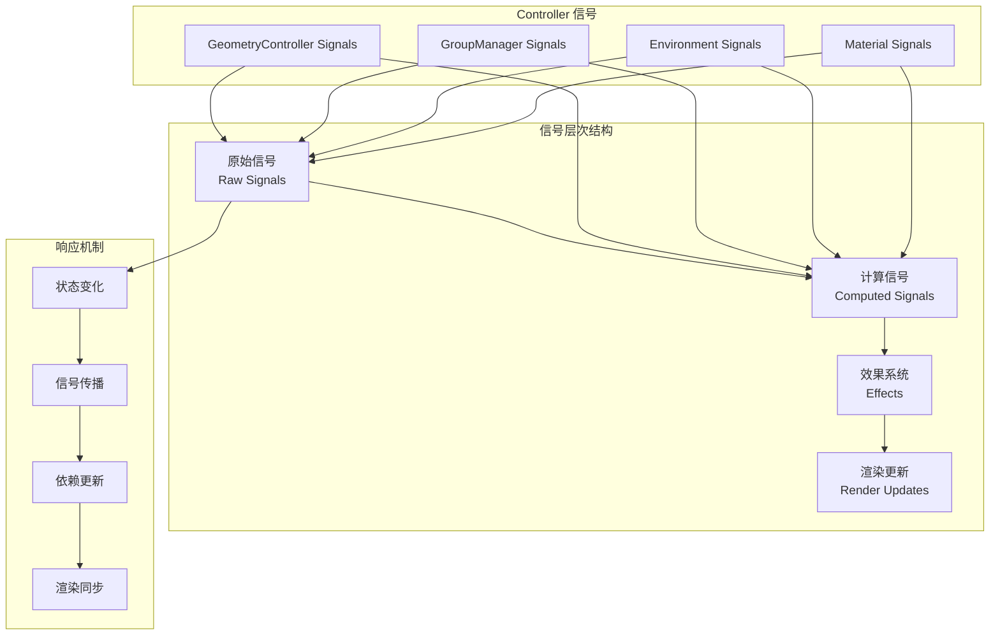
```mermaid
graph TB
    subgraph "信号层次结构"
        A[原始信号<br/>Raw Signals] --> B[计算信号<br/>Computed Signals]
        B --> C[效果系统<br/>Effects]
        C --> D[渲染更新<br/>Render Updates]
    end
    
    subgraph "Controller 信号"
        E[GeometryController Signals] --> B
        F[GroupManager Signals] --> B
        G[Environment Signals] --> B
        H[Material Signals] --> B
    end
    
    E --> A
    F --> A
    G --> A
    H --> A
    
    subgraph "响应机制"
        I[状态变化] --> J[信号传播]
        J --> K[依赖更新]
        K --> L[渲染同步]
    end
    
    A --> I
```

## 内存管理和性能优化

### 资源生命周期

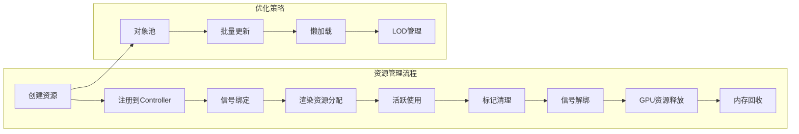
```mermaid
graph LR
    subgraph "资源管理流程"
        A[创建资源] --> B[注册到Controller]
        B --> C[信号绑定]
        C --> D[渲染资源分配]
        D --> E[活跃使用]
        E --> F[标记清理]
        F --> G[信号解绑]
        G --> H[GPU资源释放]
        H --> I[内存回收]
    end
    
    subgraph "优化策略"
        J[对象池] --> K[批量更新]
        K --> L[懒加载]
        L --> M[LOD管理]
    end
    
    A --> J
```

### 性能监控

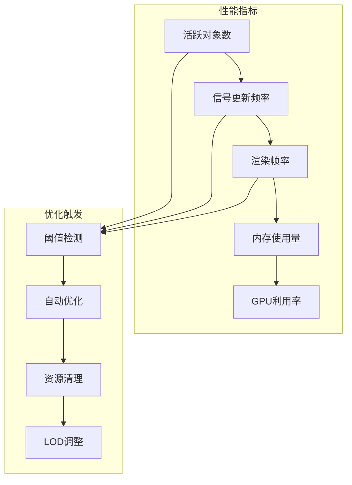
```mermaid
graph TB
    subgraph "性能指标"
        A[活跃对象数] --> B[信号更新频率]
        B --> C[渲染帧率]
        C --> D[内存使用量]
        D --> E[GPU利用率]
    end
    
    subgraph "优化触发"
        F[阈值检测] --> G[自动优化]
        G --> H[资源清理]
        H --> I[LOD调整]
    end
    
    A --> F
    B --> F
    C --> F
```

## Controller 集成模式

### 初始化序列

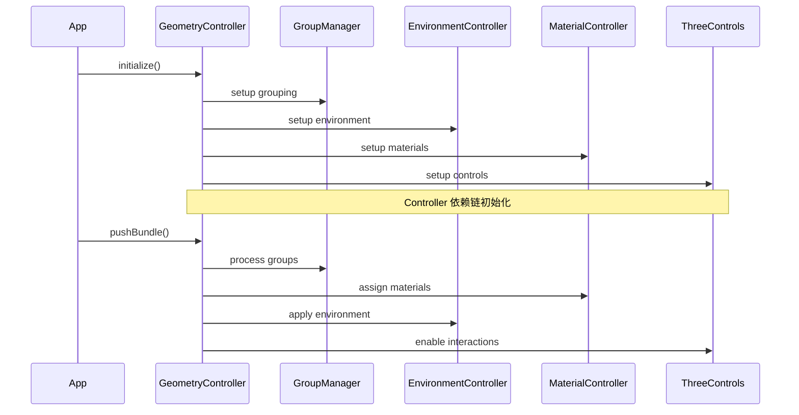
```mermaid
sequenceDiagram
    participant App
    participant GC as GeometryController
    participant GM as GroupManager
    participant EC as EnvironmentController
    participant MC as MaterialController
    participant TC as ThreeControls
    
    App->>GC: initialize()
    GC->>GM: setup grouping
    GC->>EC: setup environment
    GC->>MC: setup materials
    GC->>TC: setup controls
    
    Note over GC,TC: Controller 依赖链初始化
    
    App->>GC: pushBundle()
    GC->>GM: process groups
    GC->>MC: assign materials
    GC->>EC: apply environment
    GC->>TC: enable interactions
```

### 跨 Controller 通信

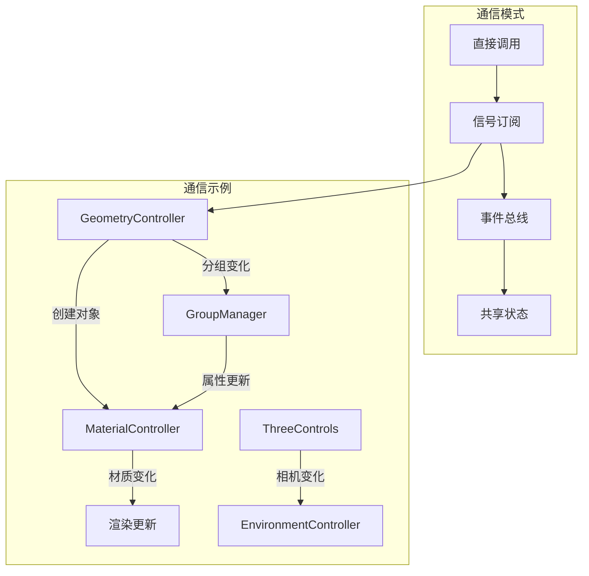
```mermaid
graph TB
    subgraph "通信模式"
        A[直接调用] --> B[信号订阅]
        B --> C[事件总线]
        C --> D[共享状态]
    end
    
    subgraph "通信示例"
        E[GeometryController] -->|创建对象| F[MaterialController]
        F -->|材质变化| G[渲染更新]
        E -->|分组变化| H[GroupManager]
        H -->|属性更新| F
        I[ThreeControls] -->|相机变化| J[EnvironmentController]
    end
    
    B --> E
```

## 最佳实践和使用指南

### Controller 扩展模式

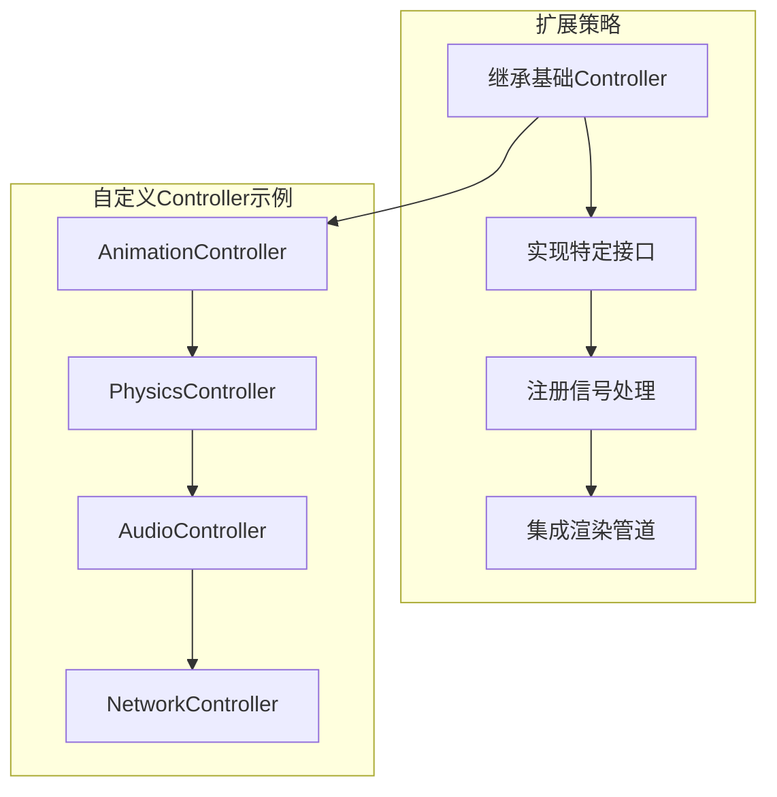
```mermaid
graph TB
    subgraph "扩展策略"
        A[继承基础Controller] --> B[实现特定接口]
        B --> C[注册信号处理]
        C --> D[集成渲染管道]
    end
    
    subgraph "自定义Controller示例"
        E[AnimationController] --> F[PhysicsController]
        F --> G[AudioController]
        G --> H[NetworkController]
    end
    
    A --> E
```

### 错误处理和调试

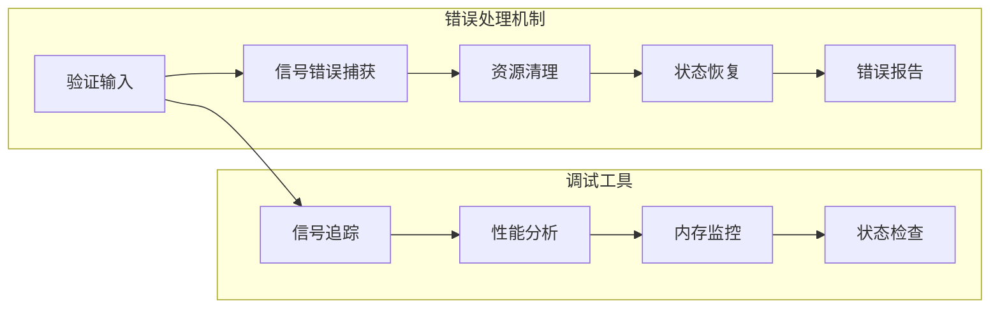
```mermaid
graph LR
    subgraph "错误处理机制"
        A[验证输入] --> B[信号错误捕获]
        B --> C[资源清理]
        C --> D[状态恢复]
        D --> E[错误报告]
    end
    
    subgraph "调试工具"
        F[信号追踪] --> G[性能分析]
        G --> H[内存监控]
        H --> I[状态检查]
    end
    
    A --> F
```

## 总结

UVF 的 Controller 架构通过以下关键特性实现了高效的 3D 场景管理：

1. **模块化设计**: 每个 Controller 专注于特定领域的功能
2. **信号驱动**: 基于响应式编程模式，确保状态同步
3. **内存高效**: 智能资源管理和生命周期控制
4. **扩展性**: 清晰的接口和依赖注入支持
5. **性能优化**: 批量更新、对象池和 LOD 管理

这种架构设计使得 UVF 能够处理复杂的 3D 场景，同时保持良好的性能和可维护性。
