# UVF Manifest 架构解读

## 概述

UVF (Unified Visualization Framework) 的 Manifest 系统是一个强类型的数据建模架构，用于定义、验证和管理 3D 场景中的各种几何对象、属性和关系。该系统基于 io-ts 库提供运行时类型验证，确保数据的完整性和一致性。

## 核心架构概览

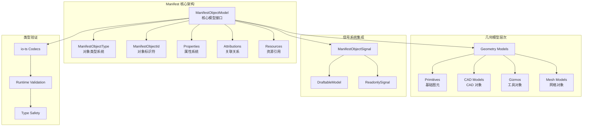
```mermaid
graph TB
    subgraph "Manifest 核心架构"
        MOM[ManifestObjectModel<br/>核心模型接口]
        MOT[ManifestObjectType<br/>对象类型系统]
        MOI[ManifestObjectId<br/>对象标识符]
        Props[Properties<br/>属性系统]
        Attr[Attributions<br/>关联关系]
        Res[Resources<br/>资源引用]
    end
    
    subgraph "几何模型层次"
        Geo[Geometry Models]
        Prim[Primitives<br/>基础图元]
        CAD[CAD Models<br/>CAD 对象]
        Gizmo[Gizmos<br/>工具对象]
        Mesh[Mesh Models<br/>网格对象]
    end
    
    subgraph "信号系统集成"
        Signal[ManifestObjectSignal]
        Draft[DraftableModel]
        Readonly[ReadonlySignal]
    end
    
    subgraph "类型验证"
        Codec[io-ts Codecs]
        Valid[Runtime Validation]
        TypeSafe[Type Safety]
    end
    
    MOM --> MOT
    MOM --> MOI
    MOM --> Props
    MOM --> Attr
    MOM --> Res
    
    Geo --> Prim
    Geo --> CAD
    Geo --> Gizmo
    Geo --> Mesh
    
    MOM --> Geo
    MOM --> Signal
    Signal --> Draft
    Signal --> Readonly
    
    MOM --> Codec
    Codec --> Valid
    Valid --> TypeSafe
```

## ManifestObjectModel - 核心数据模型

### 基础结构

`ManifestObjectModel` 是所有 3D 对象的基础接口，定义了统一的数据结构：

```typescript
type ManifestObjectModel<
  IDType extends ManifestObjectId,
  TManifestType extends ManifestObjectType,
  TProperties extends Properties | undefined = undefined,
  TAttributions extends Attributions | undefined = undefined,
  TResources extends Resources | undefined = undefined,
  TManifestObjectTags extends ManifestObjectTags | undefined = undefined,
  TVersion extends ManifestObjectVersion | undefined = ManifestObjectVersion,
> = {
  id: IDType;                    // 唯一标识符
  type: TManifestType;          // 对象类型
  properties?: TProperties;      // 对象属性
  attributions?: TAttributions;  // 关联关系
  resources?: TResources;        // 资源引用
  tags?: TManifestObjectTags;   // 标签信息
  version?: TVersion;           // 版本信息
  __updateCount?: number;       // 内部更新计数
  __manifestId?: IDType;        // 原始清单ID
}
```

### 类型安全保证

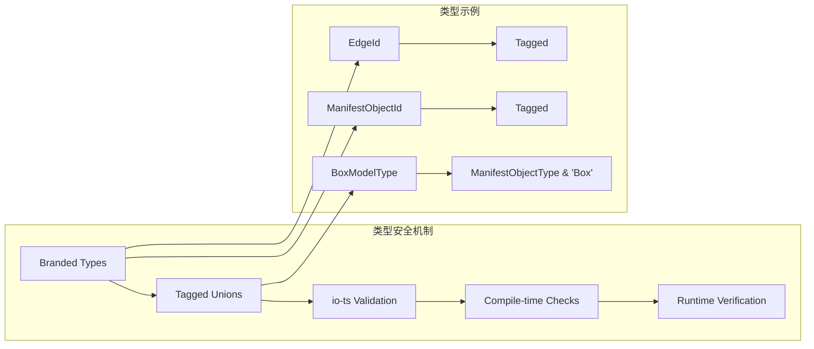
```mermaid
graph LR
    subgraph "类型安全机制"
        A[Branded Types] --> B[Tagged Unions]
        B --> C[io-ts Validation]
        C --> D[Compile-time Checks]
        D --> E[Runtime Verification]
    end
    
    subgraph "类型示例"
        F[ManifestObjectId] --> G["Tagged<string, 'ManifestObjectId'>"]
        H[BoxModelType] --> I["ManifestObjectType & 'Box'"]
        J[EdgeId] --> K["Tagged<ManifestObjectId, 'EdgeId'>"]
    end
    
    A --> F
    B --> H
    A --> J
```

## 对象类型系统

### 几何对象分类

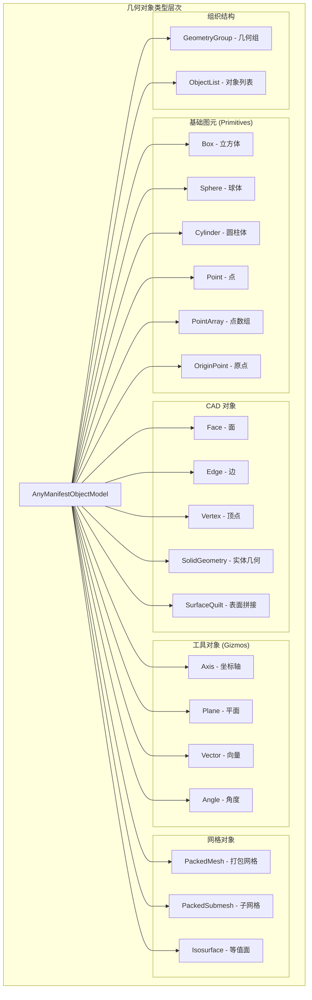
```mermaid
graph TB
    subgraph "几何对象类型层次"
        Root[AnyManifestObjectModel]
        
        subgraph "基础图元 (Primitives)"
            Box[Box - 立方体]
            Sphere[Sphere - 球体]
            Cylinder[Cylinder - 圆柱体]
            Point[Point - 点]
            PointArray[PointArray - 点数组]
            OriginPoint[OriginPoint - 原点]
        end
        
        subgraph "CAD 对象"
            Face[Face - 面]
            Edge[Edge - 边]
            Vertex[Vertex - 顶点]
            SolidGeo[SolidGeometry - 实体几何]
            SurfaceQuilt[SurfaceQuilt - 表面拼接]
        end
        
        subgraph "工具对象 (Gizmos)"
            Axis[Axis - 坐标轴]
            Plane[Plane - 平面]
            Vector[Vector - 向量]
            Angle[Angle - 角度]
        end
        
        subgraph "网格对象"
            PackedMesh[PackedMesh - 打包网格]
            PackedSubmesh[PackedSubmesh - 子网格]
            Isosurface[Isosurface - 等值面]
        end
        
        subgraph "组织结构"
            Group[GeometryGroup - 几何组]
            ObjectList[ObjectList - 对象列表]
        end
    end
    
    Root --> Box
    Root --> Sphere
    Root --> Cylinder
    Root --> Point
    Root --> PointArray
    Root --> OriginPoint
    
    Root --> Face
    Root --> Edge
    Root --> Vertex
    Root --> SolidGeo
    Root --> SurfaceQuilt
    
    Root --> Axis
    Root --> Plane
    Root --> Vector
    Root --> Angle
    
    Root --> PackedMesh
    Root --> PackedSubmesh
    Root --> Isosurface
    
    Root --> Group
    Root --> ObjectList
```

### 类型注册和查找机制

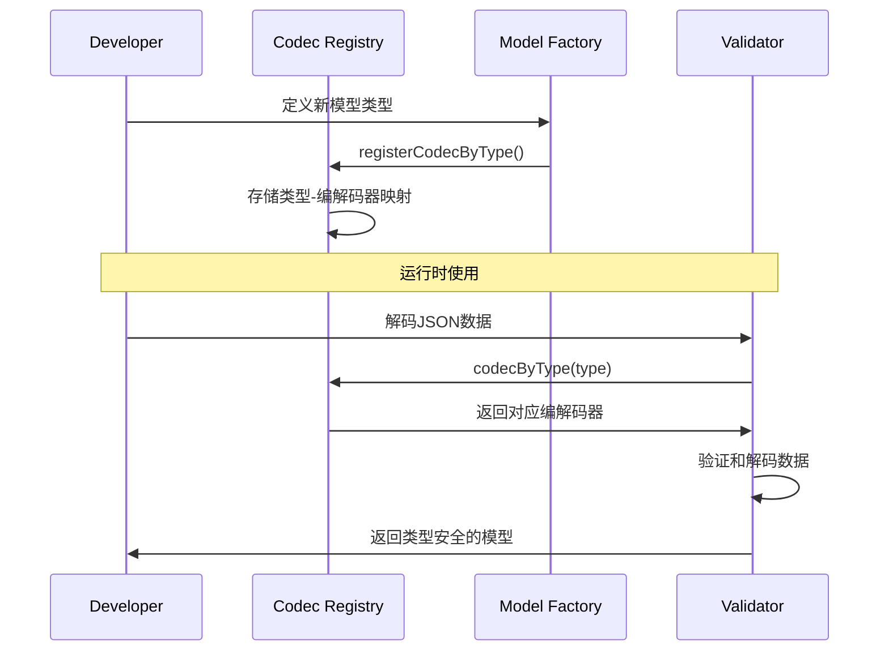
```mermaid
sequenceDiagram
    participant Dev as Developer
    participant Codec as Codec Registry
    participant Factory as Model Factory
    participant Valid as Validator
    
    Dev->>Factory: 定义新模型类型
    Factory->>Codec: registerCodecByType()
    Codec->>Codec: 存储类型-编解码器映射
    
    Note over Dev,Valid: 运行时使用
    
    Dev->>Valid: 解码JSON数据
    Valid->>Codec: codecByType(type)
    Codec->>Valid: 返回对应编解码器
    Valid->>Valid: 验证和解码数据
    Valid->>Dev: 返回类型安全的模型
```

## 属性系统

### 通用属性类型

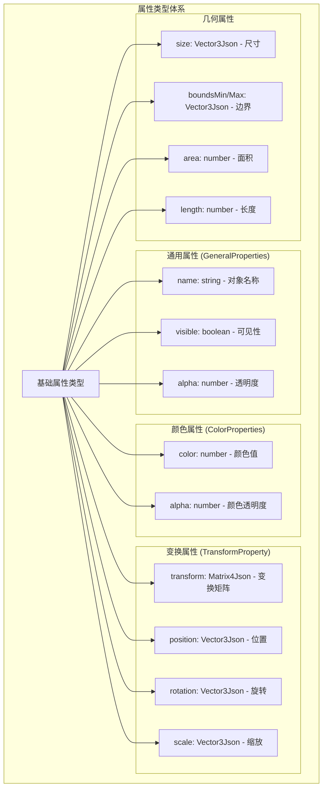
```mermaid
graph TB
    subgraph "属性类型体系"
        BaseProps[基础属性类型]
        
        subgraph "通用属性 (GeneralProperties)"
            Name[name: string - 对象名称]
            Visible[visible: boolean - 可见性]
            Alpha[alpha: number - 透明度]
        end
        
        subgraph "颜色属性 (ColorProperties)"
            Color[color: number - 颜色值]
            ColorAlpha[alpha: number - 颜色透明度]
        end
        
        subgraph "变换属性 (TransformProperty)"
            Transform[transform: Matrix4Json - 变换矩阵]
            Position[position: Vector3Json - 位置]
            Rotation[rotation: Vector3Json - 旋转]
            Scale[scale: Vector3Json - 缩放]
        end
        
        subgraph "几何属性"
            Size[size: Vector3Json - 尺寸]
            Bounds[boundsMin/Max: Vector3Json - 边界]
            Area[area: number - 面积]
            Length[length: number - 长度]
        end
    end
    
    BaseProps --> Name
    BaseProps --> Visible
    BaseProps --> Alpha
    BaseProps --> Color
    BaseProps --> ColorAlpha
    BaseProps --> Transform
    BaseProps --> Position
    BaseProps --> Rotation
    BaseProps --> Scale
    BaseProps --> Size
    BaseProps --> Bounds
    BaseProps --> Area
    BaseProps --> Length
```

### 属性组合模式

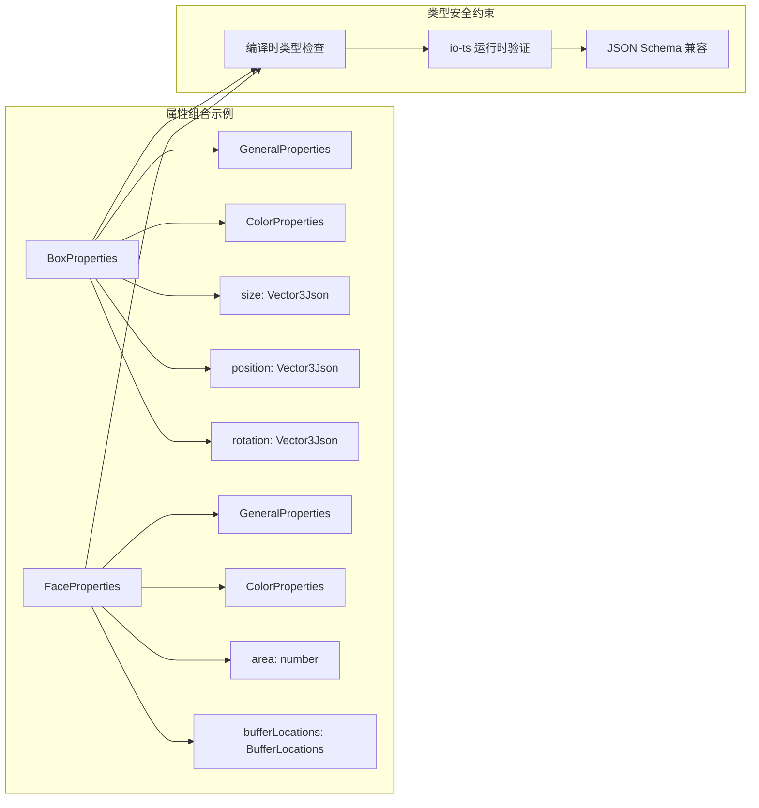
```mermaid
graph LR
    subgraph "属性组合示例"
        BoxProps[BoxProperties] --> GP[GeneralProperties]
        BoxProps --> CP[ColorProperties]
        BoxProps --> SizeP[size: Vector3Json]
        BoxProps --> PosP[position: Vector3Json]
        BoxProps --> RotP[rotation: Vector3Json]
        
        FaceProps[FaceProperties] --> GP2[GeneralProperties]
        FaceProps --> CP2[ColorProperties]
        FaceProps --> AreaP[area: number]
        FaceProps --> BufLoc[bufferLocations: BufferLocations]
    end
    
    subgraph "类型安全约束"
        TypeCheck[编译时类型检查] --> IoTs[io-ts 运行时验证]
        IoTs --> JSONSchema[JSON Schema 兼容]
    end
    
    BoxProps --> TypeCheck
    FaceProps --> TypeCheck
```

## 关联关系系统 (Attributions)

### 对象间关系

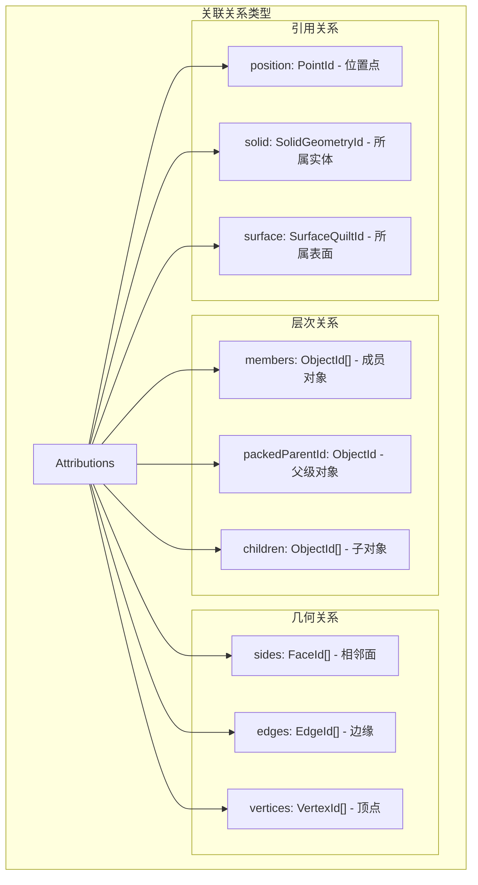
```mermaid
graph TB
    subgraph "关联关系类型"
        Attr["Attributions"]
        
        subgraph "层次关系"
            Members["members: ObjectId[] - 成员对象"]
            Parent["packedParentId: ObjectId - 父级对象"]
            Children["children: ObjectId[] - 子对象"]
        end
        
        subgraph "几何关系"
            Sides["sides: FaceId[] - 相邻面"]
            Edges["edges: EdgeId[] - 边缘"]
            Vertices["vertices: VertexId[] - 顶点"]
        end
        
        subgraph "引用关系"
            Position["position: PointId - 位置点"]
            Solid["solid: SolidGeometryId - 所属实体"]
            Surface["surface: SurfaceQuiltId - 所属表面"]
        end
    end
    
    Attr --> Members
    Attr --> Parent
    Attr --> Children
    Attr --> Sides
    Attr --> Edges
    Attr --> Vertices
    Attr --> Position
    Attr --> Solid
    Attr --> Surface
```

### 关系验证和一致性

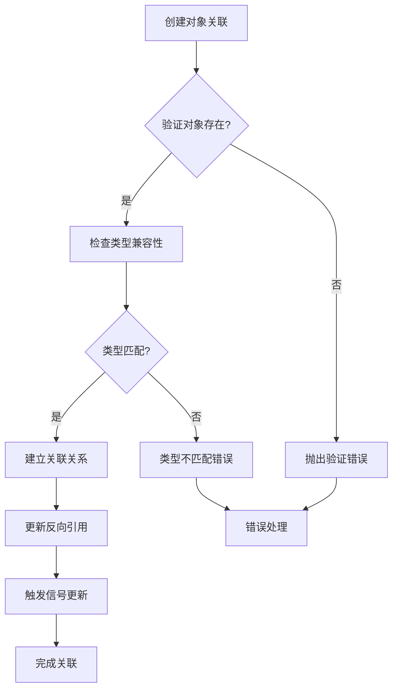
```mermaid
flowchart TD
    A[创建对象关联] --> B{验证对象存在?}
    B -->|是| C[检查类型兼容性]
    B -->|否| D[抛出验证错误]
    
    C --> E{类型匹配?}
    E -->|是| F[建立关联关系]
    E -->|否| G[类型不匹配错误]
    
    F --> H[更新反向引用]
    H --> I[触发信号更新]
    I --> J[完成关联]
    
    D --> K[错误处理]
    G --> K
```

## 资源系统 (Resources)

### 资源类型和管理

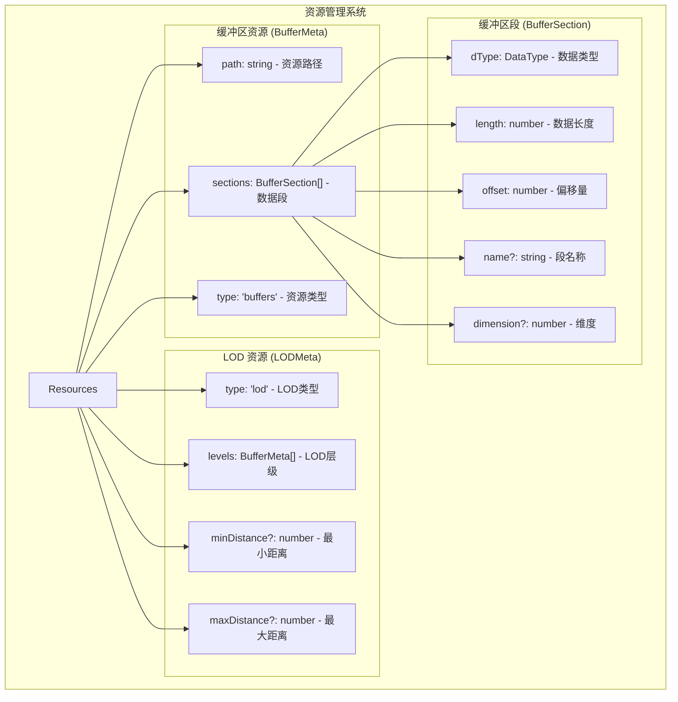
```mermaid
graph TB
    subgraph "资源管理系统"
        Res["Resources"]
        
        subgraph "缓冲区资源 (BufferMeta)"
            Path["path: string - 资源路径"]
            Sections["sections: BufferSection[] - 数据段"]
            BufType["type: 'buffers' - 资源类型"]
        end
        
        subgraph "LOD 资源 (LODMeta)"
            LODType["type: 'lod' - LOD类型"]
            Levels["levels: BufferMeta[] - LOD层级"]
            MinDist["minDistance?: number - 最小距离"]
            MaxDist["maxDistance?: number - 最大距离"]
        end
        
        subgraph "缓冲区段 (BufferSection)"
            DType["dType: DataType - 数据类型"]
            Length["length: number - 数据长度"]
            Offset["offset: number - 偏移量"]
            Name["name?: string - 段名称"]
            Dimension["dimension?: number - 维度"]
        end
    end
    
    Res --> Path
    Res --> Sections
    Res --> BufType
    Res --> LODType
    Res --> Levels
    Res --> MinDist
    Res --> MaxDist
    
    Sections --> DType
    Sections --> Length
    Sections --> Offset
    Sections --> Name
    Sections --> Dimension
```

### 资源加载流程

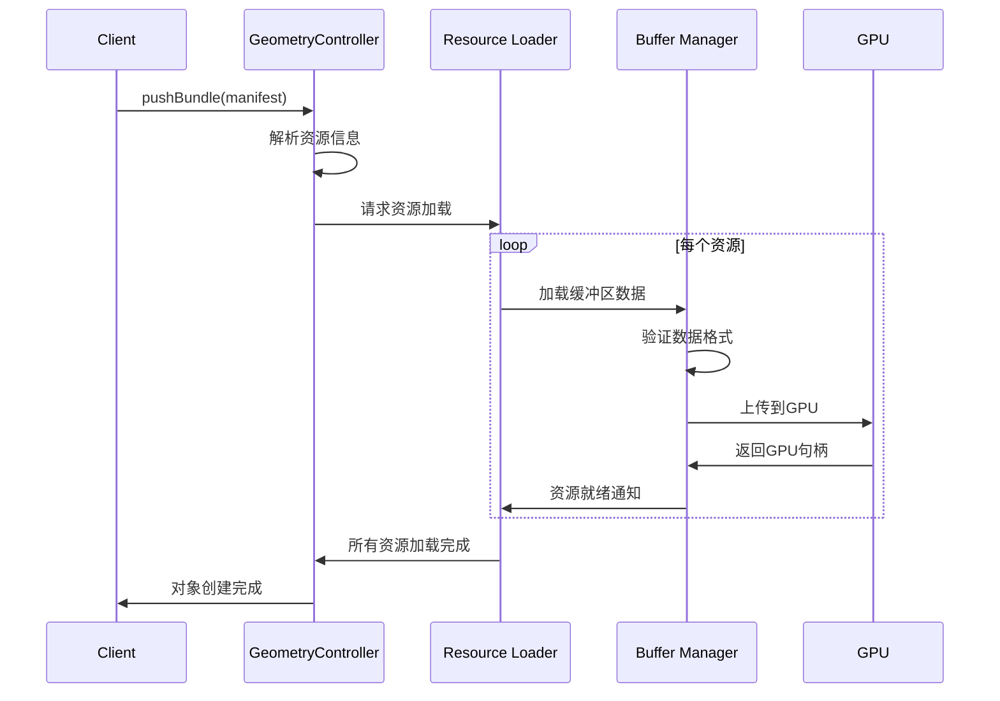
```mermaid
sequenceDiagram
    participant Client
    participant Controller as GeometryController
    participant Loader as Resource Loader
    participant Buffer as Buffer Manager
    participant GPU
    
    Client->>Controller: pushBundle(manifest)
    Controller->>Controller: 解析资源信息
    Controller->>Loader: 请求资源加载
    
    loop 每个资源
        Loader->>Buffer: 加载缓冲区数据
        Buffer->>Buffer: 验证数据格式
        Buffer->>GPU: 上传到GPU
        GPU->>Buffer: 返回GPU句柄
        Buffer->>Loader: 资源就绪通知
    end
    
    Loader->>Controller: 所有资源加载完成
    Controller->>Client: 对象创建完成
```

## 信号系统集成

### 响应式模型架构

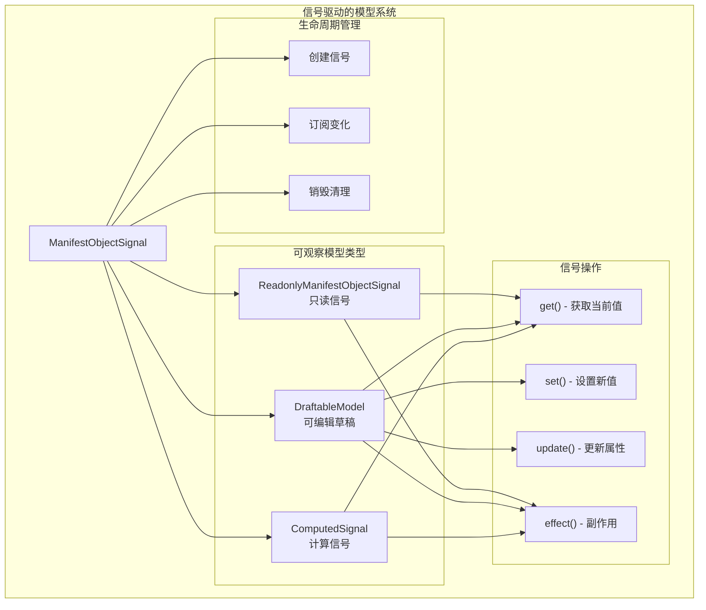
```mermaid
graph TB
    subgraph "信号驱动的模型系统"
        MOS["ManifestObjectSignal"]
        
        subgraph "可观察模型类型"
            Readonly["ReadonlyManifestObjectSignal<br/>只读信号"]
            Draft["DraftableModel<br/>可编辑草稿"]
            Computed["ComputedSignal<br/>计算信号"]
        end
        
        subgraph "信号操作"
            Get["get() - 获取当前值"]
            Set["set() - 设置新值"]
            Update["update() - 更新属性"]
            Effect["effect() - 副作用"]
        end
        
        subgraph "生命周期管理"
            Create["创建信号"]
            Subscribe["订阅变化"]
            Dispose["销毁清理"]
        end
    end
    
    MOS --> Readonly
    MOS --> Draft
    MOS --> Computed
    
    Readonly --> Get
    Draft --> Get
    Draft --> Set
    Draft --> Update
    Computed --> Get
    
    Readonly --> Effect
    Draft --> Effect
    Computed --> Effect
    
    MOS --> Create
    MOS --> Subscribe
    MOS --> Dispose
```

### 草稿系统工作流

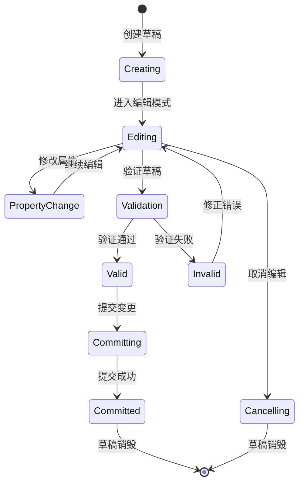
```mermaid
stateDiagram-v2
    [*] --> Creating: 创建草稿
    Creating --> Editing: 进入编辑模式
    
    Editing --> PropertyChange: 修改属性
    PropertyChange --> Editing: 继续编辑
    
    Editing --> Validation: 验证草稿
    Validation --> Valid: 验证通过
    Validation --> Invalid: 验证失败
    
    Invalid --> Editing: 修正错误
    Valid --> Committing: 提交变更
    
    Committing --> Committed: 提交成功
    Committed --> [*]: 草稿销毁
    
    Editing --> Cancelling: 取消编辑
    Cancelling --> [*]: 草稿销毁
```

## 类型验证系统

### io-ts 集成架构

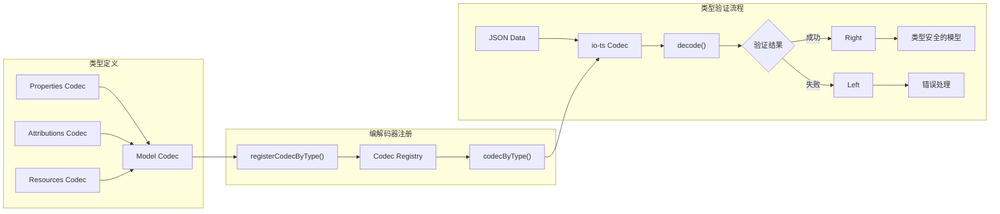
```mermaid
graph LR
    subgraph "类型验证流程"
        JSON["JSON Data"] --> Codec["io-ts Codec"]
        Codec --> Decode["decode()"]
        Decode --> Result{"验证结果"}
        
        Result -->|成功| Right["Right<Model>"]
        Result -->|失败| Left["Left<Errors>"]
        
        Right --> TypeSafe["类型安全的模型"]
        Left --> ErrorHandle["错误处理"]
    end
    
    subgraph "编解码器注册"
        Register["registerCodecByType()"] --> Registry["Codec Registry"]
        Registry --> Lookup["codecByType()"]
        Lookup --> Codec
    end
    
    subgraph "类型定义"
        Props["Properties Codec"] --> Model["Model Codec"]
        Attr["Attributions Codec"] --> Model
        Res["Resources Codec"] --> Model
        Model --> Register
    end
```

### 编解码器工厂模式

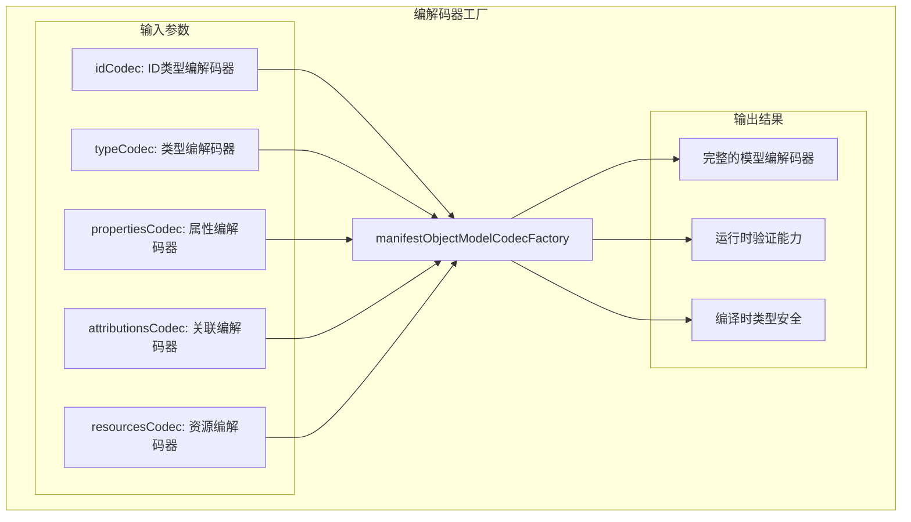
```mermaid
graph TB
    subgraph "编解码器工厂"
        Factory[manifestObjectModelCodecFactory]
        
        subgraph "输入参数"
            IdCodec[idCodec: ID类型编解码器]
            TypeCodec[typeCodec: 类型编解码器]
            PropsCodec[propertiesCodec: 属性编解码器]
            AttrCodec[attributionsCodec: 关联编解码器]
            ResCodec[resourcesCodec: 资源编解码器]
        end
        
        subgraph "输出结果"
            ModelCodec[完整的模型编解码器]
            Validation[运行时验证能力]
            TypeSafety[编译时类型安全]
        end
    end
    
    IdCodec --> Factory
    TypeCodec --> Factory
    PropsCodec --> Factory
    AttrCodec --> Factory
    ResCodec --> Factory
    
    Factory --> ModelCodec
    Factory --> Validation
    Factory --> TypeSafety
```

## 数据流和生命周期

### 对象创建流程

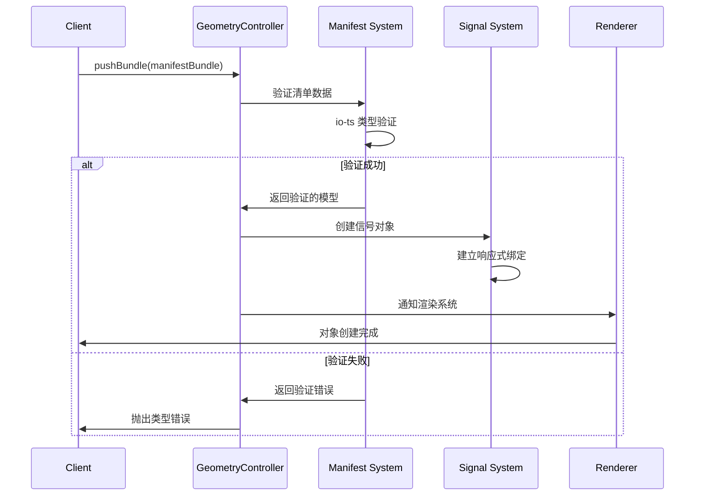
```mermaid
sequenceDiagram
    participant Client
    participant GC as GeometryController
    participant Manifest as Manifest System
    participant Signal as Signal System
    participant Renderer
    
    Client->>GC: pushBundle(manifestBundle)
    GC->>Manifest: 验证清单数据
    Manifest->>Manifest: io-ts 类型验证
    
    alt 验证成功
        Manifest->>GC: 返回验证的模型
        GC->>Signal: 创建信号对象
        Signal->>Signal: 建立响应式绑定
        GC->>Renderer: 通知渲染系统
        Renderer->>Client: 对象创建完成
    else 验证失败
        Manifest->>GC: 返回验证错误
        GC->>Client: 抛出类型错误
    end
```

### 对象更新流程

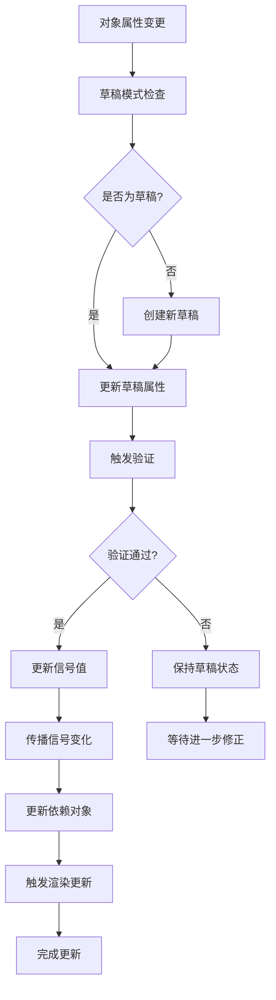
```mermaid
flowchart TD
    A[对象属性变更] --> B[草稿模式检查]
    B --> C{是否为草稿?}
    
    C -->|是| D[更新草稿属性]
    C -->|否| E[创建新草稿]
    
    E --> D
    D --> F[触发验证]
    F --> G{验证通过?}
    
    G -->|是| H[更新信号值]
    G -->|否| I[保持草稿状态]
    
    H --> J[传播信号变化]
    J --> K[更新依赖对象]
    K --> L[触发渲染更新]
    L --> M[完成更新]
    
    I --> N[等待进一步修正]
```

## 分组和层次结构

### 几何分组系统

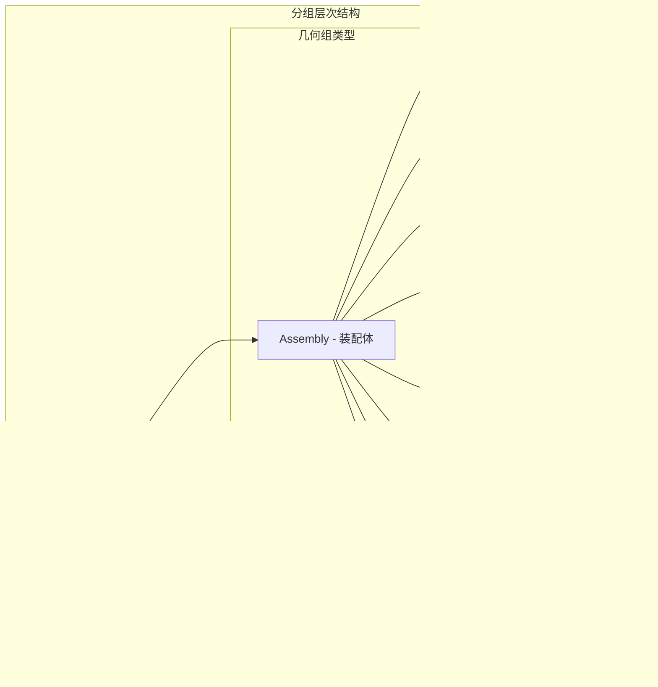
```mermaid
graph TB
    subgraph "分组层次结构"
        Root[RootScene - 根场景]
        
        subgraph "几何组类型"
            Assembly[Assembly - 装配体]
            Part[Part - 零件]
            Feature[Feature - 特征]
            Custom[Custom - 自定义组]
        end
        
        subgraph "分组属性"
            Transform[变换矩阵]
            Visibility[可见性]
            Material[材质属性]
            LOD[细节层次]
        end
        
        subgraph "成员管理"
            Add[添加成员]
            Remove[移除成员]
            Reorder[重新排序]
            Query[查询成员]
        end
    end
    
    Root --> Assembly
    Root --> Part
    Root --> Feature
    Root --> Custom
    
    Assembly --> Transform
    Assembly --> Visibility
    Assembly --> Material
    Assembly --> LOD
    
    Assembly --> Add
    Assembly --> Remove
    Assembly --> Reorder
    Assembly --> Query
```

### 分组操作流程

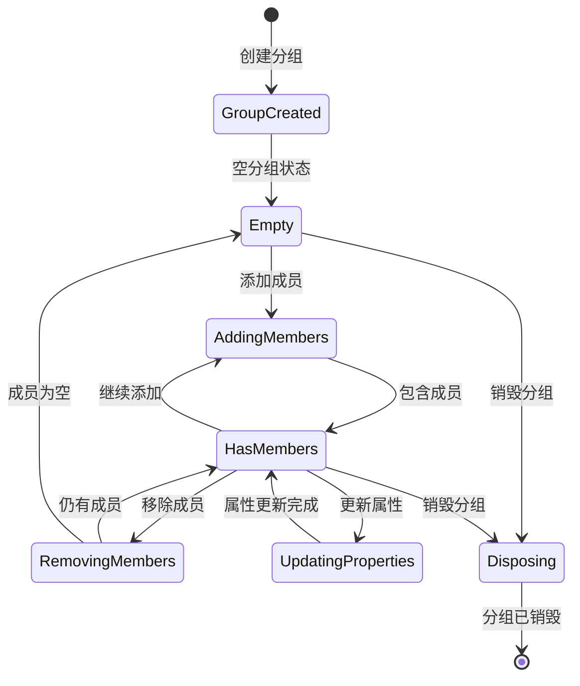
```mermaid
stateDiagram-v2
    [*] --> GroupCreated: 创建分组
    GroupCreated --> Empty: 空分组状态
    
    Empty --> AddingMembers: 添加成员
    AddingMembers --> HasMembers: 包含成员
    
    HasMembers --> AddingMembers: 继续添加
    HasMembers --> RemovingMembers: 移除成员
    RemovingMembers --> HasMembers: 仍有成员
    RemovingMembers --> Empty: 成员为空
    
    HasMembers --> UpdatingProperties: 更新属性
    UpdatingProperties --> HasMembers: 属性更新完成
    
    Empty --> Disposing: 销毁分组
    HasMembers --> Disposing: 销毁分组
    Disposing --> [*]: 分组已销毁
```

## 性能优化和最佳实践

### 内存管理策略

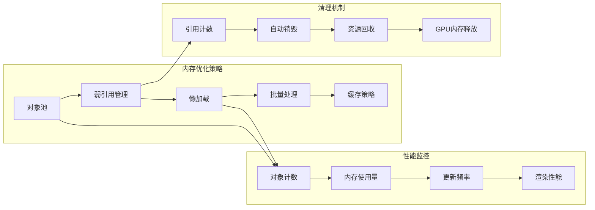
```mermaid
graph LR
    subgraph "内存优化策略"
        A[对象池] --> B[弱引用管理]
        B --> C[懒加载]
        C --> D[批量处理]
        D --> E[缓存策略]
    end
    
    subgraph "性能监控"
        F[对象计数] --> G[内存使用量]
        G --> H[更新频率]
        H --> I[渲染性能]
    end
    
    subgraph "清理机制"
        J[引用计数] --> K[自动销毁]
        K --> L[资源回收]
        L --> M[GPU内存释放]
    end
    
    A --> F
    B --> J
    C --> F
```

### 类型安全最佳实践

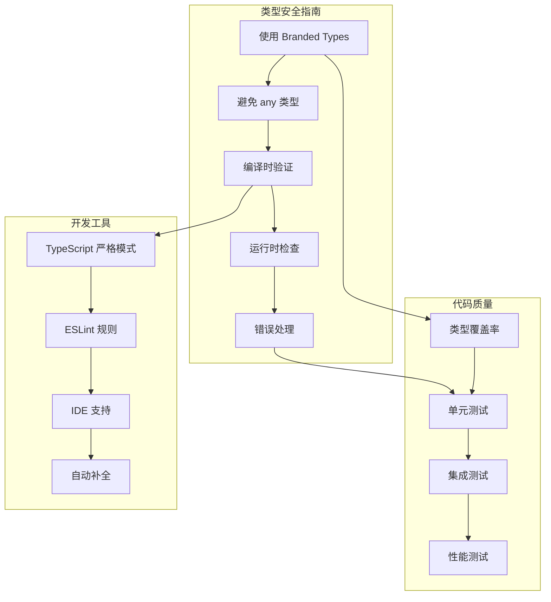
```mermaid
graph TB
    subgraph "类型安全指南"
        A[使用 Branded Types] --> B[避免 any 类型]
        B --> C[编译时验证]
        C --> D[运行时检查]
        D --> E[错误处理]
    end
    
    subgraph "代码质量"
        F[类型覆盖率] --> G[单元测试]
        G --> H[集成测试]
        H --> I[性能测试]
    end
    
    subgraph "开发工具"
        J[TypeScript 严格模式] --> K[ESLint 规则]
        K --> L[IDE 支持]
        L --> M[自动补全]
    end
    
    A --> F
    C --> J
    E --> G
```

## 扩展和自定义

### 自定义模型类型

```mermaid
sequenceDiagram
    participant Dev as 开发者
    participant TypeDef as 类型定义
    participant Codec as 编解码器
    participant Registry as 注册表
    participant System as 系统集成
    
    Dev->>TypeDef: 定义新模型类型
    TypeDef->>Codec: 创建 io-ts 编解码器
    Codec->>Registry: 注册类型映射
    Registry->>System: 集成到系统
    System->>Dev: 类型可用于使用
```

### 插件化架构

```mermaid
graph TB
    subgraph "插件化设计"
        Core[核心 Manifest 系统]
        
        subgraph "扩展点"
            TypeExt[类型扩展]
            PropExt[属性扩展]
            ValidExt[验证扩展]
            RenderExt[渲染扩展]
        end
        
        subgraph "插件示例"
            PhysicsPlugin[物理属性插件]
            AnimationPlugin[动画属性插件]
            MaterialPlugin[高级材质插件]
            LODPlugin[LOD管理插件]
        end
    end
    
    Core --> TypeExt
    Core --> PropExt
    Core --> ValidExt
    Core --> RenderExt
    
    TypeExt --> PhysicsPlugin
    PropExt --> AnimationPlugin
    ValidExt --> MaterialPlugin
    RenderExt --> LODPlugin
```

## 总结

UVF 的 Manifest 系统通过以下关键特性实现了强大的 3D 数据建模能力：

### 🏗️ **核心优势**

1. **类型安全**: 编译时和运行时双重类型检查
2. **响应式**: 信号驱动的数据变更传播
3. **可扩展**: 插件化的类型系统设计
4. **高性能**: 智能缓存和内存管理
5. **标准化**: 基于 JSON Schema 的数据交换

### 🚀 **技术亮点**

- **Branded Types**: 防止类型误用的强类型约束
- **io-ts 集成**: 运行时类型验证和错误处理
- **信号系统**: 响应式数据流和自动更新
- **资源管理**: 统一的缓冲区和LOD管理
- **关系建模**: 复杂的对象间关联关系

### 📈 **应用价值**

UVF Manifest 系统为 3D 应用提供了：
- 数据完整性保证
- 开发效率提升  
- 运行时错误减少
- 系统可维护性增强
- 跨平台数据兼容性

这种设计使得 UVF 能够处理复杂的 3D 场景数据，同时保持代码的可读性、可维护性和高性能。
