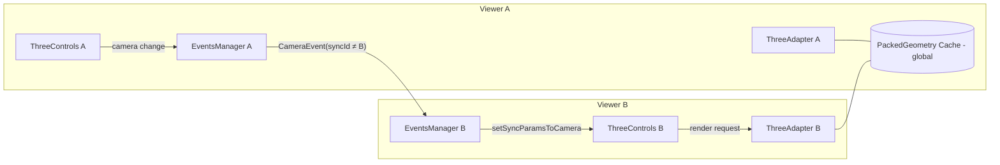

## 多 ThreeView（ThreeViewer）并行时的相互影响与机制

本节梳理 UVF 中 `ThreeViewer` 在多视图并行场景下的交互、共享与隔离点，帮助定位同步相机、多实例资源与事件的影响范围，以及潜在的性能/状态耦合问题。

### 结论速览

- 视图隔离：每个 `ThreeViewer` 拥有独立的 Scene、Renderer、Controls、InstanceIdService、事件管理器与渲染循环，互不干扰。
- 相机同步：通过 EventsManager 扇出发布/订阅实现，默认关闭；开启后仅同步相机参数，不共享选择/悬停等交互状态。
- 资源共享：PackedGeometry 采用静态全局缓存（按几何 ID），跨 Viewer 复用 CPU 侧几何与字段缓冲；材质与 BufferGeometry 实例为每 Viewer 单独创建（颜色等会被写入），避免写时冲突。
- 生命周期管理：每个 Viewer 的渲染器适配层负责实例级别释放；PackedGeometry 通过全局引用计数在所有引用释放时统一清理。
- 渲染节流：各 Viewer 独立的 RAF/timeout 驱动；启用流场 LIC 等效果时，每个 Viewer 独立维护帧步进与 FBO。

### 关键构件与作用域

- ThreeViewer（`src/rendering/components/threeViewer.ts`）
	- 独立创建：Scene、WebGLRenderer、ThreeControls、ResizeObserver、AmbientLight、选中/悬停集合服务、渲染调度（RAF + 超时）。
	- 适配层：`ThreeAdapter` 绑定该 Viewer，管理可见性、渲染顺序、实例查找与释放。
	- 事件：`eventsManager`（每 Viewer 一份）提供本地相机事件总线。

- ThreeControls（`threeControls.ts`）
	- 持有 `activeCamera` 与 ArcballControls；`animationFrameCallback` 中在本 Viewer 的相机变化时 emit 相机事件。
	- `enableSyncCamera` 决定是否响应外部相机事件。

- EventsManager（`eventsManager.ts`）
	- 基于 three.js EventDispatcher 的轻量事件中心，支持多监听者扇出分发；作用域在当前 Viewer 内。

- PackedGeometry（`genericModels/packedGeometry.ts`）
	- 全局静态缓存 byId/pendingById/referencedBy：跨所有 Viewer 共享同一几何 ID 的已加载缓冲。
	- 引用计数：实例释放时调用 `removeReferencedBy()`，当引用数为 0 时清理并从缓存移除。
	- 注意：面颜色等属性在实例级会被克隆或新建缓冲，避免共享写冲突。

### 多视图相机同步工作流

1) 某 Viewer 内相机/控制器更新 → ThreeControls.animationFrameCallback：
	 - 若不是“来自其他视图的同步”驱动（isSyncFromAnotherViewer=false），则通过本 Viewer 的 eventsManager 发出 CameraEvent（包含 zoom、position、up、quaternion、scale、orbitCenter、syncId）。
2) 外层应用在多个 Viewer 之间交叉订阅每个 Viewer 的 cameraEvent：
	 - 收到事件后，排除事件源（syncId 比较）再调用目标 Viewer 的 `setSyncParamsToCamera()`。
3) 目标 Viewer 应用参数到其相机与 ArcballControls，并以 isSyncFromAnotherViewer=true 触发一次 requestRender，避免再次循环广播。

### 多视图下的状态边界

- 选择/悬停集合：`ConstrainedCollectionService` 以 Viewer 的 `InstanceIdService` 为域，每 Viewer 独立；不会因为相机同步相互影响。
- AABB 与视口：每 Viewer 基于自身 Scene 与容器尺寸计算 `maxViewPort`；ResizeObserver 各自监听，互不干扰。
- 渲染顺序与透明排序：每 Viewer 在 render 前依据自身相机矩阵更新排序，不共享。
- LIC / 流线动画：每 Viewer 持有独立的 render target、定时步进与材质 uniforms 更新；不会串扰，但总体 GPU 负载叠加。

### 资源与性能要点（多视图）

- CPU 侧几何/字段缓冲：PackedGeometry 跨 Viewer 共享，二次视图加载命中缓存，减少网络/解析成本。
- GPU 资源：BufferGeometry/Material/RenderTarget 多为每 Viewer 单独实例；多个 Viewer 会乘法叠加显存与填充率压力。
- 颜色缓冲写入：面颜色缓冲在实例级克隆；同一几何被多 Viewer 同时着色更新不会互相污染。
- 事件传播：相机同步仅在显式订阅下发生；未订阅或 `enableSyncCamera(false)` 的 Viewer 完全隔离。

### 典型多视图场景的交互图

### 常见问题与排查建议

- 相机循环同步：确保在 `setSyncParamsToCamera()` 内设置 `isSyncFromAnotherViewer=true` 后再触发 requestRender（代码已处理），并通过 `syncId` 过滤事件源。
- 共享写导致的颜色错乱：PackedGeometry faces 的 color buffer 在实例级克隆；如看到串色，多半来自外部共享材质实例，建议保持材质/纹理在 Viewer 内部创建与管理。
- 内存增长：多视图叠加会倍增 WebGL 纹理/FBO/材质数量；关闭不需要的特效（如 LIC）、合理的 LoD 与解绑不再使用的 Viewer 可缓解。
- 相机未同步：检查外层是否对所有 Viewer 完成订阅/退订，目标 Viewer 是否已 `enableSyncCamera(true)`。

### 小结

多 Viewer 架构通过“状态本地化 + 事件显式互联 + 几何缓存全局共享”的组合，兼顾了隔离与复用。开启同步时仅相机参数传播，交互与渲染状态保持独立，从而在多视图对比/联动场景中具备可控的一致性与良好的性能基线。

