# UVF Rendering 架构解读

## 概述

UVF (Unified Visualization Framework) 的 Rendering 系统是一个高度模块化的 3D 渲染架构，基于 Three.js 构建，提供了从数据模型到最终渲染输出的完整渲染管道。该系统采用适配器模式、工厂模式和响应式编程，实现了高性能的实时 3D 渲染。

## 核心架构概览

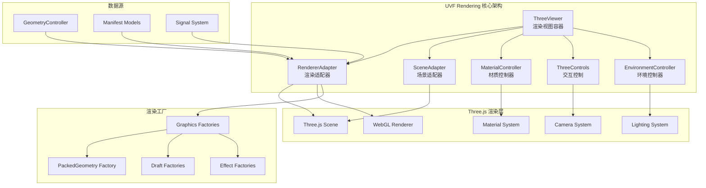
```mermaid
graph TB
    subgraph "UVF Rendering 核心架构"
        TV[ThreeViewer<br/>渲染视图容器]
        RA[RendererAdapter<br/>渲染适配器]
        SA[SceneAdapter<br/>场景适配器]
        MC[MaterialController<br/>材质控制器]
        TC[ThreeControls<br/>交互控制]
        EC[EnvironmentController<br/>环境控制器]
    end
    
    subgraph "Three.js 渲染层"
        Scene[Three.js Scene]
        Renderer[WebGL Renderer]
        Camera[Camera System]
        Lights[Lighting System]
        Materials[Material System]
    end
    
    subgraph "数据源"
        GC[GeometryController]
        Manifest[Manifest Models]
        Signals[Signal System]
    end
    
    subgraph "渲染工厂"
        GF[Graphics Factories]
        PGF[PackedGeometry Factory]
        DF[Draft Factories]
        EF[Effect Factories]
    end
    
    TV --> RA
    TV --> SA
    TV --> MC
    TV --> TC
    TV --> EC
    
    RA --> Scene
    RA --> Renderer
    SA --> Scene
    MC --> Materials
    TC --> Camera
    EC --> Lights
    
    GC --> RA
    Manifest --> RA
    Signals --> RA
    
    RA --> GF
    GF --> PGF
    GF --> DF
    GF --> EF
```

## ThreeViewer - 核心渲染视图

### 设计职责

`ThreeViewer` 是 UVF 渲染系统的核心组件，负责管理整个 3D 渲染流程、用户交互和渲染生命周期。

### 核心组件架构

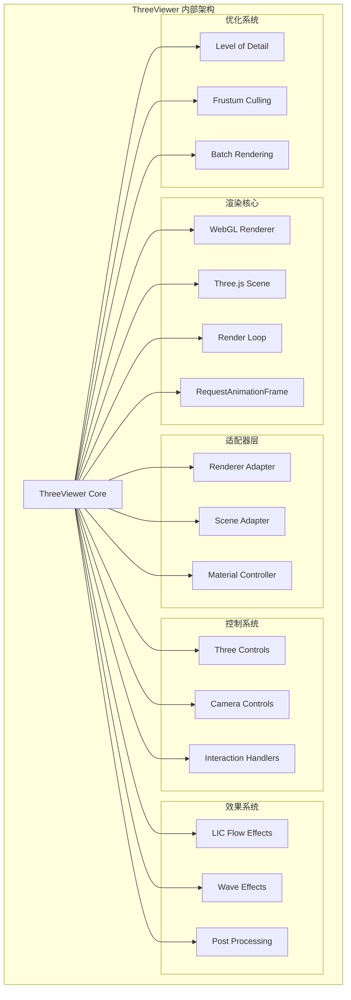
```mermaid
graph TB
    subgraph "ThreeViewer 内部架构"
        Core[ThreeViewer Core]
        
        subgraph "渲染核心"
            WGLRenderer[WebGL Renderer]
            Scene[Three.js Scene]
            RenderLoop[Render Loop]
            RAF[RequestAnimationFrame]
        end
        
        subgraph "适配器层"
            RendererAdapter[Renderer Adapter]
            SceneAdapter[Scene Adapter]
            MaterialController[Material Controller]
        end
        
        subgraph "控制系统"
            ThreeControls[Three Controls]
            CameraControls[Camera Controls]
            InteractionHandlers[Interaction Handlers]
        end
        
        subgraph "效果系统"
            LICSystem[LIC Flow Effects]
            WaveEffects[Wave Effects]
            PostProcessing[Post Processing]
        end
        
        subgraph "优化系统"
            LOD[Level of Detail]
            Culling[Frustum Culling]
            BatchRendering[Batch Rendering]
        end
    end
    
    Core --> WGLRenderer
    Core --> Scene
    Core --> RenderLoop
    Core --> RAF
    
    Core --> RendererAdapter
    Core --> SceneAdapter
    Core --> MaterialController
    
    Core --> ThreeControls
    Core --> CameraControls
    Core --> InteractionHandlers
    
    Core --> LICSystem
    Core --> WaveEffects
    Core --> PostProcessing
    
    Core --> LOD
    Core --> Culling
    Core --> BatchRendering
```

### 渲染生命周期

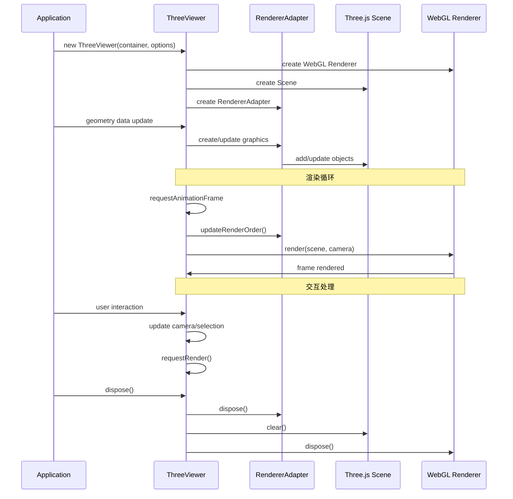
```mermaid
sequenceDiagram
    participant App as Application
    participant TV as ThreeViewer
    participant RA as RendererAdapter
    participant Scene as Three.js Scene
    participant WGL as WebGL Renderer
    
    App->>TV: new ThreeViewer(container, options)
    TV->>WGL: create WebGL Renderer
    TV->>Scene: create Scene
    TV->>RA: create RendererAdapter
    
    App->>TV: geometry data update
    TV->>RA: create/update graphics
    RA->>Scene: add/update objects
    
    Note over TV,WGL: 渲染循环
    
    TV->>TV: requestAnimationFrame
    TV->>RA: updateRenderOrder()
    TV->>WGL: render(scene, camera)
    WGL->>TV: frame rendered
    
    Note over TV,WGL: 交互处理
    
    App->>TV: user interaction
    TV->>TV: update camera/selection
    TV->>TV: requestRender()
    
    App->>TV: dispose()
    TV->>RA: dispose()
    TV->>Scene: clear()
    TV->>WGL: dispose()
```

## RendererAdapter - 渲染适配器核心

### 架构设计

`RendererAdapter` 是连接数据模型和渲染系统的核心适配器，负责将 Manifest 模型转换为可渲染的 Three.js 对象。

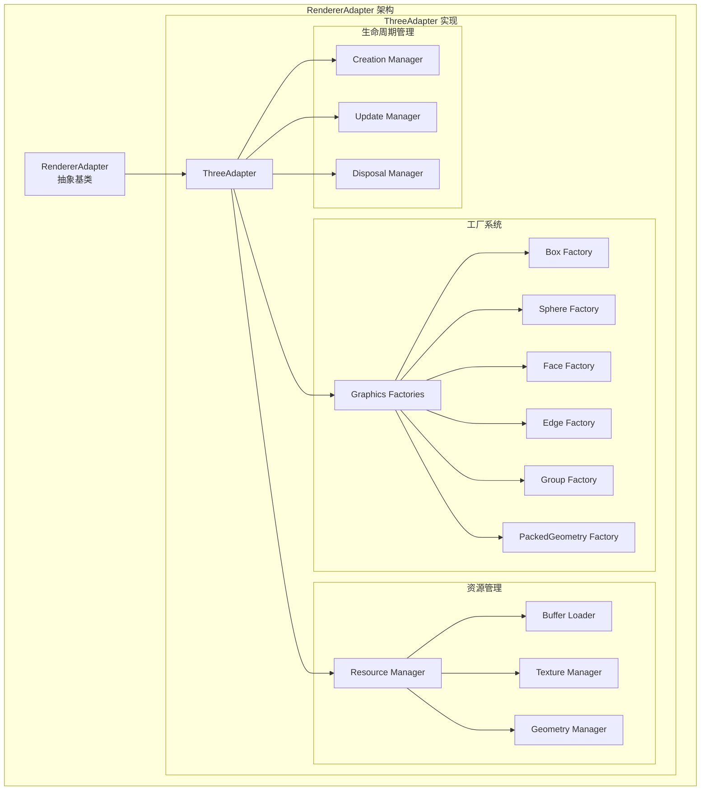
```mermaid
graph TB
    subgraph "RendererAdapter 架构"
        RA[RendererAdapter<br/>抽象基类]
        
        subgraph "ThreeAdapter 实现"
            TA[ThreeAdapter]
            
            subgraph "工厂系统"
                GF[Graphics Factories]
                BoxF[Box Factory]
                SphereF[Sphere Factory]
                FaceF[Face Factory]
                EdgeF[Edge Factory]
                GroupF[Group Factory]
                PackedF[PackedGeometry Factory]
            end
            
            subgraph "资源管理"
                RM[Resource Manager]
                BL[Buffer Loader]
                TM[Texture Manager]
                GM[Geometry Manager]
            end
            
            subgraph "生命周期管理"
                CM[Creation Manager]
                UM[Update Manager]
                DM[Disposal Manager]
            end
        end
    end
    
    RA --> TA
    
    TA --> GF
    GF --> BoxF
    GF --> SphereF
    GF --> FaceF
    GF --> EdgeF
    GF --> GroupF
    GF --> PackedF
    
    TA --> RM
    RM --> BL
    RM --> TM
    RM --> GM
    
    TA --> CM
    TA --> UM
    TA --> DM
```

### 工厂模式实现

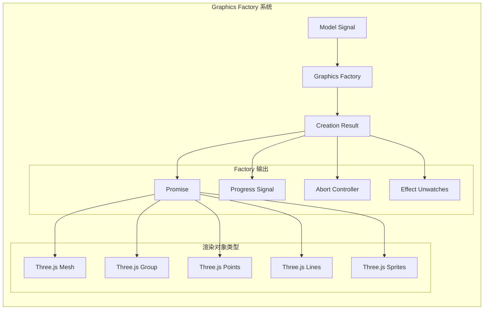
```mermaid
graph LR
    subgraph "Graphics Factory 系统"
        ModelSignal[Model Signal] --> Factory[Graphics Factory]
        Factory --> CreationResult[Creation Result]
        
        subgraph "Factory 输出"
            Promise[Promise<Rendered>]
            Progress[Progress Signal]
            AbortCtrl[Abort Controller]
            Unwatches[Effect Unwatches]
        end
        
        subgraph "渲染对象类型"
            Mesh[Three.js Mesh]
            Group[Three.js Group]
            Points[Three.js Points]
            Lines[Three.js Lines]
            Sprites[Three.js Sprites]
        end
    end
    
    CreationResult --> Promise
    CreationResult --> Progress
    CreationResult --> AbortCtrl
    CreationResult --> Unwatches
    
    Promise --> Mesh
    Promise --> Group
    Promise --> Points
    Promise --> Lines
    Promise --> Sprites
```

### 响应式更新机制

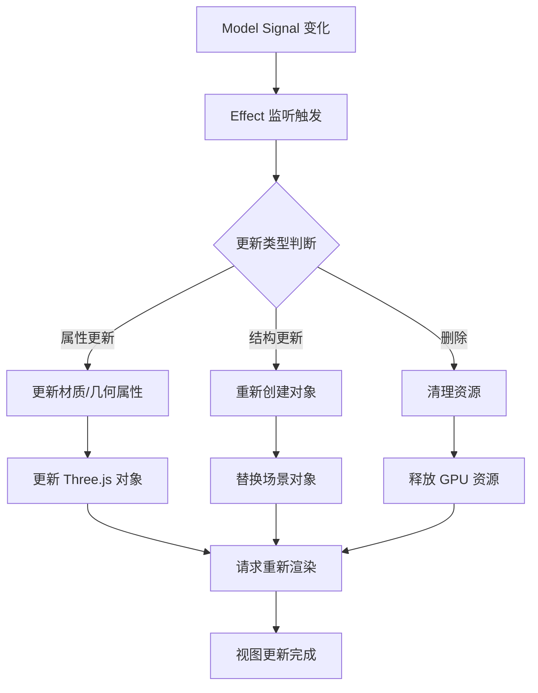
```mermaid
flowchart TD
    A[Model Signal 变化] --> B[Effect 监听触发]
    B --> C{更新类型判断}
    
    C -->|属性更新| D[更新材质/几何属性]
    C -->|结构更新| E[重新创建对象]
    C -->|删除| F[清理资源]
    
    D --> G[更新 Three.js 对象]
    E --> H[替换场景对象]
    F --> I[释放 GPU 资源]
    
    G --> J[请求重新渲染]
    H --> J
    I --> J
    
    J --> K[视图更新完成]
```

## SceneAdapter - 场景管理适配器

### 场景层次管理

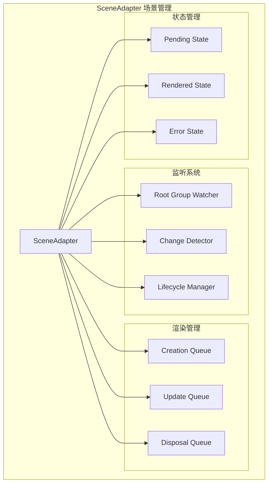
```mermaid
graph TB
    subgraph "SceneAdapter 场景管理"
        SA[SceneAdapter]
        
        subgraph "监听系统"
            RootWatcher[Root Group Watcher]
            ChangeDetector[Change Detector]
            LifecycleManager[Lifecycle Manager]
        end
        
        subgraph "渲染管理"
            CreationQueue[Creation Queue]
            UpdateQueue[Update Queue]
            DisposalQueue[Disposal Queue]
        end
        
        subgraph "状态管理"
            PendingState[Pending State]
            RenderedState[Rendered State]
            ErrorState[Error State]
        end
    end
    
    SA --> RootWatcher
    SA --> ChangeDetector
    SA --> LifecycleManager
    
    SA --> CreationQueue
    SA --> UpdateQueue
    SA --> DisposalQueue
    
    SA --> PendingState
    SA --> RenderedState
    SA --> ErrorState
```

### 异步渲染流程

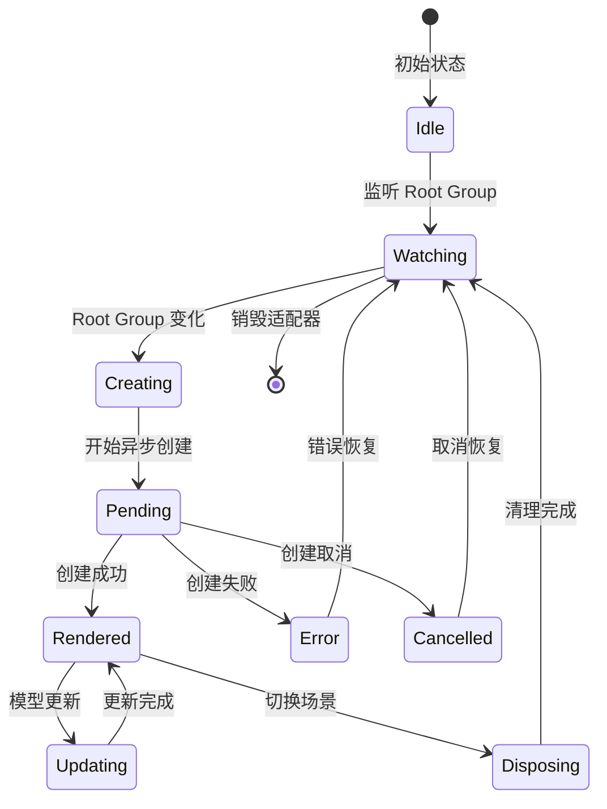
```mermaid
stateDiagram-v2
    [*] --> Idle: 初始状态
    Idle --> Watching: 监听 Root Group
    
    Watching --> Creating: Root Group 变化
    Creating --> Pending: 开始异步创建
    
    Pending --> Rendered: 创建成功
    Pending --> Error: 创建失败
    Pending --> Cancelled: 创建取消
    
    Rendered --> Updating: 模型更新
    Updating --> Rendered: 更新完成
    
    Rendered --> Disposing: 切换场景
    Disposing --> Watching: 清理完成
    
    Error --> Watching: 错误恢复
    Cancelled --> Watching: 取消恢复
    
    Watching --> [*]: 销毁适配器
```

## 材质系统架构

### MaterialController 设计

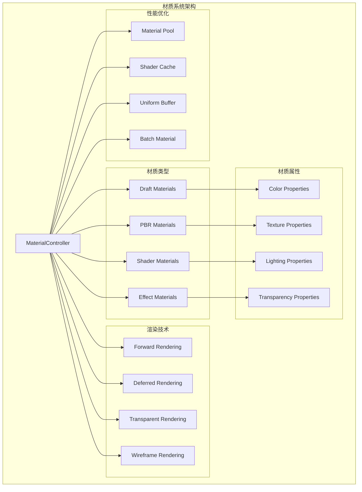
```mermaid
graph TB
    subgraph "材质系统架构"
        MC[MaterialController]
        
        subgraph "材质类型"
            DraftMat[Draft Materials]
            PBRMat[PBR Materials]
            ShaderMat[Shader Materials]
            EffectMat[Effect Materials]
        end
        
        subgraph "材质属性"
            ColorProps[Color Properties]
            TextureProps[Texture Properties]
            LightingProps[Lighting Properties]
            TransparencyProps[Transparency Properties]
        end
        
        subgraph "渲染技术"
            Forward[Forward Rendering]
            Deferred[Deferred Rendering]
            Transparent[Transparent Rendering]
            Wireframe[Wireframe Rendering]
        end
        
        subgraph "性能优化"
            MaterialPool[Material Pool]
            ShaderCache[Shader Cache]
            UniformBuffer[Uniform Buffer]
            BatchMaterial[Batch Material]
        end
    end
    
    MC --> DraftMat
    MC --> PBRMat
    MC --> ShaderMat
    MC --> EffectMat
    
    DraftMat --> ColorProps
    PBRMat --> TextureProps
    ShaderMat --> LightingProps
    EffectMat --> TransparencyProps
    
    MC --> Forward
    MC --> Deferred
    MC --> Transparent
    MC --> Wireframe
    
    MC --> MaterialPool
    MC --> ShaderCache
    MC --> UniformBuffer
    MC --> BatchMaterial
```

### 材质更新流程

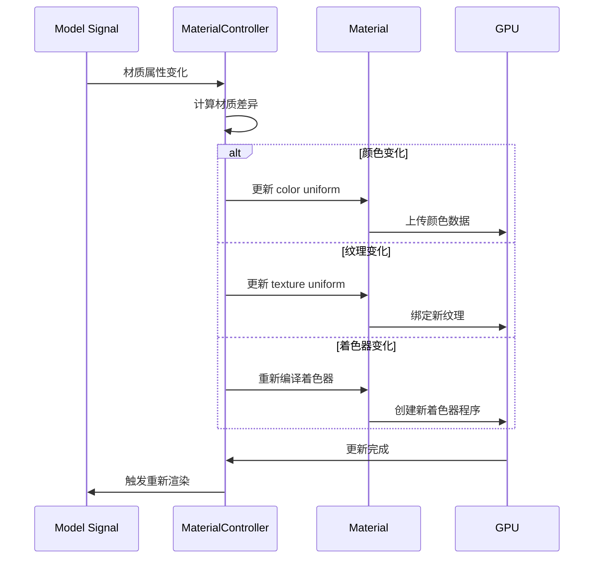
```mermaid
sequenceDiagram
    participant Model as Model Signal
    participant MC as MaterialController
    participant Mat as Material
    participant GPU
    
    Model->>MC: 材质属性变化
    MC->>MC: 计算材质差异
    
    alt 颜色变化
        MC->>Mat: 更新 color uniform
        Mat->>GPU: 上传颜色数据
    else 纹理变化
        MC->>Mat: 更新 texture uniform
        Mat->>GPU: 绑定新纹理
    else 着色器变化
        MC->>Mat: 重新编译着色器
        Mat->>GPU: 创建新着色器程序
    end
    
    GPU->>MC: 更新完成
    MC->>Model: 触发重新渲染
```

## 特效系统

### 高级渲染效果

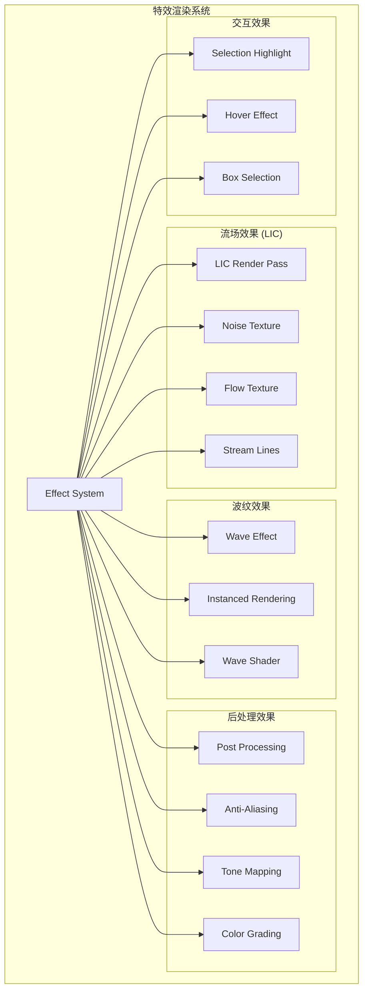
```mermaid
graph TB
    subgraph "特效渲染系统"
        ES[Effect System]
        
        subgraph "流场效果 (LIC)"
            LICPass[LIC Render Pass]
            NoiseTexture[Noise Texture]
            FlowTexture[Flow Texture]
            StreamLines[Stream Lines]
        end
        
        subgraph "波纹效果"
            WaveEffect[Wave Effect]
            InstancedRender[Instanced Rendering]
            WaveShader[Wave Shader]
        end
        
        subgraph "后处理效果"
            PostProcess[Post Processing]
            AntiAliasing[Anti-Aliasing]
            ToneMapping[Tone Mapping]
            ColorGrading[Color Grading]
        end
        
        subgraph "交互效果"
            SelectionHighlight[Selection Highlight]
            HoverEffect[Hover Effect]
            BoxSelection[Box Selection]
        end
    end
    
    ES --> LICPass
    ES --> NoiseTexture
    ES --> FlowTexture
    ES --> StreamLines
    
    ES --> WaveEffect
    ES --> InstancedRender
    ES --> WaveShader
    
    ES --> PostProcess
    ES --> AntiAliasing
    ES --> ToneMapping
    ES --> ColorGrading
    
    ES --> SelectionHighlight
    ES --> HoverEffect
    ES --> BoxSelection
```

### LIC 流场渲染流程

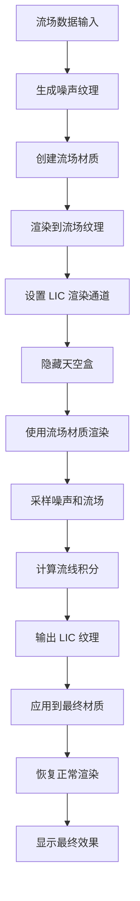
```mermaid
flowchart TD
    A[流场数据输入] --> B[生成噪声纹理]
    B --> C[创建流场材质]
    C --> D[渲染到流场纹理]
    
    D --> E[设置 LIC 渲染通道]
    E --> F[隐藏天空盒]
    F --> G[使用流场材质渲染]
    
    G --> H[采样噪声和流场]
    H --> I[计算流线积分]
    I --> J[输出 LIC 纹理]
    
    J --> K[应用到最终材质]
    K --> L[恢复正常渲染]
    L --> M[显示最终效果]
```

## 性能优化系统

### 渲染优化策略

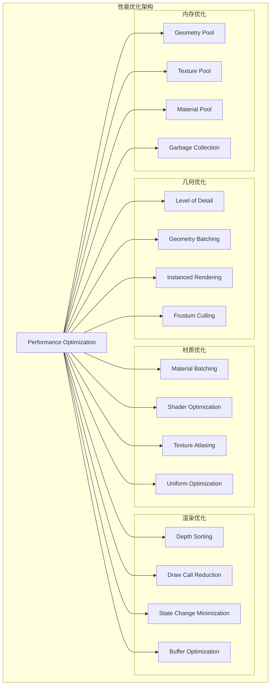
```mermaid
graph TB
    subgraph "性能优化架构"
        PO[Performance Optimization]
        
        subgraph "几何优化"
            LOD[Level of Detail]
            GeomBatch[Geometry Batching]
            InstRender[Instanced Rendering]
            Culling[Frustum Culling]
        end
        
        subgraph "材质优化"
            MatBatch[Material Batching]
            ShaderOpt[Shader Optimization]
            TexAtlas[Texture Atlasing]
            UniformOpt[Uniform Optimization]
        end
        
        subgraph "渲染优化"
            DepthSort[Depth Sorting]
            DrawCall[Draw Call Reduction]
            StateChange[State Change Minimization]
            BufferOpt[Buffer Optimization]
        end
        
        subgraph "内存优化"
            GeomPool[Geometry Pool]
            TexPool[Texture Pool]
            MatPool[Material Pool]
            GC[Garbage Collection]
        end
    end
    
    PO --> LOD
    PO --> GeomBatch
    PO --> InstRender
    PO --> Culling
    
    PO --> MatBatch
    PO --> ShaderOpt
    PO --> TexAtlas
    PO --> UniformOpt
    
    PO --> DepthSort
    PO --> DrawCall
    PO --> StateChange
    PO --> BufferOpt
    
    PO --> GeomPool
    PO --> TexPool
    PO --> MatPool
    PO --> GC
```

### 内存管理策略

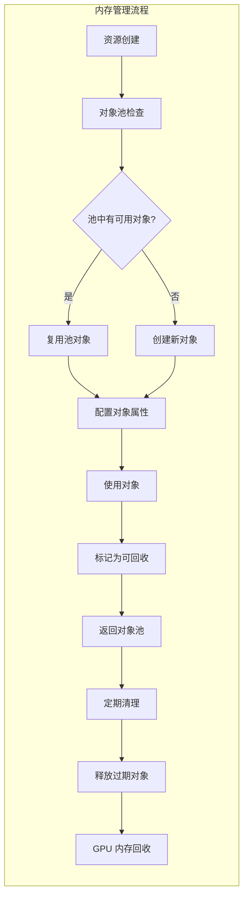
```mermaid
graph LR
    subgraph "内存管理流程"
        A[资源创建] --> B[对象池检查]
        B --> C{池中有可用对象?}
        
        C -->|是| D[复用池对象]
        C -->|否| E[创建新对象]
        
        D --> F[配置对象属性]
        E --> F
        
        F --> G[使用对象]
        G --> H[标记为可回收]
        H --> I[返回对象池]
        
        I --> J[定期清理]
        J --> K[释放过期对象]
        K --> L[GPU 内存回收]
    end
```

## 交互系统

### ThreeControls 交互架构

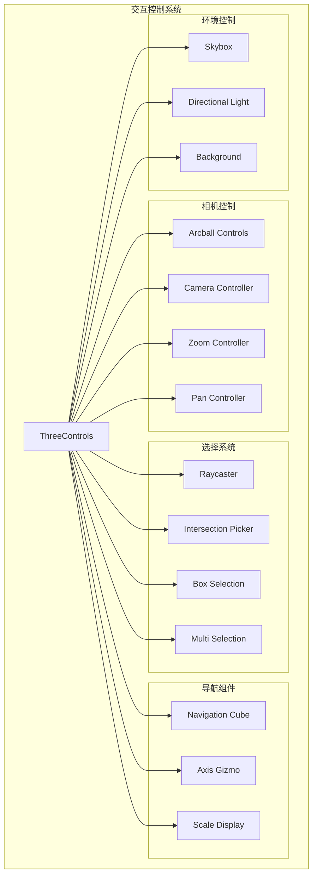
```mermaid
graph TB
    subgraph "交互控制系统"
        TC[ThreeControls]
        
        subgraph "相机控制"
            AC[Arcball Controls]
            CC[Camera Controller]
            ZC[Zoom Controller]
            PC[Pan Controller]
        end
        
        subgraph "选择系统"
            Ray[Raycaster]
            Pick[Intersection Picker]
            BoxSel[Box Selection]
            MultiSel[Multi Selection]
        end
        
        subgraph "导航组件"
            NavCube[Navigation Cube]
            AxisGizmo[Axis Gizmo]
            ScaleDisplay[Scale Display]
        end
        
        subgraph "环境控制"
            Skybox[Skybox]
            DirLight[Directional Light]
            Background[Background]
        end
    end
    
    TC --> AC
    TC --> CC
    TC --> ZC
    TC --> PC
    
    TC --> Ray
    TC --> Pick
    TC --> BoxSel
    TC --> MultiSel
    
    TC --> NavCube
    TC --> AxisGizmo
    TC --> ScaleDisplay
    
    TC --> Skybox
    TC --> DirLight
    TC --> Background
```

### 射线投射选择流程

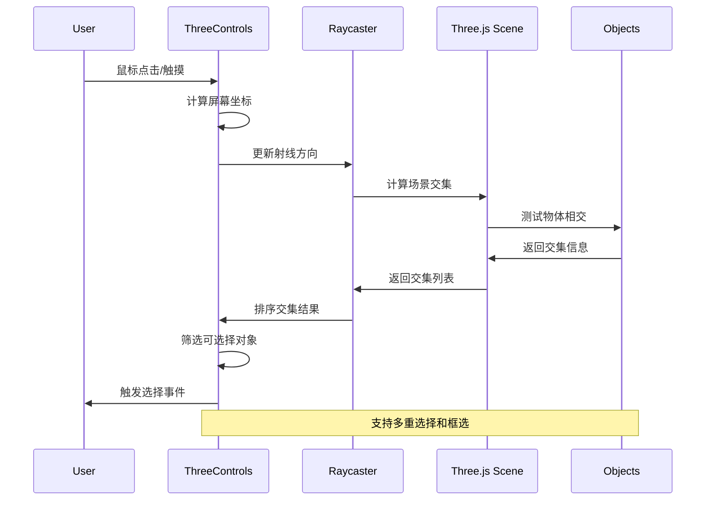
```mermaid
sequenceDiagram
    participant User
    participant TC as ThreeControls
    participant Ray as Raycaster
    participant Scene as Three.js Scene
    participant Objects
    
    User->>TC: 鼠标点击/触摸
    TC->>TC: 计算屏幕坐标
    TC->>Ray: 更新射线方向
    
    Ray->>Scene: 计算场景交集
    Scene->>Objects: 测试物体相交
    Objects->>Scene: 返回交集信息
    
    Scene->>Ray: 返回交集列表
    Ray->>TC: 排序交集结果
    
    TC->>TC: 筛选可选择对象
    TC->>User: 触发选择事件
    
    Note over TC,Objects: 支持多重选择和框选
```

## 环境系统

### EnvironmentController 架构

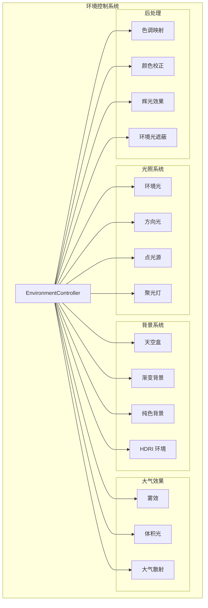
```mermaid
graph TB
    subgraph "环境控制系统"
        EC[EnvironmentController]
        
        subgraph "光照系统"
            AmbLight[环境光]
            DirLight[方向光]
            PointLight[点光源]
            SpotLight[聚光灯]
        end
        
        subgraph "背景系统"
            Skybox[天空盒]
            GradientBG[渐变背景]
            SolidBG[纯色背景]
            HDRI[HDRI 环境]
        end
        
        subgraph "大气效果"
            Fog[雾效]
            VolumetricLight[体积光]
            AtmosphericScatter[大气散射]
        end
        
        subgraph "后处理"
            ToneMap[色调映射]
            ColorCorrect[颜色校正]
            Bloom[辉光效果]
            SSAO[环境光遮蔽]
        end
    end
    
    EC --> AmbLight
    EC --> DirLight
    EC --> PointLight
    EC --> SpotLight
    
    EC --> Skybox
    EC --> GradientBG
    EC --> SolidBG
    EC --> HDRI
    
    EC --> Fog
    EC --> VolumetricLight
    EC --> AtmosphericScatter
    
    EC --> ToneMap
    EC --> ColorCorrect
    EC --> Bloom
    EC --> SSAO
```

## 数据流和信号集成

### 响应式渲染流程

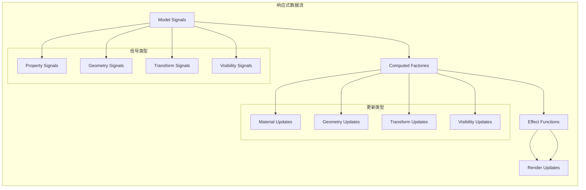
```mermaid
graph LR
    subgraph "响应式数据流"
        MS[Model Signals] --> CF[Computed Factories]
        CF --> EF[Effect Functions]
        EF --> RU[Render Updates]
        
        subgraph "信号类型"
            PS[Property Signals]
            GS[Geometry Signals]
            TS[Transform Signals]
            VS[Visibility Signals]
        end
        
        subgraph "更新类型"
            MU[Material Updates]
            GU[Geometry Updates]
            TU[Transform Updates]
            VU[Visibility Updates]
        end
    end
    
    MS --> PS
    MS --> GS
    MS --> TS
    MS --> VS
    
    CF --> MU
    CF --> GU
    CF --> TU
    CF --> VU
    
    EF --> RU
```

### 批量更新机制

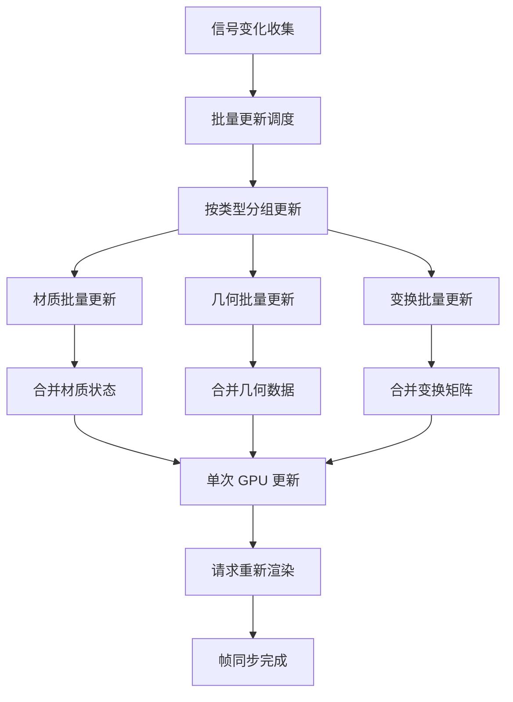
```mermaid
flowchart TD
    A[信号变化收集] --> B[批量更新调度]
    B --> C[按类型分组更新]
    
    C --> D[材质批量更新]
    C --> E[几何批量更新]
    C --> F[变换批量更新]
    
    D --> G[合并材质状态]
    E --> H[合并几何数据]
    F --> I[合并变换矩阵]
    
    G --> J[单次 GPU 更新]
    H --> J
    I --> J
    
    J --> K[请求重新渲染]
    K --> L[帧同步完成]
```

## 错误处理和调试

### 错误处理架构

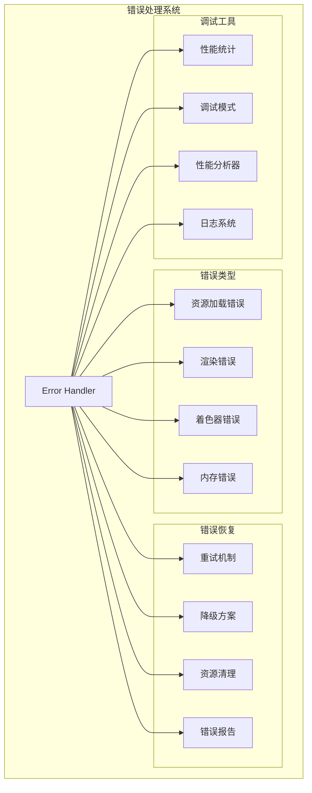
```mermaid
graph TB
    subgraph "错误处理系统"
        EH[Error Handler]
        
        subgraph "错误类型"
            LoadError[资源加载错误]
            RenderError[渲染错误]
            ShaderError[着色器错误]
            MemoryError[内存错误]
        end
        
        subgraph "错误恢复"
            Retry[重试机制]
            Fallback[降级方案]
            Cleanup[资源清理]
            Report[错误报告]
        end
        
        subgraph "调试工具"
            Stats[性能统计]
            DebugMode[调试模式]
            Profiler[性能分析器]
            Logger[日志系统]
        end
    end
    
    EH --> LoadError
    EH --> RenderError
    EH --> ShaderError
    EH --> MemoryError
    
    EH --> Retry
    EH --> Fallback
    EH --> Cleanup
    EH --> Report
    
    EH --> Stats
    EH --> DebugMode
    EH --> Profiler
    EH --> Logger
```

## 渲染管道优化

### 多线程渲染架构

```mermaid
graph TB
    subgraph "多线程渲染系统"
        MT[Multi-Threading]
        
        subgraph "主线程"
            MainThread[Main Thread]
            UIUpdate[UI Updates]
            SceneManage[Scene Management]
        end
        
        subgraph "工作线程"
            WorkerThread[Worker Thread]
            GeomProcess[Geometry Processing]
            DataLoad[Data Loading]
        end
        
        subgraph "渲染线程"
            RenderThread[Render Thread]
            GPUCommand[GPU Commands]
            BufferUpdate[Buffer Updates]
        end
        
        subgraph "通信机制"
            MessagePass[Message Passing]
            SharedBuffer[Shared Buffers]
            AsyncQueue[Async Queues]
        end
    end
    
    MT --> MainThread
    MT --> WorkerThread
    MT --> RenderThread
    
    MainThread --> UIUpdate
    MainThread --> SceneManage
    
    WorkerThread --> GeomProcess
    WorkerThread --> DataLoad
    
    RenderThread --> GPUCommand
    RenderThread --> BufferUpdate
    
    MT --> MessagePass
    MT --> SharedBuffer
    MT --> AsyncQueue
```

## 扩展性和插件系统

### 渲染扩展架构

```mermaid
graph TB
    subgraph "扩展系统架构"
        ES[Extension System]
        
        subgraph "渲染扩展点"
            PreRender[Pre-Render Hook]
            PostRender[Post-Render Hook]
            MaterialExt[Material Extension]
            EffectExt[Effect Extension]
        end
        
        subgraph "自定义渲染器"
            CustomRenderer[Custom Renderer]
            CustomShader[Custom Shader]
            CustomEffect[Custom Effect]
            CustomControl[Custom Control]
        end
        
        subgraph "插件管理"
            PluginLoader[Plugin Loader]
            PluginRegistry[Plugin Registry]
            PluginLifecycle[Plugin Lifecycle]
        end
    end
    
    ES --> PreRender
    ES --> PostRender
    ES --> MaterialExt
    ES --> EffectExt
    
    ES --> CustomRenderer
    ES --> CustomShader
    ES --> CustomEffect
    ES --> CustomControl
    
    ES --> PluginLoader
    ES --> PluginRegistry
    ES --> PluginLifecycle
```

## 总结

UVF 的 Rendering 系统通过以下关键特性实现了高效的 3D 渲染：

### 🏗️ **架构优势**

1. **模块化设计**: 清晰的组件分离和职责划分
2. **适配器模式**: 灵活的渲染后端支持
3. **响应式编程**: 自动的数据变更传播和渲染更新
4. **工厂模式**: 统一的图形对象创建和管理
5. **异步架构**: 非阻塞的资源加载和渲染

### ⚡ **性能特性**

- **批量渲染**: 减少 GPU 状态切换和绘制调用
- **实例化渲染**: 高效的重复几何体渲染
- **LOD 系统**: 基于距离的细节层次管理
- **视锥剔除**: 智能的可见性判断
- **内存池**: 对象复用和内存优化

### 🎨 **渲染特性**

- **PBR 材质**: 物理真实的材质渲染
- **高级特效**: LIC 流场、波纹效果、后处理
- **交互系统**: 完整的 3D 交互控制
- **环境系统**: 丰富的光照和背景效果
- **调试工具**: 性能监控和错误处理

### 🔧 **开发友好**

- **类型安全**: 完整的 TypeScript 类型系统
- **错误处理**: 完善的错误恢复机制
- **扩展性**: 插件化的渲染扩展
- **调试支持**: 丰富的调试和性能分析工具

这种架构设计使得 UVF 能够处理复杂的 3D 场景渲染，同时保持良好的性能和开发体验，为构建高质量的 3D 可视化应用提供了坚实的基础。
