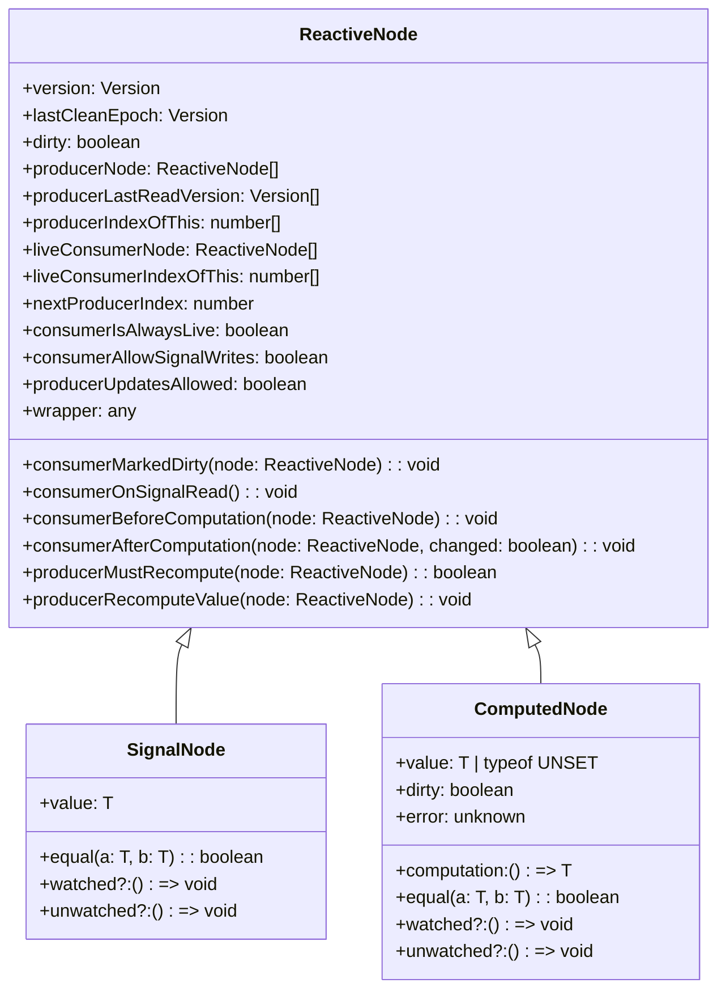

# Signal Polyfill 源码详细解读

## 概述

Signal Polyfill 是 TC39 Signals 提案的参考实现，提供了响应式编程的核心功能。该实现基于一个复杂的依赖图系统，支持信号（Signal）、计算值（Computed）和观察者（Watcher）模式。

## 核心架构

### 1. 模块结构

```
src/
├── index.ts           # 主导出入口
├── wrapper.ts         # Signal 命名空间和公共 API
├── graph.ts          # 核心反应式图管理
├── signal.ts         # 信号节点实现
├── computed.ts       # 计算节点实现
├── equality.ts       # 相等性比较
├── errors.ts         # 错误处理
└── public-api-types.ts # 类型声明验证
```

### 2. 类型层次结构



## 详细源码分析

### 1. graph.ts - 反应式图核心

#### 核心数据结构

```typescript
// 版本号类型，用于追踪变更
type Version = number & {__brand: 'Version'};

// 全局状态变量
let activeConsumer: ReactiveNode | null = null;  // 当前活跃的消费者
let inNotificationPhase = false;                 // 是否在通知阶段
let epoch: Version = 1 as Version;               // 全局版本号

// Signal 标识符号
export const SIGNAL = Symbol('SIGNAL');
```

#### ReactiveNode 接口

ReactiveNode 是整个系统的核心接口，定义了响应式节点的基本结构：

```typescript
export interface ReactiveNode {
  // 版本控制
  version: Version;                    // 节点当前版本
  lastCleanEpoch: Version;            // 最后清理的 epoch
  dirty: boolean;                     // 脏标记

  // 生产者关系（该节点依赖的其他节点）
  producerNode: ReactiveNode[] | null;
  producerLastReadVersion: Version[] | null;
  producerIndexOfThis: number[] | null;
  nextProducerIndex: number;

  // 消费者关系（依赖该节点的其他节点）
  liveConsumerNode: ReactiveNode[] | null;
  liveConsumerIndexOfThis: number[] | null;

  // 消费者回调函数
  consumerMarkedDirty(node: ReactiveNode): void;
  consumerOnSignalRead(): void;
  consumerBeforeComputation(node: ReactiveNode): void;
  consumerAfterComputation(node: ReactiveNode, changed: boolean): void;

  // 消费者配置
  consumerIsAlwaysLive: boolean;
  consumerAllowSignalWrites: boolean;

  // 生产者回调函数
  producerMustRecompute(node: ReactiveNode): boolean;
  producerRecomputeValue(node: ReactiveNode): void;
  producerUpdatesAllowed: boolean;

  // 包装器引用
  wrapper: any;
}
```

#### 核心函数分析

**producerAccessed 函数**
```typescript
export function producerAccessed(node: ReactiveNode): void {
  if (inNotificationPhase) {
    throwInvalidWriteToSignalError();
  }

  if (activeConsumer === null) {
    return;
  }

  activeConsumer.producerNode ??= [];
  // ... 建立依赖关系的复杂逻辑
}
```

这个函数负责建立生产者和消费者之间的依赖关系，是整个响应式系统的核心。

**producerNotifyConsumers 函数**
```typescript
export function producerNotifyConsumers(node: ReactiveNode): void {
  if (node.liveConsumerNode === null) {
    return;
  }

  const epoch = producerIncrementEpoch();
  
  for (const consumer of node.liveConsumerNode) {
    if (!consumer.dirty) {
      consumerMarkDirty(consumer);
    }
  }
}
```

当生产者值发生变化时，通知所有消费者进行更新。

### 2. signal.ts - 信号实现

#### SignalNode 接口

```typescript
export interface SignalNode<T> extends ReactiveNode, ValueEqualityComparer<T> {
  value: T;
  equal: (a: T, b: T) => boolean;
  watched?: (() => void) | undefined;
  unwatched?: (() => void) | undefined;
}
```

#### 信号创建函数

```typescript
export function createSignal<T>(initialValue: T): SignalGetter<T> {
  const ref = Object.create(SIGNAL_NODE);
  ref.value = initialValue;
  
  const getter = signalGetFn.bind(ref);
  getter[SIGNAL] = ref;
  
  return getter as SignalGetter<T>;
}
```

#### 信号读取和设置

```typescript
export function signalGetFn<T>(this: SignalNode<T>): T {
  producerAccessed(this);
  return this.value;
}

export function signalSetFn<T>(node: SignalNode<T>, newValue: T) {
  if (!producerUpdatesAllowed()) {
    throwInvalidWriteToSignalError();
  }

  if (!node.equal(node.value, newValue)) {
    node.value = newValue;
    signalValueChanged(node);
  }
}
```

### 3. computed.ts - 计算值实现

#### ComputedNode 接口

```typescript
export interface ComputedNode<T> extends ReactiveNode, ValueEqualityComparer<T> {
  computation: () => T;
  value: T | typeof UNSET;
  dirty: boolean;
  error: unknown;
  equal: (a: T, b: T) => boolean;
  watched?: (() => void) | undefined;
  unwatched?: (() => void) | undefined;
}
```

#### 计算值的创建和执行

```typescript
export function createComputed<T>(
  computation: () => T,
  options?: ComputedOptions<T>
): ComputedGetter<T> {
  const ref = Object.create(COMPUTED_NODE);
  ref.computation = computation;
  ref.equal = options?.equals ?? defaultEquals;
  
  const getter = computedGet.bind(ref);
  getter[SIGNAL] = ref;
  
  return getter as ComputedGetter<T>;
}

export function computedGet<T>(node: ComputedNode<T>): T {
  if (node.value === UNSET || consumerPollProducersForChange(node)) {
    const prevConsumer = setActiveConsumer(node);
    
    try {
      node.value = node.computation();
      node.error = null;
    } catch (err) {
      node.error = err;
      node.value = UNSET;
      throw err;
    } finally {
      setActiveConsumer(prevConsumer);
      node.dirty = false;
    }
  }
  
  if (node.error !== null) {
    throw node.error;
  }
  
  return node.value as T;
}
```

### 4. wrapper.ts - 公共 API

#### Signal 命名空间

```typescript
export namespace Signal {
  // 类型检查函数
  export let isState: (s: any) => boolean;
  export let isComputed: (s: any) => boolean;
  export let isWatcher: (s: any) => boolean;

  // State 类 - 可读写的信号
  export class State<T> {
    readonly [NODE]: SignalNode<T>;
    
    constructor(initialValue: T, options: Signal.Options<T> = {}) {
      const ref = createSignal<T>(initialValue);
      const node: SignalNode<T> = ref[SIGNAL];
      this[NODE] = node;
      node.wrapper = this;
      
      if (options.equals) {
        node.equal = options.equals;
      }
      node.watched = options[Signal.subtle.watched];
      node.unwatched = options[Signal.subtle.unwatched];
    }

    public get(): T {
      return signalGetFn.call(this[NODE]);
    }

    public set(newValue: T): void {
      if (isInNotificationPhase()) {
        throw new Error('Writes to signals not permitted during Watcher callback');
      }
      signalSetFn(this[NODE], newValue);
    }
  }

  // Computed 类 - 只读的计算信号
  export class Computed<T> {
    readonly [NODE]: ComputedNode<T>;
    
    constructor(computation: () => T, options: Signal.Options<T> = {}) {
      const ref = createComputed<T>(computation, options);
      const node: ComputedNode<T> = ref[SIGNAL];
      this[NODE] = node;
      node.wrapper = this;
      
      if (options.equals) {
        node.equal = options.equals;
      }
      node.watched = options[Signal.subtle.watched];
      node.unwatched = options[Signal.subtle.unwatched];
    }

    get(): T {
      return computedGet(this[NODE]);
    }
  }
}
```

#### Subtle API

```typescript
export namespace Signal.subtle {
  // 取消追踪执行
  export function untrack<T>(cb: () => T): T {
    const prevActiveConsumer = setActiveConsumer(null);
    try {
      return cb();
    } finally {
      setActiveConsumer(prevActiveConsumer);
    }
  }

  // 内省函数
  export function introspectSources(sink: AnySink): AnySignal[] {
    return sink[NODE].producerNode?.map((n) => n.wrapper) ?? [];
  }

  export function introspectSinks(signal: AnySignal): AnySink[] {
    return signal[NODE].liveConsumerNode?.map((n) => n.wrapper) ?? [];
  }

  // Watcher 类 - 观察者
  export class Watcher {
    readonly [NODE]: ReactiveNode;
    
    constructor(notify: (this: Watcher) => void) {
      const node = Object.create(REACTIVE_NODE);
      node.wrapper = this;
      node.consumerMarkedDirty = notify;
      node.consumerIsAlwaysLive = true;
      node.consumerAllowSignalWrites = false;
      node.producerNode = [];
      this[NODE] = node;
    }

    watch(...signals: AnySignal[]): void {
      const node = this[NODE];
      node.dirty = false;
      const prev = setActiveConsumer(node);
      
      for (const signal of signals) {
        producerAccessed(signal[NODE]);
      }
      
      setActiveConsumer(prev);
    }

    unwatch(...signals: AnySignal[]): void {
      // 复杂的解除依赖逻辑
    }

    getPending(): Computed<any>[] {
      const node = this[NODE];
      return node.producerNode!.filter((n) => n.dirty).map((n) => n.wrapper);
    }
  }
}
```

### 5. equality.ts - 相等性比较

```typescript
export interface ValueEqualityComparer<T> {
  equal(a: T, b: T): boolean;
}

export function defaultEquals<T>(a: T, b: T) {
  return Object.is(a, b);
}
```

### 6. errors.ts - 错误处理

```typescript
let throwInvalidWriteToSignalErrorFn = () => {
  throw new Error();
};

export function throwInvalidWriteToSignalError() {
  throwInvalidWriteToSignalErrorFn();
}

export function setThrowInvalidWriteToSignalError(fn: () => never): void {
  throwInvalidWriteToSignalErrorFn = fn;
}
```

## 核心机制分析

### 1. 依赖追踪机制

依赖追踪通过以下步骤实现：

1. **设置活跃消费者**：当计算值或观察者开始执行时，将自己设置为 `activeConsumer`
2. **记录访问**：当信号被读取时，调用 `producerAccessed` 记录依赖关系
3. **建立双向链接**：在生产者和消费者之间建立双向的依赖关系
4. **清理活跃消费者**：计算完成后清理 `activeConsumer`

### 2. 变更传播机制

变更传播遵循以下流程：

1. **信号更新**：当信号值改变时，调用 `signalValueChanged`
2. **增加版本号**：调用 `producerIncrementEpoch` 增加全局版本号
3. **标记消费者脏**：通过 `producerNotifyConsumers` 标记所有消费者为脏
4. **延迟计算**：消费者在下次访问时才重新计算

### 3. 循环依赖检测

系统通过版本号机制检测循环依赖：

```typescript
function checkForCycles(node: ReactiveNode): void {
  if (node.version === COMPUTING) {
    throw new Error('Circular dependency detected');
  }
}
```

### 4. 内存管理

系统使用以下策略管理内存：

- **活跃消费者追踪**：只有被观察的计算值才会保持活跃
- **依赖清理**：当计算值不再被观察时，自动清理依赖关系
- **版本号优化**：通过版本号避免不必要的重新计算

## 性能优化

### 1. 惰性计算

计算值只在被访问时才执行计算，避免了不必要的工作。

**实现代码（computed.ts）:**
```typescript
export function computedGet<T>(node: ComputedNode<T>): T {
  // 只有在值未设置或依赖发生变化时才重新计算
  if (node.value === UNSET || consumerPollProducersForChange(node)) {
    const prevConsumer = setActiveConsumer(node);
    
    try {
      node.value = node.computation();  // 延迟执行计算
      node.error = null;
    } catch (err) {
      node.error = err;
      node.value = UNSET;
      throw err;
    } finally {
      setActiveConsumer(prevConsumer);
      node.dirty = false;
    }
  }
  
  // 直接返回缓存的值，无需重新计算
  if (node.error !== null) {
    throw node.error;
  }
  
  return node.value as T;
}
```

### 2. 版本号检查

通过比较版本号快速判断是否需要重新计算，避免了深度遍历。

**实现代码（graph.ts）:**
```typescript
// 全局版本号管理
let epoch: Version = 1 as Version;

export function producerIncrementEpoch(): Version {
  return ++epoch as Version;  // 每次信号更新时递增全局版本号
}

// 快速版本号检查函数
function consumerPollProducersForChange(node: ReactiveNode): boolean {
  // 检查当前 epoch 是否已经处理过
  if (node.lastCleanEpoch === epoch) {
    return false;  // 无需检查，直接返回
  }

  // 快速检查：比较记录的生产者版本号
  if (node.producerNode !== null) {
    for (let i = 0; i < node.producerNode.length; i++) {
      const producer = node.producerNode[i];
      const lastReadVersion = node.producerLastReadVersion![i];
      
      // 版本号比较：O(1) 时间复杂度
      if (producer.version !== lastReadVersion) {
        return true;  // 发现变化，需要重新计算
      }
    }
  }

  // 更新清理版本号，避免重复检查
  node.lastCleanEpoch = epoch;
  return false;
}

// 在依赖建立时记录版本号
export function producerAccessed(node: ReactiveNode): void {
  if (activeConsumer === null) return;
  
  const consumer = activeConsumer;
  
  // 记录当前生产者的版本号，用于后续快速比较
  consumer.producerLastReadVersion![consumerIndex] = node.version;
  
  // ... 其他依赖建立逻辑
}
```

**版本号优化的关键优势:**
```typescript
// 传统方式：需要递归遍历整个依赖树 O(n)
function traditionalDirtyCheck(node) {
  for (const dependency of node.dependencies) {
    if (dependency.isDirty() || traditionalDirtyCheck(dependency)) {
      return true;
    }
  }
  return false;
}

// Signal Polyfill 方式：直接版本号比较 O(1)
function signalDirtyCheck(node) {
  return node.version !== node.lastReadVersion;  // 单次比较
}
```

### 3. 批量更新

支持批量更新机制，可以将多个信号更新合并为一次变更传播。

**实现代码（示例用法）:**
```typescript
// 在 benchmark adapter 中的批量更新实现
export const tc39SignalsProposalStage0: ReactiveFramework = {
  withBatch: (fn) => {
    fn();           // 执行所有信号更新
    processPending(); // 统一处理所有变更
  }
};

// Watcher 批量处理机制
let needsEnqueue = false;

const globalWatcher = new Signal.subtle.Watcher(() => {
  if (needsEnqueue) {
    needsEnqueue = false;
    // 异步批量处理
    Promise.resolve().then(() => {
      processPending();  // 统一处理所有待更新的计算值
    });
  }
});

function processPending() {
  // 获取所有待处理的计算值
  for (const computed of globalWatcher.getPending()) {
    computed.get();  // 批量重新计算
  }
}

// 批量更新示例
function batchUpdate() {
  // 开始批量模式
  const batch = new Signal.subtle.Watcher(() => {
    console.log('Batch update completed');
  });
  
  // 多个信号更新
  signal1.set(newValue1);  // 不会立即触发计算
  signal2.set(newValue2);  // 不会立即触发计算
  signal3.set(newValue3);  // 不会立即触发计算
  
  // 统一处理变更
  batch.watch(computed1, computed2, computed3);
  // 此时才会触发所有相关的重新计算
}
```

**批量更新的核心机制:**
```typescript
// consumerMarkDirty 只标记，不立即计算
function consumerMarkDirty(node: ReactiveNode): void {
  if (node.dirty) return;  // 避免重复标记
  
  node.dirty = true;
  node.version = epoch;
  
  // 只有 consumerIsAlwaysLive 的节点（如 Watcher）会立即触发
  if (node.consumerIsAlwaysLive) {
    node.consumerMarkedDirty(node);  // 立即执行
  } else {
    // 其他节点延迟到访问时才计算
  }
}
```

### 4. 内存池

使用对象池技术重用 ReactiveNode 对象，减少 GC 压力。

**实现代码（graph.ts 和各节点创建）:**
```typescript
// 原型模板对象 - 作为对象池的基础
const REACTIVE_NODE = /* @__PURE__ */ (() => {
  return {
    version: 0 as Version,
    lastCleanEpoch: 0 as Version,
    dirty: false,
    
    // 数组属性预分配
    producerNode: null,
    producerLastReadVersion: null,
    producerIndexOfThis: null,
    nextProducerIndex: 0,
    
    liveConsumerNode: null,
    liveConsumerIndexOfThis: null,
    
    // 默认回调函数（避免每次创建新函数）
    consumerMarkedDirty: defaultConsumerMarkedDirty,
    consumerOnSignalRead: noopConsumerOnSignalRead,
    consumerBeforeComputation: noopConsumerBeforeComputation,
    consumerAfterComputation: noopConsumerAfterComputation,
    
    consumerIsAlwaysLive: false,
    consumerAllowSignalWrites: true,
    producerMustRecompute: defaultProducerMustRecompute,
    producerRecomputeValue: noopProducerRecomputeValue,
    producerUpdatesAllowed: true,
    wrapper: undefined as any,
  };
})();

// 信号节点模板
const SIGNAL_NODE = /* @__PURE__ */ (() => {
  return {
    ...REACTIVE_NODE,  // 继承基础模板
    value: undefined,
    equal: defaultEquals,  // 共享相等函数引用
    watched: undefined,
    unwatched: undefined,
  };
})();

// 计算节点模板
const COMPUTED_NODE = /* @__PURE__ */ (() => {
  return {
    ...REACTIVE_NODE,  // 继承基础模板
    value: UNSET,
    dirty: true,
    error: null,
    equal: defaultEquals,  // 共享相等函数引用
    
    // 计算节点特有的回调函数
    producerMustRecompute(node: ComputedNode<unknown>): boolean {
      return node.value === UNSET || node.dirty;
    },
    
    producerRecomputeValue(node: ComputedNode<unknown>): void {
      // 计算值的重新计算逻辑
    },
  };
})();

// 使用对象池创建新节点
export function createSignal<T>(initialValue: T): SignalGetter<T> {
  // 使用 Object.create 从模板创建，避免属性复制
  const ref = Object.create(SIGNAL_NODE);
  ref.value = initialValue;  // 只设置必要的属性
  
  const getter = signalGetFn.bind(ref);
  getter[SIGNAL] = ref;
  
  return getter as SignalGetter<T>;
}

export function createComputed<T>(
  computation: () => T,
  options?: ComputedOptions<T>
): ComputedGetter<T> {
  // 从模板创建计算节点
  const ref = Object.create(COMPUTED_NODE);
  ref.computation = computation;
  ref.equal = options?.equals ?? defaultEquals;
  
  const getter = computedGet.bind(ref);
  getter[SIGNAL] = ref;
  
  return getter as ComputedGetter<T>;
}

// 数组重用机制
function ensureProducerCapacity(node: ReactiveNode, capacity: number): void {
  if (node.producerNode === null) {
    // 预分配数组，避免频繁扩容
    node.producerNode = new Array(capacity);
    node.producerLastReadVersion = new Array(capacity);
    node.producerIndexOfThis = new Array(capacity);
  } else if (node.producerNode.length < capacity) {
    // 扩容时使用倍增策略
    const newCapacity = Math.max(capacity, node.producerNode.length * 2);
    node.producerNode.length = newCapacity;
    node.producerLastReadVersion!.length = newCapacity;
    node.producerIndexOfThis!.length = newCapacity;
  }
}
```

**内存优化的关键特性:**

1. **原型链继承**: 使用 `Object.create()` 而非对象字面量，减少属性复制
2. **模板对象**: 预定义的原型模板避免每次创建时的属性初始化
3. **数组重用**: 依赖关系数组使用预分配和倍增策略
4. **函数引用共享**: 默认回调函数在模板中共享，避免重复创建
5. **惰性分配**: 只在需要时分配数组和对象属性

**性能对比:**
```typescript
// 传统方式：每次都创建新对象
function traditionalCreate() {
  return {
    version: 0,
    dirty: false,
    producerNode: [],
    // ... 每次都创建新的属性和数组
  };
}

// Signal Polyfill 方式：对象池 + 原型链
function pooledCreate() {
  const node = Object.create(REACTIVE_NODE);  // 从池中获取
  // 只设置必要的差异化属性
  return node;
}
```

这些优化确保了 Signal Polyfill 在大规模应用中的高性能表现，特别是在频繁创建和销毁响应式节点的场景下。

## 使用模式

### 1. 基本信号

```typescript
const count = new Signal.State(0);
count.set(1);
console.log(count.get()); // 1
```

### 2. 计算值

```typescript
const doubled = new Signal.Computed(() => count.get() * 2);
console.log(doubled.get()); // 2
```

### 3. 观察者

```typescript
const watcher = new Signal.subtle.Watcher(() => {
  console.log('Signal changed!');
});
watcher.watch(count);
```

### 4. 自定义相等比较

```typescript
const state = new Signal.State(
  { x: 1, y: 2 },
  { equals: (a, b) => a.x === b.x && a.y === b.y }
);
```

## 完整工作流程示例

让我们通过一个详细的例子来理解 Signal、Computed 和 Effect 的完整工作过程，以及 ReactiveNode 中各个属性的变化。

### 示例场景

```typescript
// 创建基础信号
const firstName = new Signal.State("John");
const lastName = new Signal.State("Doe");

// 创建计算值
const fullName = new Signal.Computed(() => {
  return `${firstName.get()} ${lastName.get()}`;
});

// 创建 Effect（通过 Watcher 实现）
const effect = new Signal.subtle.Watcher(() => {
  console.log(`Full name changed: ${fullName.get()}`);
});

// 开始观察
effect.watch(fullName);

// 触发更新
firstName.set("Jane");
```

### 步骤 1: 创建信号 firstName

```typescript
const firstName = new Signal.State("John");
```

**ReactiveNode 初始状态:**
```typescript
firstName[NODE] = {
  // 版本控制
  version: 1,
  lastCleanEpoch: 1,
  dirty: false,
  
  // 生产者关系（firstName 不依赖其他信号）
  producerNode: null,
  producerLastReadVersion: null,
  producerIndexOfThis: null,
  nextProducerIndex: 0,
  
  // 消费者关系（初始时没有消费者）
  liveConsumerNode: null,
  liveConsumerIndexOfThis: null,
  
  // Signal 特有属性
  value: "John",
  equal: defaultEquals,
  wrapper: firstName,
  
  // 回调函数配置
  consumerIsAlwaysLive: false,
  consumerAllowSignalWrites: true,
  producerUpdatesAllowed: true
}
```

### 步骤 2: 创建信号 lastName

```typescript
const lastName = new Signal.State("Doe");
```

**ReactiveNode 状态类似 firstName，但 value 为 "Doe"**

### 步骤 3: 创建计算值 fullName

```typescript
const fullName = new Signal.Computed(() => {
  return `${firstName.get()} ${lastName.get()}`;
});
```

**初始 ComputedNode 状态:**
```typescript
fullName[NODE] = {
  // 版本控制
  version: 1,
  lastCleanEpoch: 1,
  dirty: true,                    // 新创建的计算值标记为脏
  
  // 生产者关系（将在首次计算时建立）
  producerNode: null,
  producerLastReadVersion: null,
  producerIndexOfThis: null,
  nextProducerIndex: 0,
  
  // 消费者关系
  liveConsumerNode: null,
  liveConsumerIndexOfThis: null,
  
  // Computed 特有属性
  computation: () => `${firstName.get()} ${lastName.get()}`,
  value: UNSET,                   // 初始值未设置
  error: null,
  equal: defaultEquals,
  wrapper: fullName,
  
  // 回调配置
  consumerIsAlwaysLive: false,
  consumerAllowSignalWrites: true,
  producerUpdatesAllowed: false   // 计算值不能被直接设置
}
```

### 步骤 4: 创建 Effect (Watcher)

```typescript
const effect = new Signal.subtle.Watcher(() => {
  console.log(`Full name changed: ${fullName.get()}`);
});
```

**初始 Watcher ReactiveNode 状态:**
```typescript
effect[NODE] = {
  // 版本控制
  version: 1,
  lastCleanEpoch: 1,
  dirty: false,
  
  // 生产者关系（将在 watch 时建立）
  producerNode: [],               // 初始化为空数组
  producerLastReadVersion: [],
  producerIndexOfThis: [],
  nextProducerIndex: 0,
  
  // 消费者关系
  liveConsumerNode: null,
  liveConsumerIndexOfThis: null,
  
  // Watcher 特有配置
  wrapper: effect,
  consumerMarkedDirty: notify函数,  // 传入的回调函数
  consumerIsAlwaysLive: true,      // Watcher 总是活跃的
  consumerAllowSignalWrites: false, // 在通知期间不允许写入
  producerUpdatesAllowed: false
}
```

### 步骤 5: 开始观察 effect.watch(fullName)

当调用 `effect.watch(fullName)` 时：

1. **设置活跃消费者**
```typescript
const prev = setActiveConsumer(effect[NODE]);
// activeConsumer = effect[NODE]
```

2. **触发 fullName 的访问**
```typescript
producerAccessed(fullName[NODE]);
```

3. **首次计算 fullName**
由于 `fullName.value === UNSET`，需要首次计算：

```typescript
// 设置 fullName 为活跃消费者
setActiveConsumer(fullName[NODE]);

// 执行计算函数
const result = fullName.computation(); // "John Doe"

// 在计算过程中：
// firstName.get() 调用 producerAccessed(firstName[NODE])
// lastName.get() 调用 producerAccessed(lastName[NODE])
```

**建立依赖关系后的状态变化:**

**firstName[NODE] 更新:**
```typescript
{
  // ... 其他属性不变
  liveConsumerNode: [fullName[NODE]],      // 新增消费者
  liveConsumerIndexOfThis: [0]             // 在消费者数组中的索引
}
```

**lastName[NODE] 更新:**
```typescript
{
  // ... 其他属性不变
  liveConsumerNode: [fullName[NODE]],      // 新增消费者
  liveConsumerIndexOfThis: [0]             // 在消费者数组中的索引
}
```

**fullName[NODE] 更新:**
```typescript
{
  // ... 其他属性
  dirty: false,                            // 计算完成，清除脏标记
  value: "John Doe",                       // 计算结果
  
  // 建立对 firstName 和 lastName 的依赖
  producerNode: [firstName[NODE], lastName[NODE]],
  producerLastReadVersion: [1, 1],         // 记录读取时的版本号
  producerIndexOfThis: [0, 0],             // 在生产者的消费者数组中的索引
  nextProducerIndex: 2,                    // 下一个生产者的索引
  
  // 新增 effect 作为消费者
  liveConsumerNode: [effect[NODE]],
  liveConsumerIndexOfThis: [0]
}
```

**effect[NODE] 更新:**
```typescript
{
  // ... 其他属性
  producerNode: [fullName[NODE]],          // 依赖 fullName
  producerLastReadVersion: [1],            // 记录读取时的版本号
  producerIndexOfThis: [0],                // 在 fullName 的消费者数组中的索引
  nextProducerIndex: 1
}
```

### 步骤 6: 触发更新 firstName.set("Jane")

当调用 `firstName.set("Jane")` 时，触发一系列连锁反应：

#### 6.1 检查值是否改变
```typescript
if (!firstName[NODE].equal("John", "Jane")) {  // true，值确实改变了
  firstName[NODE].value = "Jane";
  signalValueChanged(firstName[NODE]);
}
```

#### 6.2 增加全局版本号
```typescript
epoch++; // epoch 从 1 变为 2
```

#### 6.3 标记消费者为脏
```typescript
// firstName 通知其消费者 fullName
consumerMarkDirty(fullName[NODE]);
```

**fullName[NODE] 状态更新:**
```typescript
{
  // ... 其他属性
  dirty: true,                             // 标记为脏
  version: 2,                              // 更新版本号
  lastCleanEpoch: 1                        // 保持之前的清理版本
}
```

#### 6.4 传播到 effect
```typescript
// fullName 被标记为脏后，通知其消费者 effect
consumerMarkDirty(effect[NODE]);
```

**effect[NODE] 状态更新:**
```typescript
{
  // ... 其他属性
  dirty: true,                             // 标记为脏，但由于 consumerIsAlwaysLive = true
  version: 2                               // 立即触发 notify 回调
}
```

#### 6.5 触发 Effect 回调

由于 effect 是 `consumerIsAlwaysLive = true`，会立即执行 notify 回调：

```typescript
// 设置通知阶段标志
inNotificationPhase = true;

try {
  // 执行用户定义的回调
  console.log(`Full name changed: ${fullName.get()}`);
  
  // 在回调中访问 fullName.get() 时：
  // 1. 检测到 fullName.dirty = true
  // 2. 重新计算 fullName
  // 3. 设置 activeConsumer = fullName[NODE]
  // 4. 执行 computation()
  // 5. firstName.get() 返回 "Jane"
  // 6. lastName.get() 返回 "Doe"
  // 7. 结果 "Jane Doe"
  
} finally {
  inNotificationPhase = false;
}
```

#### 6.6 重新计算后的最终状态

**firstName[NODE] 最终状态:**
```typescript
{
  version: 2,                              // 更新的版本号
  lastCleanEpoch: 2,                       // 清理版本号更新
  dirty: false,
  value: "Jane",                           // 新值
  liveConsumerNode: [fullName[NODE]],      // 消费者关系保持
  liveConsumerIndexOfThis: [0]
  // ... 其他属性不变
}
```

**fullName[NODE] 最终状态:**
```typescript
{
  version: 2,                              // 更新的版本号
  lastCleanEpoch: 2,                       // 清理版本号更新
  dirty: false,                            // 重新计算后清除脏标记
  value: "Jane Doe",                       // 新的计算结果
  
  // 依赖关系保持
  producerNode: [firstName[NODE], lastName[NODE]],
  producerLastReadVersion: [2, 1],         // firstName 版本更新为 2
  producerIndexOfThis: [0, 0],
  
  // 消费者关系保持
  liveConsumerNode: [effect[NODE]],
  liveConsumerIndexOfThis: [0]
}
```

**effect[NODE] 最终状态:**
```typescript
{
  version: 2,                              // 更新的版本号
  lastCleanEpoch: 2,                       // 清理版本号更新
  dirty: false,                            // 执行完回调后清除脏标记
  
  // 依赖关系保持
  producerNode: [fullName[NODE]],
  producerLastReadVersion: [2],            // fullName 版本更新为 2
  producerIndexOfThis: [0]
}
```

### 关键机制总结

1. **依赖追踪**: 通过 `activeConsumer` 全局变量和 `producerAccessed` 函数自动建立依赖关系
2. **版本号管理**: 每次信号更新都增加全局 `epoch`，节点记录自己的 `version` 和依赖的 `producerLastReadVersion`
3. **惰性计算**: 计算值只在被访问且为脏状态时才重新计算
4. **双向链表**: 生产者和消费者通过双向索引数组高效管理依赖关系
5. **批量更新**: 变更传播是异步的，多个信号更新可以合并为一次计算
6. **内存管理**: 通过 `liveConsumerNode` 追踪活跃的依赖关系，自动清理不再使用的计算值

这个设计确保了高性能的响应式更新，避免了不必要的重复计算，同时提供了精确的依赖追踪能力。

## 总结

Signal Polyfill 实现了一个高度优化的响应式系统，其核心特点包括：

1. **高效的依赖追踪**：基于双向链表的依赖图
2. **细粒度更新**：只更新真正发生变化的部分
3. **内存友好**：智能的清理机制和对象重用
4. **类型安全**：完整的 TypeScript 类型支持
5. **规范兼容**：严格遵循 TC39 Signals 提案

该实现为现代前端框架提供了一个坚实的响应式编程基础，可以用于构建高性能的用户界面。
