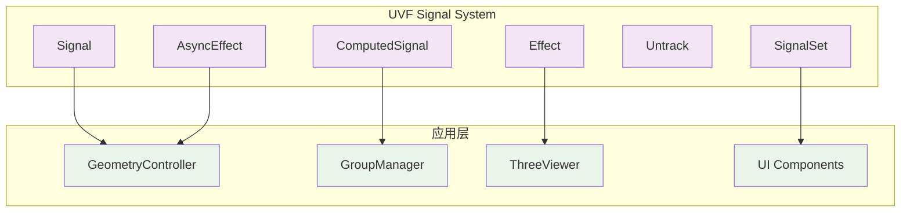
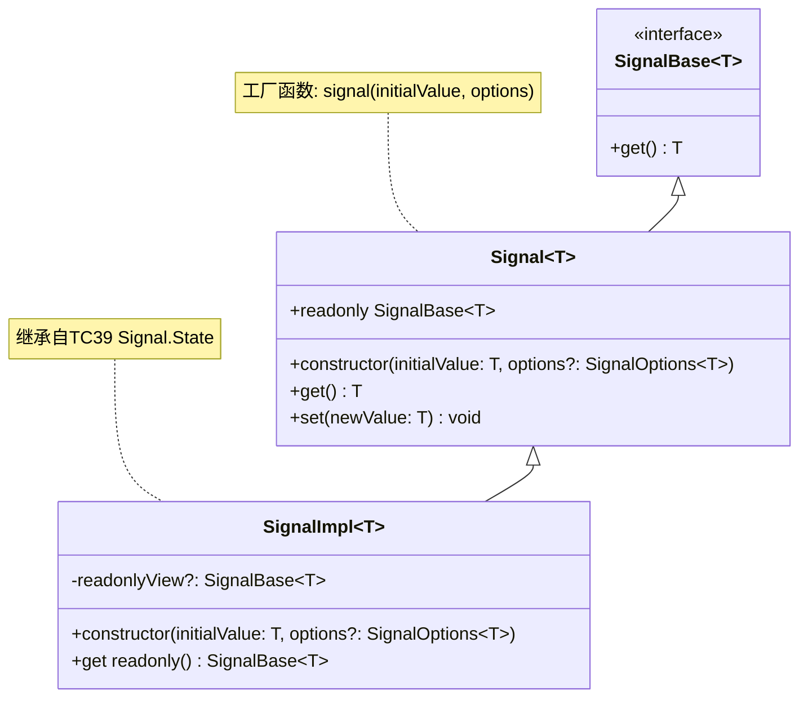
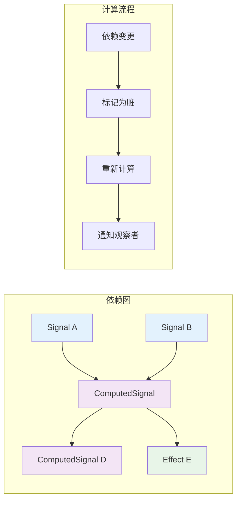
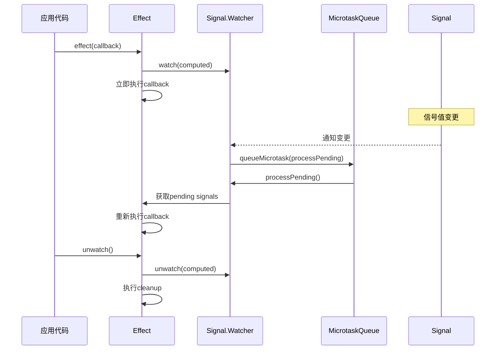
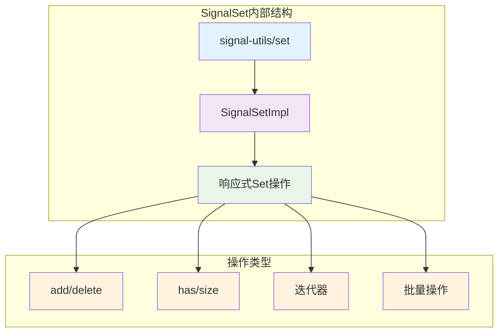
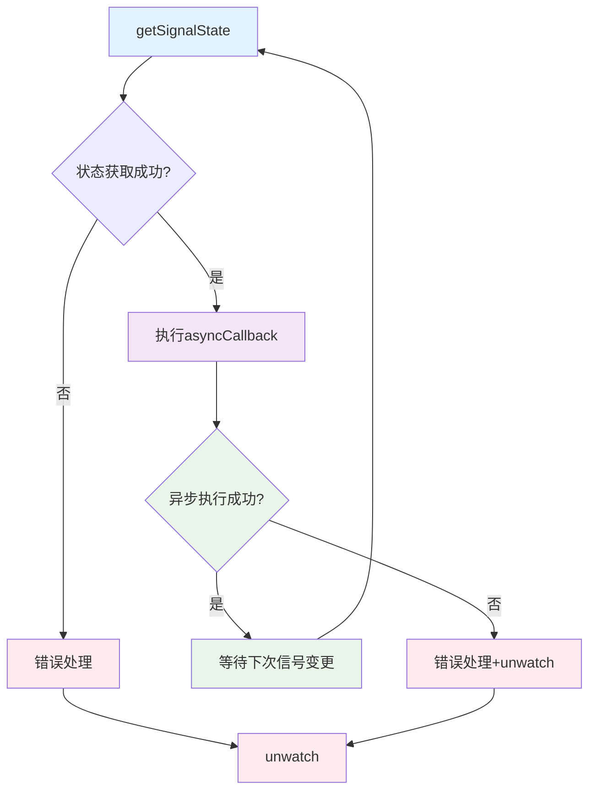
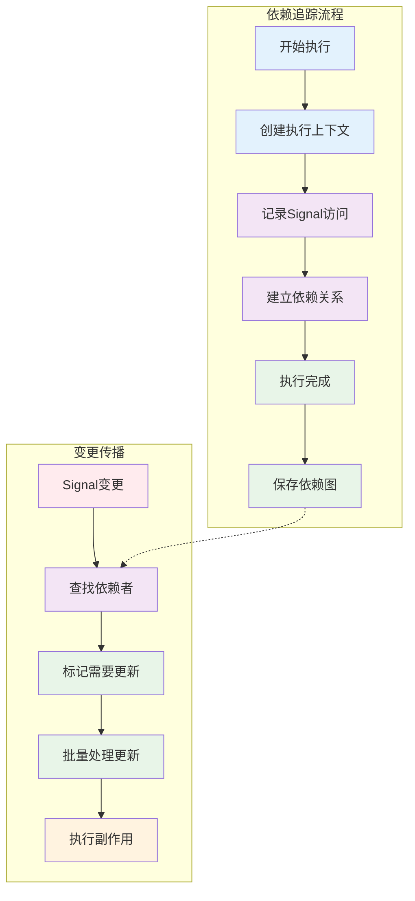
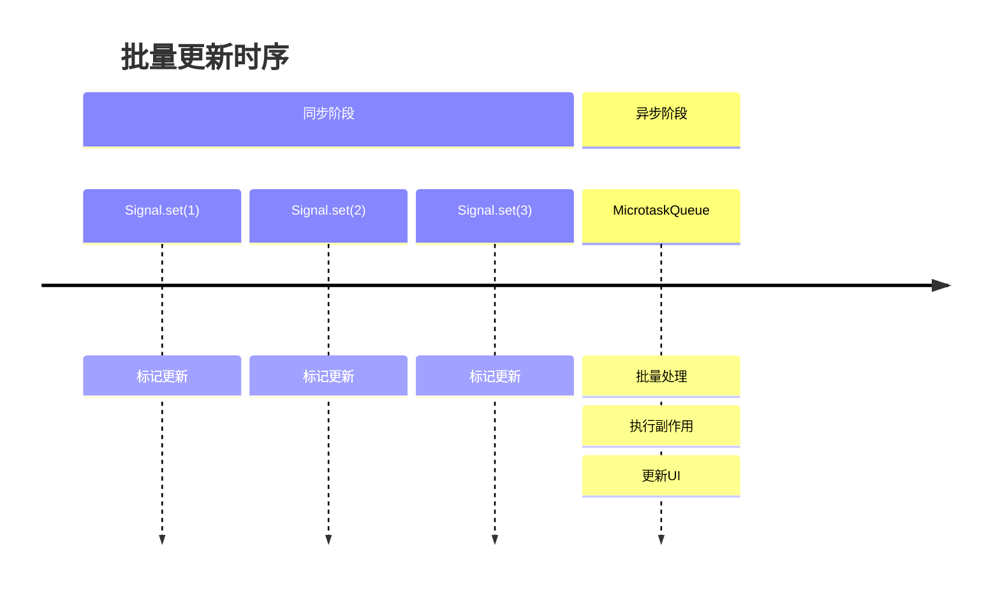
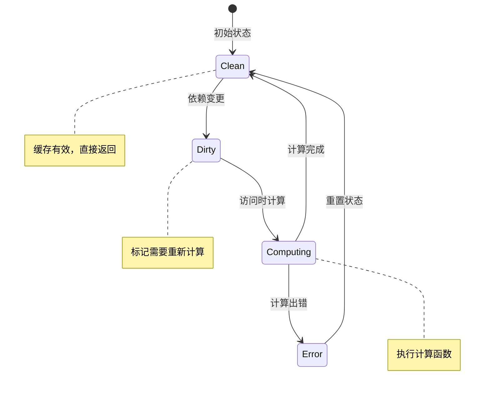
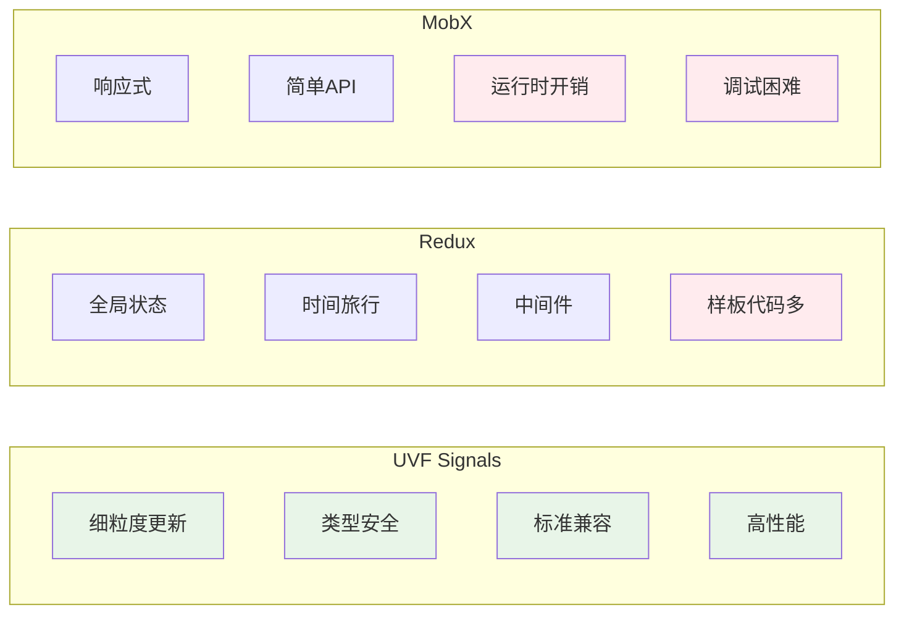

# UVF Signal系统架构解析

## 概述

UVF的Signal系统是一个基于TC39 Signals提案的响应式状态管理解决方案，通过轻量级包装器提供了高性能的细粒度响应式编程能力。该系统采用观察者模式和依赖追踪机制，实现了自动的状态传播和UI更新。

## 核心架构



## UVF Signal 组件详解

### 1. Signal - 基础状态容器



**关键实现原理：**
- 继承自TC39 `Signal.State`，提供原生性能
- 使用Object.is作为默认比较函数，避免不必要的更新
- 提供只读视图，防止意外修改
- 支持自定义相等性比较函数

### 2. ComputedSignal - 派生状态计算



**关键实现原理：**
- 懒计算：只有在访问时才重新计算
- 缓存机制：相同输入下复用计算结果
- 自动依赖追踪：运行时分析依赖关系
- 推拉结合：依赖变更时标记脏，访问时计算

### 3. Effect - 副作用处理系统



**关键实现原理：**
- **批量更新**：使用microtask队列合并同步更新
- **清理机制**：支持cleanup函数，防止内存泄漏
- **错误处理**：内置错误捕获和处理机制
- **Watch/Unwatch**：提供精确的生命周期控制

### 4. SignalSet - 集合状态管理



**关键特性：**
- 完全兼容原生Set接口
- 自动追踪集合变更
- 支持迭代器模式
- 优化的批量操作

### 5. AsyncEffect - 异步副作用处理



**设计特点：**
- 分离同步状态获取和异步执行
- 自动错误处理和资源清理
- 防止竞态条件
- 支持自定义错误处理器

## 依赖追踪机制



## 性能优化策略

### 1. 批量更新机制



### 2. 缓存和懒计算



## 应用场景示例

### 1. 几何体状态管理

```typescript
// GeometryController中的应用
const geometrySignal = signal(initialGeometry);
const transformedGeometry = computed(() => 
  applyTransform(geometrySignal.get(), transformMatrix.get())
);

effect(() => {
  const geometry = transformedGeometry.get();
  updateRenderObject(geometry);
});
```

### 2. 分组管理

```typescript
// GroupManager中的应用
const groupMembers = signalSet<ObjectId>();
const groupProperties = signal<GroupProperties>(defaultProps);

const computedGroupState = computed(() => ({
  members: Array.from(groupMembers.keys()),
  properties: groupProperties.get()
}));
```

### 3. 异步资源加载

```typescript
// 异步加载示例
const resourceUrl = signal('model.gltf');

asyncEffect(
  () => resourceUrl.get(),
  async (url) => {
    const model = await loadModel(url);
    updateScene(model);
  }
);
```

## 架构优势

### 1. 性能优势
- **细粒度更新**：只更新真正需要的部分
- **批量处理**：避免多余的DOM操作
- **懒计算**：减少不必要的计算开销
- **内存友好**：及时清理无用的依赖关系

### 2. 开发体验
- **类型安全**：完整的TypeScript支持
- **直观的API**：贴近原生JavaScript语法
- **错误处理**：内置错误边界
- **调试友好**：清晰的依赖关系追踪

### 3. 可维护性
- **解耦设计**：状态与UI逻辑分离
- **可测试性**：纯函数式的计算逻辑
- **扩展性**：支持自定义比较函数和错误处理
- **向前兼容**：基于标准提案，未来可无缝升级

## 与其他方案对比



## 总结

UVF的Signal系统展现了现代响应式编程的优秀实践：

1. **标准化基础**：基于TC39提案，确保长期兼容性
2. **性能优先**：批量更新、懒计算、细粒度依赖追踪
3. **类型安全**：完整的TypeScript支持
4. **开发友好**：简洁的API、完善的错误处理
5. **架构清晰**：分层设计、职责单一

这种设计使得UVF能够在复杂的3D可视化场景中，提供高效、稳定、易于维护的状态管理解决方案。