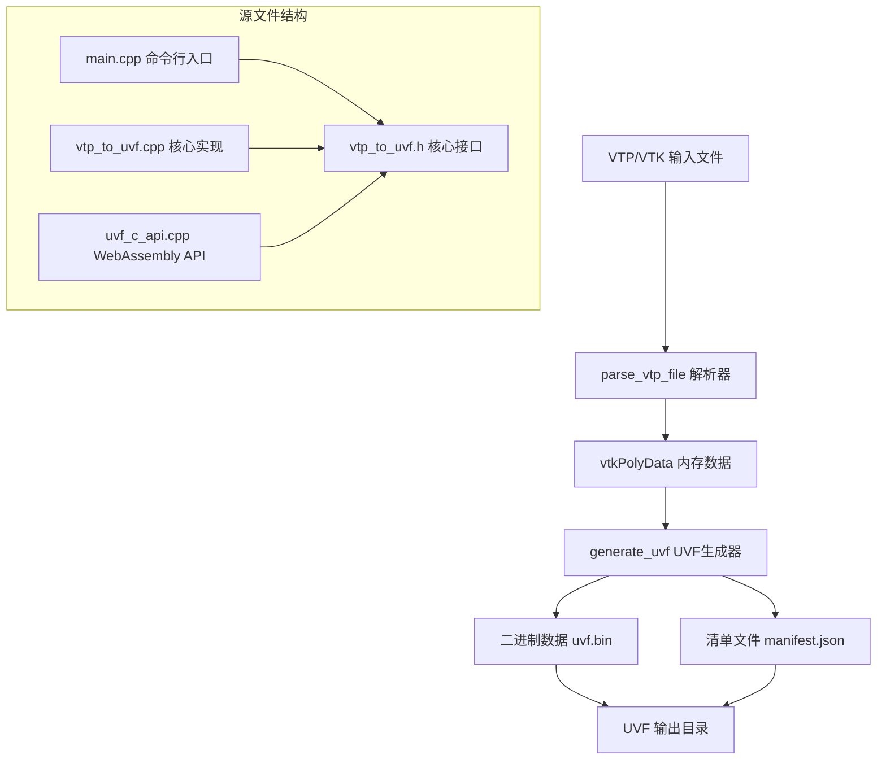
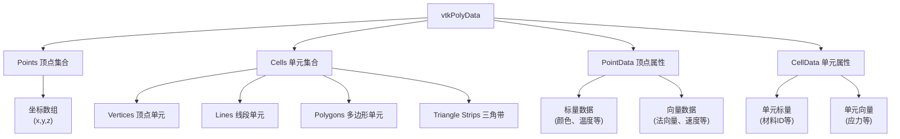
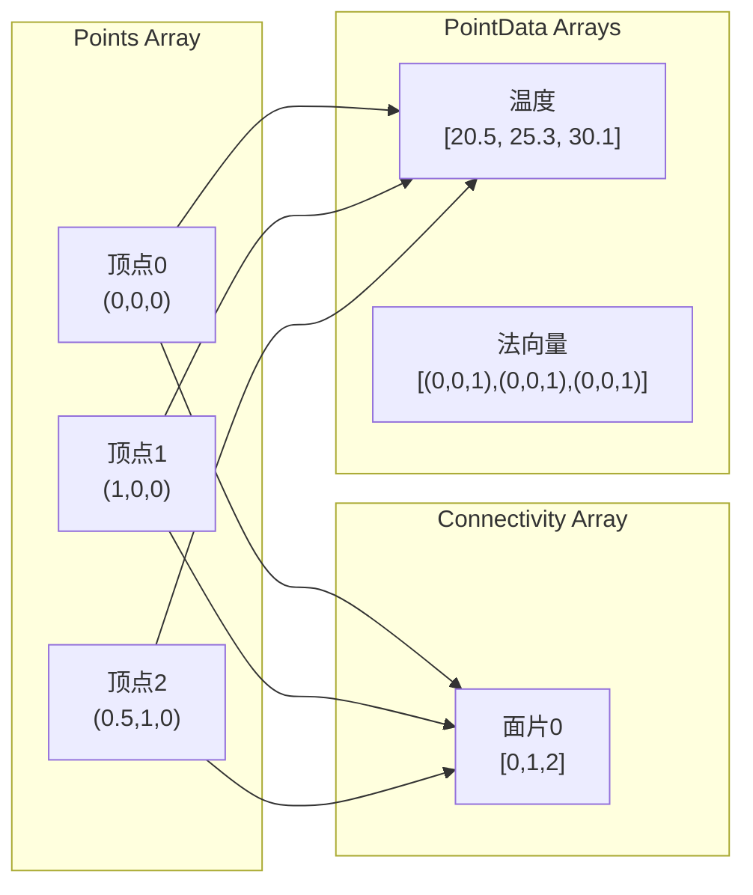
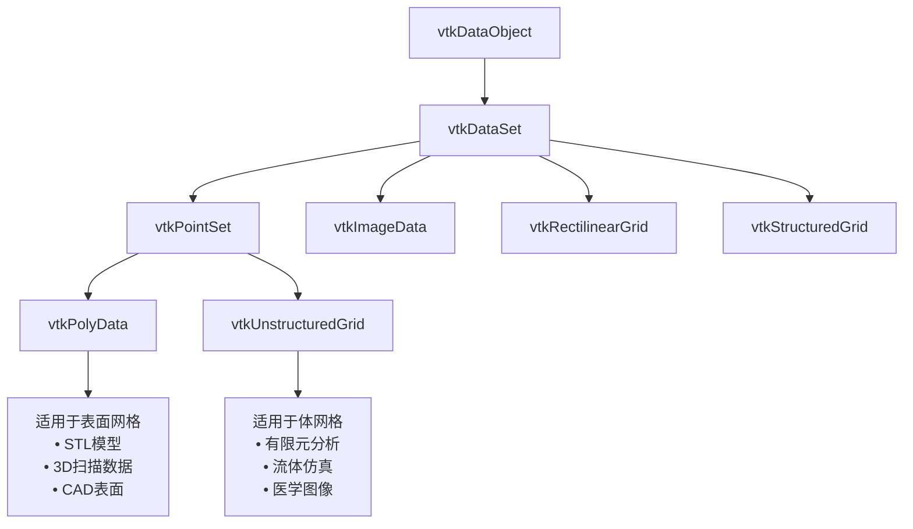
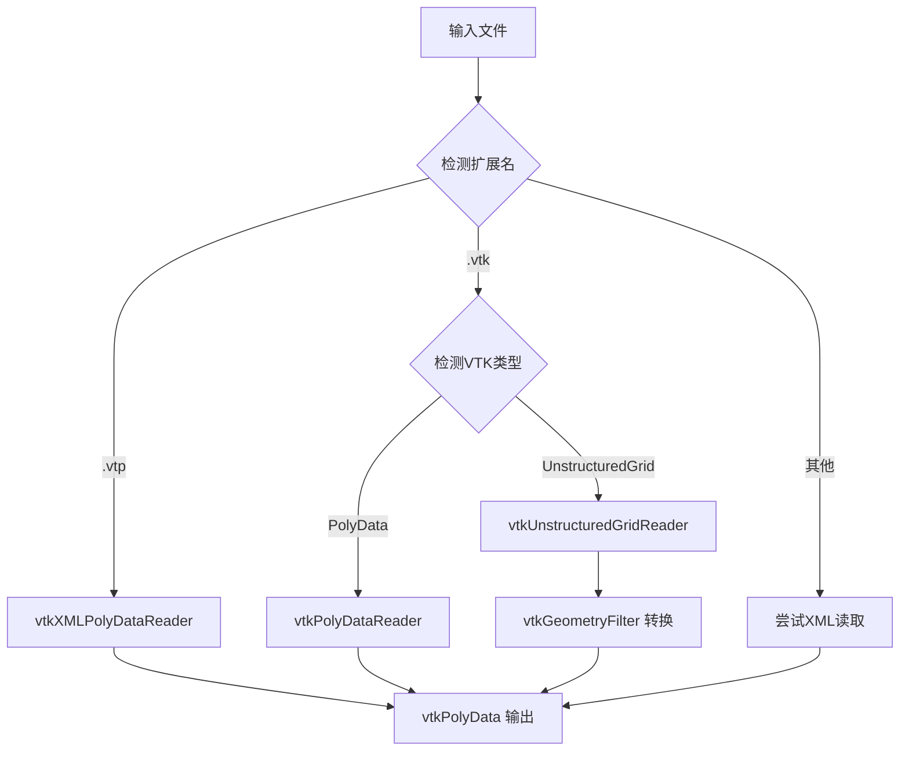
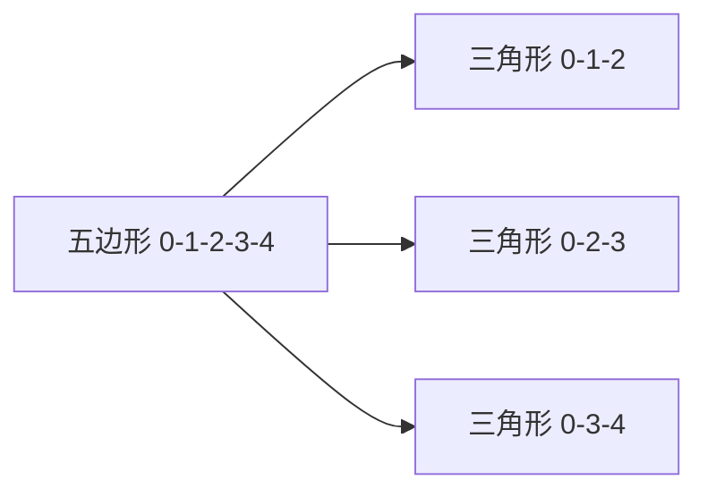
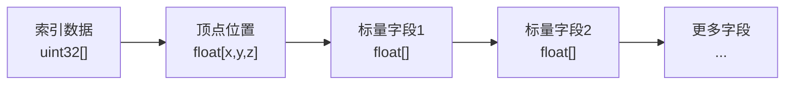
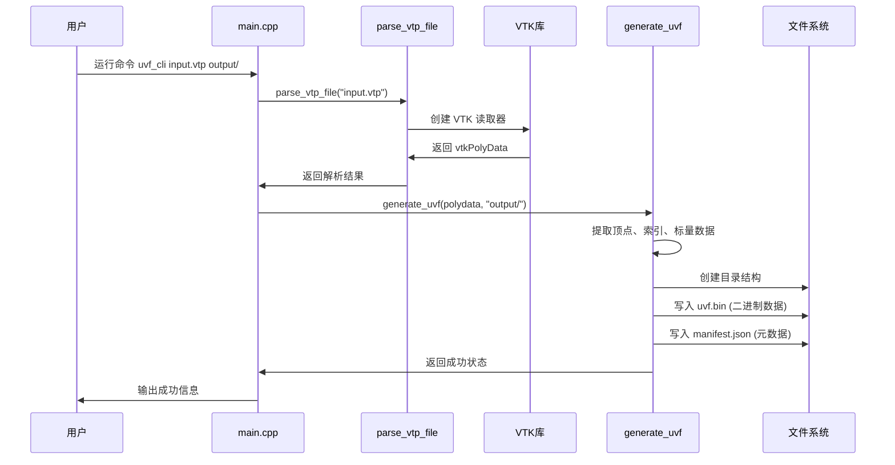

# UVF-C 项目源码详细解读

## 项目概述

这是一个用 C++ 编写的 VTK/VTP 文件转换工具，主要功能是将 VTK 格式的 3D 模型文件转换为 UVF (Universal Visualization Format) 格式。项目支持两种使用方式：命令行工具（原生）和 WebAssembly 库（浏览器）。

## 项目架构



## 源文件详细解读

### 1. main.cpp - 命令行工具入口

**作用**：提供命令行界面，处理用户输入参数

```cpp
int main(int argc, char** argv) {
    if (argc < 3) {
        std::cout << "Usage: " << argv[0] << " input.vtp output_dir" << std::endl;
        return 1;
    }
    const char* vtp_path = argv[1];  // 输入文件路径
    const char* uvf_dir = argv[2];   // 输出目录路径
    
    // 调用核心功能
    auto poly = parse_vtp_file(vtp_path);
    if (!poly) {
        std::cerr << "Failed to read VTP: " << vtp_path << std::endl;
        return 2;
    }
    if (!generate_uvf(poly, uvf_dir)) {
        std::cerr << "Failed to generate UVF in: " << uvf_dir << std::endl;
        return 3;
    }
    std::cout << "Success! Output in: " << uvf_dir << std::endl;
    return 0;
}
```

**关键概念**：
- `argc/argv`：C++ 标准的命令行参数，`argc` 是参数个数，`argv` 是参数字符串数组
- 错误返回码：`1`参数错误，`2`解析失败，`3`生成失败，`0`成功

### 2. vtp_to_uvf.h - 核心接口定义

**作用**：定义对外提供的主要函数接口

```cpp
#pragma once  // 防止头文件被重复包含
#include <vtkSmartPointer.h>
#include <vtkPolyData.h>
#include <string>

// 解析 VTP/VTK 文件，返回 VTK 内存数据结构
vtkSmartPointer<vtkPolyData> parse_vtp_file(const char* path);

// 将 VTK 数据生成 UVF 格式文件
bool generate_uvf(vtkPolyData* poly, const char* uvf_dir);
```

**关键概念**：
- `vtkSmartPointer`：VTK 的智能指针，自动管理内存，防止内存泄漏
- `vtkPolyData`：VTK 中表示多边形网格数据的核心数据结构

### VTK 数据结构详解

#### vtkPolyData - 多边形数据容器

`vtkPolyData` 是 VTK (Visualization Toolkit) 中最重要的数据结构之一，专门用于存储和处理 3D 多边形网格数据。

**数据组成部分**：



**1. Points (顶点)**：
```cpp
auto points = polyData->GetPoints();          // 获取顶点集合
vtkIdType numPoints = points->GetNumberOfPoints(); // 顶点数量
double point[3];
points->GetPoint(0, point);                   // 获取第0个顶点的坐标
// point[0] = x坐标, point[1] = y坐标, point[2] = z坐标
```

**2. Cells (单元/面片)**：
```cpp
auto polys = polyData->GetPolys();            // 获取多边形集合
vtkIdType numPolys = polys->GetNumberOfCells(); // 多边形数量

// 遍历所有多边形
auto idList = vtkSmartPointer<vtkIdList>::New();
polys->InitTraversal();
while (polys->GetNextCell(idList)) {
    vtkIdType numPointsInPoly = idList->GetNumberOfIds(); // 这个多边形有几个顶点
    for (vtkIdType i = 0; i < numPointsInPoly; i++) {
        vtkIdType pointId = idList->GetId(i); // 第i个顶点的索引
    }
}
```

**3. PointData (顶点属性)**：
```cpp
auto pointData = polyData->GetPointData();
int numArrays = pointData->GetNumberOfArrays(); // 有多少个属性数组

for (int i = 0; i < numArrays; i++) {
    auto array = pointData->GetArray(i);
    const char* name = array->GetName();        // 属性名称，如 "temperature"
    int numComponents = array->GetNumberOfComponents(); // 每个顶点几个值（1=标量，3=向量）
    vtkIdType numTuples = array->GetNumberOfTuples();   // 数据点数量
    
    // 获取第0个顶点的属性值
    double value = array->GetComponent(0, 0);   // 第0个顶点的第0个分量
}
```

#### 实际应用示例

假设我们有一个简单的三角形：

```cpp
// 创建一个三角形的 vtkPolyData
auto points = vtkSmartPointer<vtkPoints>::New();
points->InsertNextPoint(0.0, 0.0, 0.0);  // 顶点0: (0,0,0)
points->InsertNextPoint(1.0, 0.0, 0.0);  // 顶点1: (1,0,0)
points->InsertNextPoint(0.5, 1.0, 0.0);  // 顶点2: (0.5,1,0)

auto triangle = vtkSmartPointer<vtkTriangle>::New();
triangle->GetPointIds()->SetId(0, 0);    // 三角形使用顶点0
triangle->GetPointIds()->SetId(1, 1);    // 三角形使用顶点1
triangle->GetPointIds()->SetId(2, 2);    // 三角形使用顶点2

auto cells = vtkSmartPointer<vtkCellArray>::New();
cells->InsertNextCell(triangle);

auto polyData = vtkSmartPointer<vtkPolyData>::New();
polyData->SetPoints(points);
polyData->SetPolys(cells);
```

**内存布局示意图**：



#### VTK 数据类型层次结构



#### 为什么选择 vtkPolyData？

1. **高效存储**：专门为表面网格优化，内存占用小
2. **快速渲染**：GPU 友好的数据格式，渲染性能好
3. **丰富操作**：支持各种几何算法（简化、平滑、布尔运算等）
4. **标准兼容**：支持多种文件格式（STL、OBJ、PLY、VTP等）

#### 在 UVF-C 项目中的作用

```cpp
// 1. 文件解析阶段：各种格式 → vtkPolyData
auto polyData = parse_vtp_file("model.vtp");

// 2. 数据提取阶段：vtkPolyData → 原始数组
auto points = polyData->GetPoints();        // 提取顶点
auto polys = polyData->GetPolys();          // 提取面片
auto pointData = polyData->GetPointData();  // 提取属性

// 3. 格式转换阶段：原始数组 → UVF格式
generate_uvf(polyData, "output/");
```

这样 `vtkPolyData` 就像一个"万能转接器"，可以从各种 3D 文件格式中读取数据，然后统一转换为我们需要的 UVF 格式。

### 3. vtp_to_uvf.cpp - 核心实现（最复杂）

这是项目的核心文件，包含所有主要算法。让我们分段解读：

#### 3.1 文件格式检测

```cpp
static std::string file_ext_lower(const char* path){
    std::string s(path?path:"");
    auto pos = s.find_last_of('.');  // 找到最后一个点
    if(pos==std::string::npos) return "";  // 没找到扩展名
    std::string ext = s.substr(pos+1);     // 提取扩展名
    std::transform(ext.begin(), ext.end(), ext.begin(), ::tolower); // 转小写
    return ext;
}
```

**功能**：从文件路径中提取文件扩展名并转为小写，用于判断文件类型。

#### 3.2 多格式文件解析器

```cpp
vtkSmartPointer<vtkPolyData> parse_vtp_file(const char* path) {
    if(!path) return nullptr;
    std::string ext = file_ext_lower(path);
    vtkSmartPointer<vtkPolyData> output;
    
    if(ext == "vtp") {
        // XML 格式的 VTP 文件
        auto reader = vtkSmartPointer<vtkXMLPolyDataReader>::New();
        reader->SetFileName(path);
        if(!reader->CanReadFile(path)) return nullptr;
        reader->Update();
        output = reader->GetOutput();
    } else if(ext == "vtk") {
        // Legacy VTK 格式
        auto pdReader = vtkSmartPointer<vtkPolyDataReader>::New();
        pdReader->SetFileName(path);
        if(pdReader->IsFilePolyData()) {
            // 直接是多边形数据
            pdReader->Update();
            output = pdReader->GetOutput();
        } else {
            // 尝试非结构化网格，然后转换
            auto ugReader = vtkSmartPointer<vtkUnstructuredGridReader>::New();
            ugReader->SetFileName(path);
            if(ugReader->IsFileUnstructuredGrid()) {
                ugReader->Update();
                auto geom = vtkSmartPointer<vtkGeometryFilter>::New();
                geom->SetInputData(ugReader->GetOutput());
                geom->Update();
                output = geom->GetOutput();
            }
        }
    }
    // ... 其他处理
    return output;
}
```

**数据流程图**：



#### 3.3 数据提取和三角化

```cpp
bool generate_uvf(vtkPolyData* poly, const char* uvf_dir) {
    // 提取顶点数据
    auto pts = poly->GetPoints();
    vtkIdType nPts = pts->GetNumberOfPoints();
    vertices.resize(nPts * 3);  // x,y,z 坐标
    for (vtkIdType i = 0; i < nPts; ++i) {
        double p[3];
        pts->GetPoint(i, p);
        vertices[i * 3 + 0] = static_cast<float>(p[0]);  // X
        vertices[i * 3 + 1] = static_cast<float>(p[1]);  // Y
        vertices[i * 3 + 2] = static_cast<float>(p[2]);  // Z
    }
    
    // 提取面片并三角化
    auto polys = poly->GetPolys();
    auto idList = vtkSmartPointer<vtkIdList>::New();
    polys->InitTraversal();
    while (polys->GetNextCell(idList)) {
        if (idList->GetNumberOfIds() < 3) continue;  // 至少3个顶点
        // 扇形三角化：将多边形分解为多个三角形
        for (vtkIdType j = 1; j < idList->GetNumberOfIds() - 1; ++j) {
            indices.push_back(static_cast<uint32_t>(idList->GetId(0)));     // 第一个顶点
            indices.push_back(static_cast<uint32_t>(idList->GetId(j)));     // 当前顶点
            indices.push_back(static_cast<uint32_t>(idList->GetId(j + 1))); // 下一个顶点
        }
    }
}
```

**三角化过程示意图**：



#### 3.4 标量数据提取

```cpp
// 提取顶点相关的标量数据（如颜色、温度等）
auto pd = poly->GetPointData();
for (int i = 0; i < pd->GetNumberOfArrays(); ++i) {
    auto arr = pd->GetArray(i);
    if (!arr) continue;
    string name = arr->GetName() ? arr->GetName() : ("field" + std::to_string(i));
    int nComp = arr->GetNumberOfComponents();  // 每个数据点的分量数
    vtkIdType nTuples = arr->GetNumberOfTuples(); // 数据点数量
    
    vector<float> data(nTuples * nComp);
    for (vtkIdType t = 0; t < nTuples; ++t) {
        for (int c = 0; c < nComp; ++c) {
            data[t * nComp + c] = static_cast<float>(arr->GetComponent(t, c));
        }
    }
    scalar_data[name] = std::move(data);
}
```

#### 3.5 二进制数据写入

```cpp
bool write_binary_data(const vector<float>& vertices, const vector<uint32_t>& indices, 
                      const map<string, vector<float>>& scalar_data, 
                      const string& bin_path, UVFOffsets& offsets) {
    std::ofstream ofs(bin_path, std::ios::binary);
    if (!ofs) return false;
    size_t current_offset = 0;
    
    // 1. 写入索引数据
    ofs.write(reinterpret_cast<const char*>(indices.data()), indices.size() * sizeof(uint32_t));
    offsets.fields["indices"] = {current_offset, indices.size() * sizeof(uint32_t), "uint32", 1};
    current_offset += indices.size() * sizeof(uint32_t);
    
    // 2. 写入顶点位置
    ofs.write(reinterpret_cast<const char*>(vertices.data()), vertices.size() * sizeof(float));
    offsets.fields["position"] = {current_offset, vertices.size() * sizeof(float), "float32", 3};
    current_offset += vertices.size() * sizeof(float);
    
    // 3. 写入标量字段
    for (const auto& kv : scalar_data) {
        const string& name = kv.first;
        const auto& data = kv.second;
        ofs.write(reinterpret_cast<const char*>(data.data()), data.size() * sizeof(float));
        // 计算维度
        int dim = data.size() / (vertices.size() / 3);
        offsets.fields[name] = {current_offset, data.size() * sizeof(float), "float32", dim};
        current_offset += data.size() * sizeof(float);
    }
    return true;
}
```

**二进制文件布局**：



#### 3.6 JSON 清单生成

```cpp
bool create_manifest(/* 参数... */) {
    // 计算边界框
    float min_coords[3] = {vertices[0], vertices[1], vertices[2]};
    float max_coords[3] = {vertices[0], vertices[1], vertices[2]};
    for (size_t i = 0; i < vertices.size() / 3; ++i) {
        for (int j = 0; j < 3; ++j) {
            min_coords[j] = std::min(min_coords[j], vertices[i * 3 + j]);
            max_coords[j] = std::max(max_coords[j], vertices[i * 3 + j]);
        }
    }
    
    // 手动构建 JSON（避免外部依赖）
    std::ostringstream sections_ss;
    sections_ss << "[";
    bool first=true;
    for (const auto& kv : offsets.fields) {
        if(!first) sections_ss << ","; first=false;
        sections_ss << "{\"dType\":\""<<kv.second.dType<<"\",";
        sections_ss << "\"dimension\":"<<kv.second.dimension<<",";
        sections_ss << "\"length\":"<<kv.second.length<<",";
        sections_ss << "\"name\":\""<<kv.first<<"\",";
        sections_ss << "\"offset\":"<<kv.second.offset<<"}";
    }
    sections_ss << "]";
    
    // 生成完整的 UVF 清单...
}
```

### 4. uvf_c_api.cpp - WebAssembly C API

**作用**：提供 C 语言接口，供 WebAssembly 调用

```cpp
extern "C" {  // 防止 C++ 名称修饰，确保 JavaScript 可以调用

// 解析文件并返回成功状态
int parse_vtp(const char* vtp_path) {
    auto poly = parse_vtp_file(vtp_path);
    if(!poly){ set_error("Parse failed"); return 0; }
    set_stats(poly->GetNumberOfPoints(), poly->GetNumberOfPolys());
    return 1;  // 成功返回1，失败返回0
}

// 生成 UVF 文件
int generate_uvf(const char* vtp_path, const char* uvf_dir) {
    auto poly = parse_vtp_file(vtp_path);
    if (!poly){ set_error("Parse failed"); return 0; }
    bool ok = generate_uvf(poly, uvf_dir);
    if(!ok){ set_error("UVF generation failed"); return 0; }
    set_stats(poly->GetNumberOfPoints(), static_cast<int>(poly->GetNumberOfPolys()));
    return 1;
}

// 错误信息和统计数据的获取接口
const char* uvf_get_last_error();
int uvf_get_last_point_count();
int uvf_get_last_triangle_count();
}
```

**关键概念**：
- `extern "C"`：告诉编译器使用 C 语言的函数调用约定
- 线程安全：使用 `std::mutex` 保护全局状态
- 简单的错误处理：返回0表示失败，1表示成功

## 数据结构详解

### UVFOffsets 结构

```cpp
struct UVFOffsets {
    struct Info {
        size_t offset;    // 在二进制文件中的字节偏移
        size_t length;    // 数据长度（字节）
        string dType;     // 数据类型 ("float32", "uint32")
        int dimension;    // 数据维度 (1=标量, 3=向量)
    };
    map<string, Info> fields;  // 字段名 -> 信息映射
};
```

## 完整的数据转换流程



## 关键技术要点

1. **内存管理**：使用 VTK 的智能指针自动管理内存
2. **格式兼容**：支持 XML (.vtp) 和 Legacy (.vtk) 两种格式
3. **三角化算法**：将任意多边形转换为三角形网格
4. **二进制优化**：使用二进制格式提高读取性能
5. **WebAssembly 支持**：提供 C API 接口用于浏览器环境

这个项目是一个完整的 3D 数据转换管道，从文件解析到格式转换再到优化输出，展示了现代 C++ 和 VTK 库的实际应用。
