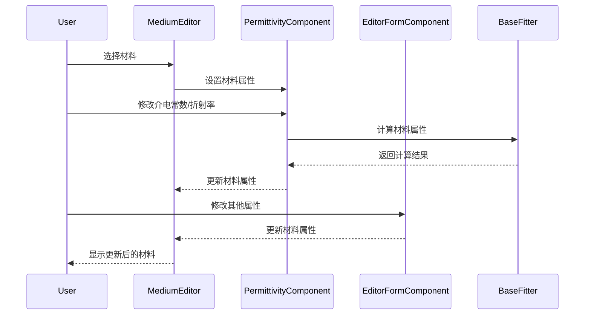
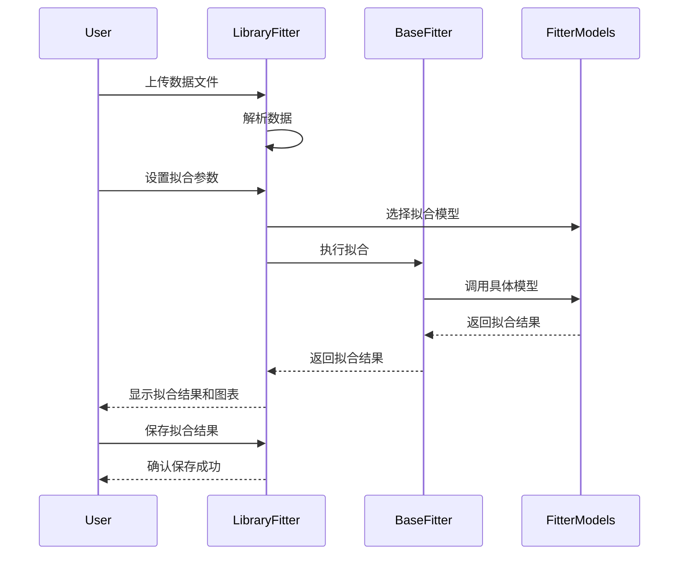

# FC-Cube 项目架构分析

## 项目概述

FC-Cube 是一个用于材料库管理和编辑的系统，主要用于电磁场模拟和光学设计。该系统基于 Angular 框架开发，采用组件化架构，支持多种材料模型（如 Lorentz、Drude、Sellmeier、Debye、PoleResidue 等），并提供了丰富的材料编辑、拟合、导入导出和可视化功能。

## 系统架构

### 核心类图

```mermaid
classDiagram
    class MediumValue {
        +string name
        +number eps_inf
        +IPoles poles
        +ILocalData localData
    }
    
    class BaseFitter {
        +number EPSILON_0
        +number C_0
        +get_nk(frequency, eps_inf, poles)
        +get_x_series(frequency)
    }
    
    class IFitterType {
        <<enumeration>>
        Medium
        PoleResidue
        Lorentz
        Drude
        Debye
        Sellmeier
    }
    
    class IFitterData {
        +string name
        +number[] frequency_range
        +IFitterType type
        +number eps_inf
        +IPoles poles
        +ILocalData localData
    }
    
    BaseFitter <|-- Lorentz
    BaseFitter <|-- Drude
    BaseFitter <|-- Sellmeier
    BaseFitter <|-- Debye
    BaseFitter <|-- PoleResidue
    BaseFitter <|-- Medium
    
    MediumValue <|-- IFitterData
    
    class MediumEditorComponent {
        +MediumValue medium
        +boolean isGraphene
        +handleMediumChange()
        +handleExpressionChange()
        +handleUnitChange()
    }
    
    class LibraryPublicComponent {
        +MediumValue[] mediums
        +searchMediums(keyword)
        +selectMedium(medium)
        +showMediumDetail(medium)
    }
    
    class LibraryPrivateComponent {
        +MediumValue[] mediums
        +searchMediums(keyword)
        +createMedium()
        +editMedium(medium)
        +deleteMedium(medium)
        +copyMedium(medium)
    }
    
    class LibraryFitterComponent {
        +uploadFile(file)
        +setFitterParams(params)
        +runFitting()
        +saveFittedMedium()
    }
    
    class LibraryPickerComponent {
        +selectMedium(medium)
        +searchMediums(keyword)
        +showMediumDetail(medium)
    }
    
    class MediumListComponent {
        +MediumValue[] mediums
        +addMedium(medium)
        +deleteMedium(medium)
        +copyMedium(medium)
        +sortMediums()
    }
    
    class MediumDetailComponent {
        +MediumValue medium
        +showProperties()
        +showCharts()
        +formatData()
    }
    
    class PermittivityComponent {
        +handleInputTypeChange()
        +handleExpressionChange()
        +handleUnitChange()
    }
```

## 核心组件

### 材料模型

项目实现了多种材料模型，所有模型都继承自 `BaseFitter` 基类：

1. **BaseFitter**：提供基础的折射率和消光系数计算方法，以及频率、波长和能量的转换功能
2. **Lorentz**：实现洛伦兹模型，用于计算材料的介电常数
3. **Drude**：实现德鲁德模型，用于计算金属和半导体的介电常数
4. **Sellmeier**：实现塞尔迈尔模型，主要用于透明材料的折射率计算
5. **Debye**：实现德拜模型，用于描述极性分子的介电弛豫
6. **PoleResidue**：实现极点留数模型，用于通用材料的介电常数计算
7. **Medium**：基础材料模型，支持直接设置电导率和介电常数

### 材料编辑器

`MediumEditorComponent` 是材料编辑的核心组件，它集成了多个子组件：

1. **PermittivityComponent**：用于编辑材料的介电常数和折射率
2. **EditorFormComponent**：提供材料属性的表单编辑功能
3. **FreqComponent**：处理频率相关的设置
4. **PropertyComponent**：处理材料的物理属性编辑

### 材料选择器

`LibraryPickerComponent` 提供了从公共和私有材料库中选择材料的功能，支持搜索、预览和选择操作。

### 材料库管理

1. **LibraryPublicComponent**：管理公共材料库，提供搜索和预览功能
2. **LibraryPrivateComponent**：管理私有材料库，提供创建、编辑、删除、复制等功能
3. **MediumListComponent**：提供材料列表的展示和管理功能，支持拖拽排序

### 材料拟合工具

`LibraryFitterComponent` 提供了材料拟合功能，支持上传数据文件，设置拟合参数，并展示拟合结果。

### 数据可视化

`MediumDetailComponent` 提供了材料属性的可视化展示，包括属性表格和图表展示。

## 关键功能流程

### 材料编辑流程

### 材料拟合流程

## 技术特点

1. **Angular 组件化架构**：项目采用 Angular 框架，通过组件化设计实现了高度的模块化和可复用性

2. **响应式设计**：使用 Angular 的响应式表单和 RxJS 实现了数据的响应式更新和处理

3. **丰富的材料模型**：支持多种材料模型（Lorentz、Drude、Sellmeier、Debye、PoleResidue 等），满足不同材料的建模需求

4. **数学计算与拟合**：使用 mathjs 库进行复数运算和数学计算，实现了材料属性的精确计算和拟合

5. **数据可视化**：集成了图表展示功能，直观展示材料的折射率、消光系数等属性

6. **单位转换**：支持不同单位（如频率、波长、能量）之间的转换，提高了用户体验

7. **表达式支持**：允许用户通过表达式编辑材料属性，增强了系统的灵活性

## 结论

FC-Cube 项目是一个功能丰富的材料库管理和编辑系统，采用组件化架构，具有良好的可扩展性和可维护性。系统支持多种材料模型，提供了丰富的编辑、拟合和可视化功能，能够满足电磁场模拟和光学设计中对材料属性的各种需求。