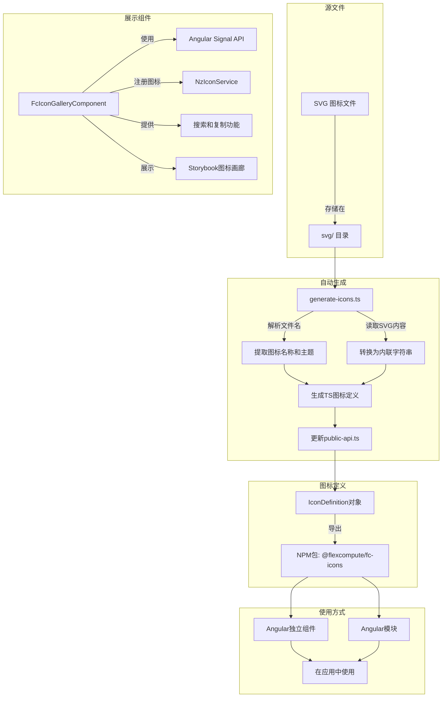
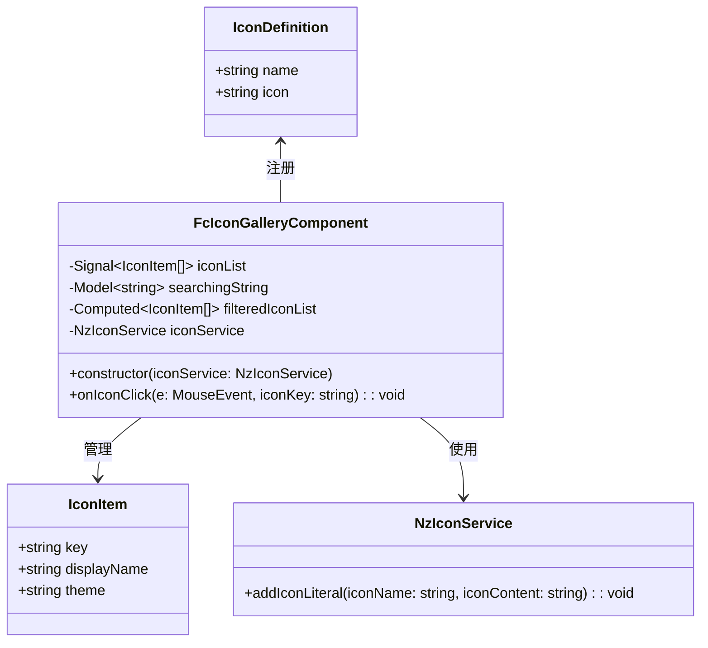

# Flexcompute Icon Library (FC-Icons) 项目分析

## 项目概述

FC-Icons 是 Flexcompute 公司开发的一个 Angular 图标库，为 Flexcompute 的产品提供统一的图标资源。该库基于 Angular 和 NG-ZORRO 的图标系统构建，提供了丰富的自定义图标集合，包括轮廓图标（outline）、填充图标（fill）和彩色图标（color）三种风格。

当前版本为 1.1.52，该库作为 NPM 包发布在 GitHub 包注册表中，可以通过 `@flexcompute/fc-icons` 包名引用。

## 核心功能

1. **丰富的图标集合**：包含数百个专业设计的图标，涵盖了 Flexcompute 产品中常用的各种元素和操作。

2. **多种图标风格**：
   - `outline`：轮廓线风格，适合常规使用
   - `fill`：填充风格，用于强调或激活状态
   - `color`：彩色风格，用于特殊场景和视觉焦点

3. **与 NG-ZORRO 集成**：完全兼容 NG-ZORRO 的图标系统，可以无缝集成到使用 NG-ZORRO 的 Angular 项目中。

4. **图标展示与搜索**：提供了 Storybook 图标画廊，方便开发者浏览、搜索和使用图标。

5. **自动化构建流程**：通过脚本自动从 SVG 文件生成 TypeScript 图标定义。

## 技术实现

### 图标生成流程

1. **SVG 源文件**：所有图标以 SVG 格式存储在 `svg/` 目录中，文件命名遵循 `name_theme.svg` 的格式，如 `list-add_outline.svg`。

2. **自动生成脚本**：使用 `generate-icons.ts` 脚本处理 SVG 文件：
   - 读取 SVG 目录中的所有 SVG 文件
   - 解析文件名，提取图标名称和主题
   - 将 SVG 内容转换为内联字符串
   - 生成 TypeScript 图标定义文件
   - 更新 `public-api.ts` 导出所有图标

3. **图标定义格式**：每个图标被定义为符合 `IconDefinition` 接口的对象：
   ```typescript
   export const ListAddOutline: IconDefinition = {
     name: 'fc:list-add_outline',
     icon: '<svg>...</svg>',
   };
   ```

4. **命名空间**：所有图标使用 `fc:` 前缀，确保与其他图标库区分。

### 图标展示组件

`FcIconGalleryComponent` 是一个 Angular 独立组件，用于展示和搜索图标：

1. **数据结构**：使用 Angular 信号 API 管理图标列表和过滤状态：
   ```typescript
   // 当前实现
   iconList = signal<IconItem[]>([]);
   filteredIconList = signal<IconItem[]>([]);
   searchingString = model<string>('');
   
   // 优化建议：使用计算属性
   // iconList = signal<IconItem[]>([]);
   // searchingString = model<string>('');
   // filteredIconList = computed(() => 
   //   this.iconList().filter(item =>
   //     item.displayName.toLocaleLowerCase().includes(this.searchingString().toLocaleLowerCase())
   //   )
   // );
   ```

2. **初始化**：在构造函数中加载所有图标，并注册到 `NzIconService`：
   ```typescript
   Object.entries(icons).forEach(iconObj => {
     const iconKey = iconObj[1].name;
     const iconContent = iconObj[1].icon;
     this.iconService.addIconLiteral(iconKey, iconContent);
     // ...
   });
   ```

3. **搜索功能**：当前通过 `onSearchChange` 方法实现实时搜索，但可以优化为使用计算属性：
   ```typescript
   // 当前实现：需要手动调用方法更新过滤结果
   onSearchChange(): void {
     const filteredIconList = this.iconList().filter(item =>
       item.displayName.toLocaleLowerCase().includes(this.searchingString().toLocaleLowerCase())
     );
     this.filteredIconList.set(filteredIconList);
   }
   
   // 优化建议：使用计算属性自动响应依赖变化
   // 无需手动更新方法，当 searchingString 或 iconList 变化时自动更新
   ```

4. **复制功能**：点击图标时，复制对应的 HTML 代码到剪贴板：
   ```typescript
   onIconClick(e: MouseEvent, iconKey: string): void {
     const copiedString = `<span nz-icon nzType="${iconKey}"></span>`;
     // 复制到剪贴板...
   }
   ```

5. **UI 设计**：使用网格布局展示图标，每个图标项包含图标本身和名称，悬停时有放大和背景色变化的动画效果。

## 使用方法

### 安装

```bash
pnpm add @flexcompute/fc-icons -S
```

### 在 Angular 独立组件中使用

```typescript
import { NzIconModule, provideNzIconsPatch } from 'ng-zorro-antd/icon';
// 对于 ng-zorro-antd@^17，使用以下导入：
// import { provideNzIconsPatch } from '@flexcompute/fc-zorro';
import { ListAddOutline } from '@flexcompute/fc-icons';

@Component({
  standalone: true,
  imports: [NzIconModule],
  providers: [provideNzIconsPatch([ListAddOutline])]
})
class MyComponent {}
```

### 在传统 Angular 模块中使用

```typescript
import { NzIconModule } from 'ng-zorro-antd/icon';
import { ListAddOutline } from '@flexcompute/fc-icons';

@NgModule({
  imports: [NzIconModule.forChild([ListAddOutline])]
})
class MyModule {}
```

### 在模板中使用

```html
<span nz-icon nzType="fc:list-add_outline"></span>
```

## 项目特点

1. **专为 Angular 优化**：充分利用 Angular 的最新特性，如信号 API 和独立组件。

2. **与 NG-ZORRO 无缝集成**：遵循 NG-ZORRO 的图标系统设计，确保一致的开发体验。

3. **自动化工作流**：通过脚本自动处理 SVG 文件，简化图标添加和更新流程。

4. **良好的开发体验**：提供 Storybook 图标画廊，方便浏览和使用图标。

5. **类型安全**：所有图标都有 TypeScript 类型定义，提供良好的 IDE 支持。

## 架构图

### 工作流程图



### 类图



## 代码优化建议

1. **使用计算属性替代手动过滤**：
   
   当前实现中，`filteredIconList` 是一个独立的信号，需要通过 `onSearchChange` 方法手动更新：
   ```typescript
   iconList = signal<IconItem[]>([]);
   filteredIconList = signal<IconItem[]>([]);
   searchingString = model<string>('');
   
   onSearchChange(): void {
     const filteredIconList = this.iconList().filter(item =>
       item.displayName.toLocaleLowerCase().includes(this.searchingString().toLocaleLowerCase())
     );
     this.filteredIconList.set(filteredIconList);
   }
   ```
   
   优化建议：将 `filteredIconList` 改为计算属性（computed），可以自动响应依赖变化，简化代码：
   ```typescript
   iconList = signal<IconItem[]>([]);
   searchingString = model<string>('');
   
   filteredIconList = computed(() => 
     this.iconList().filter(item =>
       item.displayName.toLocaleLowerCase().includes(this.searchingString().toLocaleLowerCase())
     )
   );
   ```
   
   这样做的好处：
   - 减少了手动维护状态的代码
   - 自动响应依赖变化，无需手动调用更新方法
   - 更符合响应式编程的思想
   - 减少了可能的状态不同步问题

2. **其他潜在优化点**：
   - 使用 `debounce` 或 `throttle` 处理搜索输入，减少频繁过滤操作
   - 考虑对图标列表进行分类或分页，提高大量图标时的性能
   - 添加图标预加载策略，提升首次加载体验

## 总结

FC-Icons 是一个专为 Flexcompute 产品设计的 Angular 图标库，提供了丰富的自定义图标集合和简单的使用方式。它与 NG-ZORRO 无缝集成，支持多种图标风格，并通过自动化脚本简化了图标的管理和更新。该库的设计充分考虑了开发体验，提供了图标画廊和类型安全的 API，是 Flexcompute 产品 UI 设计系统的重要组成部分。通过实施上述优化建议，可以进一步提升代码质量和用户体验。
