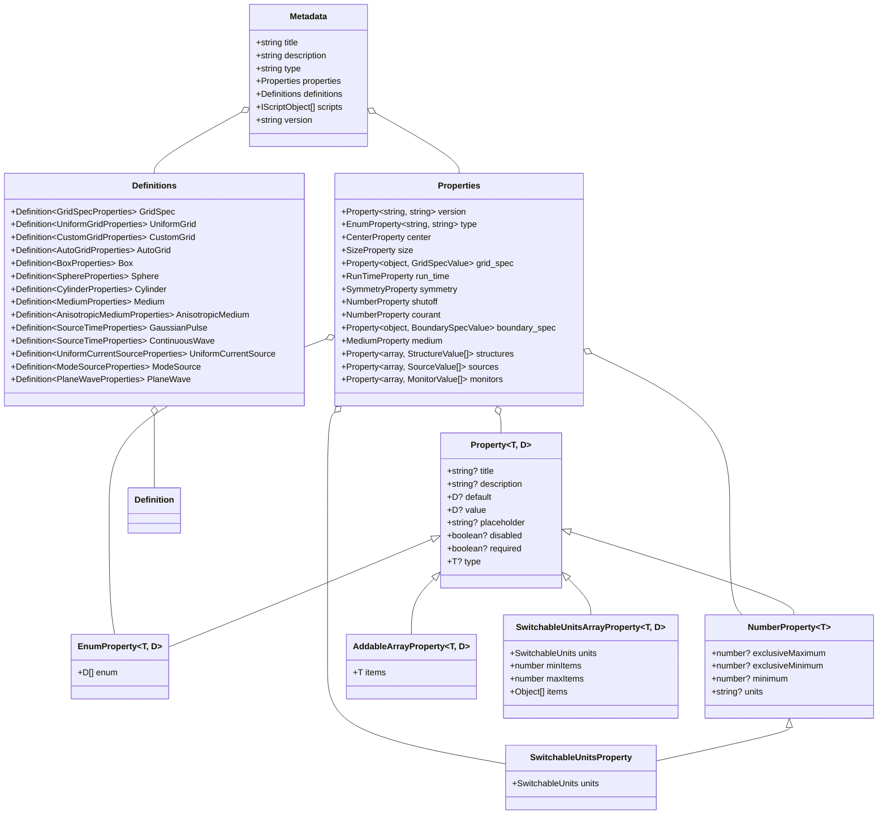

# FC-Model: 元数据类型系统分析

## 概述

FC-Model 是一个为科学计算和模拟设计的 TypeScript 类型系统，提供了丰富的接口定义，用于描述物理模拟中的各种元素，如网格、边界条件、材料属性、几何形状、光源和监视器等。这个类型系统采用了面向对象的设计原则，通过接口继承和组合构建了一个复杂而灵活的类型层次结构。

## 核心类型结构

### 基础类型

在 FC-Model 中，最基础的类型是 `Property<T, D>` 接口，它定义了属性的通用结构：

```typescript
export interface Property<T, D = any> {
  title?: string;
  description?: string;
  default?: D;
  value?: D;
  placeholder?: string;
  disabled?: boolean;
  required?: boolean;
  type?: T;
  [p: string]: any;
}
```

这个接口使用了泛型参数，其中 `T` 表示属性的类型（如 'string'、'number'、'object' 等），`D` 表示属性的值类型。基于这个基础接口，FC-Model 定义了多种特殊化的属性类型：

- `EnumProperty<T, D>`: 枚举属性，包含一组预定义的可选值
- `AddableArrayProperty<T, D>`: 可添加元素的数组属性
- `NumberProperty<T>`: 数值属性，可以设置最小值、最大值和单位
- `SwitchableUnitsProperty`: 可切换单位的数值属性
- `SwitchableUnitsArrayProperty<T, D>`: 可切换单位的数组属性

### 元数据结构

整个类型系统的顶层是 `Metadata` 接口，它定义了模拟配置的整体结构：

```typescript
export interface Metadata {
  title: string;
  description: string;
  type: 'object';
  properties: Properties;
  definitions: Definitions;
  scripts: IScriptObject[];
  version: string;
  extra?: { errorMsg?: Record<string, { error: string; number: number }> };
}
```

其中 `Properties` 接口包含了模拟的主要配置参数，如版本、类型、中心位置、尺寸、网格规格、运行时间、对称性、边界条件、材料、结构、光源和监视器等。

`Definitions` 接口则包含了各种组件的详细定义，如网格类型、几何形状、材料属性、光源类型和监视器类型等。

## 主要组件类型

### 网格系统

FC-Model 支持多种网格类型，包括：

- `UniformGrid`: 均匀网格
- `CustomGrid`: 自定义网格
- `AutoGrid`: 自动网格
- `UniformUnstructuredGrid`: 均匀非结构化网格
- `DistanceUnstructuredGrid`: 距离非结构化网格

每种网格类型都有其特定的属性和配置选项。

### 几何系统

几何系统定义了各种形状，如：

- `Box`: 盒子
- `Sphere`: 球体
- `Cylinder`: 圆柱体
- `PolySlab`: 多边形板
- `GeometryGroup`: 几何组
- `TriangleMesh`: 三角形网格

这些几何形状可以组合使用，构建复杂的模型。

### 材料系统

材料系统定义了各种材料属性，包括：

- `Medium`: 基本介质
- `AnisotropicMedium`: 各向异性介质
- `PECMedium`: 完美导体介质
- `Medium2D`: 二维介质

还支持多种材料模型，如：

- `PoleResidue`: 极点残差模型
- `Sellmeier`: 塞尔迈尔模型
- `Lorentz`: 洛伦兹模型
- `Debye`: 德拜模型
- `Drude`: 德鲁德模型

### 光源系统

光源系统定义了各种光源类型，如：

- `UniformCurrentSource`: 均匀电流源
- `PointDipole`: 点偶极子
- `GaussianBeam`: 高斯光束
- `ModeSource`: 模式光源
- `PlaneWave`: 平面波
- `TFSF`: 全场/散射场

每种光源都有其特定的属性和配置选项。

### 监视器系统

监视器系统定义了各种监视器类型，用于记录模拟过程中的数据：

- `FieldMonitor`: 场监视器
- `FieldTimeMonitor`: 场时间监视器
- `PermittivityMonitor`: 介电常数监视器
- `FluxMonitor`: 通量监视器
- `FluxTimeMonitor`: 通量时间监视器
- `ModeMonitor`: 模式监视器
- `ModeSolverMonitor`: 模式求解器监视器

## 类型系统架构图

### 基础类型层次结构



### 主要组件关系图


## 类型系统的设计特点

### 1. 泛型的广泛应用

FC-Model 类型系统大量使用了 TypeScript 的泛型特性，使得类型定义更加灵活和可复用。例如，`Property<T, D>` 接口使用泛型参数来表示属性的类型和值类型，这使得它可以适应各种不同的属性定义需求。

### 2. 接口继承和组合

类型系统通过接口继承和组合构建了复杂的类型层次结构。例如，`EnumProperty` 继承自 `Property`，添加了枚举值数组；`NumberProperty` 也继承自 `Property`，添加了数值范围限制；而 `SwitchableUnitsProperty` 则进一步继承自 `NumberProperty`，添加了单位切换功能。

### 3. 可选属性的广泛使用

大多数接口中的属性都被定义为可选的（使用 `?` 标记），这使得类型系统更加灵活，可以适应不同的使用场景和配置需求。

### 4. 索引签名的应用

许多接口使用了索引签名（如 `[p: string]: any;` 或 `[k: string]: any;`），允许添加未在接口中明确定义的额外属性，增加了类型系统的灵活性和扩展性。

### 5. 联合类型和交叉类型

类型系统使用了联合类型（如 `type?: 'Structure' | 'MeshOverrideStructure';`）和交叉类型（如 `PermittivityPerturbationValue | IndexPerturbationValue`），使得类型定义更加精确和灵活。

## 模拟流程

以下是使用 FC-Model 类型系统进行物理模拟的典型流程：


## 应用场景

FC-Model 类型系统主要应用于以下场景：

### 1. 电磁场模拟

用于模拟电磁波在各种材料和结构中的传播、散射、吸收和辐射等现象，适用于光学、光子学、天线设计等领域。

### 2. 光子学设计

用于设计和优化光子集成电路、光波导、光栅、光子晶体等光子学器件，分析其性能和特性。

### 3. 纳米光学

用于研究纳米尺度下的光学现象，如表面等离子体共振、近场光学效应等。

### 4. 材料科学

用于研究材料的光学性质，如折射率、吸收系数、色散关系等，以及材料与光的相互作用。

### 5. 生物光学

用于研究光在生物组织中的传播和相互作用，支持生物医学成像和诊断技术的发展。

## 总结

FC-Model 的类型系统是一个复杂而精心设计的 TypeScript 类型层次结构，它通过接口继承、泛型、可选属性、索引签名、联合类型和交叉类型等特性，构建了一个灵活、可扩展且类型安全的系统，用于描述物理模拟中的各种元素和配置。

这个类型系统不仅提供了类型检查和代码补全等开发便利，还通过其结构化的设计，为模拟配置提供了清晰的文档和指导。它的模块化设计使得用户可以轻松地组合各种组件，构建复杂的模拟场景，而其丰富的类型定义则确保了模拟配置的正确性和一致性。

通过 FC-Model 类型系统，开发者可以用声明式的方式描述复杂的物理模型，减少错误，提高效率，同时获得 TypeScript 提供的类型安全和智能提示等优势。这使得科学计算和模拟变得更加直观、可靠和高效。
