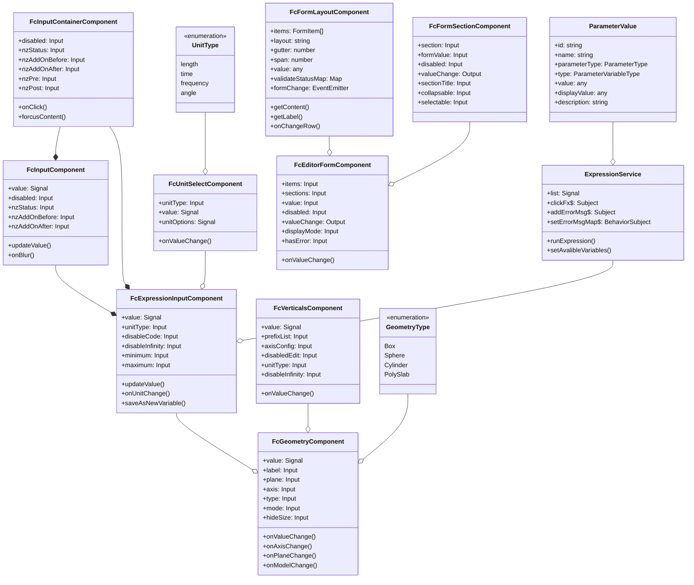
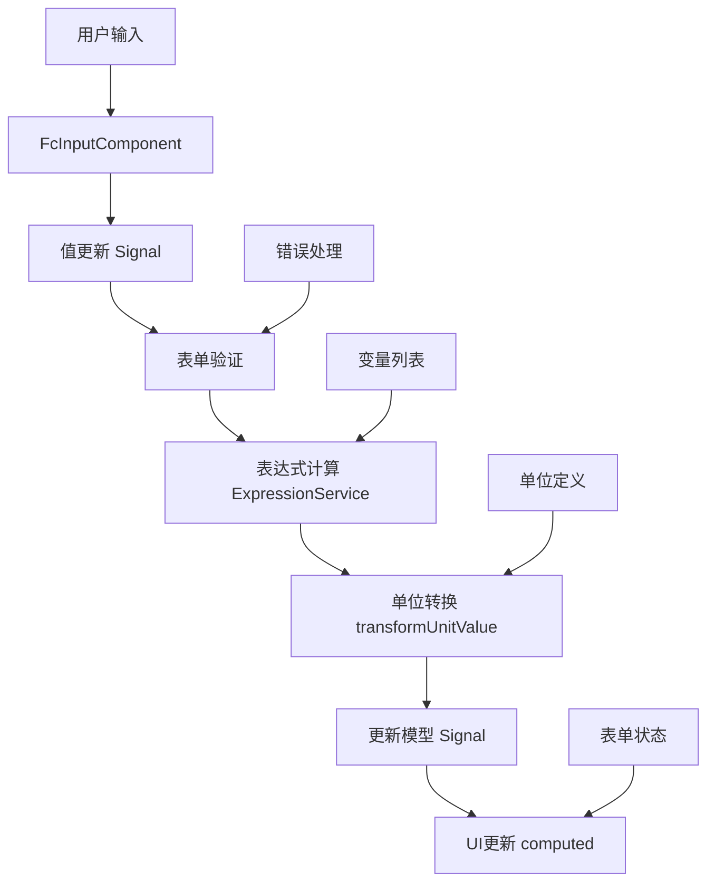
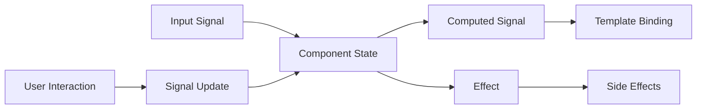

# FC-Zorro 组件库架构分析

## 项目概述

FC-Zorro 是一个基于 Angular 和 NG-Zorro 的组件库，提供了一系列高级表单组件和输入控件，专注于科学计算和工程领域的应用场景。该组件库支持表达式计算、单位转换、几何图形编辑等功能，为复杂的科学计算应用提供了丰富的UI组件。

## 技术栈

- **Angular**: 基于 Angular 的信号（Signal）API开发，使用最新的Angular特性
- **NG-Zorro**: 基于阿里的 NG-Zorro 组件库扩展，提供了丰富的UI组件
- **MathJS**: 用于数学表达式计算，支持复杂的数学表达式和单位转换
- **FC-Icons**: 自定义图标库，提供了专业领域的图标
- **FC-Model**: 数据模型库，定义了参数、变量等数据结构

## 架构设计



## 核心组件

### 1. 基础输入组件

#### FcInputContainerComponent

这是所有输入组件的基础容器，提供了统一的样式和布局，支持前缀、后缀、状态等配置。

#### FcInputComponent

基础输入组件，继承自Angular的ControlValueAccessor，实现了表单控件的基本功能，支持禁用、只读、状态等配置。

### 2. 表达式输入组件

#### FcExpressionInputComponent

支持数学表达式输入的高级组件，可以解析和计算数学表达式，支持变量引用、单位转换等功能。

#### ExpressionService

表达式服务，负责管理表达式变量列表和计算表达式的值。

### 3. 单位选择组件

#### FcUnitSelectComponent

单位选择组件，支持长度、时间、频率、角度等不同类型的单位选择和转换。

### 4. 表单布局组件

#### FcFormLayoutComponent

表单布局组件，提供了灵活的表单布局配置，支持水平和垂直布局，以及不同的间距和列宽。

#### FcEditorFormComponent

编辑器表单组件，支持分区域的表单布局，每个区域可以有自己的标题和表单项。

#### FcFormSectionComponent

表单区域组件，支持可折叠和可选择的区域，可以包含子区域和表单项。

### 5. 几何组件

#### FcGeometryComponent

几何图形编辑组件，支持不同类型的几何图形（如盒子、圆柱体、球体等）的编辑，可以设置中心点、尺寸、半径等参数。

## 数据流



### 信号（Signal）数据流



## 特色功能

### 1. 表达式计算系统

- **数学表达式解析**：支持复杂的数学表达式输入和计算，可以引用其他变量。
- **变量管理**：通过`ExpressionService`管理表达式变量列表，支持变量的添加、删除和更新。
- **错误处理**：提供完善的表达式错误处理机制，包括语法错误、未定义变量等。
- **表达式编辑器**：`FcExpressionInputComponent`提供了友好的表达式编辑界面，支持代码提示和变量引用。

### 2. 单位系统

- **多种物理单位**：内置多种物理单位的定义和转换功能，如长度、时间、频率、角度等。
- **单位转换**：通过`transformUnitValue`函数实现不同单位间的自动转换。
- **单位选择器**：`FcUnitSelectComponent`提供了友好的单位选择界面，根据不同的单位类型显示不同的选项。

### 3. 几何编辑系统

- **多种几何类型**：支持盒子、球体、圆柱体等多种几何类型的编辑。
- **坐标系切换**：支持不同坐标系和平面的切换，如XY平面、YZ平面、XZ平面。
- **顶点编辑**：通过`FcVerticalsComponent`实现顶点的编辑，支持表达式输入和单位转换。
- **模式切换**：支持中心点+尺寸和边界两种编辑模式的切换。

### 4. 表单系统

- **灵活的布局**：支持水平和垂直两种表单布局，以及不同的间距和列宽。
- **分区域表单**：通过`FcEditorFormComponent`和`FcFormSectionComponent`实现分区域的表单布局。
- **表单验证**：支持丰富的表单验证功能，包括最小值、最大值、整数验证等。
- **状态管理**：使用Angular的信号API管理表单状态，实现响应式的表单交互。

### 5. 工具函数

- **信号增强**：通过`createRefreshSignal`函数增强Angular的信号API，添加刷新功能。
- **复制粘贴**：提供了复制粘贴功能，方便用户在不同组件间传递数据。
- **辅助函数**：提供了一系列辅助函数，如`isInfinity`、`canParseToNumber`、`generateUid`等。

## 设计模式

### 1. 组件设计模式

- **组合模式**：通过组合不同的基础组件构建复杂的表单控件，如`FcGeometryComponent`组合了`FcExpressionInputComponent`和`FcVerticalsComponent`。
- **装饰器模式**：使用装饰器扩展组件的功能，如`FcInputContainerComponent`为输入组件添加前缀、后缀等装饰。
- **策略模式**：使用不同的策略处理不同类型的输入和验证，如根据`unitType`选择不同的单位转换策略。
- **模板方法模式**：在基础组件中定义算法的骨架，如`FcFormLayoutComponent`定义了表单布局的基本结构，而具体的表单项渲染由子组件实现。

### 2. 状态管理模式

- **信号模式（Signal Pattern）**：使用Angular的信号API管理组件状态，实现响应式数据流。
  ```typescript
  // 示例：使用信号管理组件状态
  value = model<GeometryValue>(); // 可写信号
  isBox = computed<boolean>(() => { // 计算信号
    return this.type() === GeometryType.Box;
  });
  ```

- **观察者模式**：使用Angular的信号（Signal）、事件发射器（EventEmitter）和RxJS的Subject实现组件间的通信。
  ```typescript
  // 示例：使用Subject进行组件间通信
  clickFx$ = new Subject<string>();
  addErrorMsg$ = new Subject<{id: string; msg: string}>();
  ```

### 3. 服务设计模式

- **单例模式**：使用Angular的依赖注入系统确保服务是单例的，如`ExpressionService`。
- **工厂模式**：使用工厂函数创建复杂对象，如`createRefreshSignal`函数创建带有刷新功能的信号。

### 4. 功能实现模式

- **代理模式**：使用JavaScript的Proxy对象创建数学计算环境，如`createProxy`函数。
- **适配器模式**：通过适配器函数转换不同格式的数据，如`transformUnitValue`函数适配不同单位的值。
- **命令模式**：将请求封装为对象，如表达式计算命令，使得可以参数化操作。

## 总结

FC-Zorro组件库是一个专为科学计算和工程应用设计的Angular组件库，它基于最新的Angular信号API构建，提供了丰富的表单组件和输入控件，支持表达式计算、单位转换、几何编辑等功能。

该组件库的架构设计有以下几个特点：

1. **组件化设计**：通过组合不同的基础组件构建复杂的表单控件，实现了高度的复用性和可维护性。

2. **响应式数据流**：使用Angular的信号API实现响应式的数据流，使得组件状态的管理更加简洁和高效。

3. **领域驱动设计**：针对科学计算和工程领域的特定需求，设计了专门的组件和服务，如表达式计算、单位转换、几何编辑等。

4. **可扩展性**：通过合理的接口设计和依赖注入，使得组件库可以方便地扩展和定制。

5. **性能优化**：使用Angular的信号API和计算属性，减少了不必要的重渲染，提高了应用的性能。

通过这些设计，FC-Zorro组件库使得复杂的科学计算应用的前端开发变得更加简单和高效，为科学计算和工程领域的Web应用提供了强大的UI支持。
